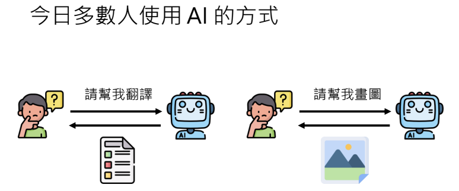
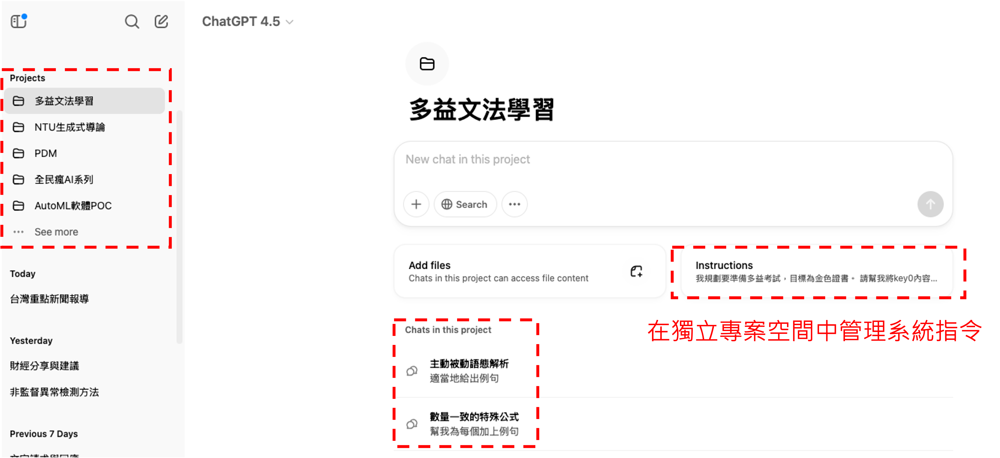

# 以大型語言模型打造的 AI Agent  
## (14:50 教你怎麼打造芙莉蓮一級魔法使考試中出現的泥人哥列姆)

> 李宏毅 生成式導論 2024 第9講

<iframe width="560" height="315" src="https://www.youtube.com/embed/bJZTJ7MjYqg?si=3VdAsK9nC6D2ADda" title="YouTube video player" frameborder="0" allow="accelerometer; autoplay; clipboard-write; encrypted-media; gyroscope; picture-in-picture; web-share" referrerpolicy="strict-origin-when-cross-origin" allowfullscreen></iframe>

本講探討如何利用大型語言模型構建能夠執行多步驟複雜任務的 AI Agent。從傳統僅能完成單一任務的 AI，到能夠根據環境變化、利用記憶和規劃來調整行動的 Agent，並介紹了許多真實或虛擬世界中的應用實例。

---

## 多數人使用 AI 的方式

目前，大多數人使用 AI 時僅限於單一步驟的應用，例如：
- 輸入一句話讓 AI 翻譯或回答問題
- 請求生成一張圖片

這種方式雖然便捷，但只發揮了語言模型的一部分能力，遠未涵蓋 AI 在解決複雜任務上的潛力。

---

## 人類與 AI：多步驟複雜任務的挑戰
人類在面對需要多個步驟才能完成的任務時，往往會事先規劃並依序執行。例如，舉辦朋友間的聚餐需要：
- 調查大家的空閒時間
- 根據統計結果訂位
- 若原訂餐廳無法提供服務，則快速調整計劃並更換餐廳

這些步驟必須依序進行，且在過程中需根據現實狀況不斷調整。若能讓 AI 具備這樣的能力，它就可以成為我們的 **AI Agent**，協助完成從計劃到執行的全流程任務。

---

## AI Agent 的概念與運作原理

### 基本概念

AI Agent 是指利用大型語言模型來執行多步驟、複雜任務的系統。它不僅僅是回應一個輸入，而是能夠：

- **理解環境狀態**：透過文字、圖像或其他感知器獲取當前狀況
- **規劃行動**：根據最終目標及過去的經驗（記憶），制定短期行動計畫
- **動態調整**：在執行過程中根據環境變化更新記憶與計畫

!!! note

        - 參考專案: [AutoGPT](https://github.com/Significant-Gravitas/Auto-GPT)
        - 參考專案: [AgentGPT](https://agentgpt.reworkd.ai/)
        - 參考專案: [BabyAGI](https://github.com/yoheinakajima/babyagi)
        - 參考專案: [Godmode](https://godmode.space/)

### 運作原理與挑戰

AI Agent 的工作流程可簡述為：

1. **感知**  
   從外界獲取資料，如文字描述、影像（通過 Image Captioning 技術轉為文字）或其他感測資訊。
2. **記憶與目標設定**  
   擁有一個終極目標，同時根據過去的經驗更新記憶，這使得 Agent 能夠更有針對性地制定行動計畫。
3. **行動計畫的生成**  
   利用大型語言模型生成短期目標，例如「評估計劃」或「尋找替代方案」。
4. **執行與反饋**  
   Agent 根據計畫執行具體行動（可能透過自然語言、程式碼或直接控制機器），並在行動後更新其對環境的認知，從而重新調整後續計畫。

此外，系統中常區分為：

- **Slow Agent**：負責生成人類可理解的自然語言計畫；
- **Fast Agent**：根據這些計畫，直接執行具體動作或產生相應程式碼。

這種分工可以使 AI Agent 在解決複雜任務時既能保持靈活性，又能確保行動的準確執行。

!!! note

        - 參考論文: [RL-GPT: Integrating Reinforcement Learning and Code-as-policy](https://arxiv.org/abs/2402.19299)

---

## 其他 AI Agent 的應用實例

### 由 AI 村民組成的虛擬村莊

!!! note

        - 參考影片: [讓 AI 村民組成虛擬村莊會發生甚麼事？](https://youtu.be/G44Lkj7XDsA?si=cMbKG3tqPbIgnnBq)
        - 參考論文:[Generative Agents: Interactive Simulacra of Human Behavior](https://arxiv.org/abs/2304.03442)

在這種應用中，每個 AI 村民都是獨立的 Agent，能夠根據自身記憶與環境互動，模擬出類似人類的行為模式。

### 會自己玩 Minecraft 的 AI

該系統展示了 AI Agent 在虛擬世界中自主學習與探索的能力，從簡單工具的製作到最終達成高階目標（如擊敗終界龍），顯示了多步驟任務的逐步完成過程。

!!! note

        - 參考論文: [Voyager: An Open-Ended Embodied Agent with Large Language Models](https://arxiv.org/abs/2305.16291)

### 由語言模型操控的機器人

透過大型語言模型解析人類自然語言指令，並進一步規劃、執行機器人的動作。傳統機器人若要接收並理解人類指令，往往需要事先定義良好的指令集（如特定的關鍵字或程式 API）。然而，伴隨大型語言模型的崛起，機器人不再需要死板的指令格式；反之，能夠「聽懂」並「推理」自然語言，並在內部將人類語句轉譯成行為計畫或動作序列。

此一新趨勢結合了自然語言處理與機器人學的領域，能為機器人帶來更高層次的靈活度與通用性。例如，在家居服務、餐廳服務、倉儲物流等場景，使用者只需用口語或文字的方式說出「請幫我拿一罐可樂」，機器人便可自動拆解任務、定位可樂位置、執行抓取並遞送的行為。

!!! info

        - 參考論文: [Inner Monologue: Embodied Reasoning through Planning with Language Models](https://arxiv.org/abs/2207.05608)

### 用大型語言模型開自駕車

在自駕車應用中，語言模型不僅負責生成行動計畫，還能透過分析天氣、交通等資訊，生成控制程式碼，實現安全駕駛與即時調整。

!!! note
        - 參考論文: [Large Language Models for Autonomous Driving: Real-World Experiments](https://arxiv.org/abs/2312.09397)

---

## 有記憶的 ChatGPT 與個人化體驗

一般情況下，ChatGPT 的記憶僅存在於單一對話中，每次新對話都需重新開始。未來，隨著記憶功能的進一步開發，AI Agent 將能根據累積的經驗進行更個人化且連續的互動，提升整體的應用效能與體驗。

!!! note

        - 參考論文: [MemGPT: Towards LLMs as Operating Systems](https://arxiv.org/abs/2310.08560)

目前在 2025 的 ChatGPT 中，系統現在會自動將部分重要訊息存放於「全域（Global）記憶」中，代表跨對話也能共享使用者的偏好或個人化設定。這樣一來，使用者不再需要在每個新對話都重新輸入相同的背景或指令，大幅提升了互動效率與個人化體驗。

此外，在付費版本（如 ChatGPT Plus、企業版）中，除了跨對話的「全域記憶」外，還提供了「**專案（Project）**」功能，讓使用者能針對不同主題或任務建立獨立的工作空間。每個專案都能設定專屬的 **系統指令**、**資料檔案**以及**使用者自訂規則**，並與其他專案或全域設定互不干擾。這樣的設計可避免不同任務之間的資訊混淆，並確保對話上下文和資料在該專案中能得到更專業、精準的處理。

- **專案指令（Instructions）**  
  可在專案層級配置，確保該專案下所有對話都能遵守相同的前置規則或使用者偏好。

- **檔案管理（Add files）**  
  可將與專案相關的檔案上傳至同一空間，例如資料集、參考文獻、教學投影片等，以便 ChatGPT 更好地掌握專案背景。

- **隔離對話與知識**  
  在專案空間進行的對話與全域記憶或其他專案的內容相對獨立，減少不同領域資訊的相互干擾，並能在單一專案中積累連貫的上下文。

透過這樣的「專案」機制，使用者能夠同時進行多個領域的深度討論，而不用擔心彼此干擾或重複提供背景資訊，讓 ChatGPT 的互動體驗更高效、清晰，也更貼合專案化或團隊化的工作模式。

未來，隨著記憶功能的進一步開發，AI Agent 將能更加有效地累積經驗，並在不同對話之間進行連續且個人化的互動，為使用者帶來更流暢與智能化的溝通體驗。

---

## 案例分享：福利蓮一級魔法使考試中的 AI Agent

在一級魔法使考試中，考生在進入危險迷宮前會獲得一個裝在瓶子裡的「逃脫用哥列姆」。這個哥列姆由大型語言模型驅動，具備以下能力：

- **自我運作與目標設定**  
    初始時哥列姆沒有任何記憶，但其終極目標是安全地將考生帶出迷宮。

- **即時感知與規劃**  

    當考生因遭遇複製體攻擊而受重傷，哥列姆立刻從當前情境（例如受傷的狀態與環境中的威脅）生成一份行動計畫。初步計畫可能包括：

    1. 立即評估考生的傷勢
    2. 提供急救
    3. 根據現場情況調整行動，保護考生免受進一步攻擊

- **動態調整與反思**  

    如果環境狀況發生變化（例如複製體再次襲擊），哥列姆能夠即時更新計畫，將保護優先順序調整為保持高度環境警覺。這種透過反思更新行動計畫的能力，正是 AI Agent 所追求的靈活性與智慧。

這個例子展示了如何利用大型語言模型不僅生成自然語言指令，還能通過動態計畫、記憶更新和行動反饋，在不確定且複雜的環境中完成任務。

---

## 延伸閱讀
如果你想更了解 AI agent 的相關資訊，這邊提供了一篇 overview paper。從以下這張圖可以看到，作者構想出了一個未來世界，當中各種AI agent 能夠自主地互動、合作，並解決日常任務。AI agent的發展將不僅改變我們的生活方式，也提供許多新的可能性與應用場景。

!!! note

        - 參考論文: [Reflexion: Language Agents with Verbal Reinforcement Learning](https://arxiv.org/abs/2309.07864)
---

## 結語

大型語言模型的出現正在改變我們與 AI 的互動模式。從單一任務的處理到能夠自主規劃、執行和反思的 AI Agent，這些技術有望在未來一至兩年內普及，廣泛應用於虛擬世界與現實生活中。隨著記憶、規劃與動作執行技術的持續進步，AI Agent 將成為一個更智能、更靈活的協助者，改變我們的工作與生活方式。
