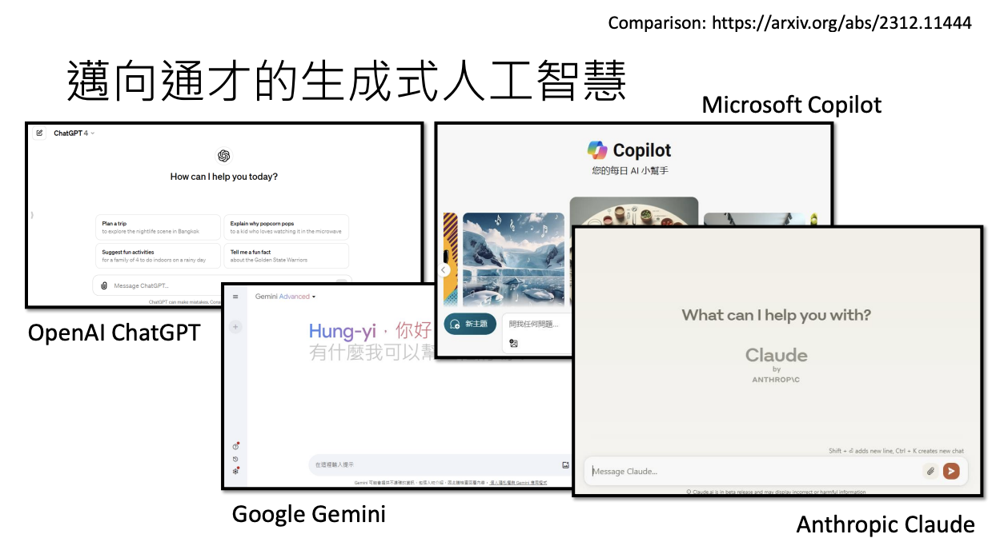
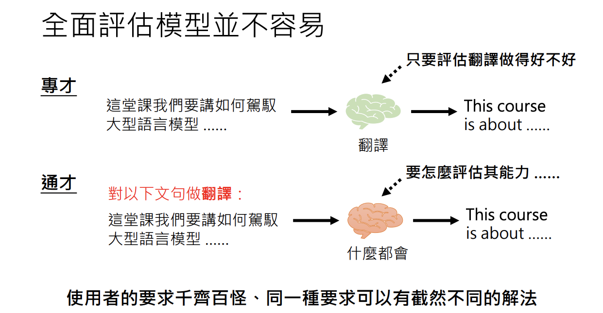

# 今日的生成式人工智慧厲害在哪裡？從「工具」變為「工具人」
> 李宏毅 生成式導論 2024 第2講

###### tags: `李宏毅` `NTU` `生成式導論 2024`

<iframe width="560" height="315" src="https://www.youtube.com/embed/glBhOQ1_RkE?si=5W1IsDWWtznU9FSx" title="YouTube video player" frameborder="0" allow="accelerometer; autoplay; clipboard-write; encrypted-media; gyroscope; picture-in-picture; web-share" referrerpolicy="strict-origin-when-cross-origin" allowfullscreen></iframe>

生成式人工智慧並非近期新興的概念，早在 Google 翻譯等應用中就已展現其初步能力；但近年來，像 ChatGPT 這類系統因其不再局限於單一任務，而是根據明確指令靈活應對多種需求，逐漸從傳統工具轉型為「工具人」。這種轉變使得人工智慧能夠在更廣泛的場景中提供協助，無論是撰寫報告、翻譯文字，還是進行技術解答，都展現出高度的適應性與多元功能。

## 今日的生成式人工智慧厲害在那哪裡？
傳統上，大型語言模型通常僅擁有單一功能，例如僅限於翻譯。如今的生成式人工智慧則需要用戶給出明確的指令，例如「請把以下文句翻譯成英文」，才能精確地執行任務。這種需要具體輸入指令的特性，使得它更接近於一個能夠理解多元需求的「工具人」，而不僅僅是固定用途的工具。

!!! note

    即使你不是「正妹帥哥」，現今每個人都有可能獲得一個「工具人」來幫忙做作業、撰寫報告，這標誌著從傳統工具到「工具人」的轉變。 

## 邁向通才的生成式人工智慧
現代生成式人工智慧的發展趨勢正朝向通才化，不再侷限於單一功能。除了最具代表性的 ChatGPT，市場上還出現了 Google 的 Gemini、Microsoft 的 Copilot、Anthropic 的 Claude 等多個系統。這些系統雖各有側重，但均展示出極為全面的能力，能夠應對技術解答、程式撰寫、健康建議、旅遊規劃等多種任務。

## 今日的生成式人工智慧能有多麼多才多藝呢？
生成式人工智慧的能力遠超過傳統語言模型。以 ChatGPT 為例，其展示的文字雲不僅列出了超過 30 項功能，涵蓋翻譯、程式碼撰寫、查詢建議等，還能夠根據用戶指令自主生成、執行程式碼，甚至進行圖片處理與網路搜尋。這些能力的展現，證明了它在多任務處理上的靈活性與全面性。值得一提的是，在生成文字雲的過程中，因預設環境中缺乏中文字符支持，初期產出的文字未能正確顯示，後來透過上傳合適的字型檔案問題得以解決。

## ChatGPT 能做什麼？
ChatGPT 自身的能力範圍極廣，其基本功能涵蓋文字生成、技術解答、程式碼撰寫、健康與旅遊建議等。不僅如此，最新版本（如 GPT-4）還擁有讀取檔案、處理圖片、進行網路搜尋等進階功能，並能夠自行執行程式碼並回傳結果，進一步擴展了其應用範圍。

透過指令讓模型列出至少 30 項其能做的事情，再將結果製作成文字雲，不僅展現了模型的多元功能，也凸顯了其在自我生成與執行程式碼方面的能力。

## 使用 ChatGPT 的心法
在使用生成式人工智慧時，關鍵不在於問它「能為你做什麼」，而在於明確提出你希望它幫助你完成什麼任務。這種從需求出發的思考方式，能夠充分發揮模型的全面潛能，避免侷限於工具般的單一應用。

> 這是在致敬某個廣告台詞嗎😂

## 這些人工智慧在「想」些什麼？
生成式人工智慧不僅具備多種應用功能，還在內部對世界有一定的認知結構。以 Meta 推出的開源模型 LLaMA 為例，通過分析模型內部對地名與地理位置的關聯性，可以發現模型對世界各地標的認知與實際地圖分布之間存在一定的對應關係。這不僅顯示了模型的內部結構，也揭示了語言模型在理解現實世界資訊上的潛力。

### 進階實驗：台灣地名的解析
進一步的實驗以台灣各里作為標的，僅提供區與里的名稱，檢測模型對地理位置的判斷。結果顯示，不同模型在預測上存在明顯差異：部分模型未能形成直觀的群聚，而 TAIDE 模型由於讀取了更多繁體中文資料，其對台灣地理的理解較為精確。

## TAIDE
TAIDE 模型作為一個專門針對中文資料進行調整的系統，在處理台灣地名時展現出更高的精確性，進一步說明了語言模型在面對地域性知識時的適應能力。

## 要如何評估模型？
生成式人工智慧因其多元功能，對其評估也變得極為複雜。傳統工具僅需評估單一任務效能，而全面性的模型則面臨如何衡量在不同情境下表現的挑戰。

例如，要求模型連續輸出「哈哈哈」一百次，不同系統在處理這類重複且無意義的任務時表現各異，有的直接拒絕，有的則勉強執行，這反映出模型在極端條件下的容錯能力與設計邏輯。

這種評估方式也提醒我們，模型在嘗試解決多樣化任務時可能會產生幻覺或犯錯，而這正是生成式人工智慧嘗試幫助用戶時所面臨的固有限制。

## 防止說出有害的內容
人工智慧在言語審查與內容過濾方面的變化，特別是針對防止發表有害內容的機制。過去的人工智慧系統較為受限，只能在預設的選項中進行分類，因此不太可能產生錯誤或不當言論。然而，隨著技術進步，現在的人工智慧能夠更自由地生成各種類型的語句，這也引發了對於其潛在風險的討論。圖片中的範例展示了要求 ChatGPT 說幾句「髒話」，但 ChatGPT 3.5 拒絕該請求，並回覆：「抱歉，我無法提供髒話或不適當的言語。」這表明當前的 AI 模型仍然內建有審查機制，以防止生成不適當或攻擊性的內容。

但事情誒想的那麼簡單...還是能透過技巧打開它粗暴的另一面😂。生成式人工智慧在生成內容時，除了需滿足用戶需求，還必須避免產生有害、歧視或抄襲等問題。雖然模型內建防禦機制，能夠避免直接輸出不當內容，但在某些情境下，用戶仍可能透過巧妙的指令試圖突破這些限制。

> ChatGPT 3.5 直接不演了！看來它真的壓抑很久😂透露真實一面...

此外，模型在回答涉及價值判斷的問題時通常保持中立與政治正確，但這也可能導致答案過於模糊，不符合部分用戶的期望。

## 強化與創新的策略
現在人工智慧已經從「工具」進化成「工具人」，那我還能做甚麼？

!!! note

    李教授曰：「🛠️ 工具人的工作都已經有人做啦！肥宅現在想要當工具人，都已經沒有辦法啦～🙅‍♂️」

生成式人工智慧的發展不僅在於模型本身的能力，更在於如何運用與調整。當前主要有兩個方向可供探索：

### 思路一：改變輸入以強化模型表現

由於現有模型本質上是一個固定的函式，無法直接更改其內部參數，因此改進輸入（即設計更精確的 prompt）成為提升表現的有效途徑。這種「Prompt Engineering」不僅是一種技術，更是一門藝術，通過精心設計的輸入，可以引導模型輸出更符合預期的答案。

這種策略強調用戶在與人工智慧互動時的主動性，通過不斷調整與優化提問方式，來激發模型的潛能。

### 思路二：訓練與調整自己的模型

若現有模型無法完全滿足特定需求，也可以考慮基於開源模型進行再訓練與參數調整。這種方式類似於對模型進行「大腦手術」，在保留原有輸入的前提下，調整模型參數以期獲得更理想的輸出。然而，這一過程技術要求高，同時可能引發其他不預期的問題，因此是一門極具挑戰性的學問。

[參考論文：Examining Forgetting in Continual Pre-training of Aligned Large Language Models](https://arxiv.org/abs/2401.03129)

## 結語

生成式人工智慧正以其全面而多元的能力改變我們的工作與生活方式。從傳統單一工具到能夠理解與回應複雜需求的「工具人」，這一變革帶來了新的應用可能性與挑戰。無論是透過精心設計的 prompt 來激發現有模型的潛力，還是通過訓練調整打造專屬模型，未來的發展都將為我們開啟更廣闊的智能時代。

> 我現在是老師的工具人？在整理這些筆記（誤
> 開玩笑我~是自願的 😆