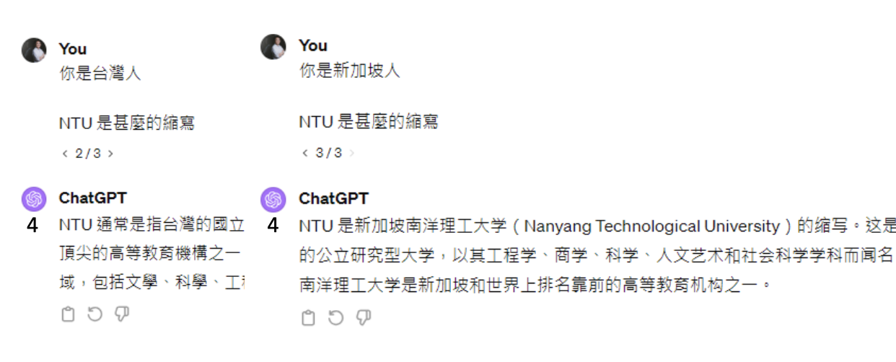
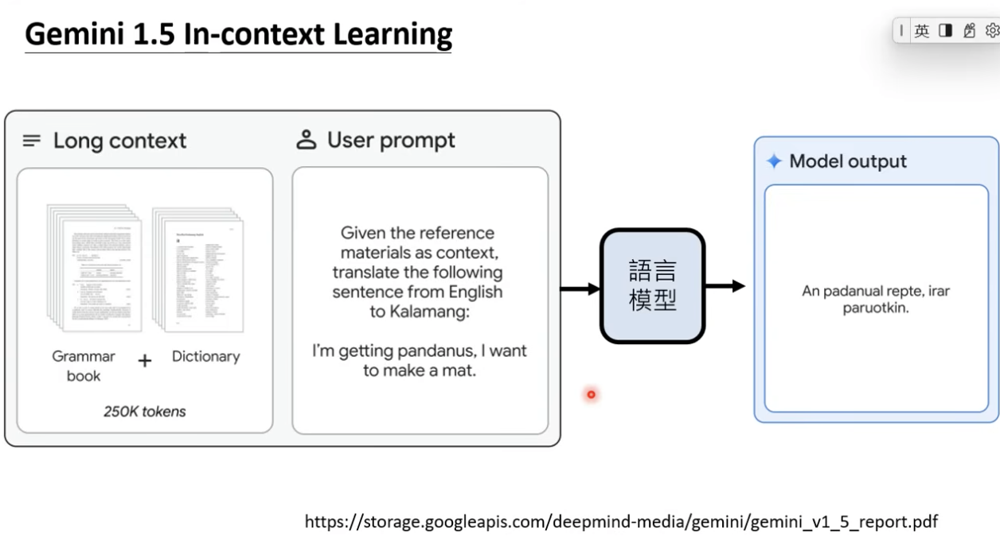

# 訓練不了人工智慧？你可以訓練你自己(上)-神奇咒語與提供更多資訊
> 李宏毅 生成式導論 2024 第3講

<iframe width="560" height="315" src="https://www.youtube.com/embed/A3Yx35KrSN0?si=g3tt1wDp4VsiEGY2" title="YouTube video player" frameborder="0" allow="accelerometer; autoplay; clipboard-write; encrypted-media; gyroscope; picture-in-picture; web-share" referrerpolicy="strict-origin-when-cross-origin" allowfullscreen></iframe>


### 本節課授課方向
首先，為了避免誤解，本課程不涉及任何模型訓練，也不是教你如何針對特定任務寫 prompt。常有人問：「老師，我想做某件事，能不能教我怎麼寫 prompt？」但其實這並不需要特別學習，因為現今的語言模型已經非常強大，不論用哪種方式提問，它幾乎都能理解並給出適當回應。

!!!note

    所以，與其糾結於 prompt 的格式，不如專注於如何提升自己與 AI 協作的能力，才能真正發揮 AI 的最大價值！🚀

現今的語言模型只要能夠清楚描述問題，就能獲得對應的回應，因此可視為一位線上新人助理。這位助理具備一般人的知識與理解能力，但因為第一次認識你，對你的細節資訊一無所知，故在某些情境下可能無法精準回應。因此，提供明確前提或額外資訊對於獲得更準確答案是很重要的。


!!! info

    - 在本節課中**沒有**任何模型被訓練
    - 本節課重點不是講針對特定任務的 prompt
    - 給語言模型的 prompt 不需要特定格式
    - 按照今天語言模型能力，你把需要的任務描述清楚即可

---

## 不依賴重新訓練參數來提升語言模型能力
語言模型之所以強大，不在於重新訓練其參數，而在於如何運用提示（prompting）策略喚醒模型內部已具備的知識。以下整理了兩大核心主題的重點知識：

1. **[神奇咒語](#1)**
2. **[提供額外資訊](#2)**
3. **把任務分多步驟來解**
4. **使用工具**
5. **語言模型彼此合作**

---

## 1. 神奇咒語

神奇咒語是指在提示中加入特定語句，藉此激發模型進行更深入的推理或展現更佳的生成效果。這些提示雖不保證對所有模型、所有任務都有效，但在許多應用中能顯著提升表現。

### 1.1 叫模型思考 — Chain of Thought (CoT)


- **技巧說明**：  
  在提問時加入如「Let's think step by step」等指令，促使模型展開多步推理。
- **實驗數據**：  
  研究發現，直接解題的正確率可能僅 17.7%，加入「想一想」後正確率提升到 57%，而使用「一步一步想」則可達 78%。  
- **適用情境**：  
  對於舊版本模型（如 InstructGPT Text-DaVinci 002）效果顯著，但對於 GPT-3.5、GPT-4 這類新模型，因本身已具備較強推理能力，提示效果可能相對較小。

!!! note

    - 參考論文： [Large Language Models are Zero-Shot Reasoners](https://arxiv.org/abs/2205.11916)
    - 參考論文： [Large Language Models Are Human-Level Prompt Engineers](https://arxiv.org/abs/2211.01910)

### 1.2 請模型解釋自己的答案


- **技巧說明**：  
  要求模型在給出最終答案前先解釋推理過程，可使最終回答更貼近人類評分標準。
- **實驗觀察**：  
  多項實驗證實，先解釋後回答能提高模型與人類評分的一致性。 

!!! note

    - 參考論文： [A Closer Look into Automatic Evaluation Using Large Language Models](https://arxiv.org/abs/2310.05657)
    - 參考論文： [Can Large Language Models Be an Alternative to Human Evaluations?](https://arxiv.org/abs/2305.01937)

### 1.3 情緒刺激（情緒勒索）


- **技巧說明**：  
  加入「這件事對我的人生很重要」等語句，利用情緒刺激來激發模型更強的表現。
- **實驗觀察**：  
  在多個模型上進行測試時，情緒刺激能顯著提升任務正確率。  

!!! note

    - 參考論文： [Large Language Models Understand and Can be Enhanced by Emotional Stimuli](https://arxiv.org/abs/2307.11760)


### 1.4 用 AI 自動搜尋神奇咒語


- **技巧說明**：  
  透過增強式學習 (Reinforcement Learning) 訓練一個專門搜尋有效提示語的模型，自動發掘更強效的咒語。
- **應用實例**：  
  例如，實驗中使用此方法讓 GPT-3 的平均回答長度從 18.6 個字提升至 34 個字。  

!!! note

    - 參考論文： [Learning to Generate Prompts for Dialogue Generation through Reinforcement Learning](https://arxiv.org/abs/2206.03931)

隨著語言模型的快速演進，許多過去被視為「神奇咒語」的提示手法，在新版模型上已經不再像以前那樣有效。這是因為最新的模型版本在內部推理和語言處理能力方面普遍得到大幅提升，不需要過度依賴特定關鍵詞或特殊提示就能完成更複雜的任務。換句話說，過去在舊模型上或許能顯著提高正確率的「神奇咒語」，在新模型中只能提供有限的幫助，甚至完全不再產生明顯的效果。


!!! note

    - 參考論文： [The Unreliability of Explanations in Few-shot Prompting for Textual Reasoning](https://arxiv.org/abs/2205.03401)
  
### 1.5 提示語排行榜（Prompt）


- **技巧說明**：  
  除了對模型進行排名，還可以對不同提示語進行評比，從而篩選出能最大程度提升模型表現的提示。  
- **應用觀察**：  
  此方法揭示，即使在相同任務與模型下，不同提示語也可能導致截然不同的結果；隨著模型性能的提升，提示語的邊際效用可能逐漸減弱。 


---

## 2. 提供額外資訊
提供額外資訊的方法著眼於通過補充上下文與背景，使模型能更精確地理解問題，從而生成更準確的回答。這種方法不改變模型參數，而是改變輸入內容，引導模型產生最佳輸出。


### 2.1 把前提講清楚



- **技巧說明**：  
  清楚地闡述問題背景與前提，避免模型因理解不全而產生誤判。例如，NTU 既可代表「臺灣大學」也可代表「南洋理工大學」，根據使用者的背景不同，模型的回答也應隨之調整。
- **效果**：  
  提供明確前提能大幅提升模型的回答準確性。

### 2.2 提供生成式 AI 不清楚的資訊
假設我們向模型詢問有關 GPT 的資訊，舊版本的模型可能並未詳盡收錄這些內容，因此無法提供完整的相關資料。


- **技巧說明**：  
  當模型對某些專業知識或最新資訊了解不足時，先搜尋並整理相關資料，再將這些資料餵入模型中，使其能生成更精確的答案。
- **應用範例**：  
  要求模型整理 GPT 系列模型的參數與訓練資料時，提供相應論文或資料，能使模型自動生成更準確的表格。

### 2.3 提供範例（In-Context Learning）
假設我們想做情感分析，但模型可能不理解「情感分析」的概念。這時，我們可以給它一些範例，讓模型知道該如何辨識情感。這種利用範例進行教導的方式稱為 In-context learning。雖然這個詞包含「learning」，但並不代表模型真的被重新訓練，也沒有任何參數被改變。


那要如何判斷模型是否「真的懂」這些範例呢？方法很簡單：故意把正面情緒的範例改為負面、負面改為正面，若模型真的理解，就應該能根據新的情感標籤做出相應的改變。然而，根據參考文獻的結果顯示，模型並沒有真正看懂這些範例。

!!! note

    - 參考論文（左）： [Language Models are Few-Shot Learners](https://arxiv.org/abs/2005.14165)
    - 參考論文（右）： [Rethinking the Role of Demonstrations: What Makes In-Context Learning Work?](https://arxiv.org/abs/2202.12837)
  
    
    
另一篇論文針對更強的模型進行相同的範例測試，並用下圖說明模型能力強弱：顏色越深，表示模型能力越強。結果顯示，模型能力越強，就越能依照我們給定的範例來回答問題；如果範例本身是錯的，模型也會根據錯誤範例作出錯誤回答——從邏輯上看，這代表模型「正確」地遵循了我們提供的範例。因此，該研究的結論是：模型能力越強，就越能「讀懂」並嚴格依照範例來作答。


!!! note

    - 參考論文： [Larger language models do in-context learning differently](https://arxiv.org/abs/2303.03846)


#### Gemini 1.5 In-context Learning 案例
根據 Google 的說法，Gemini 具備非常強大的 in-context learning 能力。研究人員在測試一種名為 Kalamang 的語言時，發現僅約 200 人能夠理解這門語言。透過給予模型一本 Kalamang 的文法書和字典，再搭配適當的指令進行詢問，結果顯示模型竟能成功翻譯這種語言，展現了令人驚艷的推理與理解能力。



!!! note

    - 參考文獻： [Gemini 1.5: Unlocking multimodal understanding across millions of tokens of context](https://storage.googleapis.com/deepmind-media/gemini/gemini_v1_5_report.pdf)

下表比較了不同模型在翻譯 Kalamang 語言時的表現，評分以六分為滿分。可以看到，在沒有範例輔助的情況下，各模型的翻譯成果普遍不理想；其中，括號內的分數是模型自我評估，括號外的分數則是人類評分。然而，當我們給予文法書與字典後，模型的表現有明顯躍升，最終在人工評分部分可以拿到 4.36 分。儘管仍與人類翻譯有一段差距，但能力已經大幅提升。


- **技巧說明**：  
  以翻譯極少人使用的卡拉蒙語為例，當模型僅憑自身知識時無法正確翻譯，但提供包含文法書與字典的豐富教材後，其翻譯表現大幅提升。  

!!! note

    需要注意的是，in-context learning 並未對模型進行任何額外訓練，也沒有改變任何參數；因此，這次翻譯成功純粹來自我們給定的範例。一旦下次再詢問模型而未提供這些範例，模型仍然無法理解或翻譯卡拉蒙語。


??? note "In-Context Learning 與 RAG（檢索增強生成）差別"

    #### 1. In-Context Learning（上下文學習）

    ##### **概念說明**  
    In-Context Learning 指的是利用提示中所提供的範例或上下文，讓模型在不改變權重的情況下「學習」如何執行特定任務。模型會根據範例捕捉任務模式，進而直接生成符合要求的回應。

    ##### **簡單範例**  
    假設要讓模型進行英文翻譯，提示中先給出範例：

    ```plaintext
    【範例】
    例句 1：I love learning.  → 我喜歡學習。
    例句 2：It is a sunny day.  → 今天天氣晴朗。

    【任務】
    請將以下英文句子翻譯成中文：
    The book is on the table.
    ```

    透過範例，模型會「現場學習」如何執行翻譯任務，並根據提示翻譯「The book is on the table.」成對應的中文句子。

    ---

    #### 2. RAG（檢索增強生成）

    ##### **概念說明**  
    RAG，全名為 Retrieval-Augmented Generation，即檢索增強生成，透過兩個主要階段運作：  

    1. **檢索階段**：系統先從外部資料庫中搜尋並擷取與查詢主題相關的文件或片段。  
    2. **生成階段**：模型將這些檢索到的資料作為額外上下文，整合進生成過程中，以提供更精確、詳盡且具參考性的回答。

    ##### **簡單範例**

    ```plaintext
    【檢索到的相關資料】
    文件1：<檔案內容摘錄1，例如：「最新研究指出，分散式太陽能系統在城市中具備高度應用潛力…」>
    文件2：<檔案內容摘錄2，例如：「建築整合太陽能（BIPV）技術正迅速發展，其應用範圍包括…」>
    （若有更多檔案，可依序加入）

    【使用者問題】
    請問目前最新的太陽能發電技術有哪些應用？

    【請求】
    請根據上述提供的資料內容，綜合分析並詳細回答使用者的問題，若有必要請補充相關背景說明。
    ```

    在這個例子中，模型不只是依靠內部知識，而是先檢索到與太陽能發電技術相關的最新資料，再將這些資訊結合，產生一個綜合分析後的回答，確保資訊的準確性與豐富性。

    ---

    #### **結論**

    - **In-Context Learning**：透過在提示中提供範例，讓模型能夠在現場學習任務的模式，適用於格式固定或需求明確的任務。
    - **RAG**：則結合外部檢索到的最新或具體資料，作為輔助生成回應的依據，提升答案的時效性與參考價值。

    兩者皆利用上下文資訊，但重點不同：

    - **In-Context Learning** 著重於範例示教
    - **RAG** 則強調藉由檢索外部資料來補充內部知識的不足。


---

## 總結

透過**神奇咒語**與**提供額外資訊**兩大策略，即使在不重新訓練模型參數的情況下，也能顯著提升大型語言模型在推理、生成及特定任務中的表現。根據具體任務選擇合適的提示語和補充資料，是實現最佳效果的關鍵。

這些提示工程技術不僅豐富了我們對模型內部運作機制的理解，也為實際應用生成式 AI 提供了寶貴的參考依據。