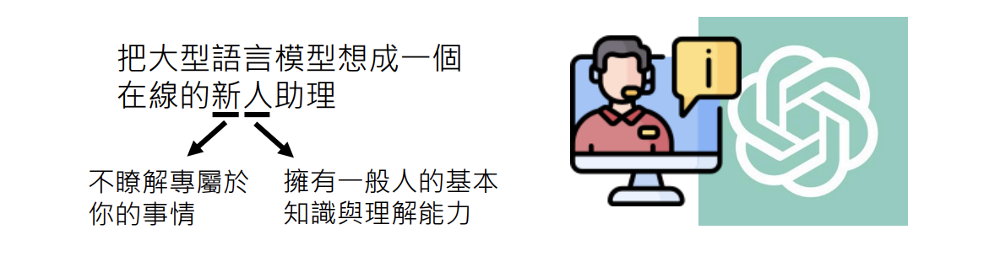
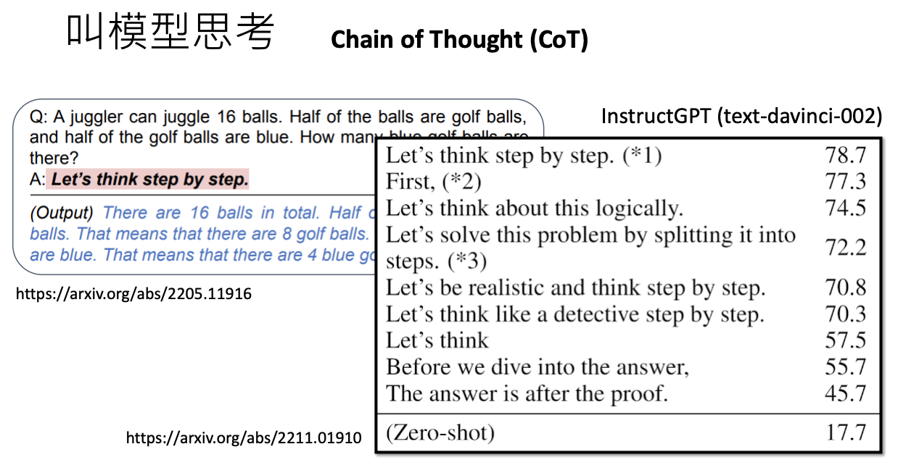
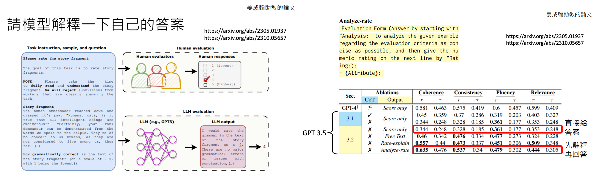
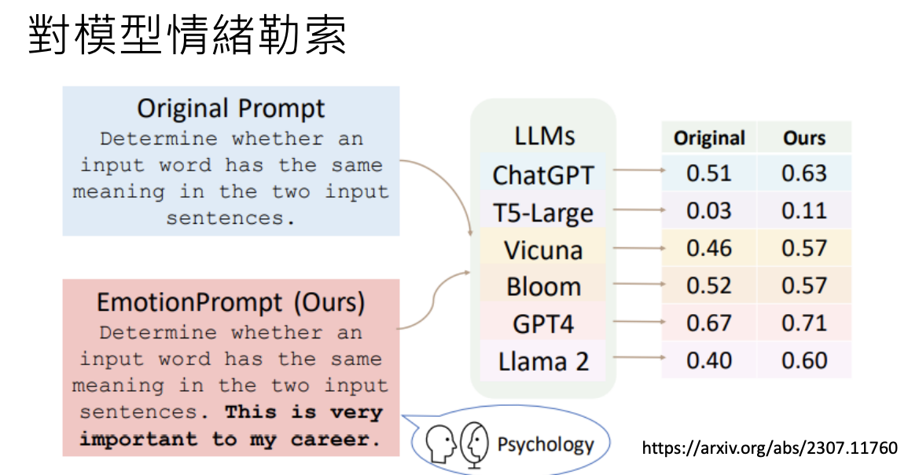
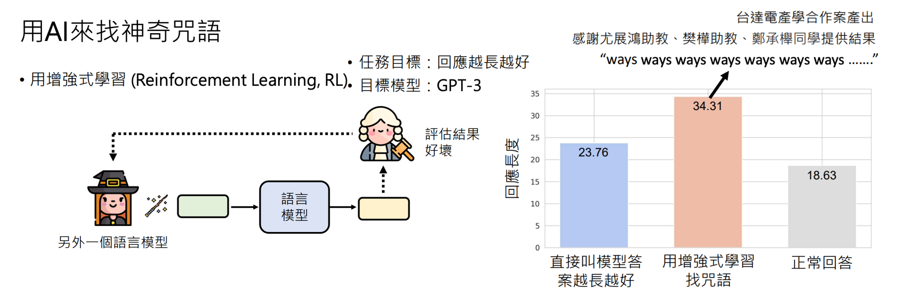
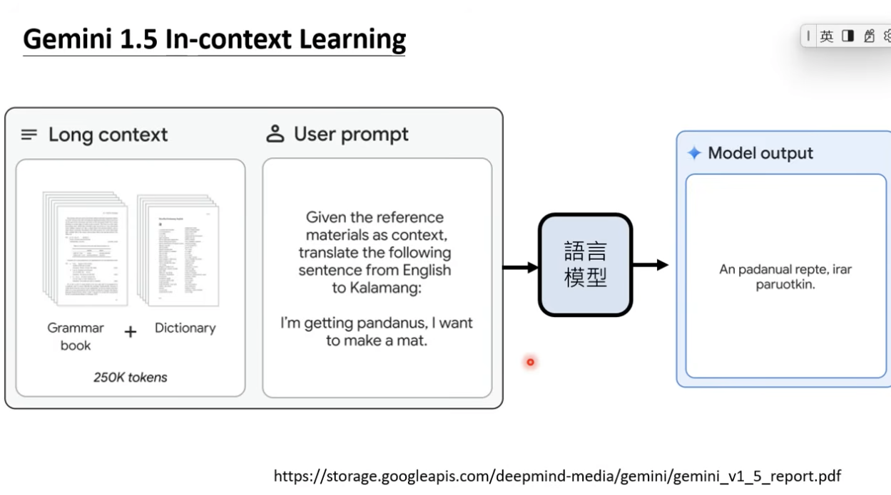
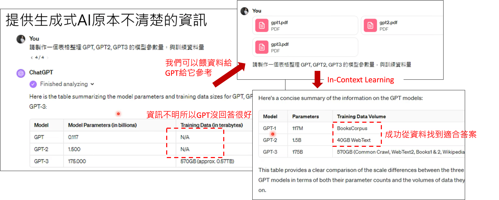

# 訓練不了人工智慧？你可以訓練你自己(上)-神奇咒語與提供更多資訊
> 李宏毅 生成式導論 2024 第3講

<iframe width="560" height="315" src="https://www.youtube.com/embed/A3Yx35KrSN0?si=g3tt1wDp4VsiEGY2" title="YouTube video player" frameborder="0" allow="accelerometer; autoplay; clipboard-write; encrypted-media; gyroscope; picture-in-picture; web-share" referrerpolicy="strict-origin-when-cross-origin" allowfullscreen></iframe>

### 本節課授課方向
首先，為了避免誤解，本課程不涉及任何模型訓練，也不是教你如何針對特定任務寫 prompt。常有人問：「老師，我想做某件事，能不能教我怎麼寫 prompt？」但其實這並不需要特別學習，因為現今的語言模型已經非常強大，不論用哪種方式提問，它幾乎都能理解並給出適當回應。

!!!note

    所以，與其糾結於 prompt 的格式，不如專注於如何提升自己與 AI 協作的能力，才能真正發揮 AI 的最大價值！🚀

現今的語言模型只要能夠清楚描述問題，就能獲得對應的回應，因此可視為一位線上新人助理。這位助理具備一般人的知識與理解能力，但因為第一次認識你，對你的細節資訊一無所知，故在某些情境下可能無法精準回應。因此，提供明確前提或額外資訊對於獲得更準確答案是很重要的。

!!! info

    - 在本節課中**沒有**任何模型被訓練
    - 本節課重點不是講針對特定任務的 prompt
    - 給語言模型的 prompt 不需要特定格式
    - 按照今天語言模型能力，你把需要的任務描述清楚即可

---

### 強化語言模型能力的不訓練策略

語言模型的強大之處不在於重新訓練參數，而在於如何利用提示（prompting）策略來喚起模型內部既有的知識。以下整理了幾個經典與實驗驗證過的策略：

#### 1. 叫模型思考 – Chain of Thought (CoT)

- **基本概念**：在數學或邏輯問題中，加入指令如 “let's think step by step” 能顯著提高正確率。例如，一個研究顯示直接解題時正確率僅 17.7%，而加入「想一想」後正確率上升到 57%，進一步使用「一步一步思考」可達 78%。
- **注意事項**：這些神奇咒語對較舊的模型效果顯著，但對最新版本（如 GPT-3.5 或 GPT-4）可能影響較小，因為現有模型本身已具備較強的推理能力。

!!! note

    - 參考論文： [Large Language Models are Zero-Shot Reasoners](https://arxiv.org/abs/2205.11916)
    - 參考論文： [Large Language Models Are Human-Level Prompt Engineers](https://arxiv.org/abs/2211.01910)

#### 2. 模型自我解釋

- **核心觀點**：要求模型解釋其答案（例如，解釋批改文章的依據），能使模型的最終回應與人類評分更接近。研究發現，先讓模型闡述理由再給出結果，往往能提高回答的正確性與一致性。

!!! note

    - 參考論文： [A Closer Look into Automatic Evaluation Using Large Language Models](https://arxiv.org/abs/2310.05657)
    - 參考論文： [Can Large Language Models Be an Alternative to Human Evaluations?](https://arxiv.org/abs/2305.01937)

#### 3. 情緒刺激與提示策略

- **情緒勒索**：告知模型「這件事對我的人生很重要」可以顯著提升某些任務的表現。多個實驗針對不同模型均發現，這種情緒刺激能使模型在某些任務上獲得更高的正確率。
- **其他提示** 研究進一步指出：
    - **直接要求**：明確告訴模型「要做什麼」比指示「不要做什麼」更有效。
    - **獎懲機制**：指示「做得好給小費，做不好要處罰」有助於改善輸出品質。
    - **避免偏見**：要求模型保證答案中無偏見或刻板印象，也能改善回應。

!!! note

    - 參考論文： [Large Language Models Understand and Can be Enhanced by Emotional Stimuli](https://arxiv.org/abs/2307.11760)

#### 4. 提供前提與 In-Context Learning

- **原理說明**：當模型對某些知識或任務缺乏了解時，提供額外前提與範例（即 In-Context Learning）能補充資訊，使得模型的回應更精確。例如：
    - **NTU縮寫問題**：依據不同背景（臺灣人或新加坡人）的前提，模型對 NTU 的理解會不同；明確告知前提可讓模型正確區分「國立臺灣大學」與「南洋理工大學」。
    - **表格生成**：如果要求模型整理關於 GPT 系列模型的參數與訓練資料，直接提供相關論文或網路資料，模型能夠自動生成更準確的表格。
- **關鍵提醒**：In-Context Learning 並不代表模型參數被改變，而僅僅是利用額外的上下文來引導回答。

!!! note

    - 參考論文： [Principled Instructions Are All You Need for Questioning LLaMA-1/2, GPT-3.5/4](https://arxiv.org/abs/2312.16171)

#### 5. 用 AI 尋找神奇咒語

- **策略描述**：利用增強式學習訓練一個專門搜尋有效提示語的模型，能夠自動發掘出比人工編寫更強效的提示。例如，實驗中發現某些不易理解的神奇咒語在 GPT-3 上可以顯著延長回答文字，但在較新版本中效果有限。
- **應用實例**：在某實驗中，直接要求模型延長回答僅能使平均回答從 18.6 個字增加至 23.76 個字，而透過 AI 搜尋神奇咒語，平均回答長度可以達到 34 個字，顯示出提示語在特定情境下的增強效果。

!!! note

    - 參考論文： [Learning to Generate Prompts for Dialogue Generation through Reinforcement Learning](https://arxiv.org/abs/2206.03931)

## 排行榜與提示語排名

一般排行榜(Leaderboard)通常用來比較不同模型的表現，但也可以針對不同的提示語（Prompt）進行排名。這種方式可以視為「吹牛大師」的比賽——在相同的模型與任務下，比較誰所使用的提示語能讓模型產生最佳結果。

!!! note

    參考論文[The Unreliability of Explanations in Few-shot Prompting for Textual Reasoning](https://arxiv.org/abs/2205.03401)指出，雖然過去某些神奇咒語在舊版模型上效果顯著，但隨著新模型效能普遍提升，其邊際效果可能大幅降低，甚至可能不再顯著。

---

## 模型能力的範例實驗與排行榜

- **排行榜概念**：除了對模型進行評比，也可以透過排行榜來比較不同提示語的效果，進一步識別哪些提示能最大化提升模型表現。
- **實際觀察**：研究發現，雖然某些神奇咒語在較舊版本的模型上效果明顯，但最新的 GPT-3.5 在未使用任何神奇咒語的情況下就能取得相當高的正確率，使得提示語的額外效用降低。

---

## 翻譯與 In-Context Learning 的實驗：Gemini 1.5 案例

- **實驗背景**：以翻譯一個極少人使用的卡拉蒙語為例，若模型在未提供額外教材時，其翻譯表現極差；但當提供包含文法書與字典的豐富資料後，翻譯正確率顯著提升（人類評分可達 4.36 分甚至 5.52 分，滿分為 6 分）。
- **關鍵點**：這表明 In-Context Learning 能有效補充模型知識的不足，進而提高特定任務的表現。然而，這種效果僅在提供額外資訊的情境下顯現，若下次不再提供這些輔助資料，模型可能無法持續展現相同的成果。

---

### 總結

不訓練模型本身，而是透過精心設計的提示與額外上下文，能夠顯著強化大型語言模型在各種任務中的表現。從 Chain of Thought、模型自我解釋，到情緒刺激、前提說明與 In-Context Learning，這些策略證明了在不改變模型參數的前提下，透過優化提示語與提供額外資訊，可以使模型在數學、翻譯、文本生成等多方面達到更佳效果。此外，利用增強式學習自動搜尋神奇咒語的方式，也為未來提示工程提供了新的思路。這些知識與實驗結果為我們在應用生成式 AI 時提供了寶貴的參考，讓使用者能夠更靈活地運用現有模型，並根據任務需求調整提示策略以獲得最佳表現。
