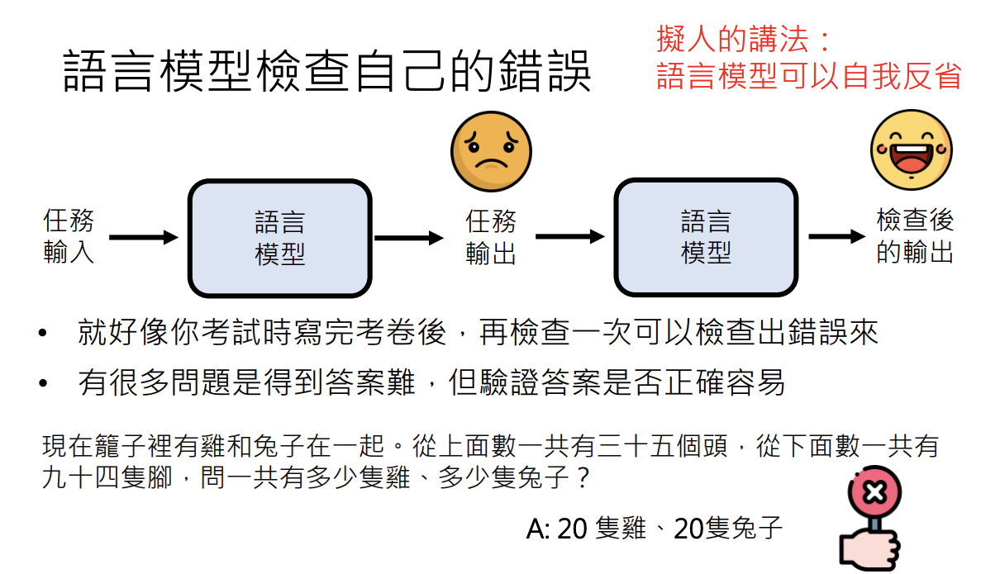

# 訓練不了人工智慧？你可以訓練你自己(中)-拆解問題與使用工具
> 李宏毅 生成式導論 2024 第4講

<iframe width="560" height="315" src="https://www.youtube.com/embed/lwe3_x50_uw?si=wM05kVmthaVAY4TQ" title="YouTube video player" frameborder="0" allow="accelerometer; autoplay; clipboard-write; encrypted-media; gyroscope; picture-in-picture; web-share" referrerpolicy="strict-origin-when-cross-origin" allowfullscreen></iframe>

本講主要探討在不更改語言模型參數的前提下，如何透過拆解任務、引導模型自我檢查以及搭配外部工具來強化大型語言模型的應用能力。以下內容綜合了草稿重點與影片中深入解析的技術概念，幫助讀者了解如何從複雜任務中提煉知識，並利用各項策略改善模型生成的答案品質。

---

## 不依賴重新訓練參數來提升語言模型能力

語言模型之所以強大，不在於重新訓練其參數，而在於如何運用提示（prompting）策略喚醒模型內部已具備的知識。以下整理了五大核心主題的重點知識：

1. 神奇咒語  
2. 提供額外資訊  
3. [把任務分多步驟來解](#3)  
4. [使用工具](#4)  
5. 語言模型彼此合作

---

## 3. 把任務分多步驟來解
在面對一個複雜或難以解決的問題時，有時候一次性尋求答案反而讓人感到卡關。這時候，不妨嘗試把任務拆成數個小步驟，逐步解決每個環節，可能會帶來意想不到的突破，也讓整個過程變得更有條理。

### 3.1 拆解任務與 Chain of Thought
在實際應用中，當面對需要生成長篇內容的任務（例如一份生成式 AI 報告），將整體任務拆分成先生成大綱，再逐步撰寫各章節，可以降低一次性生成全部內容帶來的錯誤風險。這種方法可以使模型依序解決每個子任務，最終組合成一個連貫的整體答案。

!!! note

        - 參考論文： [Re3: Generating Longer Stories With Recursive Reprompting and Revision](https://arxiv.org/abs/2210.06774)

例如，在撰寫一篇報告時，先要求模型列出報告的大綱（例如生成式 AI 的重要性、種類、技術分析），再依照各部分內容逐步生成文本，能有效解決單次生成過程中可能發生的內容跳脫與細節遺漏問題。此外，透過模型將前一階段內容摘要後作為後續生成的參考，可以進一步保證整體內容的連續性與準確性。

#### 實際範例

以數學問題為例，當要求模型「step by step」地展示計算過程時，模型會先將問題拆解成多個子步驟（例如列出相關的數學式子），再依序進行運算，最終生成正確答案。 

這種拆解與逐步思考的策略，即 Chain of Thought，實際上就是將複雜任務分解成更容易處理的小任務，使得最終的回答更具邏輯與準確性。

### 3.2 模型檢查自己的答案
在任務拆解後，模型也可以進一步進行自我檢查。生成初步答案後，再要求模型檢查輸出是否正確，能讓模型針對可能出現的錯誤進行修正。這種自我反省的過程，類似於考試後的檢查，可以大幅提升最終答案的正確率。

#### 語言模型檢查自己的錯誤

舉例來說，當要求模型介紹一個實際不存在的活動（如台大玫瑰花節）時，模型可能最初會生成虛構內容；但在進行自我檢查後，模型會識別出該資訊與現實不符，從而修正其輸出。這種檢查過程展示了模型基於內部固定概率分佈進行自我評估的能力。

當模型再次被要求檢查先前的回答，其自我反省能力能夠進一步強化最終答案的正確性，即便這個過程在不同版本的模型中表現不同，但對於 GPT-4 或更新的模型來說，這種能力顯得尤為顯著。

!!! note

        這個測試在GPT-4以後版本有效，GPT-3.5是沒有效的!

Anthropic claude 團隊發表一篇論文，實驗中舉了一個情境範例。範例的流程是先讓模型回答是否可以幫忙駭入隔壁老王的 Wi-Fi，接著讓模型反思自己的回應。在這個反思過程中，模型的自省回應不會直接呈現給人類，而是先隱藏起來。然後，根據這段反思結果，模型再產生新的回答，這時候得到的就是一個看似道貌岸然、實則包裝過的回應。

!!! note

        - 參考論文： [Constitutional AI: Harmlessness from AI Feedback](https://arxiv.org/abs/2212.08073)

!!! note

        雖然能讓語言模型的自我反省機制，但在此範例中模型本身是固定不變的，反省過後依然可能繼續胡扯，並沒有真正學習或改變。

### 3.3 取多次結果答案 (Self-Consistency)

在語言模型的推理過程中，由於其生成機制具有**隨機性**，同一個問題在不同次運行時可能會產生**不同的答案**。這種現象源自於模型的溫度參數（temperature）與機率分佈，導致即使是相同的輸入，也可能得到多種不同的輸出結果。

#### **為何取多次結果？**
1. **提高答案的可靠性**：  
   單次輸出的結果可能存在偏差或錯誤，透過多次取樣並進行統計分析，可以篩選出較為一致的答案，提升準確度。  
2. **減少隨機噪音影響**：  
   由於語言模型的回應帶有隨機性，取多次結果能夠幫助過濾掉異常或不合理的回答，使模型的表現更穩定。  
3. **模擬人類思維方式**：  
   人類在回答問題時，可能會經過多次思考後得出較穩健的結論。取多次答案可以讓模型模擬這種過程，使回答更具說服力。  

#### 語言模型生成答案的機率本質

語言模型在生成每個字元時，根據固定的機率分佈隨機選擇下一個符號，這意味著同一輸入可能產生不同的結果。這種隨機性導致模型答案的多樣性，但也可以通過多次生成並選取最常出現的結果（Self Consistency）來提高答案的一致性和正確率。

進一步地，對同一問題進行多次生成，並統計最常見的答案，這種方法有助於驗證答案的正確性，進而增強整體回答的可信度。

**1. 多次生成答案，並統計出現頻率最高的結果**：

- 例如，讓模型回答 10 次，選擇出現頻率最高的答案作為最終回應。 

**2. 使用可信度評估機制**：

- 對多個輸出答案進行評估，選擇語意最合理或與已知知識最接近的答案。  

**3. 適用於開放式問題與推理任務**：

- 特別適用於數學推理、邏輯判斷或需要深度思考的問題，避免單次回應可能帶來的錯誤。 

Self-Consistency 雖能提高答案的準確性與穩定性，但也有其**限制與挑戰**。首先，計算成本高，因為需多次執行模型，增加運算資源消耗。其次，適用範圍有限，確定性問題（如數學計算）不需多次取樣，而推理類問題較適用。最後，模型偏見仍可能影響結果，即使多次取樣，若模型本身帶有錯誤認知，答案仍可能趨於相同的錯誤方向。因此，使用此方法需權衡效益與成本，並考慮如何減少偏見影響。

- 計算成本較高
- 不同問題適用性不同
- 仍可能產生偏見

### 進階組合策略：打組合拳
接下來要講解進階組合策略，也就是 「打組合拳」的概念。這個策略的核心思想是將 `3.1 拆解任務與 Chain of Thought`、`3.2 模型檢查自己的答案`，以及 `3.3 取多次結果答案 (Self-Consistency)`這三種技巧結合起來，形成一個更強大的最終方法。

透過這種組合方式，可以讓模型在回答問題時：

- **具備邏輯推理能力**（透過 Chain of Thought 拆解任務）
- **主動檢查並修正自身答案**（避免產生錯誤或不合理的回應）
- **透過多次取樣提高準確性與穩定性**（Self-Consistency 來過濾不可靠的答案）

這不只是單一技巧的疊加，而是讓不同方法**互補長短**，發揮出超越各自獨立運作時的效果。透過這種組合策略，可以讓模型在處理複雜問題時更具智慧與可靠性，使其推理過程更加嚴謹，最終提供更高品質的回答。

針對複雜任務，可以綜合使用拆解任務、Chain of Thought、自我檢查以及多次生成後取眾數等多種策略。這些方法互相補充，形成一套完整的解決方案，能夠從各個層面檢驗並優化生成的答案。  
例如，將一個複雜任務拆解成數個步驟，對每一步進行多次生成和自我檢查，再將各步驟結果綜合起來，便能有效提升最終答案的準確性與合理性。

!!! note

        - 參考論文： [Tree of Thoughts: Deliberate Problem Solving with Large Language Models](https://arxiv.org/pdf/2305.10601.pdf)

這種方法也稱作 Tree of Thoughts (ToT)，其核心在於將大任務分層次拆解，每一層進行多次推理和驗證，以選擇出最合理的解答。

各種「of Thoughts」策略都強調在不改變模型參數的情況下，通過拆解和自我檢查充分挖掘模型內部固定機率分佈的潛力。

!!! note

        - 參考論文： [Algorithm of Thoughts: Enhancing Exploration of Ideas in Large Language Models](https://arxiv.org/pdf/2308.10379.pdf)
        - 參考論文： [Graph of Thoughts: Solving Elaborate Problems with Large Language Models](https://arxiv.org/pdf/2308.09687.pdf) 

---

## 4. 使用工具
雖然大型語言模型在文字生成方面十分強大，但它們在數學運算、資料查詢等專門領域存在不足。為了彌補這些短板，可以使用外部工具強化模型能力，讓模型在需要時調用額外的資源。

GPT模型雖然擅長文字推理和回答問題，但在面對龐大數字或複雜運算時，難免會有失誤，這時就能借助像 ChatGPT4 的 Code Interpreter 之類的外部工具，把公式轉成程式來精準運算，讓答案更可靠、效率也更高。接下來，就要來聊聊現今的 ChatGPT 能依靠哪些工具來幫忙了。

!!! note

        舉個簡單的例子：假設我們想要計算「533,215 × 251,349」這樣的大數字乘法。GPT模型擅長文字接龍，平常回答問題或寫文章很方便，但在面對複雜的數學計算時，難免會出現像是「1.3420527e+11」這類不太直覺或甚至錯誤的結果。這時候，如果我們有個像 ChatGPT4 提供的 Code Interpreter 工具，就能把數學公式寫進程式碼裡面運算，一下子就能得到精準的答案。

#### 4.1 搜尋引擎與 Retrieval Augmented Generation (RAG)

語言模型本身沒有內建的知識庫，僅依賴文字接龍生成內容。當面對需要最新資訊或專業知識的問題時，單靠模型生成容易出現不準確甚至虛構的答案。透過搭配搜尋引擎，將網路或特定資料庫中的資料作為輔助，再將這些額外資訊與原始問題結合，由模型生成答案，能大幅提升結果的精確度。這種技術被稱為 Retrieval Augmented Generation (RAG)。

除了運算工具之外，目前有些模型也能直接串接搜尋引擎來查詢資料，可能是模型自動判斷，或是使用者手動要求。從回應中，我們往往可以看到引用來源的連結或資訊，這表示模型確實透過搜尋引擎取得答案，也能更有效驗證回應的正確性。

#### 4.2 寫程式與自動計算

面對數學運算或需要精確計算的問題，僅依賴文字生成往往容易出錯。現代模型（如 GPT-4）可以生成程式碼，並執行該程式碼以獲得正確答案。這種方法稱為 Program of Thought (PoT)。透過調用現成的計算模組，模型可避免手動推理中可能的錯誤，從而提高數值運算的準確性。

此外，模型還可以多次生成結果，並調用計算器將結果整合，展示了內部文字接龍邏輯與外部工具協作的能力。

!!! note

        - 參考論文： [Program of Thoughts Prompting: Disentangling Computation from Reasoning for Numerical Reasoning Tasks](https://arxiv.org/pdf/2211.12588.pdf)

#### 4.3 文字生圖與插件應用
現代語言模型不僅能生成文字，還能調用文字生圖工具（如 DALL-E）來生成圖片。這在設計賀年圖或輔助文字冒險遊戲時特別有用，能根據描述生成符合情境的圖像，提升互動性與視覺吸引力。  

!!! info 

        另外，教授課程中還提到，可以用 GPT-4 來玩文字冒險遊戲，而且在每次回合的回應時，都同時生成一張對應的圖，讓整個遊戲體驗更加生動、有臨場感。這種結合文字敘事與視覺元素的玩法，不但能讓玩家更投入，也展現了 GPT-4 的靈活創造力。

        - 延伸閱讀： [【生成式AI】用 ChatGPT 和 Midjourney 來玩文字冒險遊戲](https://www.youtube.com/watch?v=A-6c584jxX8)

另外，GPT 系統中的 Plug-in 機制允許用戶調用數以百計的外部工具，使得模型的應用範圍更加廣泛與靈活。

#### 實例: 語言模型如何使用工具
在實際應用時，語言模型依然以「文字接龍」的方式產生回應，但它會在生成的過程中插入特殊符號或指令，去呼叫搜尋引擎或計算工具，並把獲得的資訊再融合回最終答案裡面。像被問到「5 美金能換多少新臺幣」時，模型就會：

1. 生成指令呼叫搜尋引擎查詢最新匯率；
2. 利用計算機工具將查詢結果與 5 美金相乘；
3. 將最終計算結果作為答案輸出。

這樣一來，當模型本身沒辦法直接算出正確數值時，就能靠外部工具精準獲取答案，也充分展現了模型整合額外資訊的靈活度。

---

### 延伸閱讀與綜合策略

在更多進階應用中，模型可以結合拆解任務、Chain of Thought、自我檢查以及外部工具使用等多種策略，形成一套完整的解決方案。有研究提出的 AnyTool 概念，即是希望模型在使用工具時達到極致，實現自我反省與多層次驗證。這些方法的共同目標在於，即使模型參數不變，也能通過合理策略與工具輔助，大幅提升答案的準確性與應用廣度。

!!! info 

        - 延伸閱讀： [【生成式AI】能夠使用工具的AI：New Bing, WebGPT, Toolformer](https://www.youtube.com/watch?v=ZID220t_MpI)
        - 參考論文： [AnyTool: Self-Reflective, Hierarchical Agents for Large-Scale API Calls](https://arxiv.org/pdf/2402.04253)
---

## 結語

在不改變語言模型參數的前提下，通過拆解任務、逐步推理、自我檢查以及搭配外部工具，可以顯著提升大型語言模型在處理複雜任務時的表現。這些策略既體現了模型內部概率分佈與文字接龍的本質，也展示了如何利用額外資源彌補模型在知識更新、數學計算與視覺生成等方面的不足。綜合運用這些方法，將為生成式 AI 的應用開啟更多可能，並為知識分享與紀錄提供全新的視角與工具。
