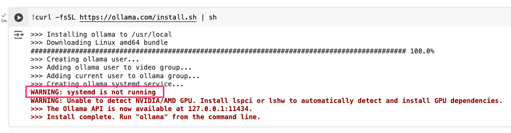

# 利用 Google Colab 部署 Ollama 服務

## 前言
Ollama 服務提供一個統一的介面，讓你能夠輕鬆管理與呼叫各式語言模型，無論是在測試環境還是實際應用中，都能發揮極佳效能。對於手上沒有 GPU 運算資源，卻又想試玩地端大型語言模型的朋友，利用 Colab 平台進行概念驗證不失為一個好方法。透過 Colab 的免費運算資源，你可以快速驗證 Ollama 的功能與表現，進而應用於開發或原型設計。

!!! info "小提醒"

        筆者認為 Colab 適合作為初學者或暫時缺乏運算資源時的測試平台，若進行正式開發，建議還是選擇自備電腦或租用專業的雲端資源，才能獲得更穩定的運作環境。

## 下載與安裝 Ollama
在 Colab Notebook 中，首先我們要下載並安裝 Ollama。可以透過以下指令輕鬆完成安裝：

```sh
!curl -fsSL https://ollama.com/install.sh | sh
```



安裝過程中你可能會看到一些紅色警告訊息，其原因在於 Ollama 在 Linux 系統中安裝後，預設會利用 systemd 自動啟動背景服務。但由於 Colab 環境並未支援 systemd，所以會顯示「systemd is not running」的警告。這個警告屬正常現象，接下來我們只需手動設定 Ollama 以背景程式方式運行即可。

## 手動背景執行 Ollama
由於 Colab 只有單一畫面，我們需要利用背景運行機制來啟動 Ollama 服務。這裡採用 `nohup` 指令，將原本在終端機上輸出的 log 訊息轉存至 `ollama.log` 檔案中，方便日後查閱運行紀錄。請使用以下指令：

```sh
!nohup ollama serve > ollama.log 2>&1 &
```

如此一來，Ollama 服務就會在背景中持續運行，所有過程紀錄都會記錄在 `ollama.log` 裡面。

!!! info

        另外需要補充的是，Colab 的 code cell 預設執行 Python 程式，但如果要執行 Linux 系統指令，可以在指令前加上驚嘆號 `!`，就能執行相應的系統命令。

## 安裝 LLM 模型
服務順利啟動後，接下來便可下載第一個開源的語言模型。此處以 Google 的 gemma2:9b 模型為例進行說明。請輸入以下指令：

```sh
!ollama pull gemma2:9b
```

Ollama 官方的 [Models 頁面](https://ollama.com/models) 提供了多種支援的模型，依據你的應用需求，也可以選擇其他模型來試玩與測試。

## 使用 Ollama API 整合 OpenAI Python 函式庫
Ollama 除了提供獨立服務外，也與 OpenAI API 部分功能相容，方便現有應用程式連接與呼叫。以下示範如何使用 Chat Completion API 來進行聊天互動，此範例中使用 gemma2:9b 模型並傳送一則訊息。

首先，透過 OpenAI Python 函式庫建立 API 客戶端，設定本機 API 伺服器的 URL 與金鑰（此例中金鑰為 `'ollama'`）：

```python
from openai import OpenAI

client = OpenAI(
    base_url='http://localhost:11434/v1/',  # 設定 API 伺服器的 URL，此處使用本機端點
    api_key='ollama',                      # API 金鑰（此例中設定為 'ollama'）
)
```

接著，利用 chat API 建立一個聊天請求，傳送一則詢問「法國的首都在哪？」的訊息：

```python
chat_completion = client.chat.completions.create(
    messages=[
        {
            'role': 'user',          # 設定角色為「使用者」
            'content': '法國的首都在哪?',  # 你想詢問的內容
        }
    ],
    model='gemma2:9b',              # 指定使用的模型
)
```

最後，使用下列指令即可取得並顯示模型的回應內容：

```python
print(chat_completion.choices[0].message.content)
```

這樣就能夠透過 API 輕鬆整合 Ollama，進行各種聊天互動應用的開發。

## 檢查 Ollama 運作狀態
若你需要確認 Ollama 是否正在運行，或想查看是否使用了 CPU 或 GPU 等運算資源，可以使用以下指令來檢查服務狀態：

```sh
!ollama ps
```

此指令會顯示目前 Ollama 服務的運作狀態與資源使用情形，讓你可以方便地進行監控與調整。

## 結語
透過上述步驟，我們已成功在 Google Colab 上部署並啟動了 Ollama 服務。雖然 Colab 的環境有其限制，但對於初學者及概念驗證來說，這無疑是一個快速入門的好工具。未來若要進一步發展或投入正式應用，建議選擇更穩定且資源充足的環境，以獲得最佳的效能表現。若在部署過程中遇到問題，不妨參考 Ollama 官方文件或加入相關社群交流求助。

希望這篇介紹能幫助各位讀者更順利地理解與部署 Ollama 服務，開啟你在語言模型應用領域的更多可能性！**Happy coding!**
