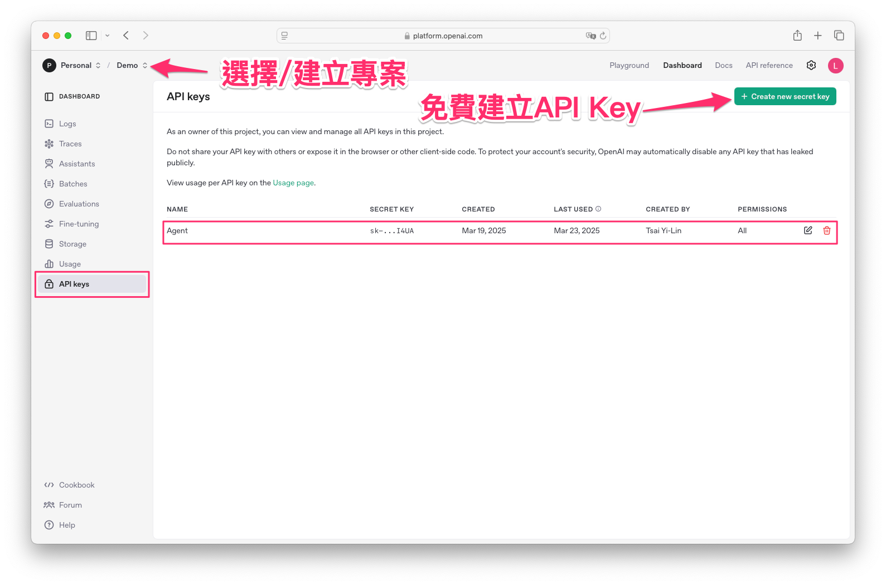
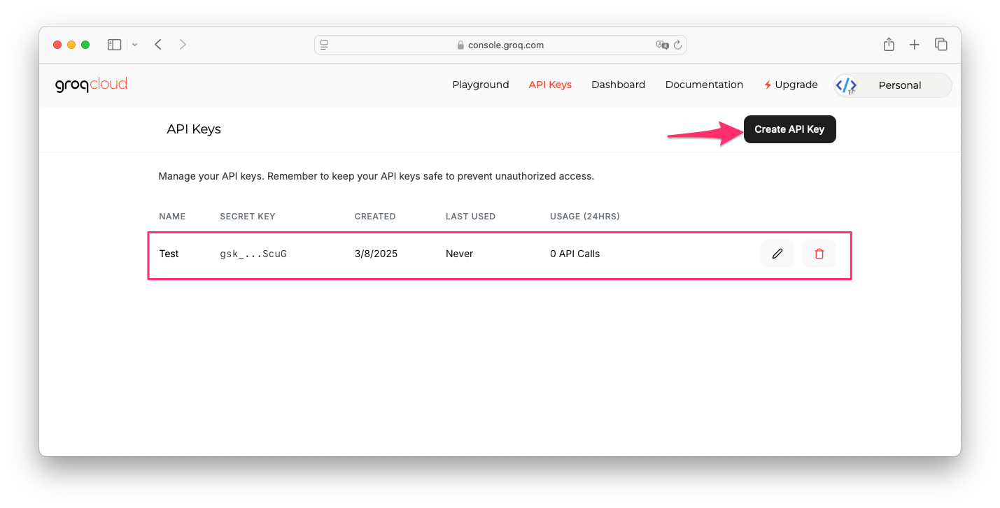
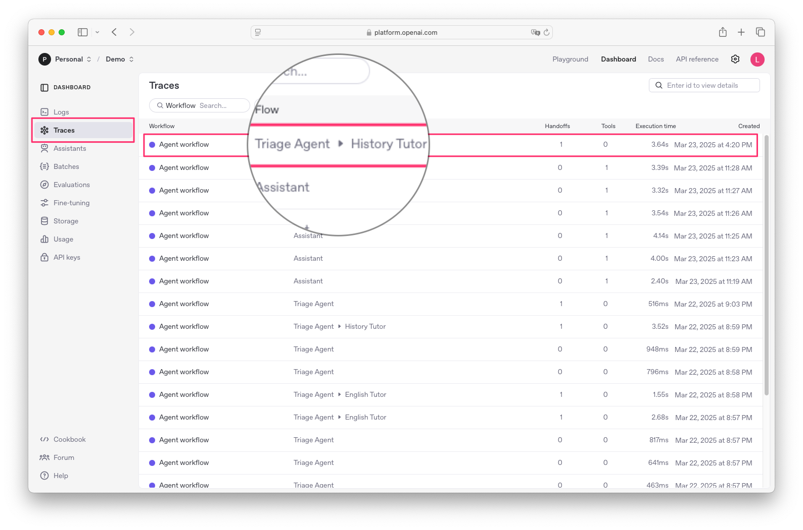
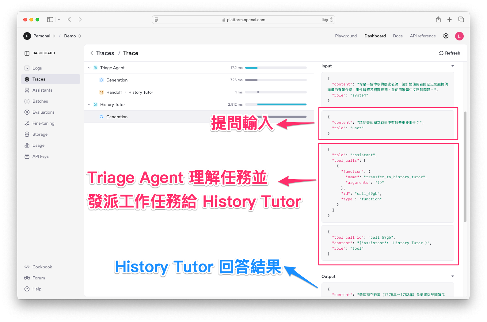

# 使用 OpenAI Responses API 與 Agents SDK：多代理人工作流程教學
> 帶你免費就能試玩 OpenAI Agents SDK

範例程式：[](https://colab.research.google.com/github/andy6804tw/crazyai-llm/blob/main/docs/2.llm-practical/code/OpenAI_Agents_SDK_tutorial.ipynb)

OpenAI 最近又端出了 **Responses API** 以及 **Agents SDK**，讓開發者能在「三分鐘內打造專屬 AI 小幫手」！以前若要做一個能自行執行多步驟流程的 AI Agent，通常得花大量時間串接各種工具並教大模型如何使用，非常耗時。現在，OpenAI 新發表的 Agent API 幫你的 AI 接好「手跟腳」，出廠就能直接上工！

## Responses API 簡介
這次的 **Responses API** 內建了 **WebSearch**、**FileSearch** 和 **Computer Use** 等工具，還搭配專門為搜尋任務微調過的 **GPT-4o** 模型，能夠大幅降低「亂掰」或產生幻覺的機率。對於需要串接私有資料庫的企業，更能把內部文件或資料庫檔案一併上傳，讓 Agent 馬上成為「知識庫」。此外，**Computer Use** 工具甚至能遠端操作電腦或瀏覽器，處理各種繁雜的工作。

| 工具名稱          | 功能描述                                                             | 應用場景                          |
| ----------------- | -------------------------------------------------------------------- | --------------------------------- |
| Web Search Tool   | - 即時整合搜尋 <br> - 採用 GPT-4.0 Search Preview 模型 <br> - 簡易問答約 90% 準確度 | - 需要最新網路資訊的應用 <br> - 例如新聞搜尋 |
| File Search Tool  | - 檔案檢索與讀寫 <br> - 內建即時記憶體存取 <br> - 適用於處理文件與使用者偏好      | - 企業內部文件快搜 <br> - 個人化推薦        |
| Computer Use Tool | - 控制電腦操作（如迴圈、資料調用、Operator 技術等）                  | - 自動化作業 <br> - 預排班、營運自動化      |


!!! note

        - 延伸閱讀： [Responses vs. Chat Completions](https://platform.openai.com/docs/guides/responses-vs-chat-completions)
        - 延伸閱讀： [Web Search and States with Responses API](https://cookbook.openai.com/examples/responses_api/responses_example)

## Agents SDK 簡介
同時，OpenAI 也釋出了 **Agents SDK**，讓多個 Agent 可以透過工作流程編排進行無縫合作。例如，一個 Agent 負責旅遊行程規劃，另一個就能照著行程表幫你訂票、購物，一次搞定！目前各家 AI 大廠都在拚「Agent」，這被視為 AGI 的第三階段。未來，或許真的會出現一大波「AI 同事」，分擔企業中許多重複性或繁瑣的工作。

OpenAI 將實驗性的 Swarm SDK 升級為 Agents SDK，新增了以下功能：

- 代理人之間的任務交接控制 (Handoffs)
- 安全防護機制 (Guardrails)
- 後台管理追蹤、除錯與優化 (Tracing & Observability)

!!! info

        在本文中，我們將展示如何在 **不付費購買 OpenAI API** 的情況下，使用 **Groq** 這類第三方免費模型服務來執行 Agents SDK。並且透過 OpenAI 提供的可觀測性（Observability）功能，將代理人執行紀錄上傳到 OpenAI 後台進行除錯和分析。


---

## 註冊 OpenAI Platform
前往 [OpenAI Platform](https://platform.openai.com/)，註冊 OpenAI 帳號登入。在左側選單中點擊「API keys」，再點擊右上角的「Create new secret key」。此時會產生一組新的 API 金鑰，請務必先複製或下載保存，因為只會顯示一次。



雖然我們會使用 Groq 服務作為模型後端，但若你想體驗 **Tracing** 功能（將代理人互動記錄上傳到 OpenAI 後台做視覺化與除錯），依然需要在 OpenAI platform 建立一個專案，並呼叫 `set_tracing_export_api_key('<YourOpenAIKey>')`。若你不需要這項功能，只要把金鑰留空字串即可，Agents SDK 就不會上傳到 OpenAI。

```python
from agents import set_tracing_export_api_key

# 如果不想上傳到 OpenAI，就保持空字串
set_tracing_export_api_key('YourOpenAIKey')
```

## 註冊 Groq(免費LLM方案)
如果手邊沒有付費 OpenAI 的 LLM 模型 API 不妨可以使用免費的資源先玩玩看。Groq 的使用方式與介紹可以參考另一篇文章：[Groq 使用教學](../3.free-llm-api-integration-resources/groq-tutorial.md)。



申請完成後，將 Groq 金鑰貼到你的程式碼中。

```py
GROQ_API_KEY = 'YourGroqKey' # 請自行填入
```

!!! note

        只要平台提供與 OpenAI Chat Completions 相容的 API 端點，Agents SDK 都能順利整合。除了 Groq，也可以使用像是 [GitHub Models](../3.free-llm-api-integration-resources/github-models-tutorial.md)、Google Gemini、[Ollama](./Ollama使用教學.md) 等其他服務都是不錯的選擇。


---

## 範例一：Hello World

以下程式展示了最基本的「Hello World」示範：建立一個簡單的助理代理人，並使用 **Groq** 提供的免費模型（以 `llama3-8b-8192` 為例）來產生回覆。

```python
from agents import Agent, Runner, AsyncOpenAI, OpenAIChatCompletionsModel

# 初始化 Groq Client
groq_client = AsyncOpenAI(
    base_url = 'https://api.groq.com/openai/v1',
    api_key=GROQ_API_KEY, # 填入對應的金鑰
)

# 建立一個簡單的助理代理人
agent = Agent(
    name="Assistant",
    instructions="你是一位有用的助理，請使用繁體中文回答問題。",
    model=OpenAIChatCompletionsModel(
        model="llama3-8b-8192", # 指定使用 Groq 上的 llama3-8b-8192 模型
        openai_client=groq_client,
    )
)

result = await Runner.run(agent, "用Python實作費式數列")
print(result.final_output)
```

### 用法與使用時機

- **\`groq_client\`**：不走官方 OpenAI API，而是把 `base_url` 指向 Groq 的端點。
- **\`Agent(...)\`**：定義一個基本代理人，指定要說繁體中文，並設定模型來源為 Groq。
- **\`Runner.run(...)\`**：啟動代理人，傳入使用者問題並等待回覆。

若只想測試單一代理人且不需要多步驟工作流程，這樣的範例就已經能滿足最基本的對話需求。

---

## 範例二：Handoffs（交接）範例

以下示範如何利用 **handoff** 機制，讓不同領域的代理人可以分工合作。例如，「英文老師」負責英文相關問題，而「歷史老師」負責歷史事件背景。

```python
from agents import Agent, Runner, AsyncOpenAI, OpenAIChatCompletionsModel

# 初始化 Groq Client
groq_client = AsyncOpenAI(
    base_url = 'https://api.groq.com/openai/v1',
    api_key=GROQ_API_KEY, # 填入對應的金鑰
)

# 定義英文老師代理人，負責解答英文相關問題
english_teacher = Agent(
    name="English Tutor",
    handoff_description="負責回答英文文法、單字與閱讀理解等問題",
    instructions="你是一位專業的英文老師，請詳細解釋英文文法、單字用法，並舉例說明，幫助學生理解英文內容。並使用繁體中文回答問題。",
    model=OpenAIChatCompletionsModel(
        model="qwen-2.5-32b",
        openai_client=groq_client,
    )
)

# 定義歷史老師代理人，負責解答歷史事件與背景問題
history_teacher = Agent(
    name="History Tutor",
    handoff_description="負責回答歷史事件、人物和背景問題。",
    instructions="你是一位博學的歷史老師，請針對使用者的歷史問題提供詳盡的背景介紹、事件解釋及相關細節。並使用繁體中文回答問題。",
    model=OpenAIChatCompletionsModel(
        model="qwen-2.5-32b",
        openai_client=groq_client,
    )
)

# 定義分流代理人，根據使用者問題內容自動判斷並轉交給最合適的老師
triage_assistant = Agent(
    name="Triage Agent",
    instructions="""
請根據以下規則判斷使用者問題的屬性：
1. 若問題涉及英文文法、詞彙或閱讀理解，請轉交給「English Tutor」；
2. 若問題涉及歷史事件、人物或背景，請轉交給「History Tutor」。
請根據使用者提問內容，自動選擇最適合的代理人。
若提問非兩個領域的問題，則拒絕回答。
""",
    handoffs=[english_teacher, history_teacher],
    model=OpenAIChatCompletionsModel(
        model="qwen-2.5-32b",
        openai_client=groq_client,
    )
)

sample_question = "請問美國獨立戰爭中有哪些重要事件？"
result = await Runner.run(triage_assistant, sample_question)
print("最終回覆：", result.final_output)
```

### 用法與使用時機

- **多代理人協同**：一個代理人負責英文問題，另一個專攻歷史問題，能避免單一代理人「萬能卻不專精」的情況。
- **\`handoffs\`**：在 `triage_assistant` 裡指定可交接的代理人清單。當程式執行時，分流代理人會依照指令內容自動決定要交給哪一個老師。
- **彈性應用**：若再增加更多領域（例如數學、科學），就能讓每個科目專家各司其職，提升回答的精準度。

在這段程式執行後，你可以在 **OpenAI Platform** 後台的 **Traces** 頁面，觀察到整個工作流程：

1. **Triage Agent** 先讀取使用者提問，判斷問題屬於「歷史領域」。  
2. 它便透過 **handoff** 機制，將工作任務交接給 **History Tutor**。  
3. **History Tutor** 收到任務後，負責產生關於「美國獨立戰爭」的詳細回覆，並最終將回答返回給使用者。



在 Traces 頁面上，每個步驟都會以時間順序顯示，包括：

- **Agent workflow**：顯示是哪個代理人在執行任務。  
- **Handoff**：顯示交接行為，從 Triage Agent 轉給 History Tutor。  
- **Execution**：列出執行過程所花費的時間與 Token 使用量，方便日後除錯或分析效能。



---

## 範例三：Functions（函式工具）範例

OpenAI 其實提供了 Responses API（需要付費）來實現 WebSearch、FileSearch、Computer Use 等功能；然而，我們也能自己撰寫函式並串接第三方服務，達到類似效果，而且不需付官方費用。

### 安裝與簡單測試
這裡示範使用 **Tavily**（每月有 1000 次免費呼叫）進行網路搜尋。若還沒有帳號，請先至 [Tavily 官方網站](https://app.tavily.com) 註冊並在後台建立一組 **API Key**。

```bash
!pip install tavily-python -q
```


```python
from tavily import TavilyClient

TAVILY_API_KEY = "YourTavilyKey" # 請自行填入
tavily_client = TavilyClient(api_key=TAVILY_API_KEY)
response = tavily_client.search("請問今天的體育新聞?")
print(response)
```

若成功，就能取得搜尋結果及連結。

!!! note

        如果不想使用官方的付費 WebSearch，常見的替代方案有:

        - **Exa.ai**：整合多個資料來源，快速擴充搜尋範圍。
        - **Tavily**：提供簡易網路搜尋問答，並有免費額度可使用。
        - **SerpAPI**：直接取得 Google 等主流搜尋引擎的 JSON 化結果。


### 整合到 Agents SDK

```python
import json
from typing_extensions import TypedDict, Any

from agents import Agent, Runner, function_tool
from agents.models import OpenAIChatCompletionsModel
from agents.clients import AsyncOpenAI
from tavily import TavilyClient

TAVILY_API_KEY = "YourTavilyKey"  # 請自行填入

@function_tool
async def tavily_search(query: str) -> dict:
    """
    使用 Tavily API 進行網路搜尋，並回傳結果。
    """
    tavily_client = TavilyClient(api_key=TAVILY_API_KEY)
    print(f"Tavily search with query {query}")
    response = tavily_client.search(query)
    return response['results']

groq_client = AsyncOpenAI(
    base_url='https://api.groq.com/openai/v1',
    api_key=TAVILY_API_KEY,
)

tavily_search_agent = Agent(
    name="Assistant",
    instructions="使用繁體中文回答問題。",
    tools=[tavily_search],
    model=OpenAIChatCompletionsModel(
        model="qwen-2.5-32b",
        openai_client=groq_client,
    )
)

result = await Runner.run(tavily_search_agent, "請問今天的體育新聞?")
print(result.final_output)
```

### 用法與使用時機

- **`@function_tool`**：將自定義的函式標記為代理人可用的工具，代理人可在對話過程中自動決定是否呼叫此函式。
- **整合第三方 API**：類似官方提供的 WebSearch，但我們改用 Tavily API，以免支付官方費用。
- **彈性與擴充**：可依照需求再增加更多工具函式，如翻譯、計算、檔案讀寫等，擴大代理人的應用範圍。

!!! note 

        因為我們現在用的是阿里巴巴發布的 Qwen 2.5，雖然我有指定模型要用繁體中文回答，不過有時候還是會出現簡體中文（這是正常現象）。如果想要獲得更好的繁體中文回答品質，建議可以自行架設 Ollama，並下載部署專門針對繁體中文進行 Instruction Fine-Tuning 的模型，例如 Llama-3-Taiwan、TAIDE 等在地化語言模型。

        - 延伸閱讀： [盤點台灣開源的繁體中文LLM](https://medium.com/@andy6804tw/2024-ai-技術大回顧-9aea9f4b77d9#9462)


---

## 筆者心得感想
面對未來 Agent 與多工具標準之爭，OpenAI 也在這場「AI 世界的 USB 接口」競賽中率先推出自家方案。無論最後誰能成為主流標準，對開發者來說，靈活選擇與串接各家服務的能力才是關鍵。趕快動手試試看，讓你的專案率先擁抱多代理人的新時代吧！


不過，要讓 Agent 接入外部資料、操作各種 App，現在仍缺乏一個「通用標準協議」。像 **Anthropic** 推出的 **MCP 協議** 就被譽為「AI 世界的 USB 接口」，能讓大模型即插即用各種外部工具。面對這波「標準之爭」，OpenAI 也推出自家版本的接口(就好比蘋果的Lightning)。至於誰能成為 AI 時代的 USB-C，讓我們拭目以待。

??? note "名詞解釋：近日火紅的 MCP 是什麼？"

    MCP（Model Context Protocol）由 Claude 的母公司 Anthropic 所提出，目標是讓大型語言模型（LLM）擁有「控制」與「觀察」的能力。原本只能進行文字輸入輸出的 LLM，現在只要依照 MCP 規範輸出特定文字，就能被 MCP 解讀為指令，進一步與支援 MCP 的軟硬體互動，彷彿「文字變成咒語」一般。MCP 也正在重塑 AI 代理的生態系統，讓 AI Agent 可以根據上下文決定使用哪些工具、以何種順序串接，同時引入人機協作功能。2025 年將是 MCP 發展的關鍵一年，市場統一、多步驟執行協議正式化，以及 AI 代理認證的無縫化都將是值得關注的重大進展。

    


---

## 結語

透過 **OpenAI Agents SDK**，開發者不僅可以利用官方的 Responses API（付費），也能整合像 **Groq**、**Tavily** 這類免費或第三方的服務，打造各種功能強大的多代理人系統。再加上可選的 **Tracing**（可觀測性）機制，你能清楚掌握代理人之間的交互與工作流程，方便後續調校與除錯。

- **不必綁死 OpenAI**：只要對方提供類似 **OpenAI Chat Completions** 的 API 端點，就能直接串接，對於有成本考量的團隊尤其實用。  
- **多代理人協作**：利用 **handoffs** 機制，能把任務分配給不同專家代理人。  
- **自定義工具**：任何第三方服務或自家 API，都能包裝成函式工具，供代理人呼叫使用。

