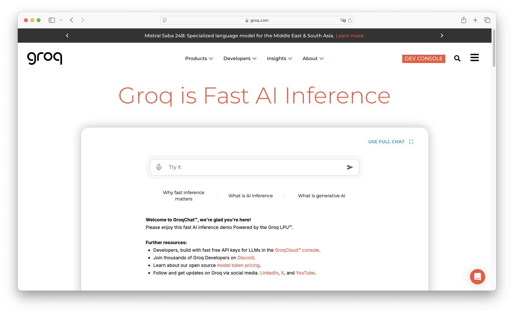
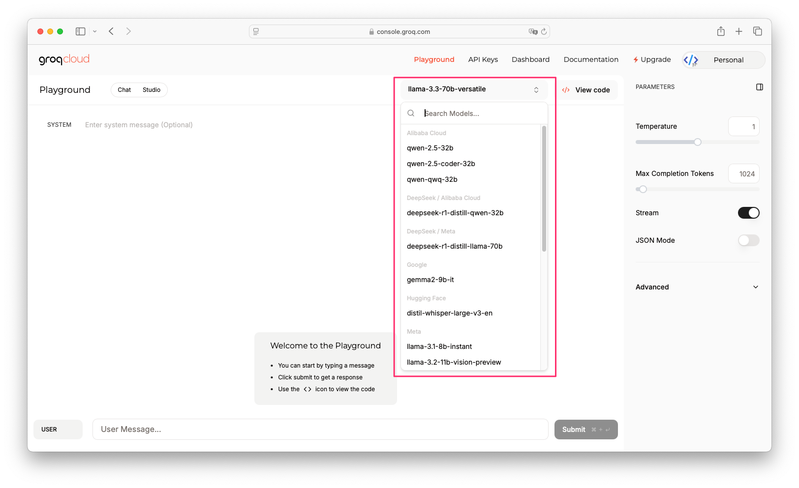
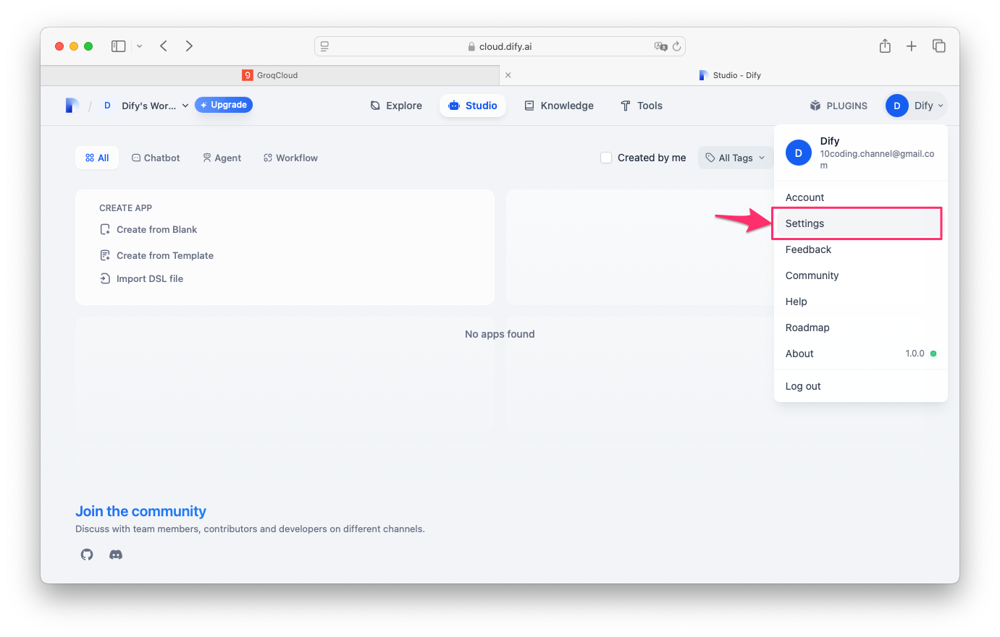
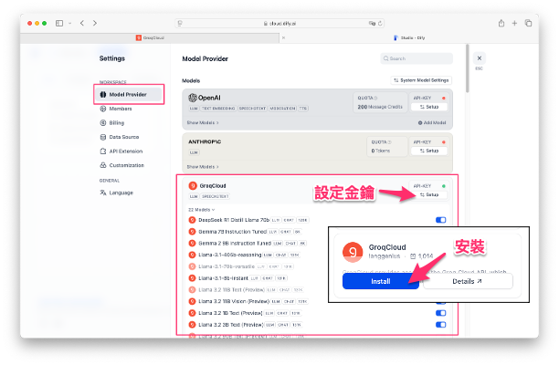
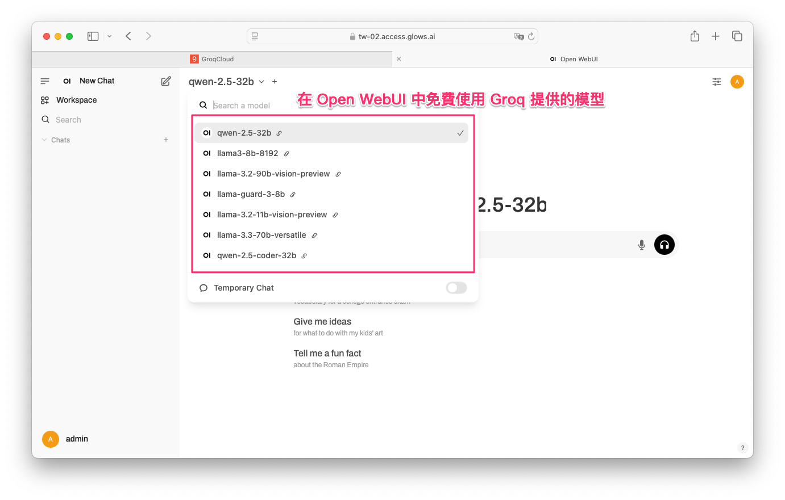
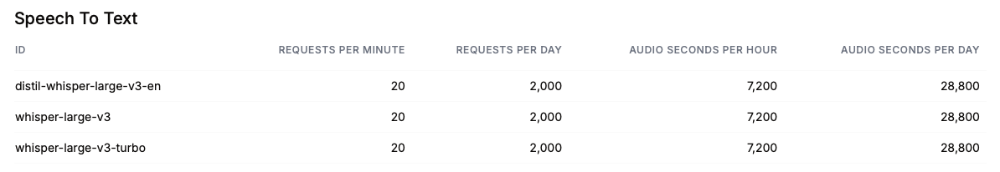
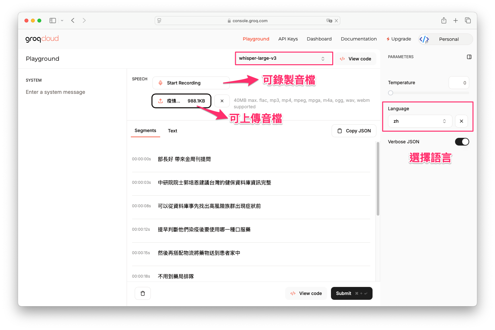

# Groq 免費體驗 Llama API 與超高速推理技術

範例程式：[](https://colab.research.google.com/github/andy6804tw/crazyai-llm/blob/main/docs/3.免費LLM%20API串接資源/code/groq-demo.ipynb)

## Groq 介紹
隨著 LLM 應用日益普及，越來越多的開發者開始尋找既快速又省成本的語言模型平台。Groq 就是一個相當佛心的平台，提供免費線上使用的開源語言模型服務。不同於傳統依賴 GPU 的運算模式，Groq 採用自家研發的 LPU（Language Processing Unit），能以更低的硬體資源提供極速推理，極大地提升工作效率。本文將從註冊帳號、模型選擇、API 整合到語音轉文字功能，逐步介紹如何運用 Groq 平台打造高效 AI 應用。



## Groq 使用限制
Groq API 提供多種開源大型語言模型（LLM），但每個模型都有特定的[使用限制](https://console.groq.com/dashboard/limits)，例如 **請求次數** 及 **Token 數量**。


以下以 **Llama3-8B-8192** 模型為例，說明 Groq API 的使用限制。

### 1. **請求次數限制**
- **每分鐘請求數**（Requests per minute）：30 次  
- **每日請求數**（Requests per day）：14,400 次

### 2. **Token 數量限制**
- **每分鐘 Token 限制**（Tokens per minute）：6,000 Tokens  
- **每日 Token 限制**（Tokens per day）：500,000 Tokens

### 3. **其他模型的限制**
不同模型的使用限制略有不同，例如：

- **部分模型的每日請求次數較低**（如 `qwen-2.5-32b` 限制為 1,000 次/日）。
- **某些模型 Token 無上限**（如 `deepspeed-r1-distill-qwen-32b`）。
- **部分 Vision 模型請求數較低**（如 `llama-3.2-90b-vision-preview` 每分鐘限制為 15 次）。

這些限制確保 Groq API 在免費提供高速推理的同時，也能維持穩定的服務品質。如果需要更高的額度，可以使用付費方案進行升級。

---

## 1. 註冊與帳號建立

首先，請至 [Groq 官方網站](https://console.groq.com/login) 進入登入畫面。Groq 平台支援使用 Google 帳號直接登入，省去繁瑣的手機驗證步驟，讓你能夠快速建立帳號並立即體驗各項服務。

## 2. 模型選擇與性能測試
登入後，右上角的模型選單提供多種選擇，目前主要包含：

- **Llama**
- **Gemma 7B**
- **Mixtral 8x7B**
- **Qwen**
- **Deepseek**



選擇你想要使用的模型後，就能夠在平台上直接進行文字輸入測試。Groq 在推理速度上表現驚人，測試 Llama3-8b-8192 結果可達每秒 1200 至 1300 Tokens，相較於一般家用高階顯示卡的性能，速度快了數十倍，十分適合追求高效運算的專案應用。

!!! info

        有網友在 RTX 4090 上測試各種 Llama 模型的 Benchmarks: [參考](https://github.com/XiongjieDai/GPU-Benchmarks-on-LLM-Inference)

## 3. Groq API 使用教學
除了網頁介面外，Groq 也提供 OpenAI 兼容的免費 API，方便開發者整合至各種第三方應用或專案中。以下是基本操作流程：


### 3.1 取得 API Key
點選「API Keys」選項後，再按下「Create API Key」按鈕，輸入你喜歡的名稱並按下「Submit」，即可獲得專屬的 API Key。請注意，API Key 僅會在建立後的視窗中顯示，關閉後便無法再次查閱，因此建議妥善保存。


將取得的 API Base URL 與 API Key 貼入你所使用的第三方應用中（例如 Dify、Open WebUI 等聊天介面工具），即可立即開始調用 Groq 模型服務，享受免費且超高速的推理體驗。

### 3.2 整合至第三方應用 - Dify
Dify 是一個 AI 應用開發平台，可透過 OpenAI 兼容 API 整合 Groq 的 Llama 3 模型。以下是將 Groq API 整合到 Dify 的步驟：

#### **1. 進入 Dify 設定頁面**  
1. 登入 [Dify](https://cloud.dify.ai/) 平台。  
2. 在右上角點擊你的帳號，選擇 **Settings**（設定）。  
3. 進入設定頁面後，即可管理模型供應商。



#### **2. 新增 GroqCloud 為模型供應商**  
1. 在 **Settings**（設定）頁面，選擇 **Model Provider**（模型供應商）。  
2. 在可用的模型列表中，找到 **GroqCloud**。  
3. 點擊 **Install** 按鈕，將 GroqCloud 安裝到 Dify 平台。
4. 安裝完成後，點擊 **Setup**（設定）。  
5. 在 API 設定欄位中，輸入你的 **Groq API Key**（可從 GroqCloud 後台獲取）。  
6. 完成後點擊 **Save**，即完成整合。



完成 API 設定後，你就可以在 Dify 平台內選擇 **Llama 3 8B** 或 **Llama 3 70B** 作為推理模型，並在聊天機器人或 AI 應用中進行測試。 這樣，你就成功在 Dify 平台上整合了 Groq 提供的超高速 Llama 3 API！

### 3.3 整合至第三方應用 - Open WebUI
**Open WebUI** 是一款開源的 Web 介面，支援 OpenAI 兼容 API，可以輕鬆整合 **Groq API**，免費使用 Llama 3 等開源模型。以下是詳細的整合步驟。

#### **1. 進入 Open WebUI 設定頁面**
1. 開啟 [Open WebUI](https://github.com/open-webui/open-webui)。
2. 在左側選單中，點擊 **Settings → Admin Settings → Connections**。
3. 在「Manage OpenAI API Connections」區塊，點選 + 新增 LLM API 供應商。


#### **2. 設定 Groq API**
1. **API Base URL** 輸入：  
   ```
   https://api.groq.com/openai/v1
   ```
2. **API Key** 輸入你的 **Groq API Key**（可從 GroqCloud 後台獲取）。
3. **開啟開關** 以啟用 Groq API，然後點擊 **Save**。


完成 API 設定後，你可以直接在 Open WebUI 中使用 **Groq 提供的 Llama 3 模型**，進行聊天、文本生成或其他 AI 應用。 這樣，你就成功在 Open WebUI 上整合 **Groq API**，並能夠免費使用超高速的推理服務！



### 3.4 透過 Python 呼叫 Groq API
Groq 提供官方的 **Chat 聊天介面**，可以直接透過網頁進行對話測試。但如果希望將 API 整合到專案中，Groq 也提供 **Curl、JavaScript、Python** 等程式碼範例，開發者可以直接複製使用。


接著，我們將示範如何使用 **Python** 來調用 **Groq API**，並進行簡單的聊天測試。首先，請先安裝 `groq` 套件：

```sh
pip install groq
```

下方範例展示如何透過 Python 呼叫 Groq API，並與 Llama 3 模型進行對話：

- `api_key`：請替換成 **你的 Groq API Key**。
- `model="llama3-8b-8192"`：選擇要使用的模型，可換成 `llama3-70b-8192` 等其他模型。
- `messages`：
    - 第一個 `system` 角色：設定 AI 的行為，如「請用繁體中文回答」。
    - 第二個 `user` 角色：使用者輸入的問題（例如：「請問法國的首都？」）。

```python
from groq import Groq

client = Groq(api_key="你的API_KEY")

chat_completion = client.chat.completions.create(
    messages=[
        {
            "role": "system",
            "content": "你現在是個問答小幫手，並使用繁體中文回答問題。",
        },
        {
            "role": "user",
            "content": "請問法國的首都？",
        }
    ],
    model="llama3-8b-8192",
)

print(chat_completion.choices[0].message.content)
```

!!! note

        在這個範例中，API 預設 **`stream=False`**，即 **一次性回傳完整回應**，而不是流式輸出（Streaming）。如果需要流式回應（類似 ChatGPT 輸出方式），可額外設定 `stream=True`。

以上是一個簡單的 API 範例，還有其他不同的模型，例如具有思維鏈的 Deepseek 或是多模態的 `llama-3.2-90b-vision-preview`，可支援文字與影像混合輸入的聊天。同時，Groq 平台還提供了免費的 OpenAI 兼容 API，能讓開發者直接無痛轉移現有的 OpenAI 寫法。若想快速上手，也可以參考文章上方的 Colab 範例程式做進一步測試與開發。


## 4. Groq 的 Whisper 語音轉文字功能
除了文字生成，Groq 平台還支援 Whisper 語音轉文字模型，非常適合需要快速將語音內容轉錄成文字的應用場景。從下表可以看到 API 使用限制大致相同。



- **每分鐘請求數**：20 次  
- **每日請求數**：2,000 次  
- **每小時可處理音訊秒數**：7,200 秒（2 小時）  
- **每日可處理音訊秒數**：28,800 秒（8 小時）


### 4.1 選擇 Whisper 模型
在 GroqCloud 上方的「Playground」頁面中，選擇「whisper-large-v3」模型，這是目前提供的語音轉文字模型。點選錄音或上傳檔案按鈕，選擇欲轉錄的音檔。平台會依據檔案內容迅速進行處理。點擊「Submit」後，Groq 的轉錄速度極快，例如 8 分鐘的音檔僅需約 4-5 秒即可完成轉錄，讓你迅速取得文字內容。



目前平台產出的字幕格式可能無法直接使用，可以透過 ChatGPT 將 JSON 格式的轉錄結果轉換成 SRT 字幕檔，方便後續應用。

## 結語
今天和大家分享了這個免費的 LLM API 資源，不妨利用它做一個小專案來試試看，親身體驗一下在本地端或網頁上運行大型語言模型的樂趣。希望這篇介紹能讓你快速上手，也期待能激發更多創意專案，善用 Groq 等免費平台，讓 AI 技術更貼近日常生活。


