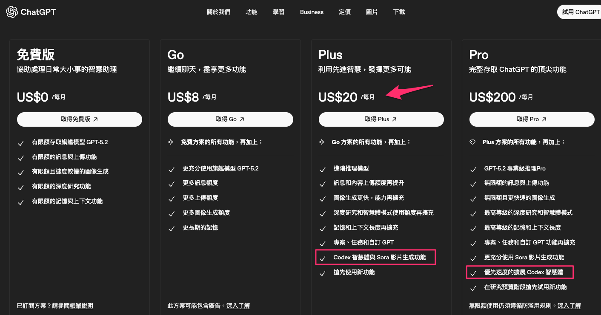
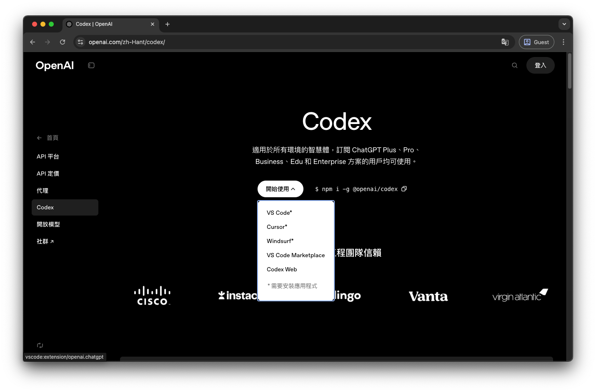
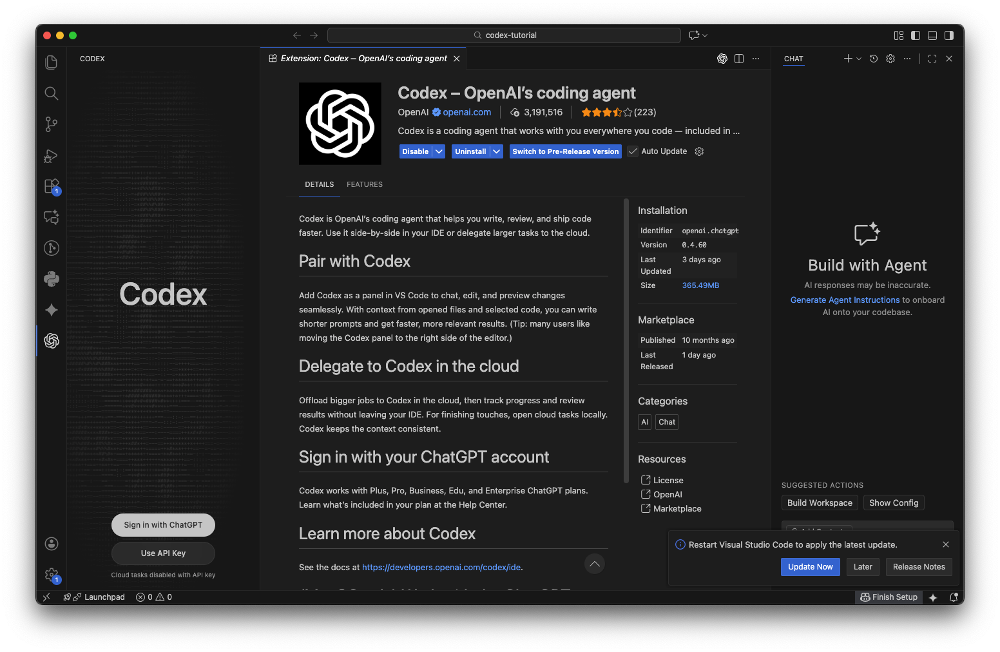
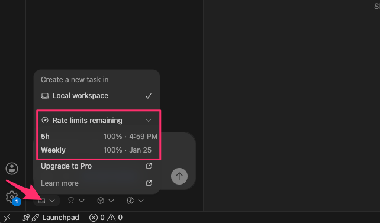
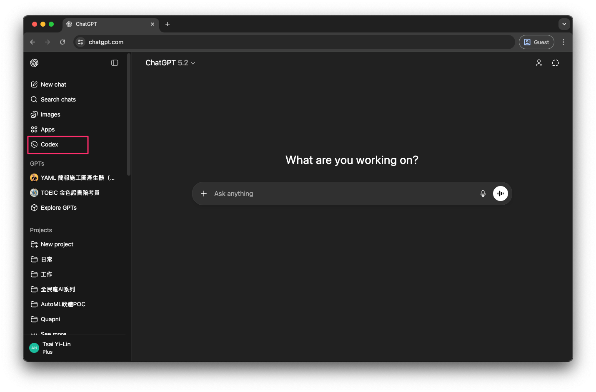
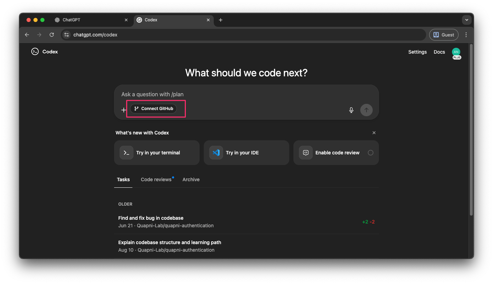

# Codex 簡介與雲端任務設定

Codex 是一個強大的 AI 程式碼輔助工具，旨在提升開發者的工作效率。它不僅能提供即時的程式碼建議，還能協助處理複雜的雲端任務，並支援多種使用情境，無論是在整合開發環境 (IDE) 中、透過命令列介面 (CLI) 操作，或是執行雲端自動化任務，Codex 都能提供全面的支援。

## codex 的三種使用方式 

**codex** 有 **三種** 主要的使用方式，讓開發者能根據不同情境選擇最適合的工具：

*   **第一種**：就像 **Copilot** 或 **Cursor** 一樣，直接在你的 **IDE**  上面使用，提供即時的程式碼輔助。
*   **第二種**：則像 **Claude Code** 的使用方式一樣，是在 **CLI**  上面操作，適合習慣終端機作業的開發者。
*   **第三種**：這種使用方式比較特別，也就是執行 **雲端任務**。你可以打開 **codex** 的網頁，像跟 **ChatGPT** 聊天一樣，告訴它你希望為你的 **repo**  新增什麼功能，或者直接向它提問。這樣做的好處是你的電腦不用一直開著，**codex** 會在雲端幫你完成任務，極大地提升了工作彈性。

## 定價資訊 

至於 **codex** 的定價方面，你至少需要購買 **GPT plus** 的方案，也就是每月 **20 美金**。這是使用其進階功能和雲端服務的基礎。

## 環境設置：IDE 整合 

### 安裝與登入 

首先，打開瀏覽器並搜尋 **[Codex](https://openai.com/zh-Hant/codex/)**，進入其官方網頁。在網頁右側，你會看到如何在 **CLI** 上安裝 **codex** 的指令。如果你想在 **IDE** 中使用，請點擊網頁左側的選項，選擇你目前正在使用的 **IDE**。系統會自動跳轉到安裝其 **extension**  的畫面。

安裝完成後，**codex 的 icon** 會出現在你的 **IDE** 左側。點擊它，如果尚未登入，系統會提示你登入。由於我已經登入過，所以畫面會顯示已登入狀態。在未登入前，你會看到類似「**Sign in with chatgpt**」帳號的提示。

### 使用量限制查看 

在 **IDE** 中，你可以非常方便地查看你的 **codex 使用量**。只需點選左側的 **codex logo**，然後找到「**rate limit**」選項。它會顯示你 **5 小時內** 和 **本週內** 還有多少可用的使用量，幫助你有效管理資源。

## codex 使用量限制 

在 **codex** 的使用量限制方面，主要有 **兩種** 限制機制：

*   **每 5 個小時** 你能提問的數量限制。
*   **每週** 的總使用量限制。

## 雲端使用 codex：設定與連線 

### 連接 GitHub 帳號 

接下來，我們將說明如何在雲端上使用 **[codex](https://chatgpt.com/codex)**。首先，打開瀏覽器並搜尋 **ChatGPT**，進入其頁面。點選左側的 **codex** 選項。

在這裡，你需要將 **codex** 與你的 **GitHub** 帳號連線。我目前已經與我的 **GitHub** 帳號連線。在你未連線前，畫面會顯示連線提示。只需按下中間的「**與 GitHub 連線**」按鈕即可進行連線。如果成功連線，系統會跳出「**GitHub 現已連線**」的通知，表示你已準備好進行雲端操作。

## 專案環境與儲存庫選擇 

成功連線 **GitHub** 後，你需要選取 **repo**。這裡分為「**環境**」和「**repo**」兩個概念：

*   **環境**：指的是你當前的對話或任務是基於哪一個專案。
*   **repo**：你可以選取特定的 **GitHub repo** 來建立你的環境。

例如，我現在選取了「**Demo**」這個環境，那麼我接下來的所有對話和任務都將會根據這個專案來執行。

### 首次設定儲存庫權限 

如果你是第一次使用 **codex**，可能還沒有設定它可以使用哪些 **repo**。此時，點擊相關選項會變成「**建立環境**」。你可以選擇讓 **codex** 使用你 **GitHub** 帳號下的 **所有 repo**，或者 **指定** 它只能使用特定的 **repo**，以確保資料安全和權限管理。

## codex 的程式碼審查功能 

**codex** 提供了一個非常實用的 **程式碼審查 ** 功能。它就位於剛剛的任務選項旁邊。

只要你按下「**啟用**」，之後每次你提交 **PR **，**codex** 都會自動幫你進行 **Code Review**。它會提供相關建議，或者如果這次的 **PR** 沒有任何問題，它會給出一個「**讚**」的回應，加速你的開發流程並提升程式碼品質。

## 雲端任務範例：專案介紹 

接下來，我們將對這個專案進行一個 **單純的提問**，而不修改程式碼。

例如，我會輸入：「**請幫我介紹這個專案**」。

然後，在任務介面，**codex** 就會開始執行這個任務。**codex** 會自動介紹這個專案，並提供詳細資訊。

## 雲端任務範例：程式碼生成 

### 預覽與程式碼差異 

接下來，我們將讓 **codex** 幫我們撰寫程式碼。

例如，我會輸入：「**請幫我根據這個電子書內容，生成一個介紹的首頁**」。

按下 Enter 後，它同樣會執行一段時間。我將展示已經完成的結果給大家看。

**codex** 會清楚地告訴你它修改了哪些內容，並且提供一個 **預覽畫面**，讓你看到生成後的頁面樣貌。在「**差異**」區塊，你可以查看程式碼的具體變動。主要就是新增了一個用於介紹網站的頁面。如果你好奇它是如何執行這段程式碼的，可以查看 **紀錄檔**。

## 建立 Pull Request 與 codex 審查 

當所有任務都執行完畢後，介面會出現一個「**建立 PR **」的按鈕。

點擊這個按鈕，你將會被導向到你的 **GitHub PR 頁面**。

當你提交 **PR** 後，**codex** 會自動進行 **Code Review**。如果它有任何建議或發現問題，**codex** 會在 **PR** 的下方留言，就像圖片中顯示的那樣。如果它認為沒有任何問題，則會簡單地給你一個「**讚**」的回應，表示程式碼符合標準。

## 雲端任務的優勢與行動應用 

那麼，**雲端任務** 有什麼好處呢？

想像一下，你突然有了什麼想法，但你卻不在電腦面前。這時，你就可以透過 **網頁** 或 **APP** 建立一個任務，請 **codex** 去修改程式碼，完成你的想法。隔天你再打開電腦，檢查它修改得是否正確。這種彈性極大地方便了開發者的工作。

### 透過 APP 建立任務 

如果你想使用 **APP**，只需前往 **App Store** 下載 **ChatGPT** 應用程式。打開應用後，點擊左上角的 **menu**，你會看到 **codex** 選項，從那裡你就可以建立新的任務。
