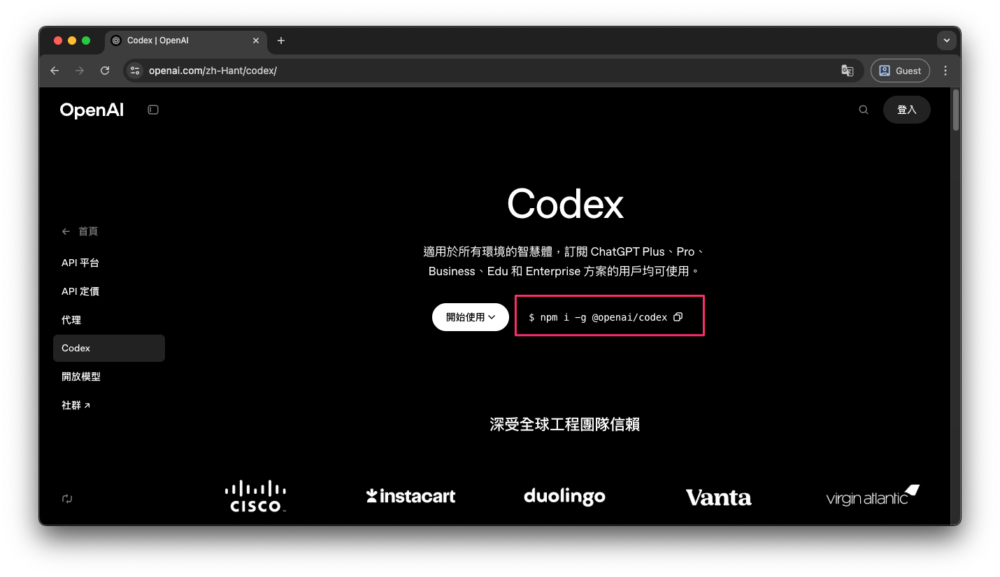
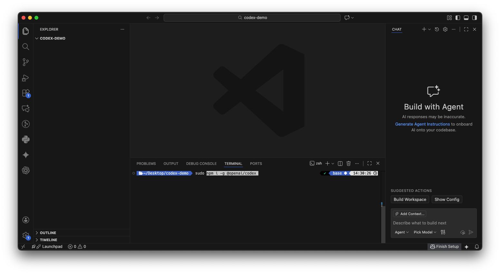
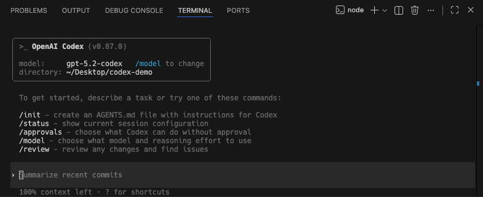
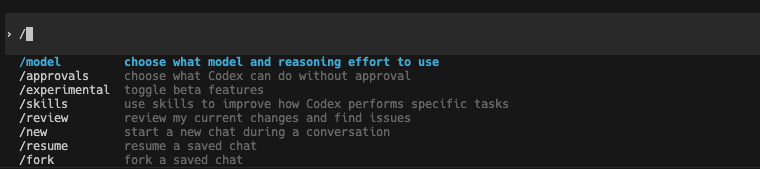
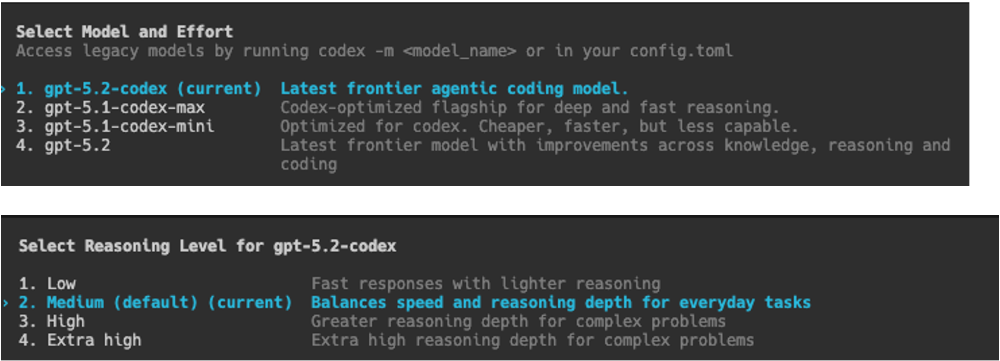

# Codex CLI 指令與 AGENTS.md 深度解析

上一篇我們已經探討了 **Codex** 的基本設置以及其雲端任務功能。在這一篇，將深入介紹 **Codex CLI** ，並詳細說明 **Codex** 的一些重要命令，以及一個非常關鍵的檔案：**AGENTS.md**。

### 安裝 Codex CLI 

首先，讓我們來安裝 **Codex CLI**。

1.  **進入 Codex 網頁**：你只需要前往 **[Codex](https://openai.com/zh-Hant/codex/)** 的官方網頁。
2.  **複製安裝指令**：在網頁上，你可以找到並複製安裝指令。
3.  **打開終端機**：接著，打開你的終端機應用程式。
4.  **執行安裝**：將複製的指令貼上並按下 **Enter** 鍵，即可開始安裝。



```sh
npm i -g @openai/codex
```



### 登入與登出 Codex 

安裝完成後，下一步是進行登入。

1.  **登入指令**：在終端機中輸入 `codex login`。
2.  **瀏覽器驗證**：執行此指令後，**Codex** 會在你的瀏覽器中自動開啟一個登入網頁，就像你現在看到的這樣。
3.  **選擇帳號登入**：你只需透過你常用的帳號進行登入即可。
4.  **成功登入提示**：一旦在網頁上完成登入，終端機便會顯示 `Successfully login` 的訊息。
5.  **登出指令**：如果你需要登出，只需輸入 `Codex logout` 即可。

## 進入 Codex 與初始設定 

要進入 **Codex** 環境，你只需在終端機中直接輸入 `codex`。

### 首次使用路徑的權限設定 

如果你是第一次在某個特定路徑下使用 **Codex**，它會詢問你是否允許 **Codex** 使用該資料夾。這是一個重要的步驟，因為它確保 **Codex** 能夠存取和操作你的專案檔案。


*   **選擇「allow」**：為了避免之後重複詢問，我建議你選擇第一個選項「allow」，這樣 **Codex** 就能夠順利地在這個專案資料夾中運作。



## 常用 Codex 命令詳解 

接下來，我將介紹一些 **Codex** 中比較常用且實用的命令。你可以在終端機中輸入斜線 `/`，然後不斷按下方向鍵，來查看所有可用的命令。



### 1. Model：選擇 AI 模型與思考深度 

`Model` 命令允許你選擇當前想要使用的 **AI** 模型。

*   **思考深度 **：這個選項決定了 **AI** 思考問題的深入程度。
    *   **深度越淺**：使用的 **token** 越少，但程式碼撰寫上可能會思考得越淺，導致不夠嚴謹。
    *   **深度越深**：使用的 **token** 越多，**AI** 會更深入地分析和思考。
*   **預設設定**：預設的思考深度是 `medium`。
*   **根據需求調整**：你可以根據你的專案需求，將其調整為 `low` 或 `high`。



### 2. Approvals：調整 Agent 權限

`Approvals` 命令是用來選擇 **Agent** 在此工作階段中的操作權限，不同模式代表 Agent 可執行的行為範圍不同。

* **`Read Only`（唯讀）**
  在此模式下，**Agent** 只能讀取檔案內容，**無法修改檔案或執行指令**。
  若需要進行任何編輯或執行指令，系統都會要求你明確批准，適合用在只想讓 Agent 協助閱讀、分析程式碼的情境。

* **`Agent (current)`（目前模式）**
  這是目前選取的模式。
  **Agent** 可以在取得你同意的情況下，**讀取與編輯檔案，並執行指令**。
  相較於唯讀模式更有彈性，同時仍保留人工確認，適合日常開發與協作使用。

* **`Agent (full access)`（完整權限）**
  在此模式下，**Agent** 可以在此工作區與工作區外編輯程式碼，並且執行指令，**包含網路存取能力**。
  由於權限最高，可能對系統或專案造成較大影響，**使用時需特別謹慎**，建議只在你完全信任操作內容時啟用。


### 3. Init：初始化專案與生成 AGENTS.md 

`init` 命令是一個非常重要的指令，它會執行以下動作：

*   **掃描專案**：它會掃描你整個專案的結構和內容。
*   **生成簡短描述**：為你的專案生成一個簡短的描述。
*   **記錄專案說明**：它會記錄專案主要使用的框架、如何啟動專案，以及如何運行測試等重要資訊。
*   **儲存於 AGENTS.md**：所有這些資訊都會被寫入一個名為 **AGENTS.md** 的檔案中。
*   **對話與任務依循**：之後你與 **Codex** 的對話或它執行的任務，都將會遵循這個 **AGENTS.md** 檔案中定義的規則和說明。
*   **自訂規則**：如果你希望未來的任務都能遵循某些特定規則，例如在更改程式碼後需要運行 **Linter**，你就可以將這些條件寫入 **AGENTS.md** 檔案中。這樣，**Codex** 在對程式碼進行任何改動時，都會自動執行這些規則。

### 4. Compact：壓縮對話內容 

在與 **Codex** 互動的過程中，你的對話內容其實是有一個上限的。

*   **上下文累積**：當你持續提問時，**Codex** 會參考你之前的提問，這會導致對話的上下文  越來越長。
*   **上下文上限**：最終，對話的上下文可能會達到其上限，這可能導致你較早的問答資訊遺失。
*   **壓縮舊對話**：你可以透過 `Compact` 這個指令來壓縮之前的對話內容。
*   **保留對話歷史**：這樣做可以讓你之後的問答繼續保留之前的對話內容，而不會因為上下文過長而丟失資訊。

### 5. Status：查看當前狀態 

`Status` 命令非常簡單，它主要用於：

*   **查看當前模型**：顯示你目前正在使用的 **AI** 模型。
*   **顯示其他資訊**：提供一些相關的資訊。
*   **查看剩餘上下文**：顯示當前對話還剩下多少上下文空間。

### 6. ai-commit：自動生成 Commit Message 

`ai-commit` 這個命令比較特別，它的作用是：

*   **偵測程式碼改動**：它會自動偵測你本次程式碼的改動。
*   **生成 Commit Message**：根據改動內容，幫助你生成一段有意義的 **Commit Message**。
*   **使用限制**：這個功能只能在 **IDE extension** 中使用，無法在 **CLI** 中直接使用。
*   **類似 GitHub Copilot**：它的功能類似於 **GitHub Copilot** 的「auto generate Commit」功能。
*   **提升效率**：這在你進行 **git Commit** 時非常方便，你無需再花時間思考本次 **Commit** 的訊息內容。

<!-- **範例說明**：
我之前請 **Codex** 幫我將網頁最上方導覽列的背景顏色改成黃色。現在，我們來執行 `AI Commit` 指令：

```
AI Commit
```

它會開始「working」，然後會說明這次的改動，例如：「在上面這個填了一個背景色」。 -->

## 管理對話：回復之前的對話 

有時候，我們可能會關閉 **Codex**，或者為了新的功能而希望重新開始一個乾淨的 **Chat**，不帶有之前的資料。然而，有時我們又會希望回復到之前的對話。

*   **關閉當前 Chat**：我現在先把這個 **Chat** 關掉。
*   **回復指令**：要回復之前的對話，只需輸入 `Codex Resume`。
*   **選擇對話**：它會列出你之前所有的對話記錄。你可以使用上下方向鍵來選擇你想要回復的對話。
*   **確認回復**：按下 **Enter** 鍵後，你就可以回到之前的對話了。

## 與檔案和路徑互動 

在你的 **Chat** 中，你可以提到你的檔案或路徑。

*   **使用 `@` 符號**：你可以使用 `@` 符號，例如 `@src/底下的檔案`。
*   **方向鍵選擇**：輸入 `@` 後，你可以使用上下方向鍵來選擇你想要提及的檔案或路徑。
*   **`mention` 命令**：你也可以使用 `mention` 命令，它也會轉換成 `@` 符號，然後你再尋找你的路徑。
*   **個人建議**：我個人覺得這樣操作有些麻煩。首先，輸入 `@` 需要按下 **Shift + 2**。其次，你還需要使用方向鍵來選擇檔案，或者直接手動輸入路徑也很不便。
*   **更高效的方法**：我通常會直接在檔案總管中對檔案點擊右鍵，選擇「複製 relative path」，然後將路徑貼到 **Codex** 的 **Chat** 中，並說明我想要針對哪個檔案做什麼事情。這樣會更有效率。

## 將圖片加入 Codex CLI 

接下來，我將說明如何在 **Codex CLI** 中加入圖片。這對於前端開發者來說尤其方便，特別是當你沒有使用 **Figma** 等設計工具時。

### 圖片的使用情境 

*   **前端設計稿**：
    *   如果你的設計師沒有使用 **Figma**，你就無法使用 **Figma MCP** 來查找設計稿。
    *   有些公司可能沒有專職設計師，而是由 **PO** 或 **PM** 在 **PPT** 上繪製設計稿。
    *   在這些情況下，你可以將設計稿圖片上傳到 **Chat** 中，然後告訴 **Codex** 你希望根據這張設計稿做什麼事情，這會非常方便。
*   **後端 API 規格**：
    *   當後端 **API SPEC** 需要撈取 **DB** 的特定欄位時，有時候規格會寫在 **Confluence** 或 **Jira board** 上。
    *   你可以將規格截圖，然後丟到 **Chat** 中，告訴 **Codex** 這個 **API** 想要撈取哪些欄位，這樣也會非常方便。

### 拖曳圖片到 CLI 的方法 

*   **簡單操作**：方法非常簡單，你只需從資料夾中將圖片拖曳到 **CLI** 介面上。
*   **按下 Enter**：拖曳後，按下 **Enter** 鍵。
*   **處理時間**：它會跑一段時間。我之前已經拖曳過一張圖片，就像這樣：
    *   這張圖片就是這個影片的封面，主題是關於 **Codex** 的，圖案大概長什麼樣子。

## 關鍵檔案：AGENTS.md 

接下來，我將介紹一個非常重要的檔案：**AGENTS.md**。

### AGENTS.md 的生成與用途 

*   **生成方式**：我們在指令中輸入 `init`，就可以生成這個 **AGENTS.md** 檔案。
*   **專案描述**：它主要用於描述你的專案。
*   **包含 instruction**：其中可能包含一些重要的 **instruction**。
*   **自訂規則**：如果你希望之後的對話能夠套用某些規則，你可以將這些規則寫入這個檔案中。

跑完之後，你會看到左邊多了一個 **AGENTS.md** 檔案。它會詳細描述這個專案。

### 跨工具的專案描述檔 

如果你使用過其他 **AI** 輔助編碼工具，應該對這件事不陌生。許多工具都會有指令來生成一個專案的描述檔。

*   **Claude Code 的 `cloud.md`**：例如，**Claude Code** 也有類似的 `init` 指令，用於生成 `cloud.md` 檔案。
*   **AGENTS.md 的特別之處**：比較特別的是 **AGENTS.md**。像 `cloud.md` 檔案，它通常只能用於 **Claude Code**。但是，正如我們在網頁上看到的，**AGENTS.md** 這個檔案會被多種工具參考：
    *   **Codex**
    *   **Cursor**
    *   **Claude Code**
    *   **n8n**
    *   **Copilot**


### AGENTS.md 在不同使用情境下是否會被參考？

#### Q1：我用 CLI command 生成的 `AGENTS.md`，會在 IDE extension 中被參考嗎？
**A：** 會。只要專案中存在 `AGENTS.md`，在 IDE extension 裡使用時，Agent（Codex）會自動去參考這個檔案。

#### Q2：如果我在對話中沒有特別提到 `AGENTS.md`，它還是會被參考嗎？
**A：** 會的。只要 `AGENTS.md` 存在於專案內，就算你沒有在指令或對話中特別指出，Agent 仍然會自動參考。

#### Q3：那在雲端環境使用時，也一樣會參考 `AGENTS.md` 嗎？
**A：** 是的。在雲端使用的情境下，只要專案中有 `AGENTS.md`，Agent 同樣會自動參考，不需要額外說明。

#### Q4：總結來說，`AGENTS.md` 可以在哪些情境下使用？
**A：** 一旦 `AGENTS.md` 生成完成，你就可以在以下三種情境中共用它的設定與說明：
- CLI（命令列）
- IDE extension
- 雲端使用環境

這代表你只需要維護一份 `AGENTS.md`，就能在不同使用方式下發揮一致的效果。


