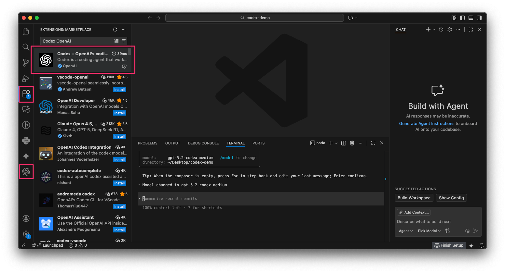
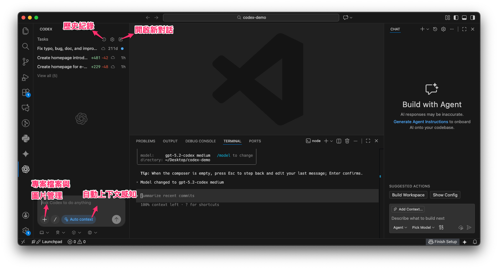
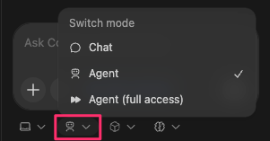
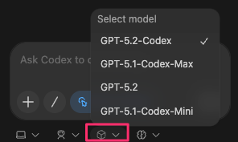

# Codex IDE 擴充功能與 Todo 實用技巧
上一篇我們深入探討了 Codex CLI 的部分，這一篇將了解 **Codex ID extension** 的操作方式，以及一個特別且強大的功能：**Todo**。

## Codex ID Extension 深度導覽 

接下來，我們將開始介紹 **Codex ID Extension**。

### 如何安裝與啟動 Codex ID Extension 

*   **尋找與安裝**
    *   你可以在市場上找到它，搜尋 "**Codex OpenAI**" 即可。
    *   安裝完成後，在你的 **IDE** 左側會出現一個 **Codex icon**。
*   **介面概覽**
    *   點擊該 icon 即可進入使用介面。我將從上到下為你介紹其各項功能。

### Codex ID Extension 的核心功能 

1.  **返回與歷史紀錄**
    *   左上方的 "**Back**" 按鈕讓你可以在之前不同的 **Chat** 之間切換。
    *   旁邊的歷史紀錄功能，不僅包含當前 **Chat** 的對話，也涵蓋了你本地端所有的 **Chat** 以及雲端上的對話紀錄。
2.  **開啟新對話**
    *   這裡可以讓你開啟一個全新的 **Chat** 對話。
3.  **專案檔案與圖片管理**
    *   左下方的加號按鈕，可以讓你將當前專案下的檔案加入對話中。
        *   你可以透過搜尋功能，選擇要加入的檔案，點擊後檔案就會顯示在對話區。
    *   如果你希望加入圖片，也可以點擊旁邊的按鈕。
        *   按下 "**Add**" 後，會進入搜尋介面，同樣可以選擇要加入的圖片。
        *   複製貼上圖片也非常簡單：你可以對圖片使用 `command c` 和 `command v` 進行複製貼上，或者直接拖曳圖片進來。
4.  **自動上下文感知**
    *   這個 **Auto Context** 功能會自動觀察你的操作和行為。
    *   它很像 **Cursor**，會自動偵測你最近打開了哪些檔案、編輯了哪些內容，並據此提供 **Code Completion** 的建議。

5.  **執行環境與倉庫選擇**
    *   在左下方，你可以選擇最上面的選項，直接在 **IDE** 中進行對話，並使用 **Cloud agent** 執行雲端任務。
    *   最下面的選項則是一般的使用方式，在本地端執行任務。
    *   值得一提的是，它還能調整不同的 **repo**（程式碼倉庫），這是一個非常特別的功能，其他工具通常沒有。

6.  **模式選擇**
    *   中間的選項是用來調整 **Codex** 的工作模式，共有三種：**Chat**、**Agent** 和 **Full access**。
        *   **Chat 模式**：每次修改程式碼或執行 `run command` 時，都會先詢問你。你需要 `approve` 之後，它才會繼續執行。
        *   **Agent 模式**：它會持續地幫助你修改程式碼，直到任務完成。
        *   **Full access 模式**：不僅會更動你的程式碼，還可能執行其他工具。

7.  **模型選擇**
    *   這裡可以讓你選擇要使用的 AI 模型。

8.  **思考深度**
    *   右邊的選項是用來調整 **Codex** 思考的深度。
        *   深度越低，耗費的 **token** 越少，思考也會越淺。
        *   深度越高，則適合處理更複雜的任務，但花費也會相對較高。

## 實際任務演示與結果檢視 

接下來，我將實際跑一個任務給大家看。為了節省大家的時間，我會直接展示結果。

*   **任務執行過程**
    *   **Codex** 會顯示它執行的過程。
    *   你可以點擊中間修改過的檔案，查看它具體修改了哪些內容，儘管畫面可能有點小。
    *   最後，它會提供一個總結，說明它完成了哪些事情。
*   **檢視與撤銷變更**
    *   你可以點擊 "**View all changes**" 更清楚地查看每個檔案的具體變更。
    *   如果你看完後不滿意結果，也可以直接點擊 "**undo**" 撤銷所有變更。

## 獨特且高效的 Todo 功能 

最後，我要介紹一個我覺得非常棒的功能，叫做 **Todo**。

*   **如何使用 Todo**
    *   你可以在程式碼的 **comment** 中，寫下 `todo`，標註你希望之後完成的事情。
    *   當你之後回頭想處理這些任務時，只需點擊 "**implement with codex**" 按鈕。
*   **自動化執行**
    *   **Codex** 便會自動執行任務。
    *   完成後，它會自動移除你之前寫的 **comment**，並將新的 **code** 放在相應的位置。
    *   這樣，這個功能就輕鬆完成了。
