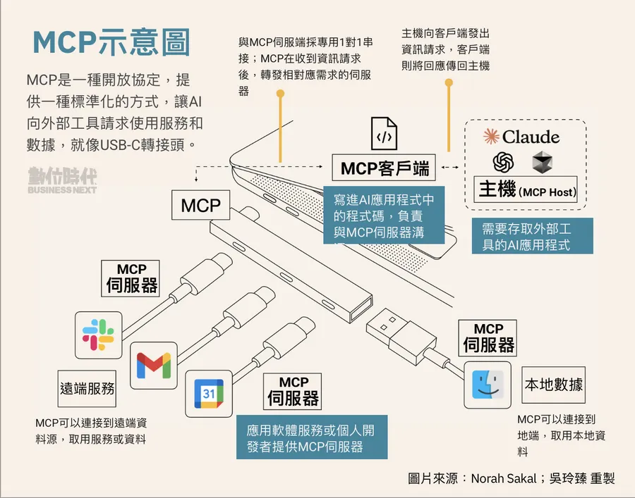
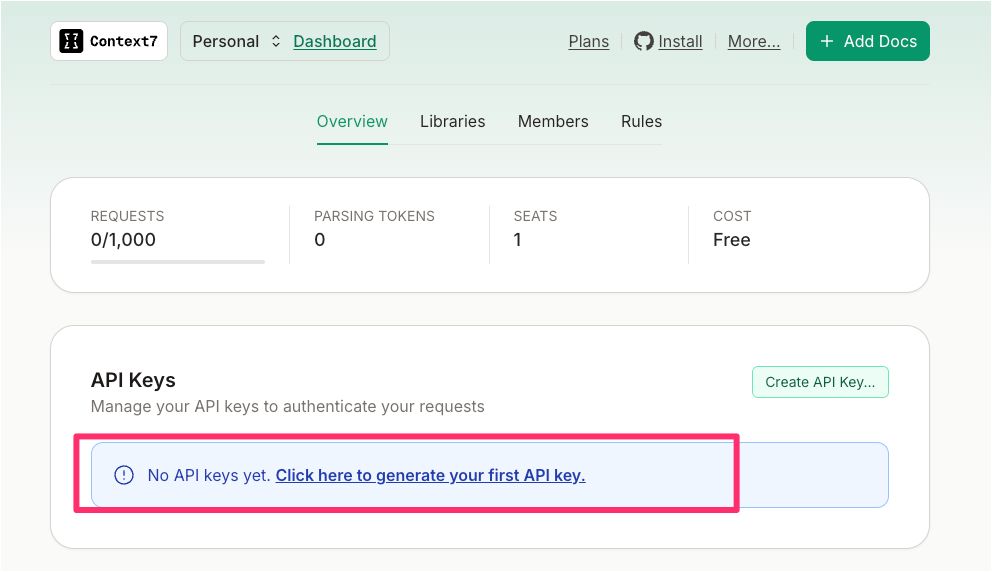
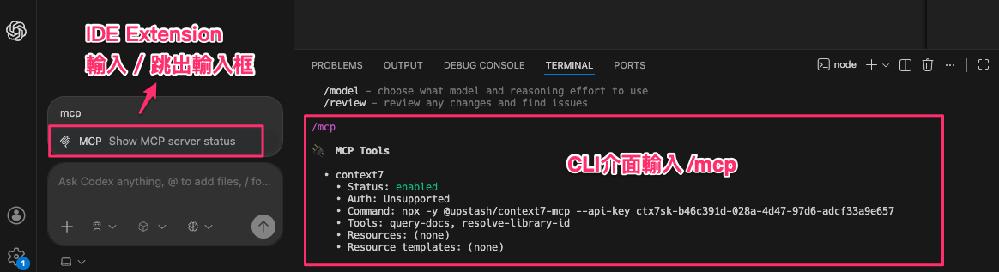

# Codex 整合 MCP Server：以 Context7 為例

### 什麼是 MCP？ 

**MCP** 是什麼呢？舉例來說，如果你請 **ChatGPT** 幫你查看 **Gmail** 現在是否有新的郵件，它其實不知道該如何查找。這是因為它們是不同的服務，由不同的公司提供，**ChatGPT** 沒有權限，也不知道該透過什麼方式來幫你查找 **Gmail**。


因此，在這些不同的服務之間，就需要一個**介面**來進行溝通。在 **MCP** 中設定好你的 **API Key**，就能讓你擁有權限去使用你想要使用的服務。

### 各產品的 MCP 實作 

各家產品都會開發自己的 **MCP**。例如，**Gmail** 會製作自己的 **MCP**，**Figma** 也會製作自己的 **MCP**，以便使用者能夠使用這些服務。



### 在 Codex 中設定 MCP Server 

我們要做的事情，就是在 **Codex** 這裡設定好 **MCP Server**。之後，所有的對話都會透過 **MCP** 去取用你想要使用的服務。

## 設定 Contex7 MCP 

在本文中，我們將以 **Contex 7** 來示範 **MCP** 的設定。


### Contex 7 的優勢 

**Contex 7** 收錄了許多常見的套件或 Library，例如：

*   **Nextjs**
*   **MongoDB**
*   **React**
*   **Vue**
*   等等

這樣的好處是，你之後的提問，**Codex** 就會去查找這些套件的 **Document**，從而提供更準確的回答。

### 生成你的 API Key 

接下來，我們需要生成我們的 **API Key**。

1.  點擊頁面上的 **Dashboard** 按鈕。
2.  如果你是第一次進入，下方會出現「**Click here to generate your first API key**」。
3.  點擊後，你就可以生成你的 **API Key**。



**提醒**：這個 **API Key** 生成後，你只有**一次機會**將它複製下來。一旦你按下確定或離開這個頁面，就無法再複製了，所以務必先將它記錄在其他地方。

### 在 Codex 中設定 MCP Server 

現在，我們要在我們的 **Codex** 中設定 **MCP Server**。

1.  點擊右上方的 **Install** 按鈕，這會帶你進入 **Contex 7** 的 **[GitHub](https://github.com/upstash/context7#installation)** 頁面。
2.  在頁面下方，你會找到它的說明文件。我們要找的是「**[Install in OpenAI Codex](https://context7.com/docs/resources/all-clients#openai-codex)**」這個部分。
3.  展開該部分，我們需要的是「**Local Server connection**」這段設定，將它複製下來。

```
[mcp_servers.context7]
args = ["-y", "@upstash/context7-mcp", "--api-key", "YOUR_API_KEY"]
command = "npx"
startup_timeout_ms = 20_000
```

4.  回到我們的 **VS Code**，打開 **Codex**，然後點選設定。
5.  進入 **MCP Setting**，然後打開 `OpenConfig.toml` 檔案。


6.  這個 `toml` 檔案一開始只有最上面和最下面的兩行。我們將剛剛複製的設定貼到中間。


**注意**：**MCP Server** 的設定是 **Global Level** 的，這表示你不能按專案來設定。一旦設定，它將會是**全域**的，所有專案都會使用這個 **MCP Server**。

**別忘了**：將 `your API Key` 替換成你剛剛生成的 **API Key**。

## 驗證 MCP 設定與限制 

### 重啟與載入 

設定完成後，你記得 **IDE extension** 這邊需要**重啟**你的對話，或者開啟一個新的對話，它才會開始使用這個 **MCP**。**CLI** 的部分也需要**重新載入**，才會出現這個 **MCP** 可以使用。

### 確認 MCP 是否安裝成功 

要確定你的 **MCP** 是否安裝成功，可以這樣檢查：

*   **CLI 部分**：在 **CLI** 中輸入 `/MCP` 並按下，它就會列出你現在有哪些 **MCP** 可以使用，並且顯示 **Status Enabled**。
*   **IDE 部分**：一樣輸入/會先跳出輸入框，接著輸入mcp就能常洵狀態了。



### 目前的限制 

**Codex** 目前只能在**本地端**使用 **MCP**。如果你是執行**雲端任務**的話，目前還不支援使用 **MCP**。


### 程式輔具工具百家爭鳴 
在最後，我想分享一下為什麼我學了這麼多的工具。其實，如果工具好用，你只要會一套就好了。我會學習這麼多的原因是因為，**每一段時間都有不同的考量**。

*   **GitHub Copilot**：一開始出現的工具是 **Copilot**，那時候其他工具都還沒有出現。我想大家最早接觸的可能也是 **Copilot**。
*   **Cursor**：後來 **Cursor** 出現了，表現好很多，之後我就轉移到 **Cursor**。
*   **Claude Code**：有一段時間，**Claude Code** 的聲勢最大，大家都評價說 **Claude Code** 的表現比 **Cursor** 更好。再來也是因為**價錢**的關係，我就轉移到 **Claude Code**。
* **Gemini CLI**： 他的生態跟 Codex 很像有 VSCode 的擴充套件(Gemini Code Assist)。目前用下來覺得非常好用，也是因為買了 Gemini AI Pro方案來嚐鮮試試。
*   **Codex**：最近我會使用 **Codex**，是因為它的**雲端任務**包含在一個月 20 美金 ChatGPT 的費用裡面，想說不用白不用。


### 選擇工具的智慧 

我是覺得工具不需要學了一套又一套。你會想用這個工具，應該是它有什麼樣的**功能**是你想要使用的。畢竟學習新東西也是需要時間的。我們選擇去做什麼事情，也相當於就是選擇了不去做什麼事情。畢竟軟體開發還是有很多東西需要學習，不只是這些 **AI coding** 的工具。

