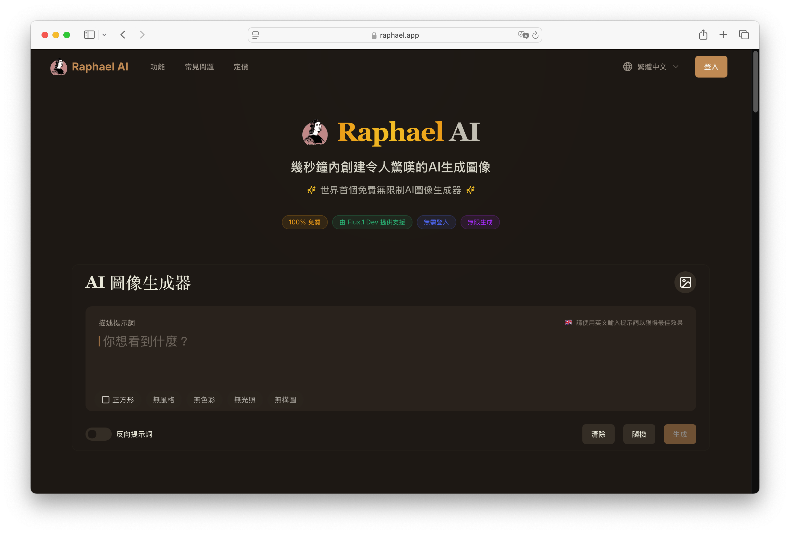
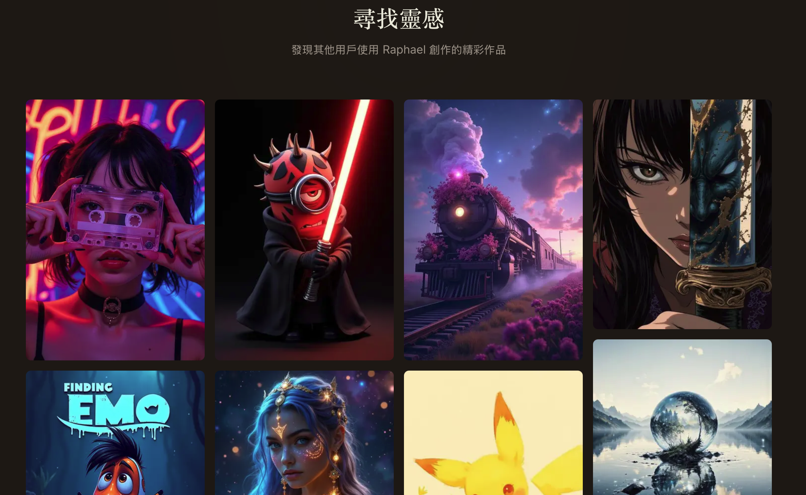
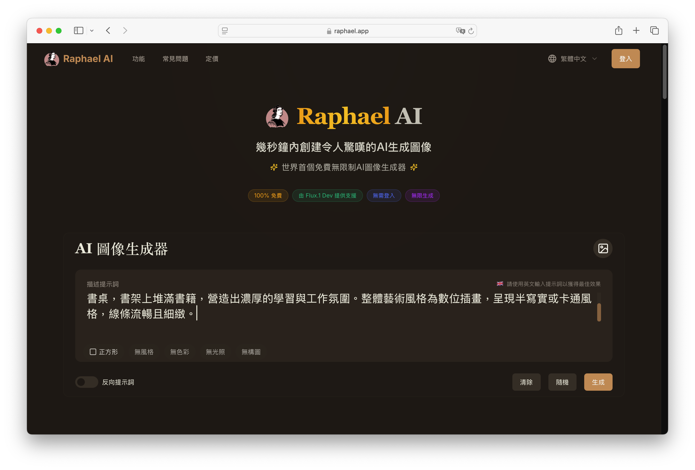
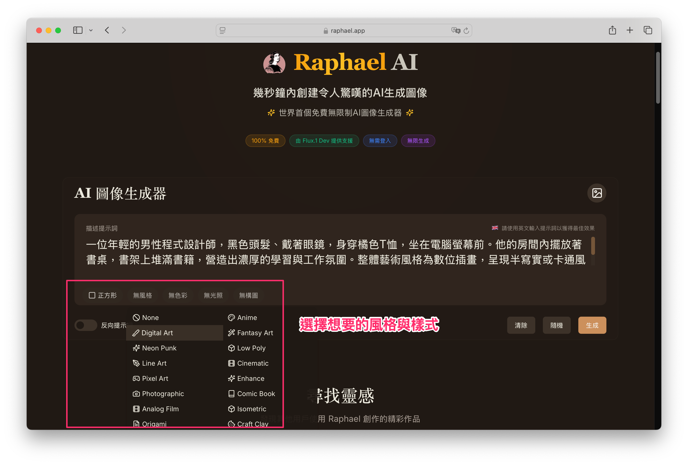
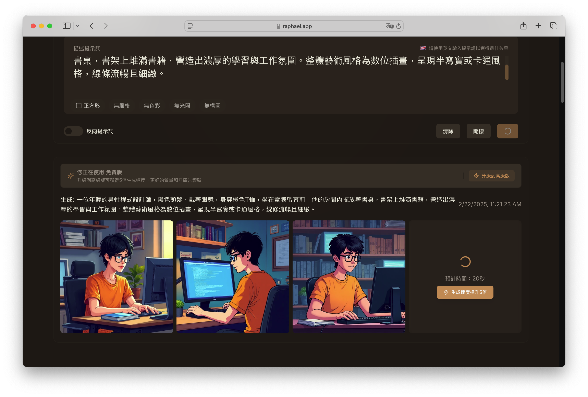
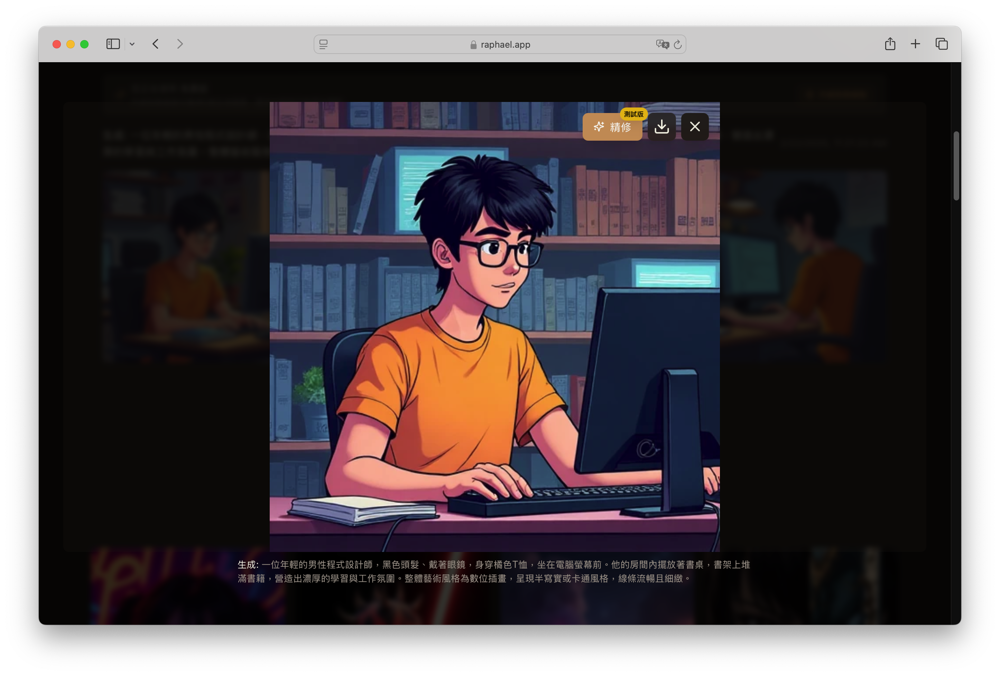

# Raphael 免費 AI 圖像生成工具介紹

## 前言
在近年來 AI 技術的快速發展下，圖像生成技術已成為許多創作者的重要工具。無論是插畫、概念設計、廣告視覺，甚至是個人社群貼文，AI 圖像生成工具都能大幅提升創作效率。其中，[Raphael](https://raphael.app/zh-Hant) 是一款免費且易於使用的 AI 圖像生成工具，提供高品質的圖片創作體驗，無需具備專業繪圖技巧，即可輕鬆產出驚人的視覺效果。

## Raphael AI 是什麼？
Raphael AI 是一款專為圖像生成設計的人工智慧工具，透過輸入關鍵字或文字描述，即可快速生成對應的圖像。這款工具不僅適合專業設計師，也適合一般用戶，讓每個人都能輕鬆創作符合需求的 AI 圖片。

## Raphael AI 的主要特色

1. **簡單直覺的操作介面**  
   無需複雜設定，只需輸入想要的圖片描述，AI 便能自動生成精美的視覺內容，適合新手與專業人士使用。

2. **支援多種風格與類型**  
   Raphael AI 能夠生成不同風格的圖像，例如插畫、寫實風格、漫畫風、數碼藝術等，滿足各種需求。

3. **高品質圖像輸出**  
   生成的圖片解析度高，細節豐富，可直接用於設計、商業用途或社群分享。

4. **適用於各種應用場景**  
   無論是品牌設計、社群行銷、部落格配圖，甚至是遊戲與動畫概念圖，Raphael AI 都能提供靈活的圖像解決方案。

## 如何使用 Raphael AI 生成圖片？

使用 Raphael AI 來生成圖片的過程相當簡單，基本步驟如下：

**1. 進入 [Raphael AI 平台](https://raphael.app/zh-Hant)** – 在瀏覽器開啟官方網站，無需安裝額外軟體。

**2. 輸入圖片描述** – 提供簡單或詳細的文字提示（Prompt），描述你想要生成的圖像內容。

!!! note "範例Prompt"

    一位年輕的男性程式設計師，黑色頭髮、戴著眼鏡，身穿橘色T恤，坐在電腦螢幕前。他的房間內擺放著書桌，書架上堆滿書籍，營造出濃厚的學習與工作氛圍。整體藝術風格為數位插畫，呈現半寫實或卡通風格，線條流暢且細緻。

!!! info

    使用英文輸入提示詞可以獲得更好的效果！

**3. 選擇風格與參數** – 可讓用戶選擇不同風格，如寫實、卡通、油畫風等。若沒有特別偏好，可選擇 None，系統將使用預設設定。

**4. 生成圖片** – AI 會根據你的描述快速產生圖片，並提供多種樣式以供選擇。

**5. 下載與應用** – 確認圖片滿意後即可下載，並應用於個人或商業用途。

## Raphael AI 的優勢與可能的限制

### 優勢
- **完全免費**，無需付費即可使用基本功能。
- **不需專業設計技巧**，讓新手也能輕鬆創作。
- **快速生成**，適合需要短時間內產出圖像的使用者。

### 可能的限制
- **生成結果可能受限於提示詞（Prompt）描述的精確度**，需要嘗試不同的輸入方式來獲得理想結果。
- **與專業繪圖軟體相比，細節調整能力有限**，但仍適合快速產出與靈感發想。

## 總結

Raphael AI 是一款強大且易於使用的 AI 圖像生成工具，適合各種創作者與一般用戶，提供免費的高品質圖像生成體驗。無論你是想為部落格文章搭配圖片、為社群媒體打造吸睛視覺，或是探索 AI 在藝術創作上的可能性，Raphael 都是一個值得嘗試的選擇。

如果你對 AI 圖像生成技術感興趣，不妨試試 Raphael AI，發掘更多創作可能！

另外，像 [Ai Image BG](https://aiimagebg.com/zh-TW) 這類工具也提供了圖像去背、畫質提升等實用功能，對於日常圖片處理也很方便，能一併滿足你不同的視覺需求。
