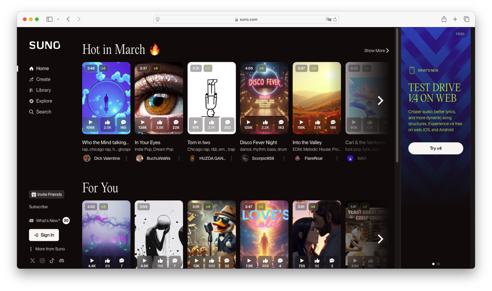
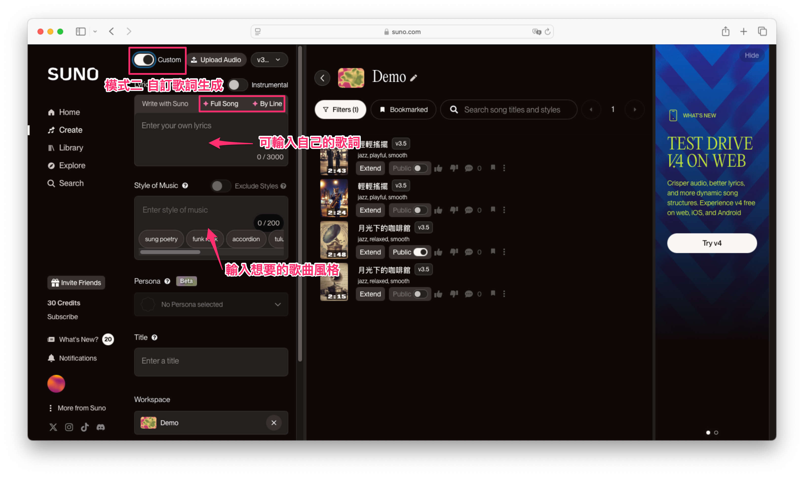
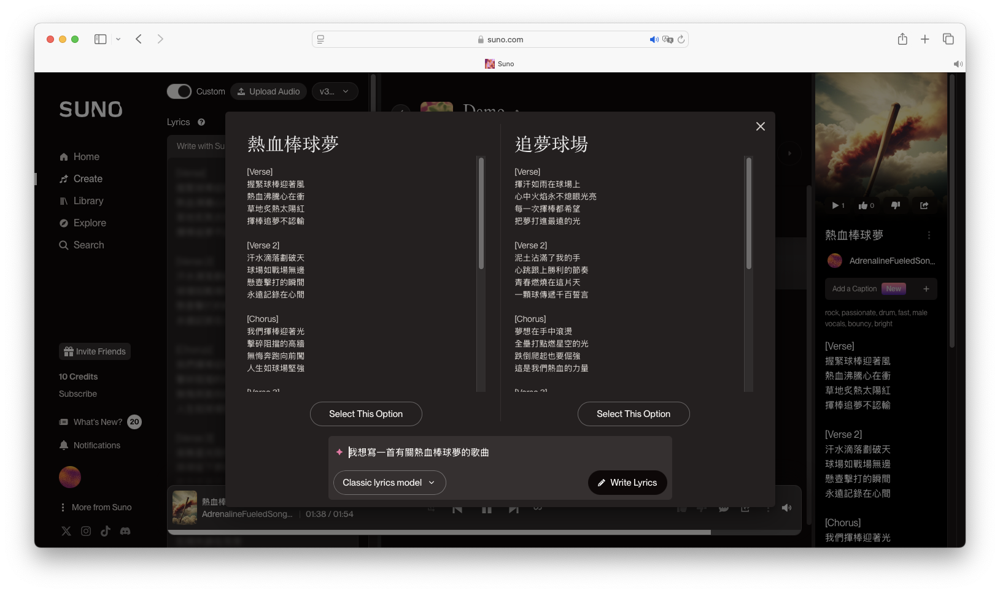
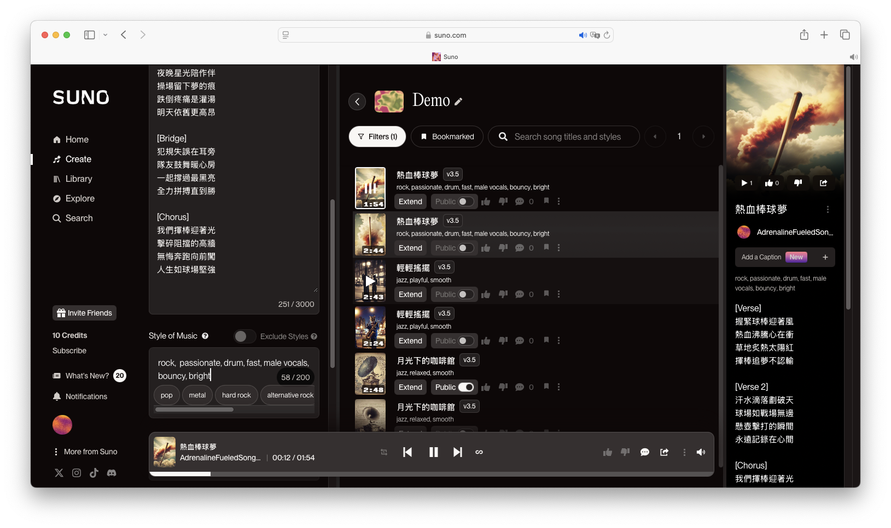
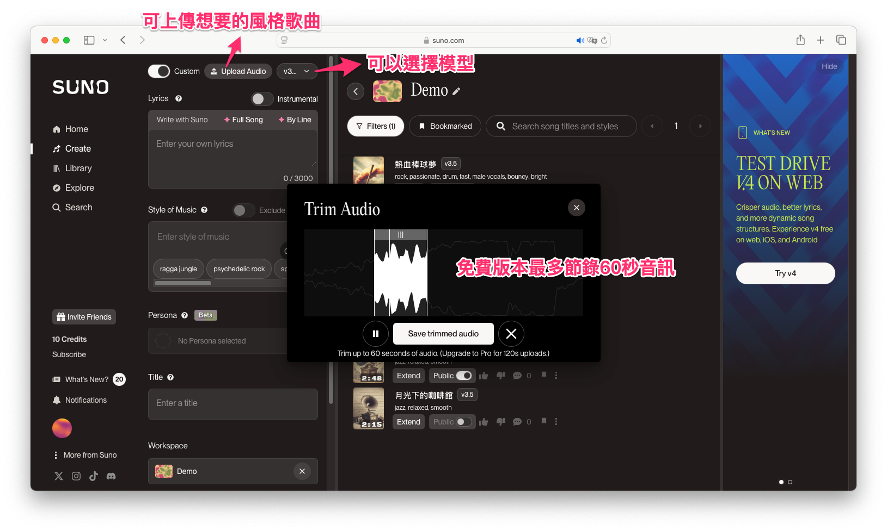

# 用 Suno.ai 輕鬆打造屬於你的AI音樂

在AI音樂創作工具百家爭鳴的時代，[Suno.ai](https://suno.com/) 以其極簡且強大的功能，讓新手也能快速產出令人驚艷的音樂作品。不論你是音樂新手還是經驗豐富的創作者，只要掌握幾個簡單步驟，就能輕鬆完成一首高品質的歌曲。



## Suno.ai 簡介

Suno.ai 是一款專門用於AI生成音樂的平台，只需輸入文字或歌詞提示，它便能即時生成旋律、伴奏甚至完整的歌曲。免費版每天能產生10首歌曲，每首歌曲的長度最多達4分鐘，完全滿足一般創作需求。

- **簡單易用**：只需輸入關鍵字，即可快速生成音樂。
- **多樣化風格**：支援流行、電子、古典、爵士等多種音樂類型。
- **歌詞與旋律同步生成**：讓 AI 幫助你寫出歌詞並自動匹配旋律。
- **語音合成與人聲**：提供 AI 合成的歌聲，甚至可選擇不同語言演唱。
- **免費試用**：Suno 免費版每天可生成 10 首歌曲，讓你自由探索。

## 註冊與登入
進入 Suno.ai 官方網站（[suno.ai](https://suno.com/)），註冊一個帳號，或直接使用 Google 帳號登入。

!!! info

        登入後每天可創作 10 首歌曲，且隔天會補充到 50 個 Credits。


## 如何使用 Suno.ai 快速生成歌曲？
進入Suno.ai並選擇音樂創作方式，Suno.ai提供了兩種主要的音樂生成方式：

- **輸入提示詞(Song Description)**：直接輸入音樂風格或主題，例如：「一首浪漫的鋼琴曲」，即可快速生成歌曲。
- **自訂歌詞(Custom Mode)**：如果你已有歌詞，開啟「Custom」模式後貼入歌詞及設定音樂風格，便能生成更精準的作品。

!!! note

        Instrumental 預設關閉，打開的話就只會生成不含人聲的純音樂。

### 模式一：文字提示詞生成
直接在輸入框輸入你想要的音樂風格或主題，例如：「輕鬆愉快的爵士樂」。由於此範例是產生爵士樂曲因此我將 Instrumental 按鈕開啟。接著按下「Generate」按鈕後，系統將提供兩個不同版本的歌曲供聆聽。生成完成後，點擊歌曲旁邊的選項按鈕（三個點），即可選擇下載並分享你的創作成果。


我們來聽聽看生成的結果：

<iframe src="https://suno.com/embed/b4230d60-26c6-4c25-980a-25e0bbb45293" width="760" height="240"><a href="https://suno.com/song/b4230d60-26c6-4c25-980a-25e0bbb45293">Listen on Suno</a></iframe>

接著我們試試看在提示詞輸入 `輕鬆愉快的爵士樂，搭配著方文山作詞`。並取消 Instrumental 讓它自動生成歌詞與配樂。我們來聽聽看生成的結果：

<iframe src="https://suno.com/embed/bdaa5867-e1e8-4d96-a523-187f38513268" width="760" height="240"><a href="https://suno.com/song/bdaa5867-e1e8-4d96-a523-187f38513268">Listen on Suno</a></iframe>

如果你對生成的歌詞、曲風或樂器不滿意，你可以點擊「Reuse Prompt」來做客製化調整。


如果你想要更多掌控權，可以輸入自己的歌詞並且制定想要的音樂風格與主唱性別，Suno.ai 會根據內容創作相應的旋律。

### 模式二：自訂歌詞生成
點選開啟「Custom」自訂開關，輸入歌詞並設定細節。我們在輸入框貼上你自己寫的歌詞，或是透過AI協作產生一個客製化的歌詞內容。



以下選擇 Full Song 協作模式，告訴機器人你想要怎樣的歌詞創作。例如我想要一首有關熱血棒球夢的歌曲。



接著設定音樂風格、歌曲結構（如副歌、主歌等）以及人聲、樂器、節奏等元素。例如這邊我下這幾個關鍵字 `rock, passionate, drum, fast, male vocals, bouncy, bright`。按下「Generate」按鈕後，系統將提供兩個不同版本的歌曲。



<iframe src="https://suno.com/embed/b0e50784-1d21-4b7b-a1dc-b19f7bbec82d" width="760" height="240"><a href="https://suno.com/song/b0e50784-1d21-4b7b-a1dc-b19f7bbec82d">Listen on Suno</a></iframe>

我們來聽聽另一個版本。

<iframe src="https://suno.com/embed/167a74c1-8f23-4985-b128-462b0bc2f64a" width="760" height="240"><a href="https://suno.com/song/167a74c1-8f23-4985-b128-462b0bc2f64a">Listen on Suno</a></iframe>

!!! note

    我們可以發現雖然歌詞一樣，但是曲目風格會影響整首的感覺！

## 常用關鍵字小提示

透過輸入精確的提示詞，能幫助AI生成更貼合你需求的音樂，例如：

- **音樂風格**：流行 (Pop)、爵士 (Jazz)、搖滾 (Rock)、電子 (Electronic)、古典 (Classical)。
- **情感**：浪漫 (Romantic)、歡快 (Cheerful)、憂鬱 (Melancholic)。
- **樂器選擇**：鋼琴 (Piano)、吉他 (Guitar)、小提琴 (Violin)、鼓 (Drums)。
- **節奏**：快速 (Fast)、中速 (Medium)、慢速 (Slow)。
- **人聲類型**：男聲 (Male Vocals)、女聲 (Female Vocals)、合唱 (Choir)。

運用這些關鍵字，讓你的創作更具個性化。亦或是把你的曲目風格想法告訴 ChatGPT 讓它幫你生成個些關鍵字。


## 進階玩法：使用 Extend 功能重新詮釋歌曲風格
除了透過提示詞和自訂歌詞外，Suno.ai 還支援 Extend 功能，允許你上傳自己喜歡的歌曲片段（約60秒），讓 AI 保留原曲的特色，再根據你的需求重新創作。



舉例來說，若你喜歡徐佳瑩的《身騎白馬》，可上傳約60秒的歌曲音檔，並輸入原本相同的歌詞，接著透過 ChatGPT 幫忙生成相近的音樂風格描述：

```
Mandopop, Chinese Pop Ballad, Folk Pop, Fusion Pop, Acoustic Ballad, Oriental Contemporary, Melodic Pop, Storytelling Pop, sentimental, romantic, nostalgic, passionate, bittersweet, Female Vocals
```

接著由 Suno.ai 根據你的音檔與描述，重新詮釋出具有個人特色的全新歌曲，保留原曲韻味同時加入創新元素，讓你的創作更有個人風格與辨識度！

<iframe src="https://suno.com/embed/7051bcb2-bb66-4fb6-90a1-274354dc69f3" width="760" height="240"><a href="https://suno.com/song/7051bcb2-bb66-4fb6-90a1-274354dc69f3">Listen on Suno</a></iframe>

!!! note

        目前這首歌是使用免費版 v3.5 模型重唱。如果要更好的聲音品質，可以使用 v4 版本會有更好的品質(每個新帳號有十首 v4 的免費額度)。

韓國 K-POP：

<iframe src="https://suno.com/embed/36d68e8b-6488-4b4d-88e5-af39ecb4869d" width="760" height="240"><a href="https://suno.com/song/36d68e8b-6488-4b4d-88e5-af39ecb4869d">Listen on Suno</a></iframe>

日本 J-POP：

<iframe src="https://suno.com/embed/d3f0cd3d-2575-4368-b66c-cb3c7098d4f8" width="760" height="240"><a href="https://suno.com/song/d3f0cd3d-2575-4368-b66c-cb3c7098d4f8">Listen on Suno</a></iframe>

## Suno.ai 音樂應用場景
AI 生成音樂不僅可以用於娛樂，還能夠應用於各種領域，例如：

- 🎶 個人創作：適合音樂愛好者用來快速創作 Demo。
- 📺 影音內容：為 YouTube、TikTok、廣告影片等創作背景音樂。
- 🎮 遊戲開發：快速生成遊戲配樂，提升沉浸感。
- 📻 podcast廣播：自製獨特的節目片頭、片尾音樂。

例如筆者最近出版了一本新書。我就透過生成式 AI 技術應用產生一首主題曲。此內容由生成式 AI 工具產生，包括 Suno 作詞作曲、Raphael 繪圖、Runway 生成動圖。

<iframe width="560" height="315" src="https://www.youtube.com/embed/fbx0SyRebfM?si=lB_qfyGYbS8lRiiS" title="YouTube video player" frameborder="0" allow="accelerometer; autoplay; clipboard-write; encrypted-media; gyroscope; picture-in-picture; web-share" referrerpolicy="strict-origin-when-cross-origin" allowfullscreen></iframe>

## 結語
Suno.ai 為每個人提供了一個輕鬆跨入音樂創作世界的門檻。現在就試試看，開始你的AI音樂創作之旅吧！
