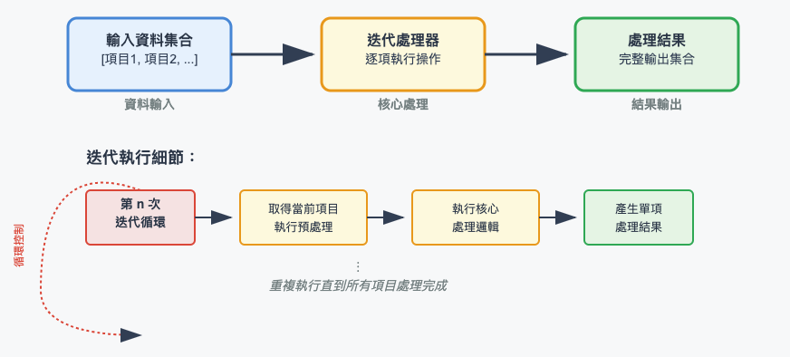
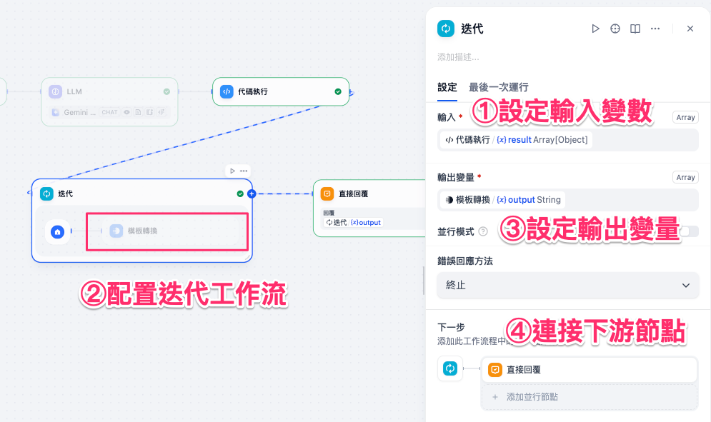
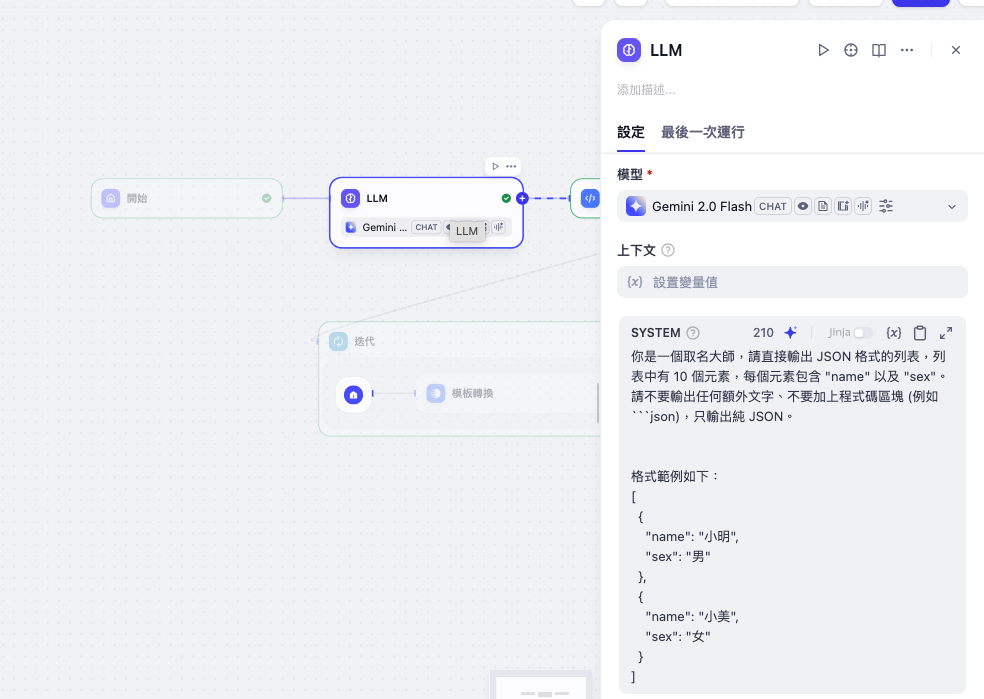
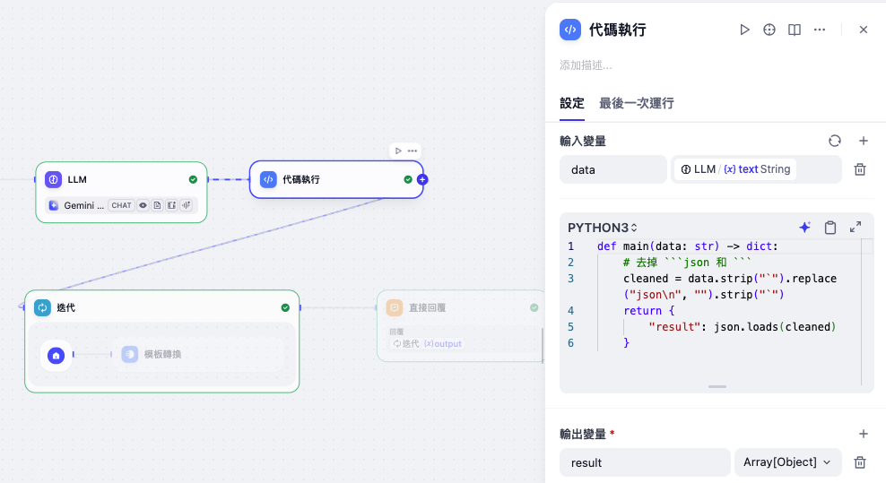
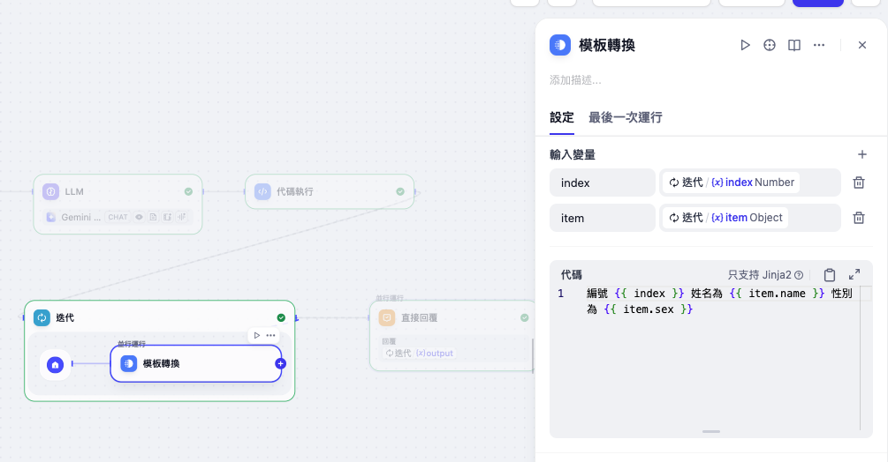
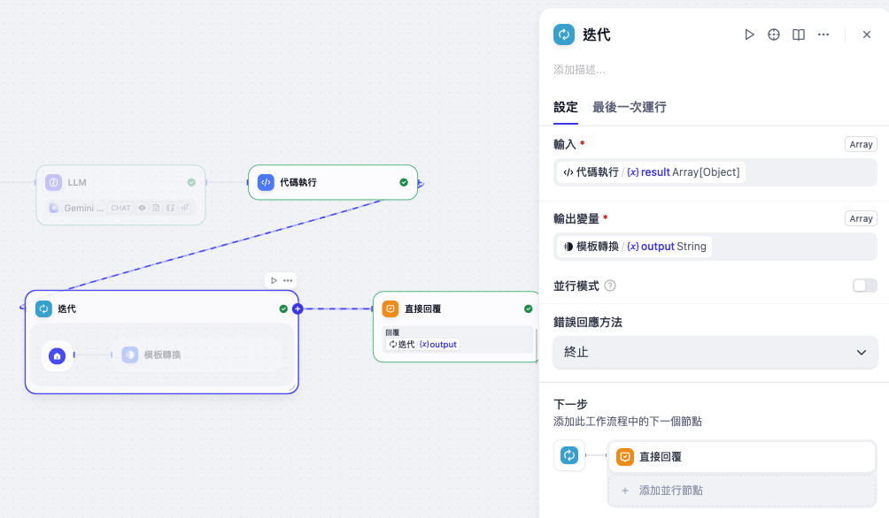
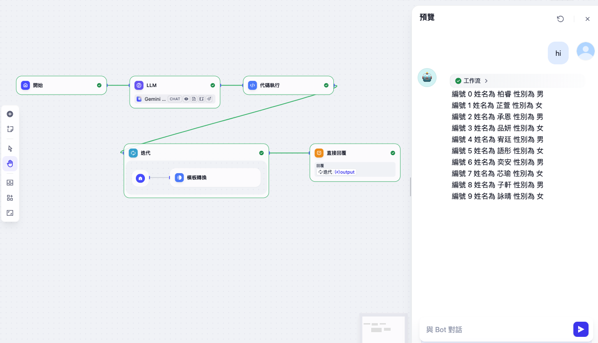

# Dify 工作流基礎：迭代

**迭代** 是一個能夠對「陣列（Array）」資料逐一處理的節點。
它依靠「循環遍歷」的方式，對陣列中的每個元素執行相同的操作，直到所有元素處理完成並輸出結果。

可以把它理解成「批次處理器」：
假如我們有 10 個空瓶要裝水，必須重複執行 10 次灌水動作，這正是迭代節點能幫我們自動完成的工作。

常見應用包括：

* 批量翻譯長文片段
* 對清單中的多個對象逐一處理
* 批量產生或修改資料
* 將列表結果拆分後交給 LLM 逐一生成內容



---

## 使用方法

在工作流中配置 **迭代** 節點時，通常包含以下幾個步驟：

1. **設定輸入變數**
   迭代節點只接受 **Array** 類型的輸入。
   上游節點必須先輸出陣列，例如：`Array[Object]`。

2. **配置迭代工作流**
   在迭代節點內部，可以放置 **LLM 節點、程式碼執行節點、API 節點** 等，讓它們針對每個元素逐一運行。

3. **設定輸出變量**
   迭代節點的輸出仍然是一個陣列，例如輸入是 10 個元素，輸出也會是 10 個結果。
   輸出變量必須設定為 **Array[...]**，最常見的是 **Array[Object]**，以保持結構化結果。

4. **連接下游節點**
   完成迭代處理後，輸出可直接傳給「直接回覆」節點或其他邏輯節點。



---

### 高級設定

* **內建變數**

    * `item`：代表目前迭代中的單筆元素（Object）
    * `index`：代表迭代的輪次（從 0 開始）

* **並行模式**
    迭代支援「並行執行」，可同時處理多個元素以加快速度（最多並行 10 筆）。

* **錯誤處理**
    當某個元素處理失敗時，可以選擇：

    * 中斷整個流程
    * 忽略錯誤並繼續
    * 移除錯誤輸出

---

## 實務案例（場景）

以下延續前一篇「程式碼執行」案例：
我們先用 **LLM 節點** 產生 10 個人名與性別，接著透過 **程式碼節點** 把字串轉換成 `Array[Object]`，最後用 **迭代節點** 逐一處理每個人名。

### 1. LLM 節點輸出（字串格式）

```json
[
  {"name": "小明", "sex": "男"},
  {"name": "小美", "sex": "女"},
  {"name": "小強", "sex": "男"}
]
```



### 2. 程式碼節點轉換為 JSON 陣列

**Python 版本**

```python
def main(data: str) -> dict:
    # 去掉 ```json 和 ```
    cleaned = data.strip("`").replace("json\n", "").strip("`")
    return {
        "result": json.loads(cleaned)
    }
```

此時輸出設定為 **Array[Object]**，確保後續迭代能正確接收。



### 3. 迭代節點逐一處理
在 **迭代** 節點內，我們會新增一個 **模板轉換** 節點，將每筆物件渲染成一行文字。



#### 1）在「迭代」節點內新增一個「模板轉換」節點

* 打開 **迭代** 節點，點選內部流程上的 **＋** 新增 **模板轉換**。
* 在右側的「輸入變量」新增兩個變量並綁定來源：

  * `index` → 來源：**迭代 (x) index**（Number）
  * `item`  → 來源：**迭代 (x) item**（Object）


!!! note

    * `index` 是迭代的內建變數，表示目前第幾輪（**從 0 開始**）。
    * `item` 是目前這一輪要處理的那筆物件（也就是陣列中的其中一個元素）。


在模板代碼區填入（Jinja2）：

```django
編號 {{ index }} 姓名為 {{ item.name }} 性別為 {{ item.sex }}
```

!!! note

    * 如果希望編號從 **1** 開始顯示，可改成 `{{ index + 1 }}`。
    * 欄位可能不存在時，可加預設值：`{{ item.name | default('未知') }}`。


#### 2）設定「迭代」節點的輸入／輸出



##### 輸入變數（必填）

* **選擇來源**：**程式碼執行 (x) result**
* **型別**：`Array[Object]`

!!! note

    前一個「程式碼執行」節點已把 LLM 的 JSON 字串解析成 **陣列物件**。迭代節點需要這種 `Array[Object]` 輸入，才能逐一取出物件交給內部流程處理。

##### 輸出變數

* **選擇來源**：**模板轉換 (x) output**
* **型別**：`String`

!!!note

    在這個範例中，我們在「模板轉換」節點內把單筆 `item` 渲染成一句文字，例如：

    ```django
    編號 {{ index }} 姓名為 {{ item.name }} 性別為 {{ item.sex }}
    ```

    因此每輪輸出的結果都是一個 **字串**。
    整個迭代節點會將所有字串合併在一起，形成單一字串輸出（而不是陣列），最後可以直接交給 **直接回覆節點** 顯示。

    也就是說：

    * 如果「輸出變量」型別設定成 **Array[String]** → 會輸出一個字串清單（陣列）。
    * 如果像本案例這樣設定成 **String** → 系統會把所有迭代過程的結果 **拼接成一個字串**，最適合用於最後的直接回覆。

### 4. 直接回覆節點

最後，將迭代輸出的陣列傳遞給 **直接回覆節點**，即可將結果逐一展示給使用者。



透過這樣的流程，**迭代** 節點能幫助我們批次處理清單中的每一筆資料，並保持結構化輸出，大幅提升工作流在處理大量資料時的靈活度。

