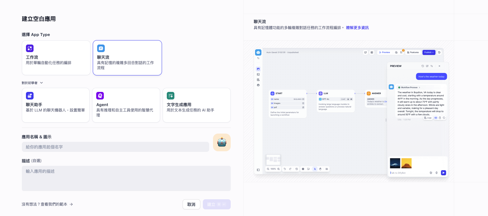
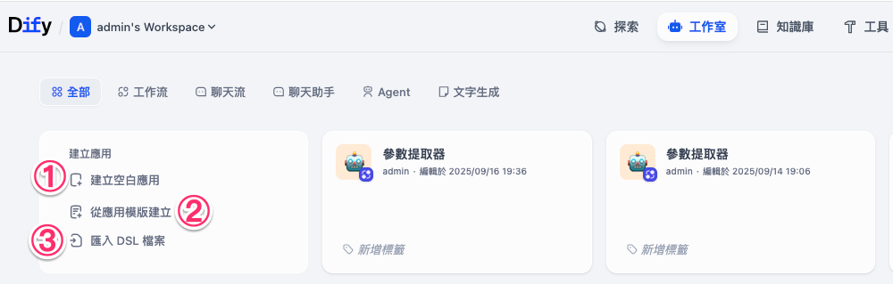
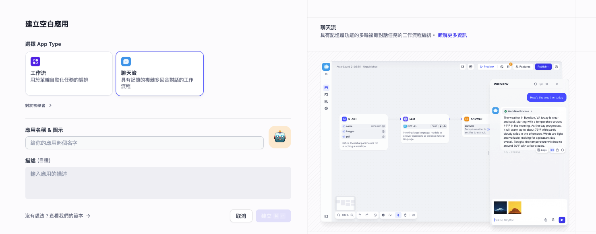
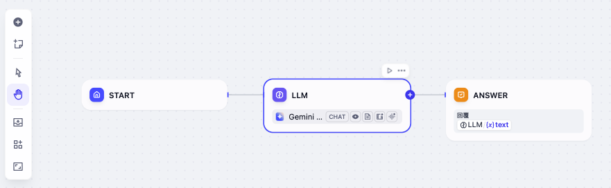
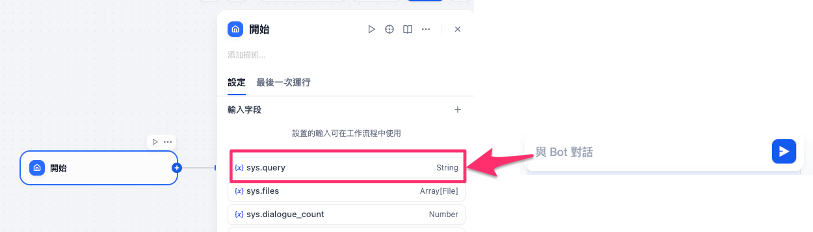
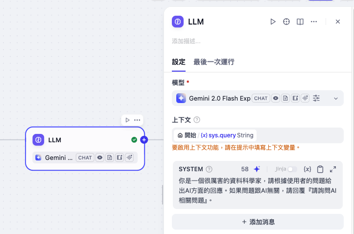
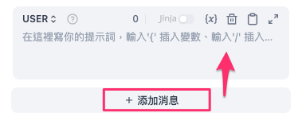
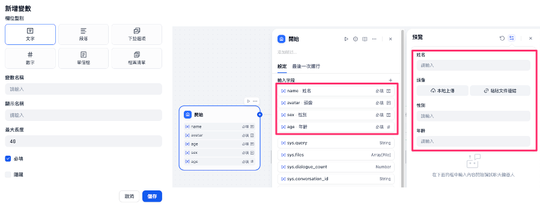
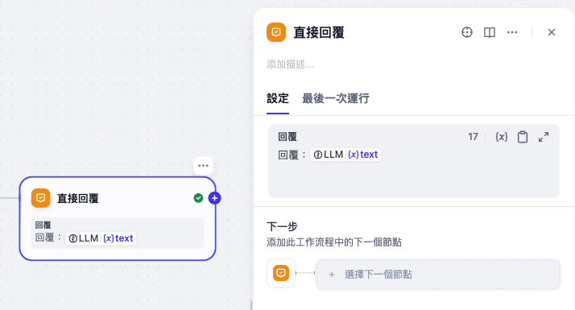
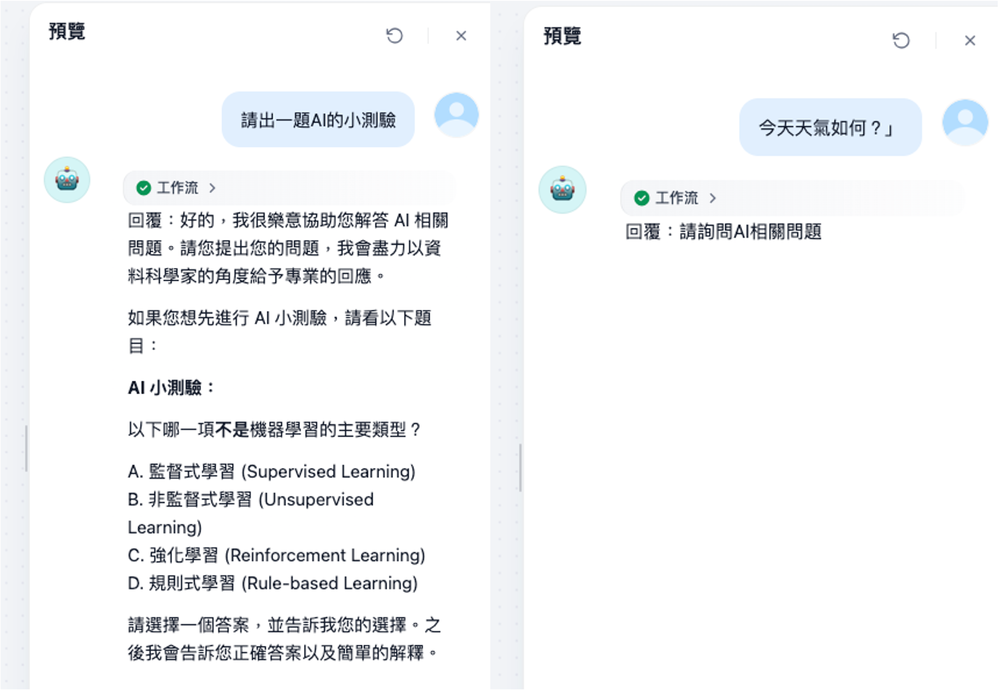

# Dify 教學：建立第一個應用

在 Dify 中，「應用」是我們把大型語言模型（LLM，例如 GPT、Gemini、Claude 等）能力落地到實際場景的核心單位。只要建立一個應用，就能快速擁有：

* **封裝好的 API**：後端或前端都能直接呼叫，並透過 Token 控制存取。
* **開箱即用的 WebApp**：美觀的 UI，不需寫程式也能即刻部署，甚至能再做二次開發。
* **完整的管理介面**：包括提示詞工程、上下文管理、知識庫接入、日誌分析和標註功能。

換句話說，建立應用的同時，你就完成了「AI 工程化的第一步」。

---

## 一、應用類型介紹

Dify 目前提供五種應用類型，不同的需求可以選擇不同類型：

| 類型                 | 特點               | 適合情境        |
| ------------------ | ---------------- | ----------- |
| **聊天助手**           | 多輪對話、可接知識庫、支援開場白 | FAQ 助理、客服對話 |
| **文本生成應用**         | 一問一答、表單輸入、結果輸出   | 翻譯、分類、摘要    |
| **Agent**          | 可推理、拆解任務、呼叫工具    | 智能客服、跨系統整合  |
| **對話流 (Chatflow)** | 定義流程的多輪對話，有記憶功能  | 複雜業務流程、線上表單 |
| **工作流 (Workflow)** | 自動化、批次處理、單輪任務    | 文件批次生成、資料處理 |

!!! note

        初學者建議先從 **聊天助手** 或 **文本生成應用** 開始。

---

## 二、建立應用的方式

在 Dify 的「工作室」中，你有三種方式建立應用：

1. **從模板建立（推薦新手）**
2. **從空白建立**
3. **透過 DSL 檔案匯入**

---

### 1. 從模板建立（最簡單）

Dify 內建許多高品質的應用模板（由提示詞工程師設計），例如 FAQ 助理、翻譯工具、知識檢索應用。
只要幾個步驟，就能快速上線：

1. 進入 **工作室 → 從模板建立**
2. 挑選一個模板（如 Code Interpreter）
3. 按「加入工作區」即可

---

### 2. 從空白建立（自由度最高）

如果想要完全自訂，可以選擇 **從空白建立**：

1. 進入 **工作室 → 從空白建立**
2. 選擇應用類型（聊天助手 / 文本生成 / Agent / Chatflow / Workflow）
3. 設定應用名稱、圖示、描述

!!! note "建議"

        * 名稱取清楚（例如「電商客服助手」）
        * 圖示可以用內建圖標或上傳自己喜歡的圖片
        * 描述寫明用途（例如「協助客戶查詢訂單、退換貨流程」）

---

### 3. 透過 DSL 檔案建立（進階用法）

Dify 提供一個 **DSL（YAML 格式）標準**，能完整描述應用設定。

* **本地匯入**：直接上傳 `.yml` 檔案
* **URL 匯入**：填寫 DSL 文件網址（例如 `https://example.com/your_app.yml`）

適合情境：

* 你在 GitHub 找到一個應用範例，直接下載匯入
* 團隊內共用應用設定，只要一份 DSL 檔即可還原

!!! info "注意"

        不同版本的 DSL 可能有相容性差異，若出現錯誤，請檢查 DSL 的版本號。

---

## 三、聊天助手 vs. 文本生成應用

很多人初學時會搞混，這裡簡單整理差異：

| 功能        | **文本生成應用**            | **聊天助手**        |
| --------- | --------------------- | --------------- |
| WebApp 介面 | 表單 + 結果式              | 聊天式             |
| API 端點    | `completion-messages` | `chat-messages` |
| 交互方式      | 一問一答                  | 多輪對話            |
| 上下文保存     | 當次                    | 持續              |
| 知識庫支援     | ✔️                    | ✔️              |
| AI 開場白    | ❌                     | ✔️              |
| 適用情境      | 翻譯、判斷、摘要              | FAQ 助理、客服       |

!!! note "建議"

        * 如果只是「輸入 → 產出」，用 **文本生成應用**。
        * 如果需要「聊天互動」，用 **聊天助手**。

---

## 四、動手建立第一個應用
首先選擇 **從空白建立**應用類型選擇聊天流(Chatflow)，設定好應用名稱、圖示、描述後點選建立。

### Dify 工作流三大基本節點

在 Dify 裡，一開始大模型就會直接回覆。這三個節點算是 Dify 中最基本、最核心的基礎節點。這三個節點可以透過連線互相串起來，也能跟其他節點靈活組合，變成更複雜、可商用的流程工具。

#### 開始節點
一開始，裡面會有一些最基本的參數，其中 **System (也就是 Sys.Query)**，就是在執行時，使用者輸入的內容。我們的聊天訊息，其實就是作為一個 Query 被送進來的。

另外也可以加入變數，這些變數有很多不同的類型，也能讓使用者自行輸入。輸入的內容同樣可以交給大語言模型來互動，像下面這樣示範：

#### LLM節點
接著，在大語言模型的部分，我們可以自己選要用哪一個模型。舉例來說，可以選 **DeepSeek**、**Gemini**、或是 **ChatGPT**，都行，直接挑一個就好。然後還會包含對應的上下文。我們可以直接引用 Sys.Query，只要點一下就能帶進來。

另外，還會有提示詞。提示詞可以輸入任何你想要的內容。像是輸入：「你是一個很厲害的資料科學家，請根據使用者的問題給出AI方面的回應。如果問題跟AI無關，請回覆『請詢問AI相關問題』。」這樣就能定義系統提示詞。這其實就是所謂的 **Prompt Engineering（提示詞工程）**。

再來，我們也能新增一個「使用者訊息」的節點。這個節點其實就是我們在聊天時，送進來的訊息。你可以隨便加一筆測試訊息。只要點選「＋」或是用斜線快速輸入，就能把上下文加進來。

#### 直接回覆節點
當上下文帶進來之後，這個流程最後會走到「直接回覆」。在「直接回覆」這裡，就是由大模型產生回覆。只要點一下，就能看到結果。這個地方顯示的就是 LLM（大模型）的輸出，你也可以在這裡加上一些文字修飾或格式，例如在大模型回覆前面加個「回覆：」。

測試的時候，只要按「預覽」就能跑起來。比方說輸入：「請出一題AI的小測驗」，大模型就會輸出一題相關的考題。如果再輸入「今天天氣如何？」，因為這題跟 AI 無關，所以系統就會回「請詢問AI相關問題」。

這樣一來，我們就只用最基本的三個節點，就能搭建出一個能跟大模型互動的聊天應用了。

