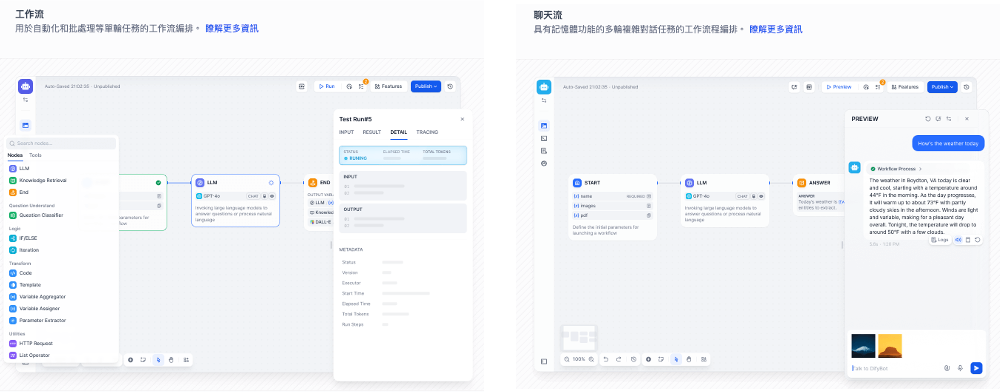

# Dify 工作流基礎：從 Chatflow 與 Workflow 認識節點

## 為什麼需要工作流？

在建構 AI 應用的過程中，單靠提示詞 (Prompt) 有時不足以處理複雜邏輯。
**工作流 (Workflow)** 的出現，正是為了將複雜任務拆解為「節點 (Node)」的形式，讓系統更有結構、更穩定。
它的好處包括：

* **降低複雜度**：把大問題拆成小步驟。
* **提升可靠性**：明確的流程比「黑箱推理」更穩定。
* **方便調試與擴展**：每個節點都能獨立檢查，靈活修改。
* **提升可解釋性**：知道系統是怎麼一步步產生結果。

---

## Dify 工作流的兩種類型

Dify 的工作流主要分為兩類，分別對應不同應用場景：

| 類型           | 特點                                           | 適用情境                  |
| ------------ | -------------------------------------------- | --------------------- |
| **Chatflow** | 專為 **對話式應用** 設計，內建對話歷史 (Memory)，支援多輪互動與即時回覆。 | 客服助理、FAQ 機器人、語義搜尋對話等  |
| **Workflow** | 專為 **自動化/批處理** 設計，支援邏輯判斷、程式碼執行與外部 API 調用。    | 批量翻譯、報表生成、數據分析、郵件自動化等 |

!!! note

        * **Chatflow** 有「Answer 節點」與「聊天記憶 (Memory)」功能。
            * 給予指令→ 產生內容→ 就內容進行多次討論→ 重新產生結果→ 結束
        * **Workflow** 則沒有多輪對話記憶，但能更靈活地進行批量與流程自動化。
            * 給予指令→ 產生內容→ 結束

---

## 常見案例

以下是幾個典型的工作流應用場景：

* **客戶服務助理**  
  透過 Chatflow 整合知識庫，LLM 可以自動回應常見問題，減輕人工客服壓力，並保留對話歷史方便後續追蹤。

* **內容生成**  
  使用 Workflow，輸入一個主題或大綱即可批量生成文章、產品描述或行銷文案，大幅節省時間。

* **任務與專案自動化**  
  結合外部工具（如 Trello、Slack、Lark），可以自動建立任務、更新狀態或發送通知，讓專案管理更高效。

* **數據分析與報告生成**  
  對大型資料集進行統計、檢索與整理，再交由 LLM 生成圖表、摘要或商業洞察，幫助決策者快速掌握重點。

* **郵件自動化處理**  
  透過工作流，系統可以自動起草郵件或社群貼文，只要輸入重點，LLM 就能生成專業且結構良好的內容。

---  

## 節點：工作流的組成核心

節點是工作流的核心，每個節點代表一個獨立的操作或邏輯。
你可以把節點想像成「積木」，透過連接它們，拼湊出完整的 AI 流程。

以下是 Dify 目前提供的核心節點清單：

| 節點名稱                           | 說明                              |
| ------------------------------ | ------------------------------- |
| **開始（Start）**                  | 定義工作流的啟動參數。                     |
| **結束（End）**                    | 定義 Workflow 的最終輸出。              |
| **回覆（Answer）**                 | Chatflow 專屬，用於輸出對話回應。           |
| **大語言模型（LLM）**                 | 調用 LLM 進行推理、生成或處理語言。            |
| **知識檢索（Knowledge Retrieval）**  | 從知識庫中檢索相關內容，提供給下游節點使用。          |
| **問題分類（Question Classifier）**  | 使用 LLM 判斷用戶問題所屬的分類。             |
| **條件分支（IF/ELSE）**              | 根據條件判斷，分流不同邏輯路徑。                |
| **程式碼執行（Code）**                | 執行 Python / NodeJS 程式碼，自定義處理邏輯。 |
| **模板轉換（Template）**             | 透過 Jinja2 模板語法進行格式轉換與文本處理。      |
| **變數聚合（Variable Aggregator）**  | 將多路分支的變數整合為一個輸入，方便後續使用。         |
| **參數提取器（Parameter Extractor）** | 從自然語言中抽取結構化參數，用於 API 或工具調用。     |
| **迭代（Iteration）**              | 對列表逐一處理，直到完成所有結果。               |
| **HTTP 請求（HTTP Request）**      | 發送 HTTP API 請求，與外部系統交互。         |
| **工具（Tools）**                  | 調用 Dify 內建工具、自訂工具或子流程。          |
| **變數賦值（Variable Assigner）**    | 向變數（如會話變數）進行賦值操作。               |
| **循環（Loop）**                   | 持續執行任務，直到滿足退出條件或達到次數上限。         |

---

## 下一步？

本文僅介紹了 **Dify 工作流的基礎觀念** 包含工作流的兩種類型，以及節點在流程設計中的角色。
在後續文章中，我會逐一拆解每一個節點，說明：

* **節點的用途**
* **常見的應用場景**
* **實作範例與技巧**

讓你能逐步掌握如何靈活運用這些節點，打造真正實用的 AI 工作流。
