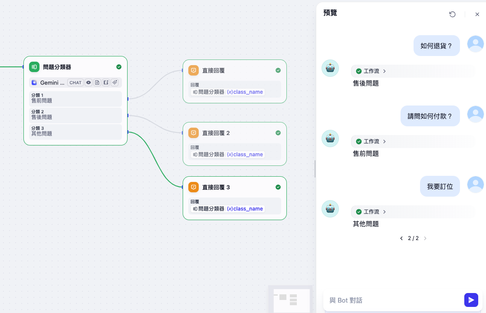
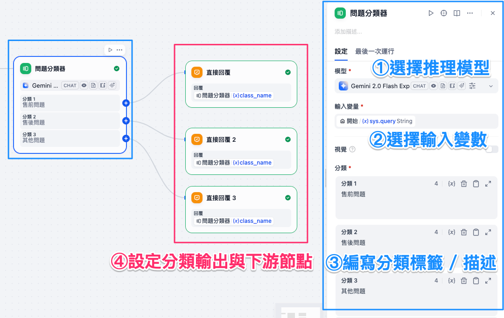
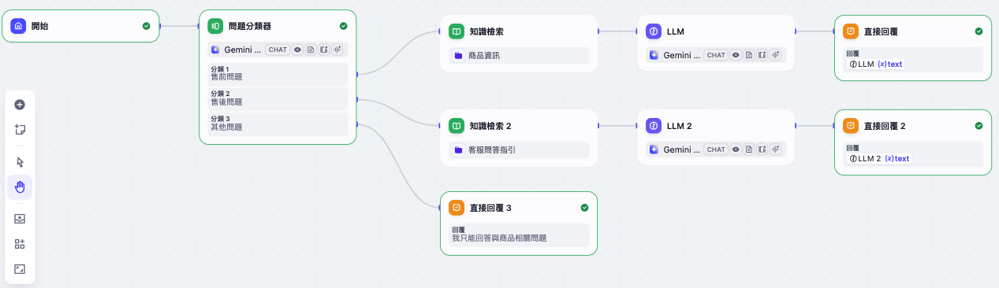

# Dify 工作流基礎：問題分類器

**問題分類器**是一個能夠根據使用者輸入內容，自動判斷問題類型的節點。它依靠大語言模型（LLM）的自然語言理解與推理能力，將輸入的問題對應到事先定義好的分類，並輸出分類結果。
透過這個節點，我們可以快速將不同意圖的輸入問題分流至不同的流程路徑，讓工作流更具結構性與自動化。

常見應用包括：

* 客服對話意圖分類
* 產品評價或留言分類
* 郵件與工單的自動分類

---

## 使用方法

在工作流中配置 **問題分類器** 節點時，通常包含以下幾個步驟：

1. **選擇推理模型**
   問題分類器依賴 LLM 的推理能力，選擇合適的模型（如 GPT、Claude、Gemini 等）能提升分類準確率。

2. **選擇輸入變數**
   指定要用來分類的輸入內容，一般為使用者的輸入問題，例如：`sys.query`。

3. **編寫分類標籤 / 描述**
   為每個類別定義一段清楚的標籤或描述，例如：

    * 售前問題：與產品規格、價格相關的問題
    * 售後問題：與維修、保固、異常使用有關的問題
    * 其他問題：與產品無關的問題

4. **設定分類輸出與下游節點**
   當問題被分類後，會輸出對應的 `class_name`，再根據結果導向不同的後續節點（例如：知識庫查詢、API 呼叫或回覆訊息）。

---

### 高級設定

* **指令**：可補充額外說明，幫助模型更好地理解分類依據。
* **記憶**：允許分類器參考對話上下文，提升對話型場景的判斷精度。
* **圖片分析**：若模型支援多模態，可以輸入圖片變數進行圖片內容分類。
* **記憶窗口**：控制上下文歷史訊息的傳遞範圍，避免過多資訊干擾。

---

## 實務案例（場景）

以客服系統為例，我們設定三個分類標籤：

1. **售前問題**
2. **售後問題**
3. **其他問題**

  

### 案例演示：

* 使用者輸入：「**iPhone 17 Pro Max 的記憶體多大？**」
  → 分類為 **售前問題**，導向產品規格知識庫。

* 使用者輸入：「**我的 iPad 才用了兩個月，為什麼相機模糊？**」
  → 分類為 **售後問題**，導向客服工單流程。

* 使用者輸入：「**明天台北會下雨嗎？**」
  → 分類為 **其他問題**，回覆罐頭語。

透過這樣的工作流，問題分類器能自動幫助系統整理與歸納問題，並分流到合適的後續處理節點，大幅提升自動化處理效率。

