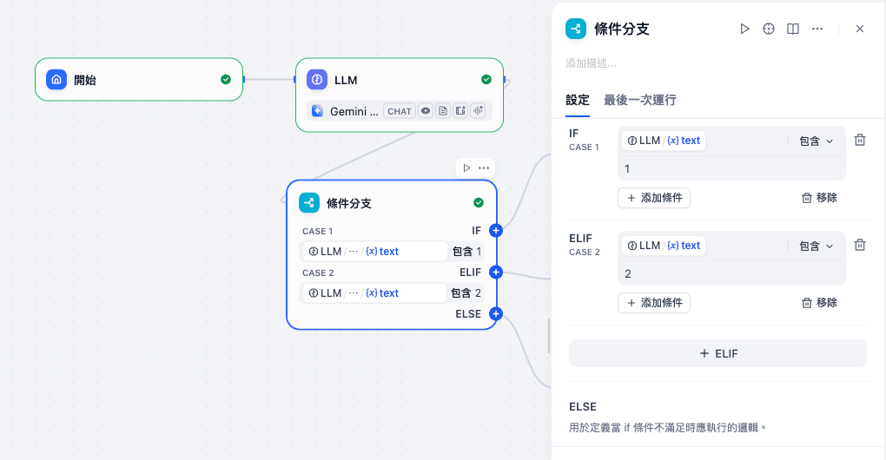
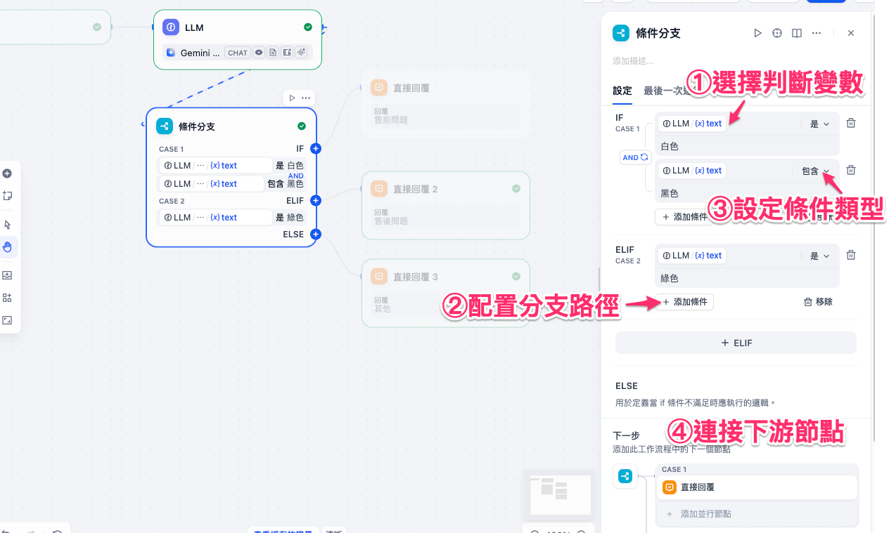
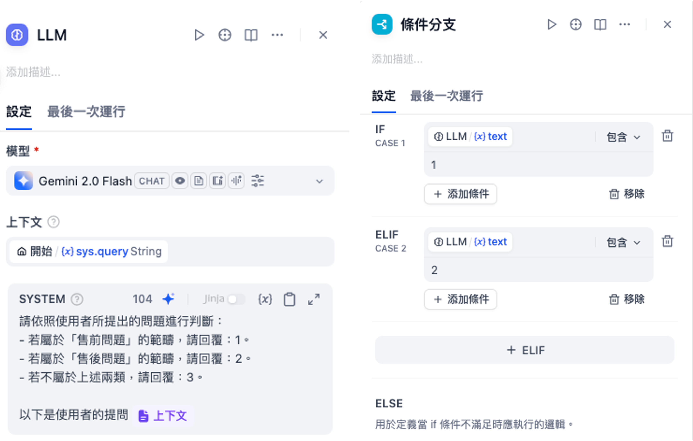
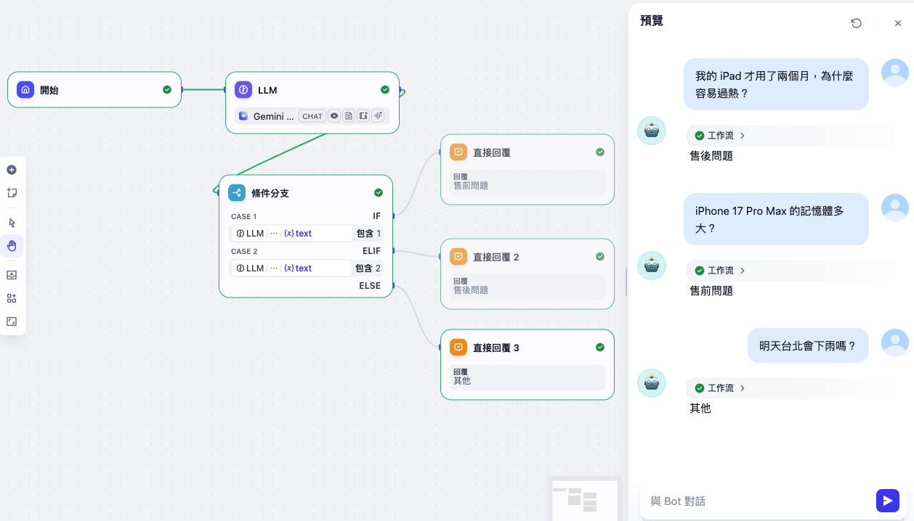

# Dify 工作流基礎：條件分支

**條件分支**是一個能夠根據 **If / Else / Elif 條件**，將 Chatflow 或 Workflow 流程拆分成多個分支的節點。
它依靠 **條件判斷邏輯**（例如：文字比對、數字比較、多重條件運算），讓不同情況下的輸入自動走向不同的處理路徑。這使得整個工作流更靈活、可控，並能針對不同輸入做出差異化的反應。

常見應用包括：

* 客服問答流程的判斷（售前 / 售後 / 其他）
* 根據輸入參數選擇不同 API 呼叫
* 根據欄位是否為空值來決定資料處理方式
* 依據關鍵字或分類結果，導向不同的知識庫或模型



---

## 使用方法

在工作流中配置 **條件分支** 節點時，通常包含以下幾個步驟：

1. **選擇判斷變數**
   從前面節點輸出的變數中，選擇要檢查的欄位或值，例如：LLM的輸出`text`。

2. **配置分支路徑**

    * **IF 路徑**：條件成立時執行。
    * **ELIF 路徑**：若 IF 不成立，則檢查次要條件，成立則執行。
    * **ELSE 路徑**：前面條件都不成立時，執行預設處理。

3. **設定條件類型**
   系統支援以下條件判斷方式：
    * 包含（Contains）
    * 不包含（Not contains）
    * 開頭是（Start with）
    * 結尾是（End with）
    * 等於（Is）
    * 不等於（Is not）
    * 為空（Is empty）
    * 不為空（Is not empty）

4. **連接下游節點**
   根據分支結果，將輸出導向不同的知識庫、LLM 回覆或 API。



---

### 高級設定

* **多重條件運算**：可在一個判斷中同時使用多個條件，透過 AND / OR 控制複雜邏輯。
* **搭配大模型輸出**：條件分支不只比對字串，也能利用 LLM 輸出的結果（例如：分類標籤或數字），再透過分支節點進行判斷。
* **靈活的 Else / Elif 配置**：可設定多層次的判斷，直到找到符合的分支，或最後進入 Else 預設流程。

---

## 實務案例（場景）

以 **客服問題處理** 為例，我們定義三種問題：

1. **售前問題** → 對應回覆代碼「1」
2. **售後問題** → 對應回覆代碼「2」
3. **其他問題** → 對應回覆代碼「3」



**LLM節點的提示詞**

```
請依照使用者所提出的問題進行判斷，並回覆數字：
- 若屬於「售前問題」的範疇，請回覆：1
- 若屬於「售後問題」的範疇，請回覆：2
- 若不屬於上述兩類，請回覆：3

以下是使用者的提問 {{#context#}}
```

### 案例演示：

* 使用者輸入：「**iPhone 17 Pro Max 的記憶體多大？**」
  → 條件分支判斷為 **售前問題**，回覆代碼 = 1，導向產品規格知識庫。

* 使用者輸入：「**我的 iPad 才用了兩個月，為什麼容易過熱？**」
  → 條件分支判斷為 **售後問題**，回覆代碼 = 2，導向客服工單流程。

* 使用者輸入：「**明天台北會下雨嗎？**」
  → 不符合售前或售後 → 自動進入 **ELSE** 分支，回覆代碼 = 3，回覆罐頭語。




透過這樣的設計，**條件分支** 能自動幫助系統做出正確的流程分流，並與 **問題分類器** 搭配使用。
不同的是，問題分類器偏重於依靠 **LLM 的語意理解** 來做分類；而條件分支則偏重於 **規則邏輯判斷**，兩者結合能讓工作流既聰明又可控。
