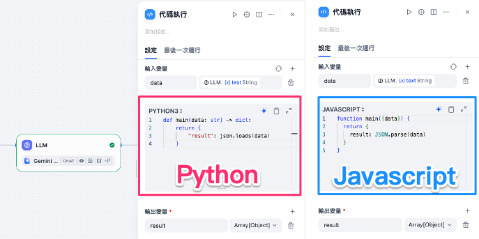
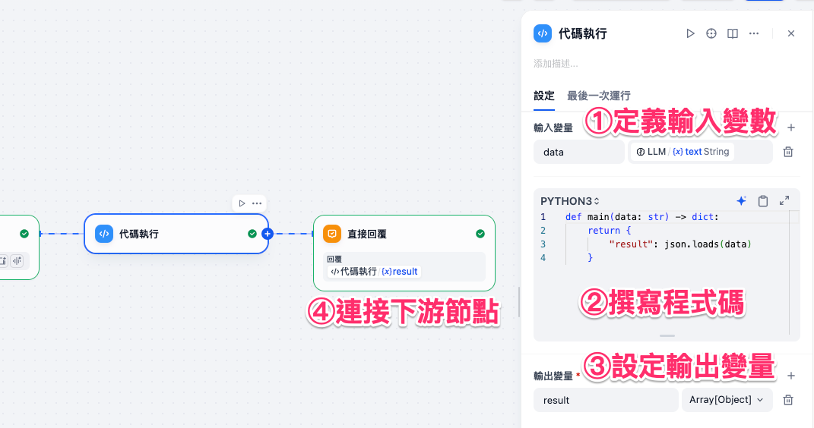
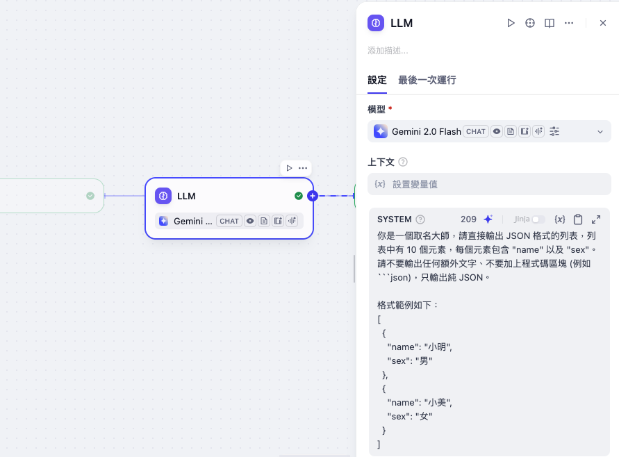
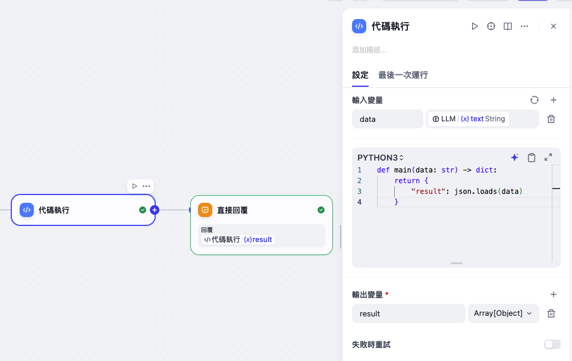
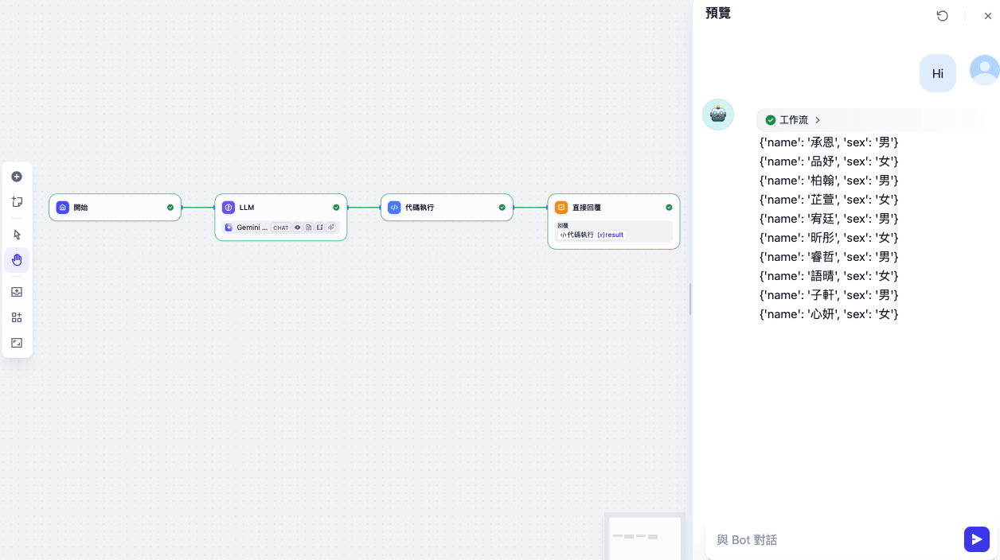

# Dify 工作流基礎：程式碼執行

**程式碼執行** 是一個能夠在工作流中執行自訂邏輯的節點。
它依靠 **Python / Javascript 腳本** 來完成資料轉換、數據運算或結構化處理，並可輸出結果給後續節點。

透過這個節點，我們可以將非結構化的輸入（如文字或原始 JSON 字串）轉換成可操作的資料物件，或執行複雜的數據處理邏輯，讓整個流程更靈活。

常見應用包括：

* 文字或 JSON 的解析與轉換
* 數學與統計運算
* 數據拼接與整合
* 資料清理與格式化



---

## 使用方法

在工作流中配置 **程式碼執行** 節點時，通常包含以下幾個步驟：

1. **定義輸入變數**
   從上游節點（如 LLM、HTTP 請求）選擇需要處理的資料，並在輸入變數中聲明。

2. **撰寫程式碼**
   依照需求使用 Python 或 Javascript 編寫處理邏輯。必須確保程式輸出為一個物件，並包含 `result` 作為輸出變數。

3. **設定輸出變量**
   在節點配置中，為程式碼執行結果選擇合適的輸出格式，例如：

    * **String**：輸出文字內容
    * **Number**：輸出數字結果
    * **Array[String]**：輸出文字陣列
    * **Array[Number]**：輸出數字陣列
    * **Array[Object]**：輸出物件陣列（最常見，如 JSON 資料列表）
    * **Object**：輸出單一物件

4. **連接下游節點**
   轉換後的資料可直接用於後續的回覆、判斷或 API 呼叫。




---

### 高級設定

* **多輸入變數處理**：可同時接受多個來源的輸入進行運算或整合。
* **錯誤處理**：在程式碼中加上 try/except（Python）或 try/catch（JS）避免異常中斷流程。
* **結合 LLM 輸出**：可將 LLM 產生的文字格式輸出轉為結構化 JSON，方便後續節點使用。

!!! note

        需了解更多應對異常的處理辦法，請參考[異常處理](https://docs.dify.ai/en/guides/workflow/error-handling/README)。

---

## 實務案例（場景）

以下是一個常見的 JSON 格式轉換案例：
為了模擬 API 回傳結果我們讓 LLM 隨機產生 10 個人名與性別，原始輸出為「文字字串格式」。若直接使用將不便於數據處理，因此需要透過程式碼節點轉換成 JSON 物件。



### LLM 節點設定
在 LLM 節點中，我們讓模型輸出一份模擬 API 回傳的資料。這裡要求模型產生 10 個人名與性別：

```
你是一個取名大師，請直接輸出 JSON 格式的列表，列表中有 10 個元素，每個元素包含 "name" 以及 "sex"。  
請不要輸出任何額外文字、不要加上程式碼區塊 (例如 ```json)，只輸出純 JSON。  

格式範例如下：  
[
  {
    "name": "小明",
    "sex": "男"
  },
  {
    "name": "小美",
    "sex": "女"
  }
]
```

模型會輸出類似以下的文字結果（注意，這裡還是字串）：

```
[
  {"name": "Andy", "sex": "男"},
  {"name": "Wang", "sex": "女"},
  {"name": "Nana", "sex": "女"}
]
```
### 程式碼節點設定
在 **程式碼執行節點** 中，我們要做的事情就是把 LLM 的字串輸出轉換為 JSON。

#### 1. 設定輸入變數

將 LLM 輸出的 `text` 或 `result` 指定為程式碼節點的輸入。

#### 2. 撰寫程式碼
在解析字串的時候，因為輸入資料多了一層 Markdown 的程式碼區塊符號（像是 json 與 ` ` `），導致內容已經不再符合標準 JSON 格式，因此解析器在讀取時會直接報錯，必須先移除這些多餘的符號才能順利解析。雖然 prompt 已經引導避免產生這樣的程式碼區塊符號，為了保險在程式還是加了一道防護。

**JavaScript 版本**

```javascript
function main({data}) {
  // 移除掉開頭的 ```json 與結尾的 ```
  const cleaned = data.replace(/^```json\s*/, "") .replace(/```$/, "");
  return {
    result: JSON.parse(cleaned)
  }
}
```

**Python 版本**

```python
def main(data: str) -> dict:
    # 去掉 ```json 和 ```
    cleaned = data.strip("`").replace("json\n", "").strip("`")
    return {
        "result": json.loads(cleaned)
    }
```

#### 3. 設定輸出變量

在「輸出變量」中，將 `result` 的格式設為 **Array[Object]**。

原因是：

* LLM 的輸出是一個包含多筆資料的清單（array）。
* 每筆資料都是一個物件（object），內含 `name` 與 `sex` 欄位。
* 若不設成 Array[Object]，後續節點在處理時會遇到型別錯誤或難以操作。



??? note "什麼是JSON 陣列（Array[Object]）"


    ### JSON 陣列（Array[Object]）

    #### 什麼是 JSON 陣列？

    * **JSON 陣列**就是一組用中括號 `[]` 包起來的資料集合。
    * 陣列裡的每個元素，可以是：

    * **JSON 物件**（`{}`）
    * **字串**、**數字**、**布林值** 或 **null**
    * 在我們常見的應用裡，通常是「**陣列裡放多個物件**」。

    #### JSON 陣列的規則

    1. **用中括號 `[]` 表示**。
    2. 陣列裡的元素之間，用 **英文逗號 `,`** 分隔。
    3. 陣列最後一個元素 **不能有逗號**。
    4. 每個元素可以是一個完整的物件 `{...}`。

    #### 範例：陣列裡有三個物件

    ```json
    [
        { "name": "承恩", "sex": "男" },
        { "name": "品妤", "sex": "女" },
        { "name": "柏翰", "sex": "男" }
    ]
    ```

    這裡：

    * `[` 與 `]` 表示這是一個 **JSON 陣列**
    * 陣列裡有三個物件（每個物件都有 `name` 和 `sex` 欄位）
    * 每個物件之間用逗號分隔，最後一個物件 **不需要逗號**


### 直接回覆節點

最後，我們可以在 **直接回覆節點** 中，將程式碼執行後的結果輸出給使用者。
這樣就能看到一份真正的 JSON 陣列，而不是一串單純的文字字串。



透過這樣的流程，**程式碼執行** 能幫助我們將 LLM 的文字輸出轉換成結構化資料，方便後續節點進行運算或直接回覆，大幅提升工作流的靈活度與可控性。

