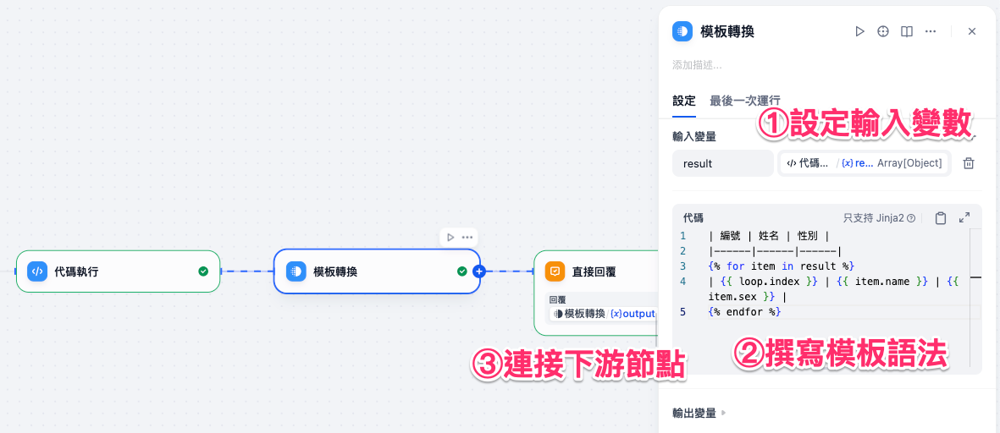
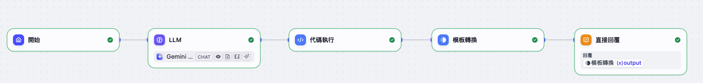
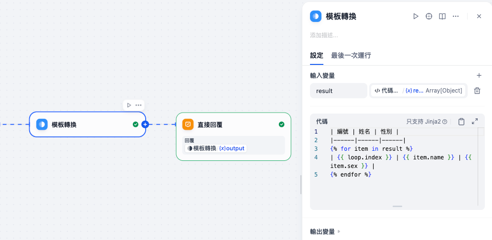
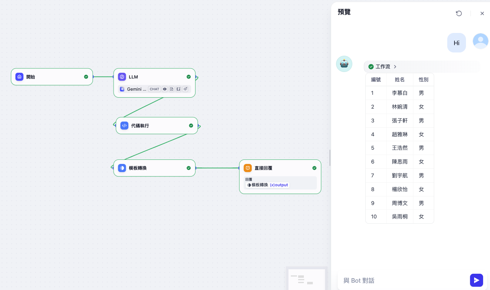

# Dify 工作流基礎：模板轉換

**模板轉換** 是一個能夠在工作流中，將變數透過 **Jinja2 模板語法** 進行靈活格式化的節點。
它依靠 **模板引擎** 來完成資料重組與文字輸出，能夠把複雜或難以閱讀的 JSON 轉換為人類友好的格式，例如：文字段落、列表、表格等。

透過這個節點，我們可以將程式碼輸出的 `Array[Object]` 資料，轉換成 **Markdown 表格**，讓使用者一眼就能看懂內容。

常見應用包括：

* 將 JSON 資料轉換成 Markdown 表格或清單
* 將多個變數拼接成段落或文件
* 對查詢結果進行格式化顯示
* 對 API 回傳內容加上結構化輸出（如報表、清單）


!!! note "什麼是 Jinja？"

    - Jinja 是一個快速、表達力強、可擴展的模板引擎。

---

## 使用方法

在工作流中配置 **模板轉換** 節點時，通常包含以下幾個步驟：

1. **設定輸入變數**
   指定來源資料，例如程式碼節點輸出的 `Array[Object]`。
   每個元素（object）都可以在模板中被迴圈處理。

2. **撰寫模板語法**
   使用 **Jinja2 語法** 定義輸出格式

3. **連接下游節點**
   轉換結果通常輸出為 **String**，方便直接回覆或進行後續處理。



---

### 高級設定

* **Jinja2 語法支援**：可以使用迴圈、條件判斷、過濾器來靈活處理資料。
* **Markdown 格式支援**：Dify 介面可以渲染 Markdown，因此表格輸出會比純文字更清晰。
* **安全性**：只讀取輸入變數，避免任意程式碼執行的風險。

---

## 實務案例（場景）

以下我們延續「程式碼執行」的例子：
程式碼節點已經把 LLM 輸出的字串轉換成 JSON 格式的 `Array[Object]`，每筆資料包含 `name` 和 `sex`。



在前一篇 程式碼執行 的案例中，我們已經讓 LLM 輸出隨機姓名與性別，並透過程式碼節點將文字字串轉換成 JSON 格式的陣列。

假設程式碼節點的輸出如下：

```json
[
  {"name": "子軒", "sex": "男"},
  {"name": "語嫣", "sex": "女"},
  {"name": "浩然", "sex": "男"},
  {"name": "欣怡", "sex": "女"},
  {"name": "博文", "sex": "男"},
  {"name": "雅靜", "sex": "女"},
  {"name": "志強", "sex": "男"},
  {"name": "美玲", "sex": "女"},
  {"name": "俊傑", "sex": "男"},
  {"name": "思婷", "sex": "女"}
]
```

這份資料是一個 Array[Object]，每個物件包含兩個欄位：

- name：姓名
- sex：性別

### 模板轉換節點配置
接著，我們希望透過 模板轉換 節點，將這些 JSON 內容以更直觀的方式展示。
在模板中，我們可以利用 Jinja2 語法 把這個陣列迴圈展開，並轉換為一個 Markdown 表格。

在模板輸入中撰寫以下 Jinja2 程式碼：

```jinja
| 編號 | 姓名 | 性別 |
|------|------|------|

| {{ loop.index }} | {{ person.name }} | {{ person.sex }} |

```



!!!note

    在撰寫 **模板轉換** 節點的 Jinja2 語法時，若發現表格輸出時多出不必要的空白行，可以這樣處理：

    * `` → **在 for 語法後加上 `-`**
    * `` 前不用換行

    這樣 Jinja2 就不會自動在每一行之間加額外的空白行。

### 直接回覆節點
最後，我們可以在 直接回覆節點 中，將模板轉換後的結果直接輸出給使用者。
這樣一來，原本程式碼節點輸出的 JSON 陣列，就能以 Markdown 表格 的形式呈現，讓使用者在介面上清楚閱讀。




透過 **模板轉換** 節點，我們可以把程式碼輸出的結構化資料，快速轉換為人類友好的表格或文字格式。
在實際應用中，這能大幅提升資訊展示的可讀性，無論是 FAQ 表格、產品清單，或報表輸出，都非常實用。
