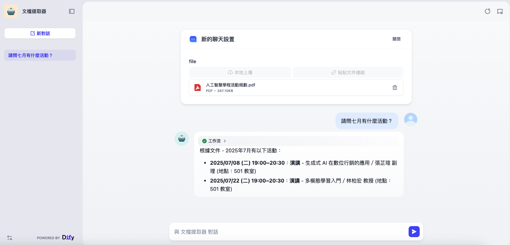
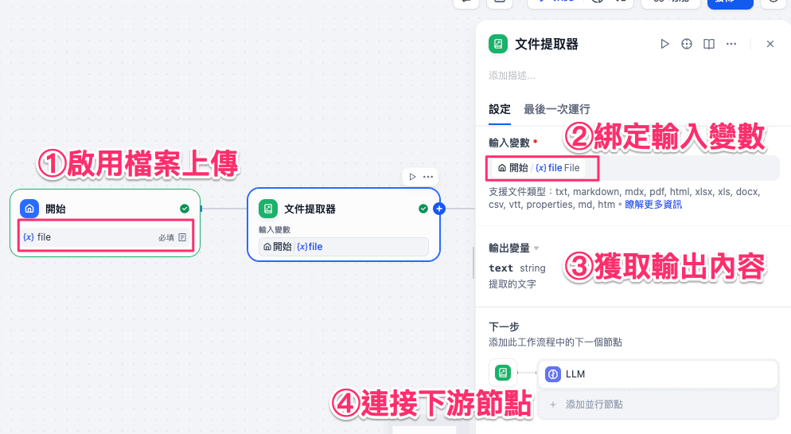
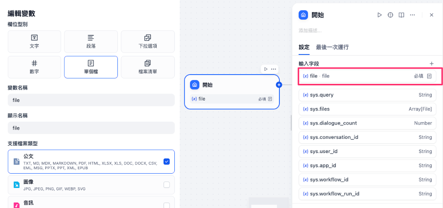
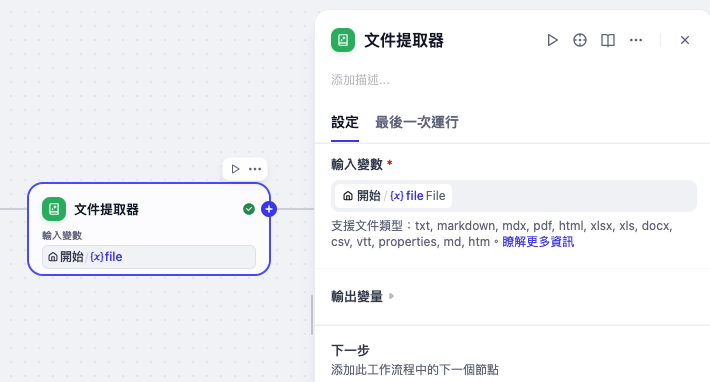
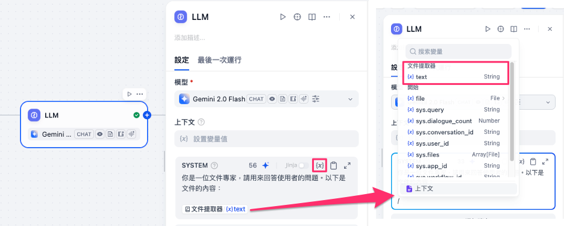
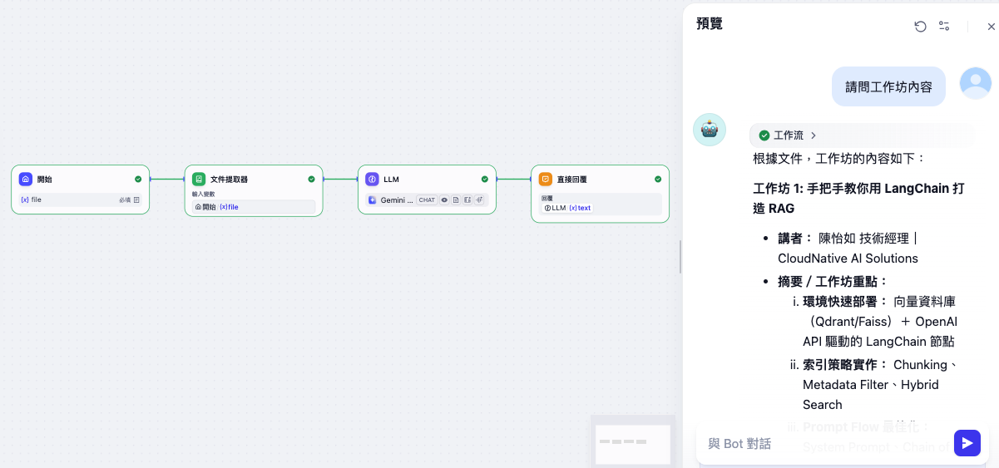

# Dify 工作流基礎：文件提取器

**文件提取器** 是一個能夠從使用者上傳的文件中提取內容的節點。
它依靠內建的檔案解析與轉換機制，將 PDF、DOCX、Markdown、TXT、HTML 等文檔格式轉換為純文字，並輸出為變數，供後續節點（如 LLM、模板轉換器）使用。

常見應用包括：

* 建立類似 **ChatPDF / ChatWord** 的文件問答應用
* 分析、檢查或優化使用者上傳的文檔內容
* 讓 LLM 在推理或生成前，能先獲取檔案的原始資料



---

## 使用方法

在工作流中配置 **文件提取器** 節點時，通常包含以下步驟：

1. **啟用檔案上傳**
   在「開始節點」中新增一個 `File` 或 `Array[File]` 類型的輸入變數，允許使用者上傳文檔。

2. **綁定輸入變數**
   在文件提取器節點中選擇上一步的檔案變數，例如：`pdf` 或 `docx`。

3. **獲取輸出內容**
   文件提取器會將檔案轉換為 `string` 或 `array[string]` 輸出變數（依照輸入而定），例如：`text`。

4. **連接下游節點**
   將 `text` 輸出接到 LLM 節點或模板轉換節點，讓模型能直接使用檔案內容。



---

### 高級設定

* **多文件輸入**：支援一次上傳多個檔案，輸出會以陣列形式提供。
* **結合列表操作器**：多檔輸出時，可搭配「列表操作器」節點逐一處理。
* **格式限制**：僅能處理文字型文檔（TXT、Markdown、PDF、HTML、DOCX），不支援圖片、音訊、影片等。

---

## 實務案例（場景）

以 **ChatPDF 應用** 為例，我們希望讓使用者能上傳 PDF 檔，並透過 LLM 進行內容問答。

### 配置流程：

1. 在「開始節點」中新增 `File` 類型輸入變數並命名為 `pdf`。

    

2. 新增 **文件提取器** 節點，輸入變數設為 `pdf`。

    

3. 新增 **LLM 節點**，在系統提示詞中插入 `{{文件提取器.text}}`。

    

    ```
    你是一位文件專家，請用來回答使用者的問題。以下是文件的內容：

    {{請配置文件提取器的輸出變數}}
    ```

4. 新增 **結束節點**，輸出 LLM 的回答。


### 案例演示：

* 使用者上傳了一份 **活動行事曆 PDF**。
  → 文檔提取器將 PDF 中的活動資訊轉換為文字並輸出。

* 使用者輸入提問的內容
  → LLM 節點接收文檔文字內容後，檢索資訊，並輸出



透過這樣的工作流，**文件提取器** 能自動完成「檔案讀取 → 文字輸出 → 傳遞至 LLM」，大幅提升文件互動型應用的便利性與自動化。
