# Dify Agent 教學：打造一個能思考又能動手的 AI 助理

在上一篇文章，我們已經學會如何在 **[Dify 建立知識庫](knowledge-retrieval.md)**，並以上傳電商常見問題資料，完成了一個 **電商問答知識庫**。今天，我們要更進一步，帶你認識 **Dify Agent**，並實作一個能「懂知識」又能「動手查資料」的小任務。

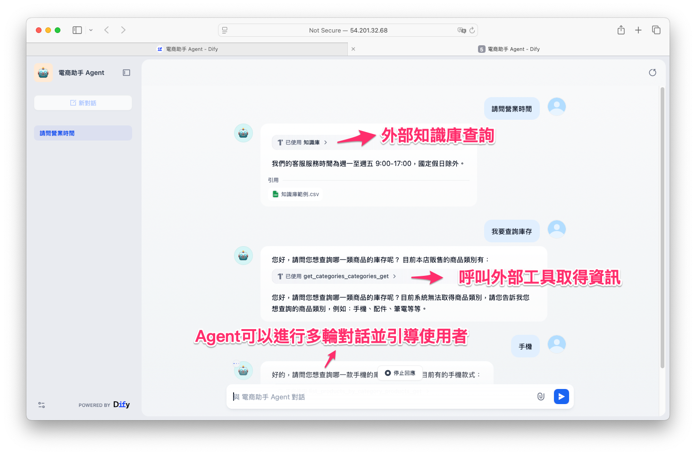

---

## 1. 為什麼要用 Agent？

單純的 RAG（檢索增強生成）可以回答知識，但它沒辦法幫你「執行任務」。
舉個例子：

* RAG 可以回答：「我們的網站支援哪些付款方式？」
* 但 RAG 沒辦法幫你「查詢用戶編號 2 的帳號資料」。

這就是 **Agent 的價值**：它能根據使用者問題，自己判斷是要 **查知識**，還是要 **呼叫工具（API）** 來動手處理。

---

## 2. Dify Agent 的組成

在 Dify 中，一個 Agent 由三個要素組成：

* **LLM**：用來理解問題、做出決策
* **Knowledge Base（知識庫）**：RAG 檢索文件答案
* **Tool（工具）**：讓 Agent 能「動手」，例如呼叫 API、查資料庫

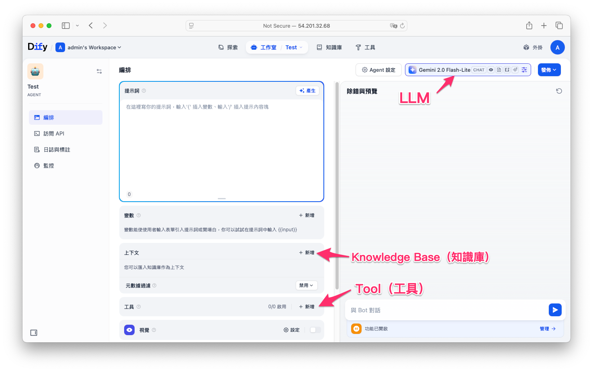

我們今天的任務就是把這三個東西串起來，做一個小型的 **AI 電商助理**。首先進入 Dify 後台 → 左側選單點 「應用（Apps）」 → 右上角 「建立應用（Create App）」。 在建立視窗選 「空白應用（Blank）」，類型選 「Agent」。 輸入應用名稱（例：電商助手 Agent）與說明，按建立。

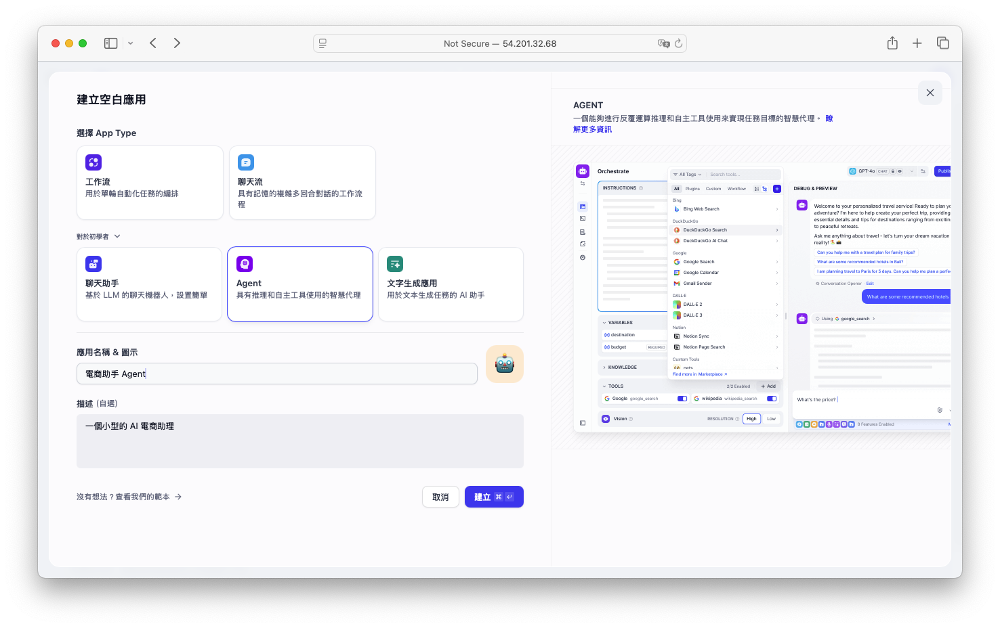

在 Model 區塊中，我們需要選擇一個支援 Tool Calling 的對話模型。這裡以 Google Gemini 為例，它具備 Function Calling 的能力，可以根據需求自動呼叫外部工具。

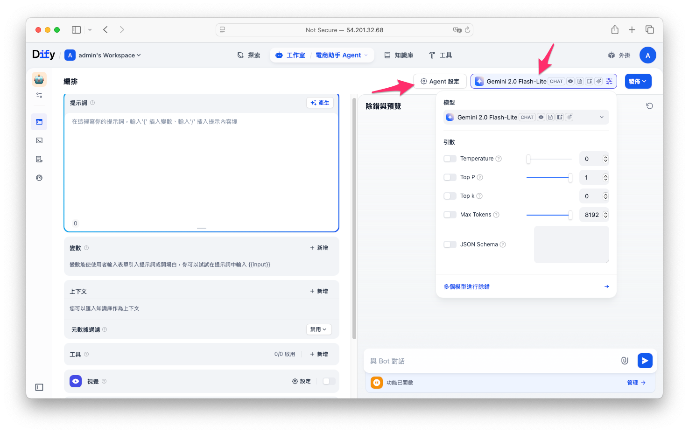

!!! note

        在 Agent 設定 中也能調整 最大迭代次數（Max Iterations）。這個參數決定 Agent 在解決一個問題時，最多允許嘗試多少次「思考與工具呼叫」的循環。預設為 10 次，也就是說如果 Agent 在 10 次內仍無法得到答案，系統就會中止，避免陷入無限迴圈或過度嘗試。

---

## 3. 實作範例任務
接下來我們要完成一個任務：

* 當使用者問「你們網站有支援貨到付款嗎？」 → Agent 要去 **知識庫** 找答案
* 當使用者問「幫我查 user\_id=2 的名字」 → Agent 要去 **API 工具** 查詢

### 3.1 建立一個具有 RAG 問答的 Agent
在 Knowledge / Datasets 區塊點 Add → 直接選擇之前已建好的「[電商問答知識庫](knowledge-retrieval.md)」。接著在**提示詞**欄位輸入以下內容指引Agent。

```
當使用者提問有關電商的QA請先透過外部文件查詢相關資訊。
```

選擇好知識來源後我們就能簡單的測試一下：

   * 問「你們網站可以刷信用卡嗎？」
   * Agent 會從知識庫找到答案 → 「目前我們僅支援信用卡與LINE Pay付款。」


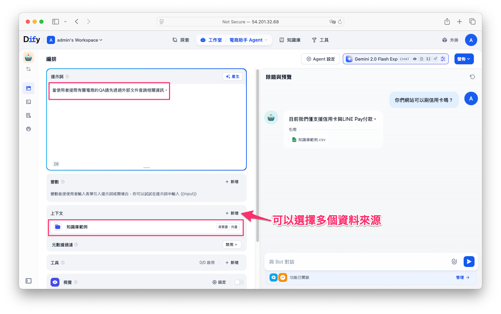

這樣就完成了第一步，讓 Agent 具備 **RAG 問答能力**。

---

### 3.2 讓 Agent 能夠呼叫外部 API

接著，我們要讓 Agent 具備「動手」能力，幫我們查詢用戶資料。我們做一個 商品庫存查詢 API，讓 Agent 能引導客人先看商品類別、再看該類別有哪些商品，或直接用商品名稱查庫存。

#### Step 1. 建立一個簡單的 FastAPI

先寫一個小小的 API 服務，提供商品類別、商品清單與庫存查詢的 API，便於 Agent 工具呼叫。大家可以開啟我事先寫好的 Colab 範例程式。快速部署我事先準備的商品庫存查詢的 API。

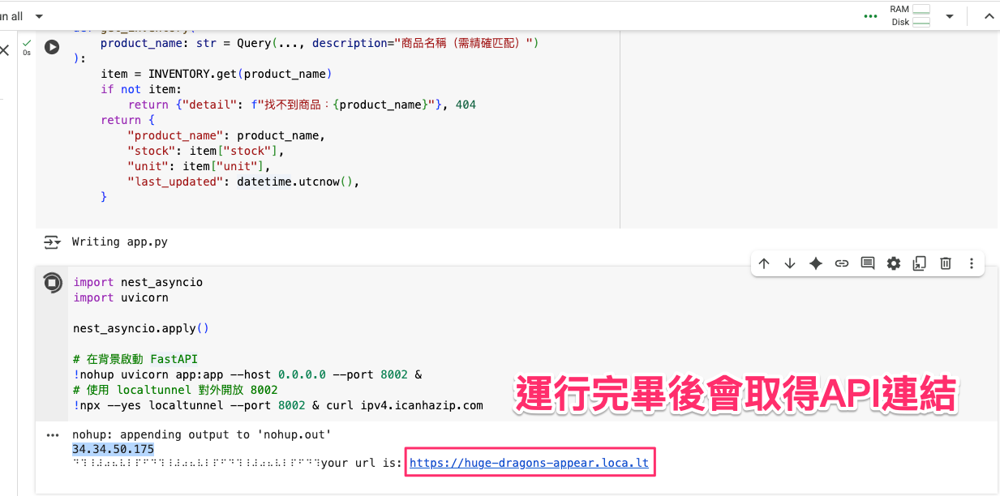

在 Colab 啟動伺服器後會得到一串臨時的 API 連結網址。在此連結後面加上 `/openapi.json` 可以得到 API 的規格(dify設定需要用到)。

```
# 例如：
https://huge-dragons-appear.loca.lt/openapi.json
```

你會看到一坨 JSON Schema。這就是 FastAPI 自動生成的 **OpenAPI 規格**，裡面包含了 API 的路由、參數、回傳格式等等。

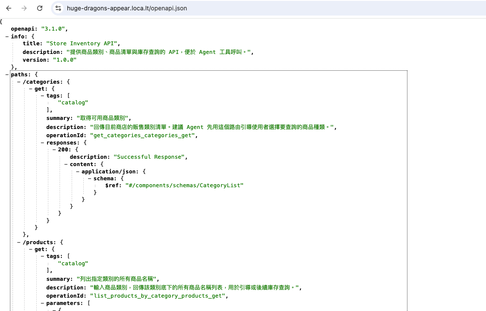

---

#### Step 2. 在 Dify 新增自定義工具
接著此步驟要把剛剛建立的 API URL 與 OpenAPI 規格匯入 Dify（建立自訂工具）。

1. 進入 **Dify 後台 → 工具（Tools） → 建立自定義工具**

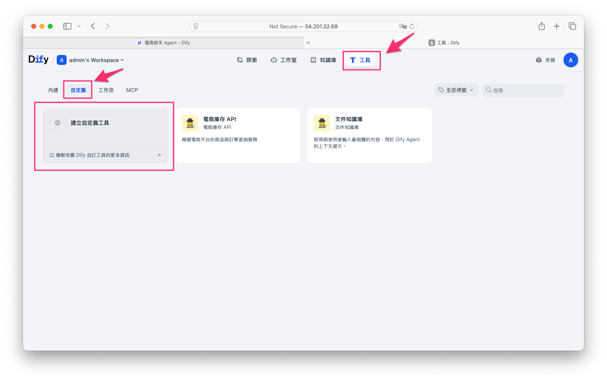

2. 選擇 **OpenAPI** 匯入方式，將 `http://xxx/openapi.json` 的內容貼上

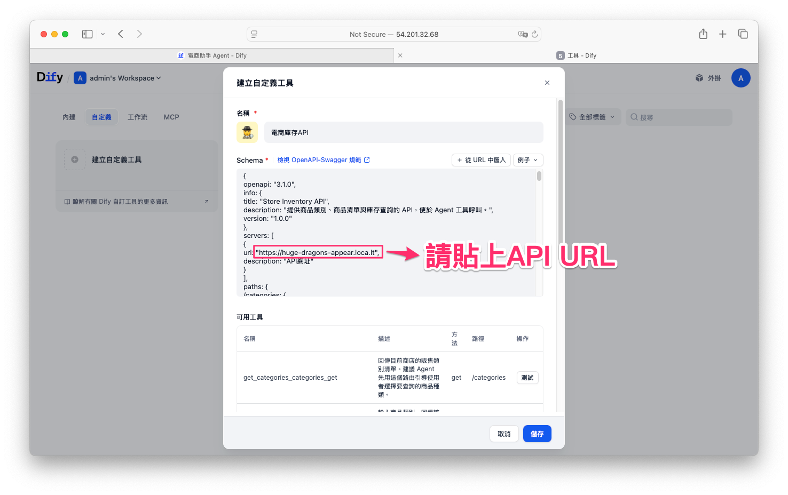

> 同時記住要在 servers 的 URL 替換成你自己的伺服器位置。

設定完成後可以點選測試呼叫看看 API 是否能成功的呼叫 FastAPI 的結果。

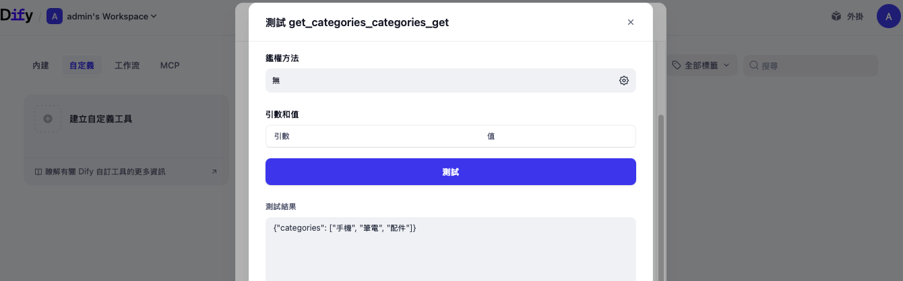


3. 儲存後，回到 Agent 設定你會在「可用工具」看到：

   * 提供可用商品類別
   * 依類別列出商品名稱
   * 直接查商品庫存

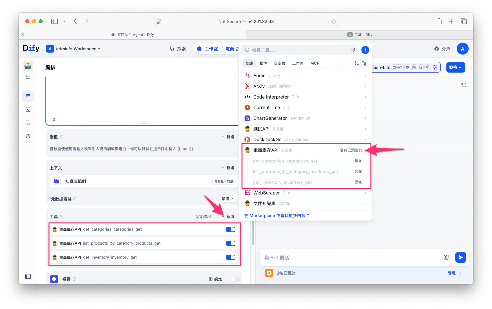

> 這三個工具的參數與描述都來自你的 FastAPI 程式碼，因此 **Function Calling / Tool Calling** 的模型（如 Google Gemini）能自動理解何時呼叫、要帶哪些參數。

建議的系統提示詞 (System Prompt)。

```
你是電商客服 Agent，回覆使用繁體中文。

【決策規則】
1) 只要是電商常見問答（付款、發票、退換貨、配送、保固、門市、會員/點數、活動）→ 一律先用知識庫（RAG）檢索外部文件後作答。
2) 檢索未命中或信心不足 → 明確說明當前系統無法解決您的問題。
3) 需要即時/動態資訊（商品、庫存）→ 使用工具，不得臆測。
   - 未指定任何資訊時**一律先呼叫** GET /categories 提示可選類別。
   - 無此商品時請呼叫 GET /categories 提示可選類別
   - 若使用者提供類別但未指商品 → 呼叫 GET /products?category=… 列出清單並引導再選。
   - 已指定商品 → 呼叫 GET /inventory?product_name=… 回覆「數量＋單位」。
4) 同時包含政策＋庫存的問題 → 先用 RAG 說明政策，再呼叫工具查庫存，合併回覆。
```

---

!!! note

        ### 🔎 補充：什麼是 Function Calling？

        要讓 LLM 能「看懂問題」並且「知道該呼叫哪個工具」，核心關鍵就是 **Function Calling（函數調用）** 技術。

        Function Calling 的流程可以簡單理解為四個步驟：

        1. **用戶提示**：使用者輸入自然語言，例如「查詢 iPhone 15 的庫存」。
        2. **函數觸發**：LLM 解析語意，判斷這需要呼叫 `get_inventory(product_name)` 這個函數。
        3. **函數執行**：LLM 不是直接回答，而是生成一段 JSON 物件，例如：

        ```json
        {
            "name": "get_inventory",
            "arguments": { "product_name": "iPhone 15" }
        }
        ```

        系統會依據這段 JSON 去執行對應的 API。
        4. **響應交付**：API 回傳查詢結果（如「庫存 12 台」），LLM 再把結果轉換成自然語言回覆給使用者。

        這樣，LLM 不僅能回答知識庫的靜態內容，還能 **即時呼叫外部工具或 API**，完成各種動態任務。

        常見應用場景包含：

        * **查詢即時數據**：像「現在台北天氣如何？」會被轉換成 `get_weather(location="Taipei")`。
        * **資料抽取與標註**：例如從文章中提取人名，轉換成 `extract_entities(type="person")`。
        * **資料庫/系統操作**：自然語言指令直接轉為 API 或 SQL 呼叫，例如「幫我查 user\_id=2 的姓名」。

        👉 簡單來說，**Function Calling 就是 LLM 與外部世界的橋樑**：
        它讓文字對話能自動轉換成程式呼叫，進而完成超越文字回答的功能。


---

#### Step 3. 測試 Agent 呼叫 API

現在我們回到 Agent 的除錯與預覽，重新測試：

* 問：「查詢商品庫存」
* Agent 會自己判斷要呼叫工具並近一步的詢問類別和產品名稱，最終回答該商品的庫存量

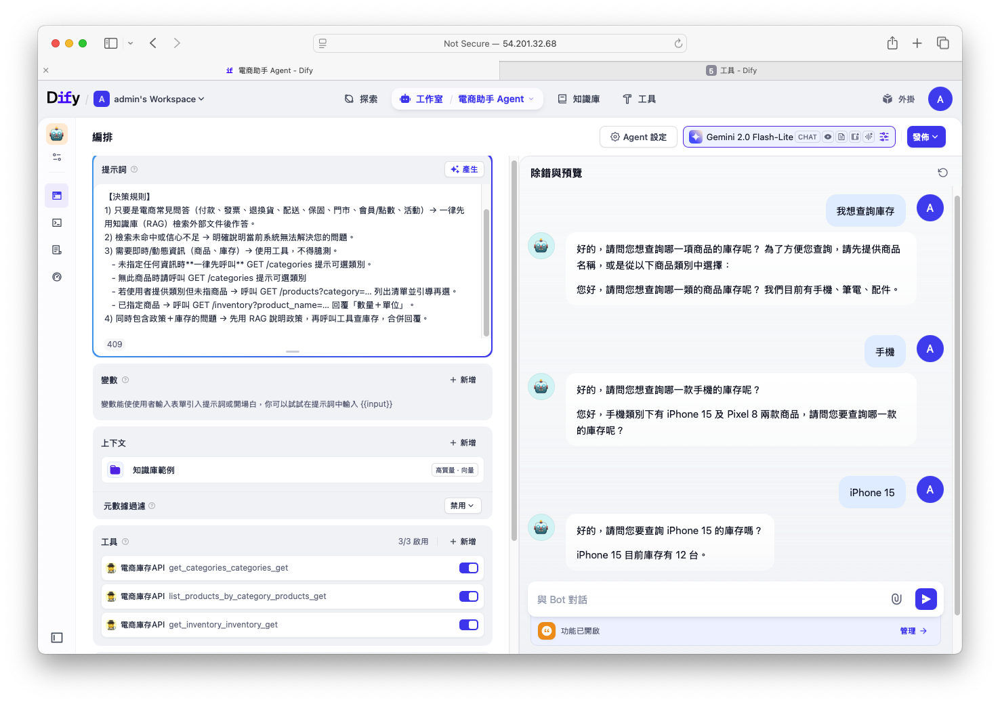

試著同時提出兩個問題，看看 Agent 會怎麼回應。從結果可以發現，它會嘗試去推測問題的意思，並且給出引導。

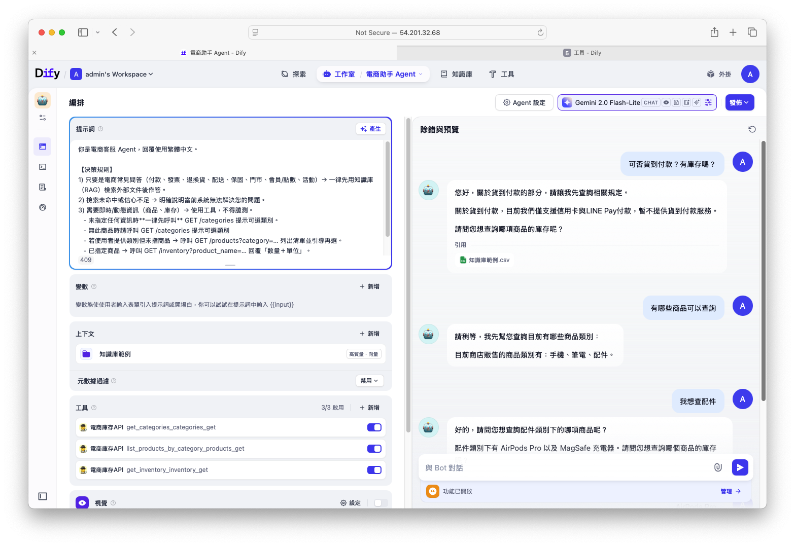

## 4. 發佈專案
當你完成所有設定後，點選右上角的藍色「發佈」按鈕，選擇「發佈更新」，即可讓應用正式啟用。

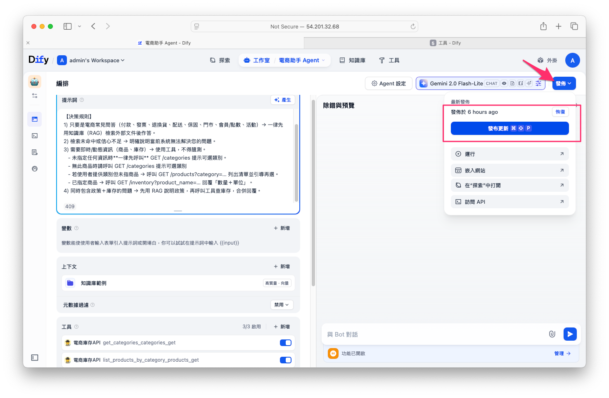

---

## 5. 總結

到這裡，我們完成了一個結合 **知識庫 + API 工具** 的 Dify Agent：

* 知識問答 → 查知識庫
* 資料查詢 → 呼叫 API

這樣的架構可以延伸到很多場景：

* 客服機器人：結合知識庫 + CRM API
* 工業 PdM：結合知識庫 + 即時感測數據 API
* 文件助理：結合知識庫 + Excel/DB 操作


## 後記補充
在本文示範中，我是用 **Python + FastAPI** 來快速建立一個範例 API。但實務上，你的 API **不一定要使用 FastAPI** —— 不管是 **Node.js (Express)**、**Java (Spring Boot)**、**Go (Gin)**，甚至現成的第三方服務，只要它能輸出或對應到 **OpenAPI 規格**，就可以直接匯入 Dify 的自定義工具。

如果你的 API 並沒有現成的 OpenAPI 文件，也不用擔心。OpenAI 很貼心地推出了一個專門協助撰寫 **OpenAPI Schema (YAML)** 的小幫手[ActionsGPT](https://chatgpt.com/g/g-TYEliDU6A-actionsgpt)。

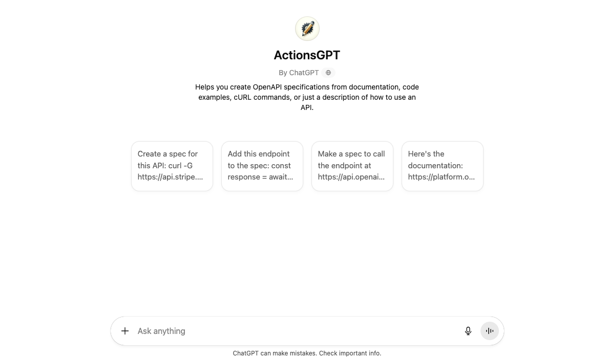

實務上，我會直接把我的 API 程式碼或功能描述丟給這個機器人，請它幫我產生一個完整的 **OpenAPI YAML** 文件。只要生成出來的 YAML 或 JSON 符合 OpenAPI 規格，就能被 Dify 接受。

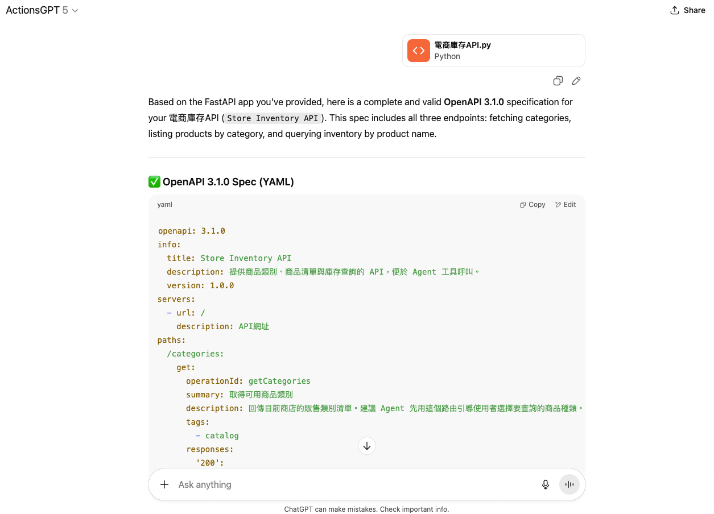

也就是說，不論你用什麼語言或框架來寫 API，只要最後能拿到一份符合 **OpenAPI Spec** 的 JSON 或 YAML，就能順利整合進 Dify Agent。
