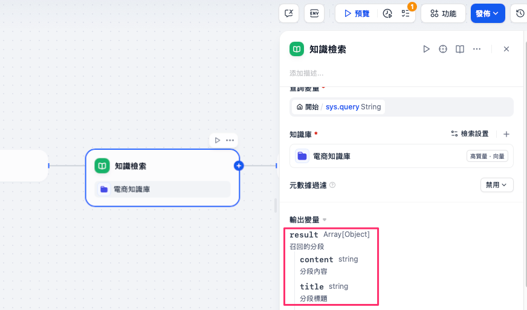
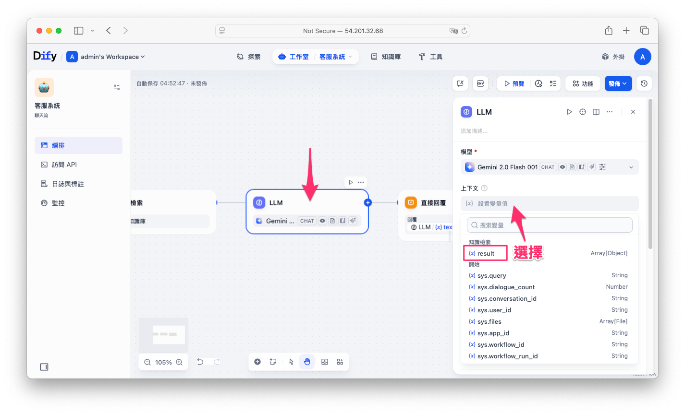
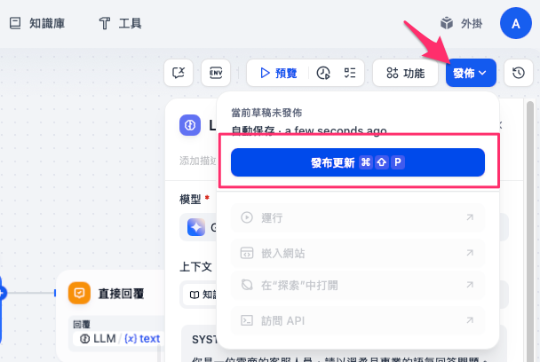
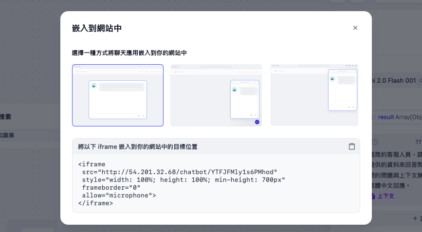

# 使用 Dify 工作流打造 RAG AI 客服系統

在現今 AI 技術蓬勃發展的時代，建立一個高效的 AI 客服系統不再需要龐大的預算與人力開發。本文將帶你一步步實作，如何透過 [Dify](https://dify.ai) 的「**工作流功能**」結合知識庫，快速打造出一套具有 RAG（Retrieval-Augmented Generation）能力的智能客服系統，能有效回答使用者問題、導引後續行動，並提供如真人般的對話體驗。

---

## 為什麼選擇 Dify 建置 AI 客服？

傳統客服系統不僅昂貴，維護與訓練人員更是一大挑戰。而 Dify 提供了低門檻、強大且彈性的解決方案，具備以下優勢：

* 具備 **聊天記憶**，可追蹤上下文
* 支援 **知識庫問答**，實現 RAG 檢索增強生成
* 視覺化流程設計介面，無需寫程式
* 可客製化嵌入網站或串接 API
* 可整合多模態模型（如圖片與文字）

---

## 建立 RAG 客服流程

### 1. 建立知識庫（Knowledge）

在建立客服系統前，需先完成「知識庫」準備：

1. 登入 Dify 後台 → 點選上方選單的「知識庫」。
2. 點選「新增知識庫」，上傳你已整理好的常見問答內容（建議使用 `.csv` 或 `.pdf` 格式）。
3. 完成後，Dify 會將資料轉為向量並儲存於內部向量資料庫。

!!! note

        - 詳細的知識庫建立可以參考另一篇完整的教學指引：[使用 Dify 打造 AI 客服知識庫](./knowledge-retrieval.md)
        - 知識庫可持續更新與精修，透過使用者回饋（Like / Dislike）進行優化。

---

### 2. 建立新的應用（Application）

1. 回到主選單，點選「建立空白應用」，新增一個空白應用。
2. 選擇「聊天流」類型。
3. 命名為「客服系統」後建立應用。


---

### 3. 編排客服的工作流程（Workflow）

進入應用編輯畫面後：

#### ➤ 預設流程說明：

* 一開始會有三個節點：Start → LLM 模型 → Response

#### ➤ 加入知識庫檢索節點：

1. 點選流程圖中的「＋」新增一個節點。
2. 選擇「知識檢索」模組。

    

3. 從下拉選單中選取已建立的知識庫。

    若還沒建立知識庫可以先參考：[使用 Dify 打造 AI 客服知識庫](./knowledge-retrieval.md)

    

4. 系統會自動產生 `result` 陣列變數，代表匹配到的內容。

    


#### ➤ 修改 LLM 輸入上下文：

1. 點選 LLM 節點。
2. 在「上下文變數」欄位加入 `{{result}}`，讓大語言模型接收知識庫回傳的資料。

    

3. 在「提示詞（Prompt）」中加入客服專屬語氣，例如：

   ```
    你是一位電商的客服人員，請以溫柔且專業的語氣回答問題。
    根據以下提供的資料來回答問題，請務必根據上下文內容作答。
    若提問的問題與上下文無關，則用緩和語氣與客人互動。全程使用繁體中文回應。
    上下文: {{#context#}}
   ```


---

### 4. 開啟記憶功能（Context Memory）

為了讓客服對話能有上下文關聯：

* 打開「記憶開關」。
* 建議設定記憶長度為 10 次對話（避免 prompt 太大送不出去）。
* 可支援多輪提問，讓使用者體驗更自然流暢。


---

### 5. 發佈專案

當你完成所有設定後，點選右上角的藍色「發佈」按鈕，選擇「發佈更新」，即可讓應用正式啟用。



專案建置完成後，你可以透過以下三種方式將客服系統嵌入網站，或與外部系統整合使用：

#### ➤ 運行

這是 Dify 內建的聊天視窗，系統會提供一組專屬網址，你可以將此連結直接分享給朋友或同事，立即體驗 AI 客服。


#### ➤ iframe 嵌入

若你希望將客服系統整合至公司網站：

* 點選應用 →「運行方式」→ 選擇 **iframe** 嵌入程式碼，即可將客服聊天框嵌入網頁中。



#### ➤ API 串接

若你需要完全自訂使用者介面（UI）：

* Dify 提供完整的 **API Endpoint**，讓你只取回模型的回答內容，自行建構前端聊天畫面，實現更彈性化的整合應用。


---


## 總結

透過 Dify 的 **工作流 + 知識庫 + 記憶功能**，您可以在短短十分鐘內完成一個具有 RAG 架構的 AI 客服系統，具備：

- 多輪對話
- 知識檢索回應
- 調整System prompt設計專屬的機器人
- 可客製化嵌入網站或系統串接

這樣的系統若委外開發往往動輒數十萬，而透過 Dify，能以最低成本、最快速度完成部署。[下一篇](./workflow-rag-chatbot-tutorial-2.md)，我們將說明一些進階的設定讓我們的聊天機器人更加專業。