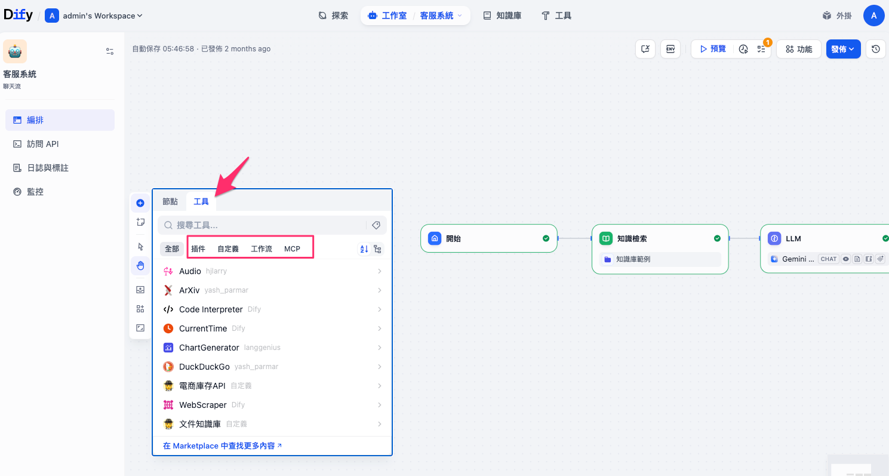
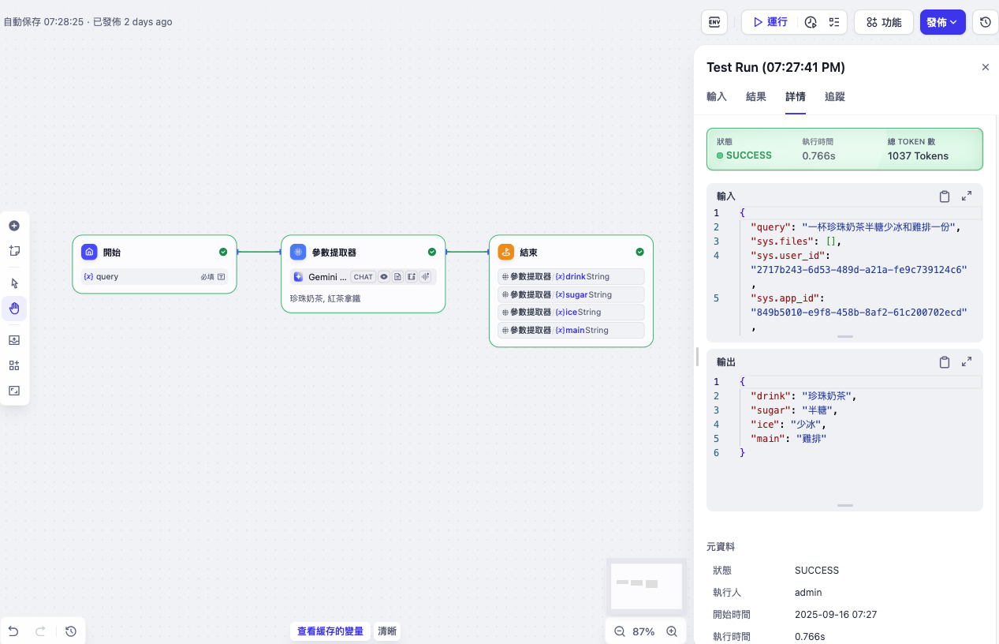
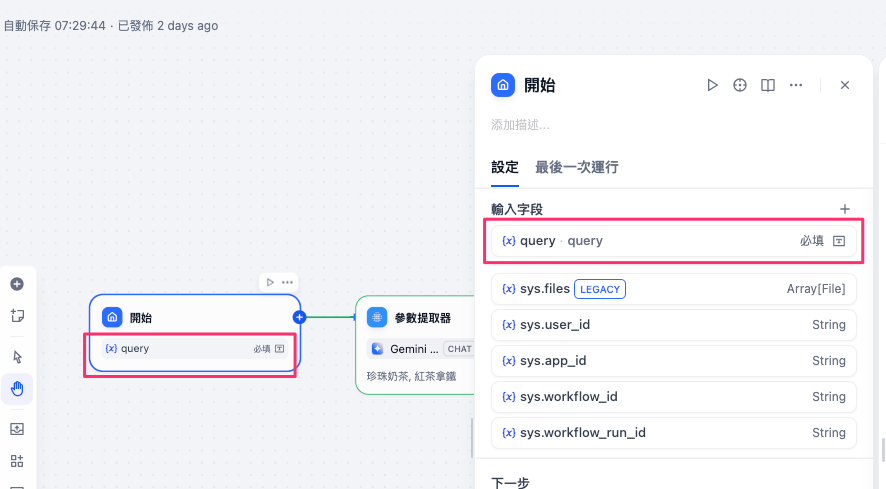
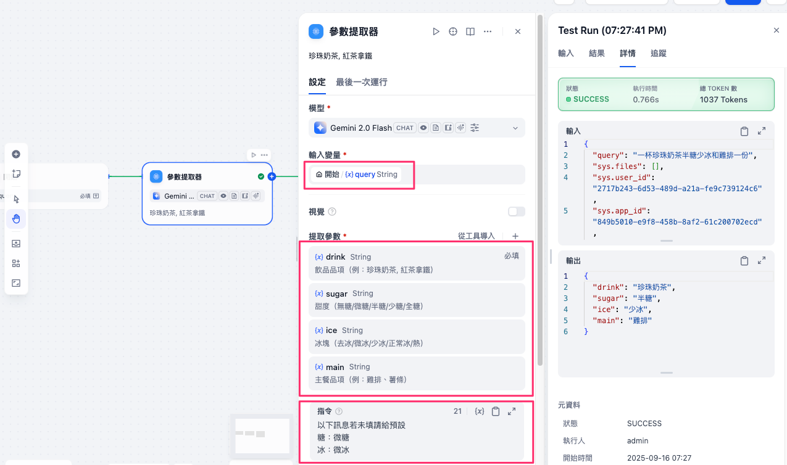
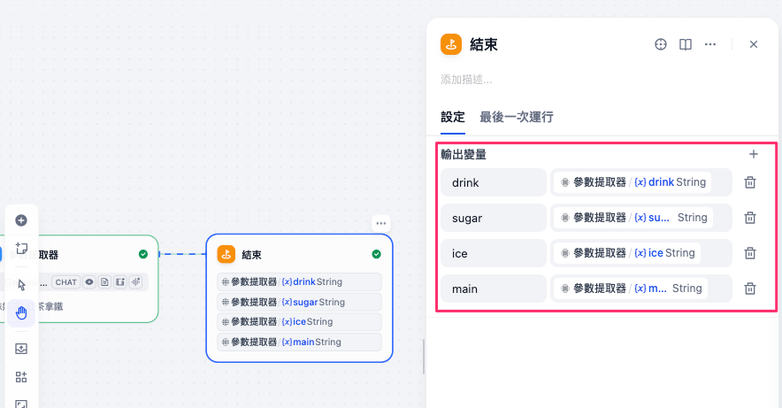
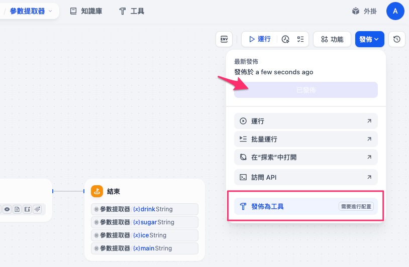

# Dify 自定義工具介紹：以「工作流發布成工具」為例

在 AI 開發與自動化應用中，**工具（Tool）** 的角色越來越重要。Dify 不只是一個能做 RAG（檢索增強生成）的平台，它更進一步提供了多種「工具化」的方式，讓你能快速重複利用既有的邏輯、串接外部 API，甚至做到跨系統的整合實現更聰明的Agent。

---

## Dify 的四種工具類型

目前在 Dify 中，「工具」大致分成四種：

| 類型                               | 特點                                             | 適合情境            |
| -------------------------------- | ---------------------------------------------- | --------------- |
| **插件 (Plugin / Marketplace)**    | 從 Dify Marketplace 安裝現成套件，一個插件可含多個工具           | 通用功能、快速上線       |
| **自定義工具 (Custom Tool)**          | 自寫 API，用 OpenAPI/Swagger 或 ChatGPT Plugin 規格匯入 | 串接內外部系統、進階邏輯    |
| **工作流發布成工具 (Workflow as Tool)**  | 將 Dify 視覺化工作流直接包裝成可重用工具                        | 問題分類器、HTTP 節點封裝 |
| **MCP (Model Context Protocol)** | 雙向協定，可呼叫外部 MCP 工具，也能把 Dify 工具/工作流曝露出去          | 系統互通、跨生態整合      |



這些模式不是互斥的，反而可以互補使用。例如：你可以先寫一個 API → 匯入成自定義工具 → 在工作流中組合成更大的邏輯 → 再把工作流發佈成工具 → 甚至用 MCP 共享出去。

---

## 為什麼需要「工作流發布成工具」？

在日常設計 Dify 流程時，我們經常會遇到一些**重複出現的邏輯**，例如：

* 參數／欄位提取（把自然語言轉成 API 入參）
* 呼叫外部 API（HTTP Node）
* 固定的分類器（如 FAQ 問題類別判斷）

如果每次設計流程都要手動重建這些節點，會非常耗時。
這時候，就可以利用「工作流發布成工具」，把常用邏輯封裝成一個可重複呼叫的工具節點。

---

## 教學實作：將工作流發佈為工具（參數提取器｜點餐範例）

**目標**：從一句自然語言點餐（例：「一杯去冰少糖的珍奶和一份雞排」），**自動抽出結構化參數**：飲品 `drink`、甜度 `sugar`、冰塊 `ice`、主餐 `main`。完成後把流程 **發布為工具 (Workflow as Tool)**，在其他專案重用。



> 提醒：**指令（Prompt）不是必填**。不寫也能抽取；但**建議填入一小段提示**，可規範可接受選項、並在缺漏時**自動補預設值**，穩定度會更好。

---

### 1. 建立一個工作流

1. 新建工作流應用；在 **開始(Start)** 節點保留 `query`（型別建議：段落）。



2. 新增 **LLM 節點**並命名「**參數提取器**」；模型可用 *Gemini 2.0 Flash (CHAT)*（或任一支援結構化輸出的模型）。
3. 在節點的 **輸入變量** 指向 `{{sys.query}}`。
4. 展開 **提取參數**，新增下列欄位（也是節點輸出變數）：

   * `drink`｜String｜**可設為必填**｜飲品品項（例：珍珠奶茶、紅茶拿鐵）
   * `sugar`｜String｜選填｜甜度（無糖/微糖/半糖/少糖/全糖）
   * `ice`｜String｜選填｜冰塊（去冰/微冰/少冰/正常冰/熱）
   * `main`｜String｜選填｜主餐品項（例：雞排、薯條）
5. **（選填）指令**—建議貼上這段 Minimal Prompt 以便補預設值：

   ```
    以下訊息若未填請給預設
    糖：微糖
    冰：微冰
   ```



6. 加一個 **結束(Output)** 節點，將 `drink/sugar/ice/main` 映射出去。



7. 測試：輸入「一杯去冰少糖的珍奶和一份雞排」 → 預期 `drink=珍珠奶茶`、`sugar=少糖`、`ice=去冰`、`main=雞排`。
   若未提及甜度/冰塊，依上方 Prompt 將自動補：`sugar=微糖`、`ice=微冰`。


---

### 2. 發布為工具

1. 右上角 **「發布」 → 「發布為工具」**。
2. 名稱：**Parameter Extractor（點餐）**；描述清楚輸入/輸出與預設值策略。
3. 儲存後，工具會出現在 **工具 → 工作流** 分頁，可於其他專案直接插入。



> 請記得先點選發布更新才能發佈為工具

---

### 3. 在新流程中使用工具

1. 在任一新流程，插入 **工具節點** → 選 **Parameter Extractor（點餐）**。
2. 將使用者訊息接到 `sys.query`。
3. 後續串接方式：

   * 直接把四個變數回傳；或
   * 以 **HTTP 節點** 呼叫點餐 API；或
   * 用 **Code 節點** 做規格化映射（例如把「微糖」轉為 `light`）。

（選用）規格化映射小片段：

```python
mapping_sugar = {"無糖":"no_sugar","微糖":"light","半糖":"half","少糖":"less","全糖":"full"}
mapping_ice   = {"去冰":"no_ice","微冰":"light_ice","少冰":"less_ice","正常冰":"regular_ice","熱":"hot"}
outputs = {
  "drink_std": inputs["drink"],
  "sugar_std": mapping_sugar.get(inputs.get("sugar","微糖"), "light"),
  "ice_std":   mapping_ice.get(inputs.get("ice","微冰"), "light_ice"),
  "main_std":  inputs.get("main","")
}
```


## 🎯 小結

Dify 工具的設計哲學是「讓流程更模組化、可重用」。
而「工作流發布成工具」則是最貼近日常需求的用法：

* 把常用邏輯封裝起來，避免重複建構
* 讓複雜的流程模組化，降低設計門檻
* 在不同專案間快速複用

下一步，你可以試著把自己最常用的節點邏輯（例如 API 呼叫、分類器、資料前處理）抽出來，封裝成工具，讓你的 Dify 流程設計更高效。
