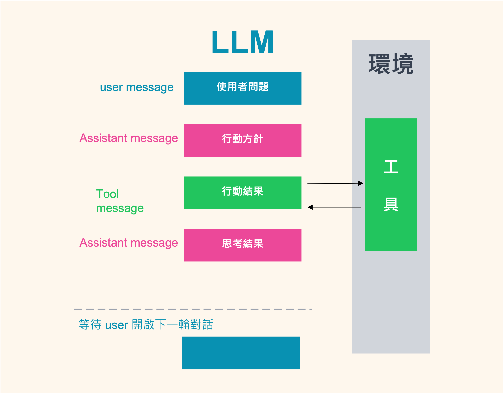
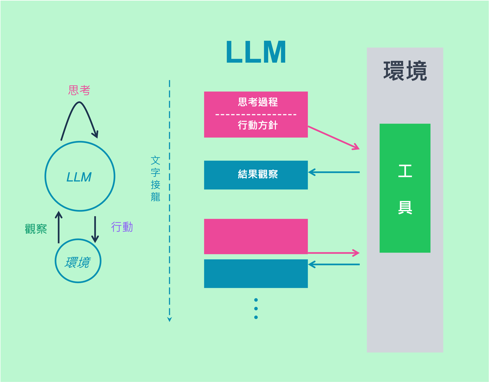

# Dify Agent：Function Calling vs. ReAct 差異

Dify 的 Agent 目前提供兩種「推理／工具使用」模式：**Function Calling** 與 **ReAct**。你的 LLM 只要支援其中一種，就能在 Agent 裡正常運作；官方文件與部落格均明確說明這兩種是內建策略，且可在介面中切換。

---

## 1. 什麼是 Function Calling？

**觀念**

Function Calling 是「**由 LLM 直接產出要呼叫的函式名稱與 JSON 參數**」，Agent 依此呼叫工具（API）並把回傳結果給模型生成答案。因為輸出結構化、可解析，**參數抽取最穩定**、可預測性高。Dify 官方也指出：支援 Function Calling 的模型（如多數主流供應商與 OpenAI 相容 API）在 Agent 任務上表現通常更穩、更一致。



* **Tool Use / Function Calling**：
  LLM 直接輸出 `{"name":"函式名","arguments":{…}}` → Agent 執行工具 → 回傳結果 → 生成答案。

**適用時機？**

* API 與參數都很明確（查庫存、下訂單、計算運費、查時程…）。
* 你想要**高成功率與固定路徑**，而非探索式推理。
* 你使用的模型原生支援 Function Calling（選型時留意供應商清單標示）。


## 2. 什麼是 ReAct（Reason + Act）？

**觀念**
ReAct 是把「**思考→行動（調工具）→觀察（讀結果）**」的迭代流程交給 LLM。模型不需原生支援 Function Calling，Agent 透過提示工程把每一步串起來。這種作法**較通用、可探索**，能處理「路徑不確定、多步驟」的任務，並在過程中根據觀察修正策略。其核心理念來自學術工作 *ReAct: Synergizing Reasoning and Acting in Language Models*。



* **ReAct**：
  LLM 先**思考**要做什麼 → **行動**用哪個工具與參數 → **觀察**結果 → 再思考下一步；可能重複多輪，直到達成目標。
  （像「模型邊走邊看、遇到狀況就修正路線」。）([arXiv](https://arxiv.org/abs/2210.03629?utm_source=chatgpt.com)) 

**適用時機？**

* 需要「先探路再決定下一步」的任務（例如先找門市→再查庫存→再比價）。
* 你的模型**不支援** Function Calling。
* 你希望**保留過程可解釋性**（觀測到什麼、為何改變行動）。

---

## 3. 兩種方法比較

| 面向      | Function Calling           | ReAct                          |
| ------- | -------------------------- | ------------------------------ |
| 輸出形式    | 由 LLM 產出 **函式名 + JSON 參數** | 由 LLM 產出 **思考 / 行動 / 觀察** 多輪軌跡 |
| 強項      | 穩定、效率高、可預測                 | 通用、可探索、可解釋                     |
| 代價      | 需模型原生支援 Function Calling   | 多輪推理，耗時與 Token 成本較高            |
| 適合任務    | 已知流程、API 參數明確              | 路徑不確定、多步驟、需邊做邊判斷               |
| Dify 支援 | 內建策略、介面可切換；多家供應商支援         | 內建策略、介面可切換；不依賴模型原生 FC          |

> 在 Dify 介面中，你可於 **Agent/節點設定 → Agent Strategy** 直接切換 Function Calling 或 ReAct；若看不到，記得到 Marketplace 安裝對應策略。

## 4. 同一任務兩種方法剖析（查商品庫存）

**任務敘述**
使用者問：「幫我查 **iPhone 15** 在**台北門市**的現貨量，不足就推薦**同等價位替代品**。」

### A. Function Calling 版（一次就定位）

1. **User**：「查 iPhone 15 台北門市庫存，不夠就推薦替代品。」
2. **LLM（輸出工具呼叫）**：

   ```json
   {
     "name": "get_inventory",
     "arguments": { "sku": "iphone-15", "city": "台北" }
   }
   ```
3. **Agent** 呼叫 `get_inventory` → 得：

   ```json
   { "sku":"iphone-15", "city":"台北", "stock": 2 }
   ```
4. **LLM（再次輸出工具呼叫，串第二支 API）**：

   ```json
   {
     "name": "get_alternatives",
     "arguments": { "price_band": "24000-28000", "city": "台北" }
   }
   ```
5. **Agent** 呼叫 `get_alternatives` → 得 3 款備選
6. **LLM（最終回答）**：
   「台北現貨 2 台，若不足可考慮 A/B/C。」

> **注意**：Function Calling 以**結構化 JSON** 形式「點名工具＋帶參數」，幾乎不會偏題；適合 SOP 明確的商務流程（查、比、推）。

---

### B. ReAct 版（邊查邊調整）

1. **Think**：不確定「台北門市」是信義或南西，先找最近門市。
   **Act**：`geocode_city("台北")` → **Obs**：回傳行政區中心點
2. **Think**：用經緯度範圍查附近門市清單
   **Act**：`list_stores_nearby(lat, lon, radius=8km)` → **Obs**：回 5 間
3. **Think**：逐間查 iPhone 15 庫存，統計總數與單店分布
   **Act**：`get_inventory(sku="iphone-15", store_id)`（多次） → **Obs**：總量不足
4. **Think**：依 iPhone 15 定價推得價位帶，查同價位替代品
   **Act**：`get_alternatives(price_band="24000-28000", city="台北")` → **Obs**：A/B/C
5. **Final**：彙整回答與建議到單一回覆

> **注意**：ReAct 允許模型根據**中途觀察**改變路徑（先找店→再查庫存→再推替代品），但會多幾輪互動、增加時延與 Token 成本；適合需要**探索與調整**的任務。

---

## 5. 小結

1. **能用 Function Calling 就先用它**：最穩定、最省 Token、最好維運；多數主流供應商（OpenAI、Azure OpenAI、Gemini、Anthropic…）都能以 FC 方式整合。
2. **需要探索、多步驟、或模型不支援 FC**：改用 **ReAct**，並設定**最大迭代數**與**觀察訊息長度**，避免「思考過長」。
3. **介面操作**：到 **Agent/節點設定 → Agent Strategy** 切換模式；若找不到 ReAct，前往 **Marketplace → Agent Strategies** 安裝。

### Function Calling

* **用 JSON Schema 清楚定義參數**（型別、單位、必要／可選），提高參數填寫成功率。
* **錯誤回傳要可讀**（例如「price\_band 應為 'min-max'」），讓模型能重試正確參數。
* **多工具串接**可放在工作流內做「輸入/輸出映射」，減少 LLM 重複抽取。
  （這條路線對商業流程最可預測、最容易治理。）

### ReAct

* **限制最大循環數與超時**，避免「無限思考」。
* **讓工具輸出精簡**（只回必要字段），降低填塞到 Prompt 的負擔。
* **保留推理軌跡**（思考、行動、觀察），便於教學、示範與除錯。
  （這些原則與 ReAct 的研究結論一致：強調可解釋、可調整，但需控管成本。）
