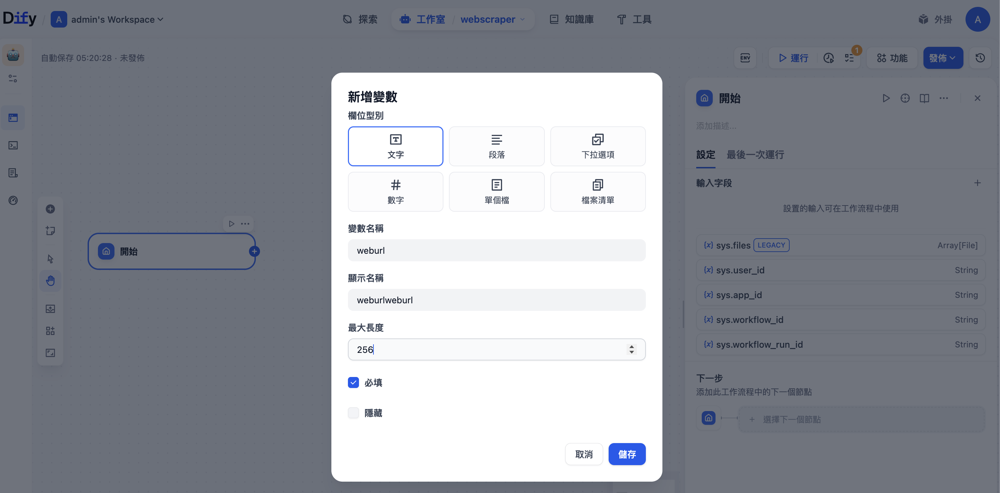
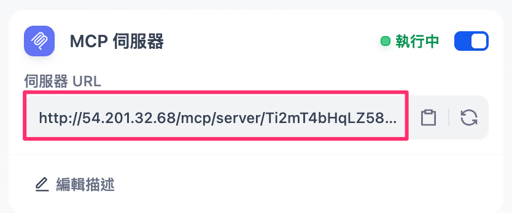
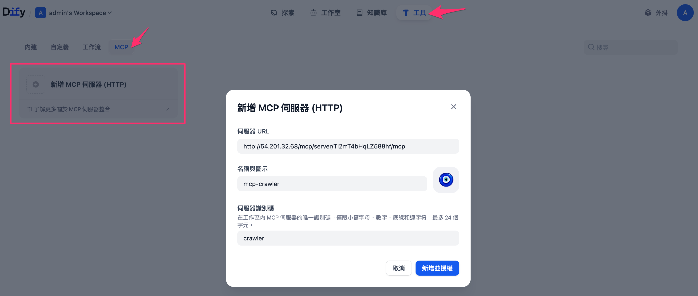
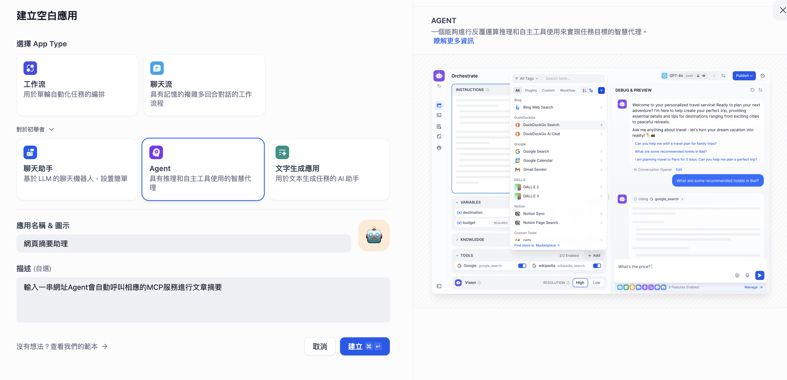
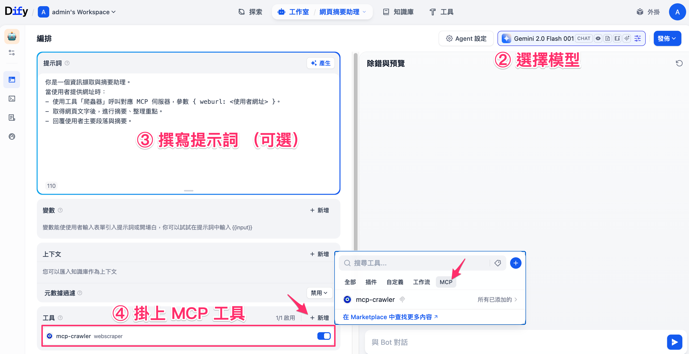
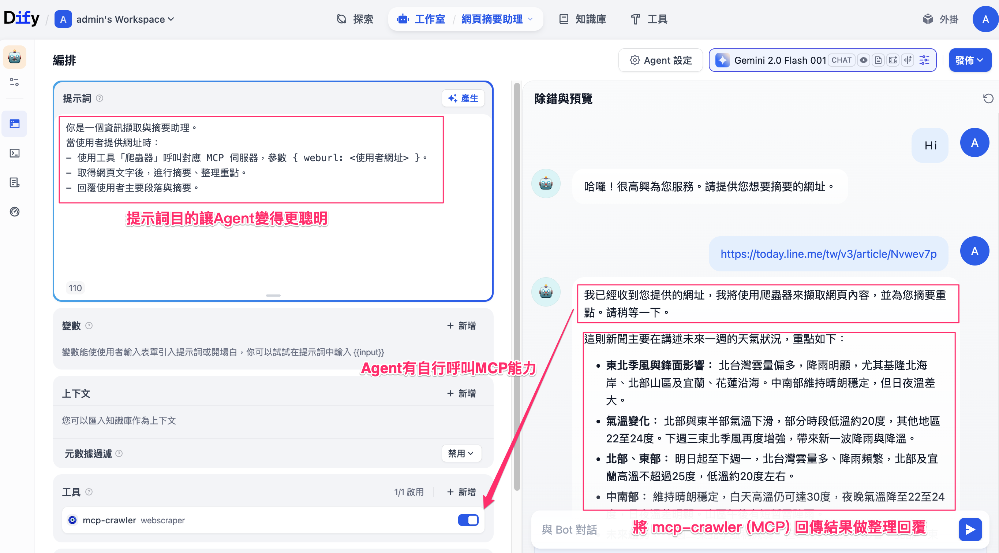

# 在 Dify 建立自己的 MCP Server：讓 Agent 自動呼叫工作流工具
在 Dify 中，我們不僅可以建立自訂工作流（Workflow），還能進一步把這些流程「封裝」成 **MCP Server（Model Context Protocol Server）**，讓 **Agent 能自動呼叫這些工作流作為工具**。
這篇文章將一步步帶你完成以下四個目標：

1. 建立一個 Dify 工作流（範例：「網頁爬蟲」）
2. 將該工作流封裝成 MCP Server
3. 在 Dify → 工具 → MCP → 新增 MCP 伺服器 (HTTP)
4. 建立一個 Agent，讓它能自動以工具方式呼叫 MCP Endpoint

---

## 什麼是 MCP（Model Context Protocol）?
**MCP（Model Context Protocol）** 是一種讓 LLM Agent 能夠「自動發現」與「使用」外部服務的通訊協定。
過去我們想讓 Agent 呼叫外部 API，必須手動撰寫 OpenAPI 文件、定義 schema；
但透過 MCP，Dify 能自動識別伺服器上提供的工具，快速整合並使用它們。

MCP 的最大優點：

* 不需手動提供 OpenAPI 描述
* 自動同步工具名稱與參數
* 即插即用：MCP Server 啟動後，Agent 可立即呼叫

---

## 建立工作流範例：「網頁爬蟲」

### 1. 建立新工作流

在 Dify 的工作室中點擊「建立新工作流」，命名為「**webscraper**」。


!!! note

    由於 Gemini 對工具與節點名稱有命名規範，
    建議在建立工作流時使用 英文命名（例如 webscraper、crawler_flow），
    以避免後續發生「Invalid function name」或格式錯誤。

### 2. 建立節點
整個流程非常簡單，僅需三個節點：

| 節點                 | 功能     | 說明                                          | 圖示     | 
| ------------------ | ------ | ------------------------------------------- | ------------------------------------------- |
| **開始 (Start)**     | 定義輸入參數 | 新增一個文字欄位 `weburl` (必填)                      |{width=250px}|
| **Web Scraper 工具** | 進行網頁擷取 | 工具類型：`webscraper`，參數來源：`{{#start.weburl#}}` |{width=250px}|
| **結束 (End)**       | 定義輸出結果 | 輸出變數：`text`，取自 `Web Scraper.text`           |{width=250px}|


!!! note

    這個工作流可讓使用者輸入任意 URL，Dify 會自動抓取網頁文字內容並回傳。


---

## 封裝成 MCP Server
完成工作流建置後，先點擊右上方的「**發佈應用**」以啟用該工作流的公開執行端點。接著，在工作流資訊頁面左上方，開啟 **「啟用 MCP 伺服器」**。


在啟用前，建議為這個 MCP 服務撰寫清楚的說明與參數描述，以幫助 LLM 更準確理解工具用途。


* **描述 (Description)**：說明此 MCP 服務的功能，例如：「提供網址即可自動擷取並返回網頁內容」。
* **參數描述 (Parameters)**：針對每個輸入欄位（如 `weburl`）補充簡要說明，例如：「想要爬取的網站」。

啟用後，系統會自動產生一組 **MCP 伺服器 URL**，這個連結將作為 Agent 呼叫此工作流的通訊入口。

{width=450px}

設定完成後，點擊「發佈更新」，Dify 便會將你的工作流正式封裝為 MCP Server，供後續在 Agent 或其他平台中掛載使用。

---

## 在 Dify 工具中掛載 MCP Server
接著，我們要讓 Dify 知道這個 MCP Server 存在。



1. 進入選單的 **工具 (Tools)** → 點選上方分頁 **MCP**。
2. 點擊「**新增 MCP 伺服器 (HTTP)**」。
3. 填寫欄位：
    * **伺服器 URL**：貼上剛剛的 MCP Server URL
    * **名稱與顯示**： mcp-crawler
    * **伺服器識別碼**：`crawler`（注意限定字元）

4. 儲存後，這個 MCP 工具就會出現在工具清單中。


!!! note

    Dify 會自動連線 MCP Server，並讀取其可用工具列表，狀態顯示為「執行中」即表示成功掛載。

---

## 建立 Agent 並掛上 MCP 工具
完成 MCP 伺服器的設定後，我們就可以建立一個能夠呼叫它的 Agent。這個步驟能幫助我們在對話介面中直接測試爬蟲結果，並驗證 MCP 服務是否正常運作。

### 1. 進入 Dify → Agent → 建立新 Agent
在左側選單中選擇「Agent」，點擊右上角「建立新 Agent」，為這個代理人命名（例如「網頁摘要助理」）。



### 2. 選擇模型
可選擇任一支援工具調用的模型，例如 `openai/gpt-4o` 或 `Gemini`。若使用企業部署環境，也可選擇內部部署的 LLM。

### 3. 撰寫提示詞（Prompt）
在「提示詞」欄位中輸入以下內容，讓 Agent 知道該如何運用 MCP 工具：

```text
你是一個資訊擷取與摘要助理。
當使用者提供網址時：
- 使用工具「mcp-crawler」呼叫對應 MCP 伺服器，參數 { weburl: <使用者網址> }。
- 取得網頁文字後，進行摘要、整理重點。
- 回覆使用者主要段落與摘要。
```

這段提示詞的邏輯是：

* 偵測使用者輸入中是否包含 URL；
* 若有，透過 MCP 工具「mcp-crawler」進行抓取；
* 最後由模型生成一段條理清晰的摘要回覆。

!!! note

    提示詞是可選填的，主要用來讓 Agent 更清楚任務目的。 MCP 本身有協定機制，能自動辨識工具和參數，所以就算不填也能正常執行。

### 4. 掛上 MCP 工具
在下方的「工具」區塊中，找到剛剛建立的 **mcp-crawler (MCP)**，點擊啟用（開關切換為藍色「啟用中」狀態）。
此時 Agent 會自動取得 MCP 伺服器提供的介面說明與參數設定，不需手動撰寫 API Schema。



### 5. 發佈並測試結果
確認設定無誤後，點擊「發佈」並啟用。
此時，你就可以在右側對話預覽區中直接輸入例如：

> 「幫我摘要這篇 [https://example.com/news」](https://example.com/news」)

Agent 會：

1. 偵測訊息中含有 URL
2. 自動呼叫 MCP 工具 `mcp-crawler`
3. 抓取網頁內容 → 回傳文字 → 自動產生摘要



最終，你會看到 Agent 回覆完整摘要內容，這代表整個 MCP 流程運作成功！

!!! note

    若你對 **Chatflow／Workflow** 的節點設計已經熟悉，也可以嘗試使用 [**Agent 節點**](https://docs.dify.ai/zh-hans/guides/workflow/node/agent) 來完成同樣的流程。透過這種方式，Agent 能在工作流中自動呼叫 MCP 伺服器，將外部功能整合進更複雜的自動化任務中。

---

## 結論
透過[集成 MCP 工具](https://docs.dify.ai/zh-hans/guides/tools/mcp)，Dify 讓工作流與 Agent 之間的整合變得輕鬆且模組化。不論是內部自行建立的流程（如「網頁爬蟲」），還是跨系統功能，都能快速封裝成一個 MCP Server，讓 Agent 直接以「工具」方式呼叫。

更進一步地，Dify 不僅能掛載自家生成的 MCP Server，也支援**外部第三方的 MCP 服務**。這意味著我們可以在其他自動化平台（如 **n8n**、**Make**、**Airflow** 等）中建立自訂流程，並對外發布為 MCP Server。只要在 Dify 工具區中新增這個外部 MCP 端點，Agent 就能像使用內建工具一樣，自動調用這些外部工作流。

