# 使用 Dify 打造 AI 客服知識庫

在建立 AI 客服系統時，一個好的知識庫是關鍵。透過 Dify，我們可以快速匯入資料並結合最新的 AI 技術如 **Embedding**、**Rerank** 與 **RAG**，打造準確又智慧的客服查詢系統。本文將手把手教你如何完成這個流程。

---

## 認識 Dify 知識庫的架構

在 Dify 中，**知識庫（Knowledge Base）**其實是由兩個主要部分構成：

1. **資料內容**：例如 FAQ 問題與答案，或是知識文件。
2. **向量化（Embedding）處理**：將文字資料轉換為向量，方便後續查詢比對。

---

## 匯入資料的三種方式
當你進入 Dify 後台頁面後，如圖所示，只要點選上方的 「知識庫」 分頁（見紅色框標示處），就可以進入知識庫管理介面。

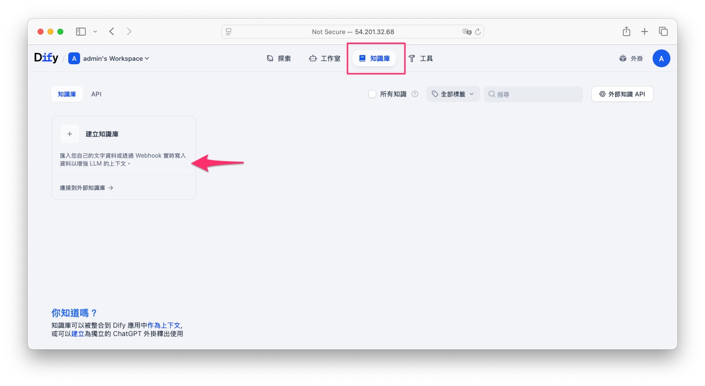

接著，點擊左側 「Create Knowledge」（見紅色箭頭所指處），即可開始建立你自己的 AI 知識庫。這裡你可以上傳自己的 FAQ、產品說明、技術文檔等資料，進行向量化與查詢設定。

!!! info

        關於知識庫的數量限制：

        - **自架版（Self-hosted）**：無知識庫數量上限，你可以建立任意多個知識庫，非常適合中大型企業部署。

        - **雲端免費版（Cloud-hosted Free Plan）**：有知識庫數量與儲存空間限制，依照 Dify 的免費額度條件而定，若超過需要升級為付費方案。

Dify 支援以下三種匯入模式：

* **檔案匯入**（支援 PDF、Markdown、CSV）
* **從 Notion 匯入**
* **網站爬蟲匯入**

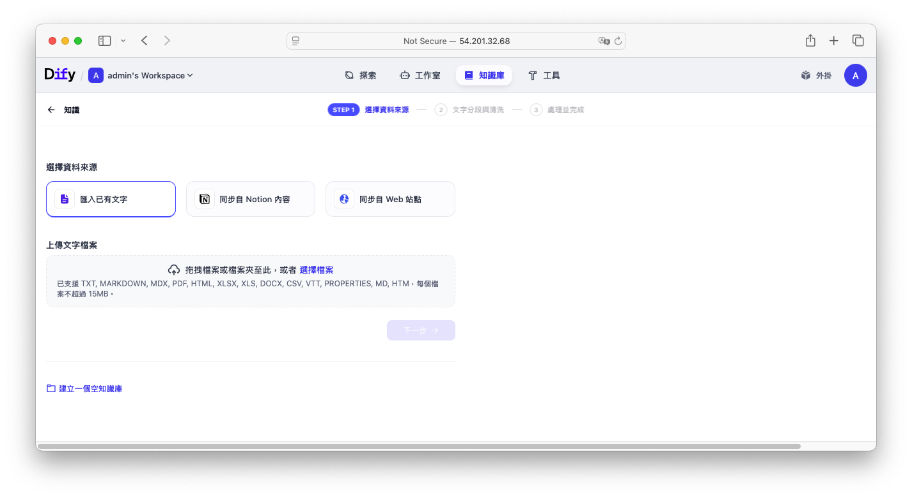

本教學聚焦在「**檔案匯入**」最適合客服用的問答格式。你可以簡單準備一個 PDF 文件或是 Excel 表格紀錄問答。儲存為 `.csv` 檔後，就可以直接在 Dify 中匯入。

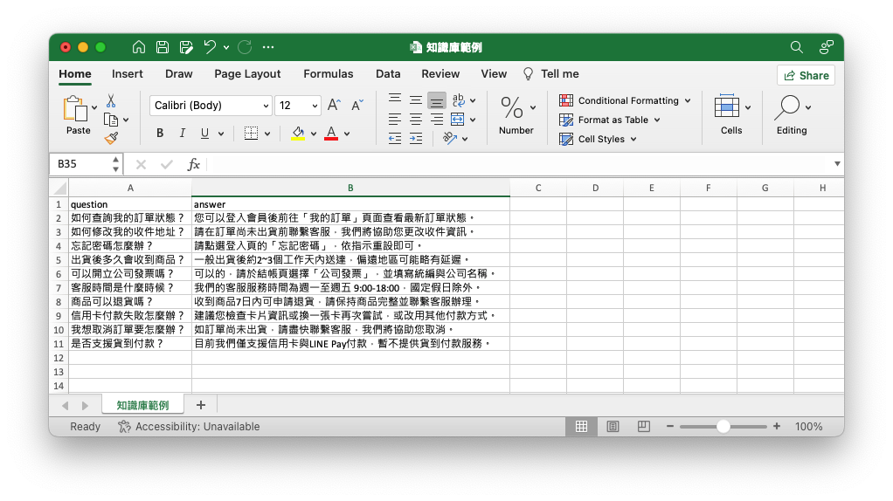

---

## 資料分塊與向量化（Embedding）
在匯入資料後，Dify 會自動將問答一筆筆當作一個區塊（Chunk）。這對於客服系統特別合適，因為每筆資料原本就是一問一答。

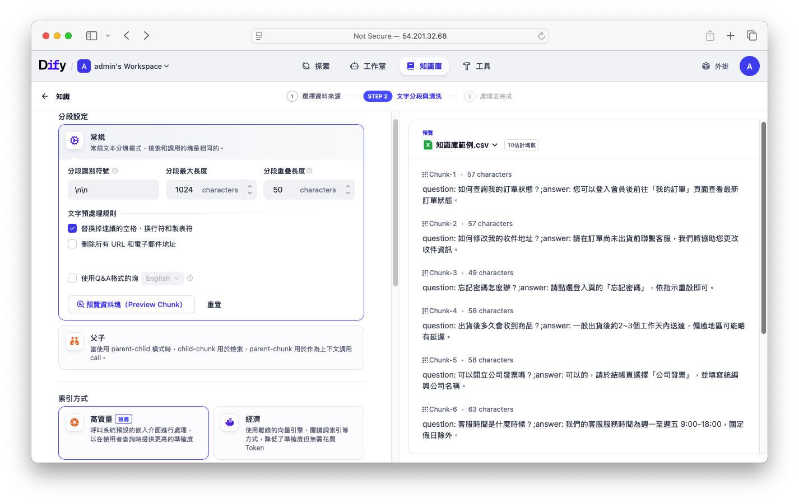

接著，系統會幫你進行「向量化（Embedding）」。這一步是將文字轉成數學向量，方便模型比對相似內容。建議選擇「**高品質模式**」，使用 AI 模型進行語意處理，而非關鍵字比對。

!!! info

        * **高品質（推薦）**：使用 AI 嵌入模型將文字轉成向量，能理解語意，查詢時能更準確地抓出相關內容，但會消耗 Token。

        * **經濟模式**：採用關鍵字或全文搜尋方式，不需 Token，成本低且速度快，但只能比對字面，無法理解語意。

---

## Embedding 與 Rerank 模型比較
Dify 支援兩種主要模型：

| 類型            | 描述              | 優點      | 缺點            |
| ------------- | --------------- | ------- | ------------- |
| **Embedding** | 將問句與資料向量比對      | 快速、大量篩選 | 命中率可能較低，結果較模糊 |
| **Rerank**    | 使用語句語意精準比對（句對句） | 精準度高    | 速度慢、成本高       |

如果想使用 **「Embedding + Rerank 混合策略」** 推薦使用 **Voyage 模型**（它支援 Embedding 與 Rerank），效果好且價格實惠，註冊即有免費額度可用。

1. 先用 Embedding 找出初步相關資料。
2. 用 Rerank 模型重新排序結果，提升精準度。

但本文中為了快速展示僅採用 Embedding，並使用 huggingface 開源免費的 `intfloat/multilingual-e5-large` 作為示範。(稍後會講解如何設定)

---

## 三種查詢策略介紹

Dify 提供三種知識庫查詢方式：

1. **向量檢索（Embedding Only）**
2. **全文檢索（Keyword Search）**
3. **混合檢索（Hybrid：向量 + 全文）**

> 實務建議選擇「混合檢索 + Rerank」，結合語意模糊查詢與關鍵字精準匹配，再透過 Rerank 精準排序，效果最佳。

---

## 設定 Embeedding 模型

### 準備 Hugging Face Access Token
1. 登入你的 Hugging Face 帳號，進入「[Access Tokens](https://huggingface.co/settings/tokens)」頁面
2. 點擊 **Create new token**，選擇 **Fine-grained**，勾選「Make calls to Inference Providers」權限，並命名（例如 `dify`）。
3. 建立後，複製該 Token，待會要填入 Dify。

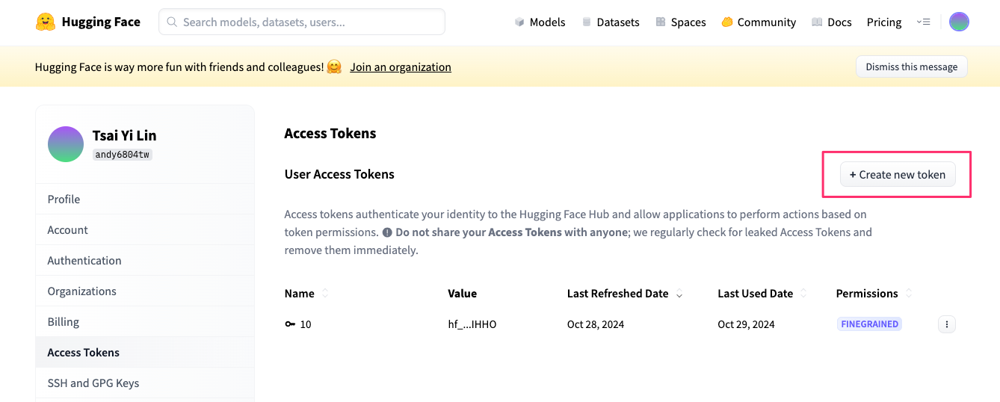
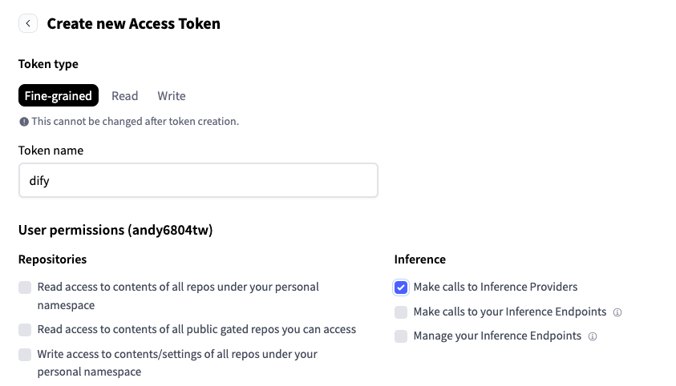

### 在 Dify 後台新增 Hugging Face 模型供應商
以下是在 Dify 上設定 Hugging Face 並使用自訂 Embedding 模型的步驟，請依序操作：

1. 在建立知識庫的頁面中點選`Embedding 模型`欄位。點擊`Model Provider`設置
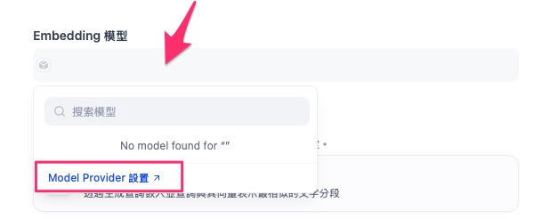
> 亦可進入 Dify 後台，點右上角用戶大頭貼 → **Settings（設定）** → **Model Provider（模型供應商）**

2. 在列表中找到 **Hugging Face Hub**，點 **Install（安裝）**，完成後回到模型供應商頁面
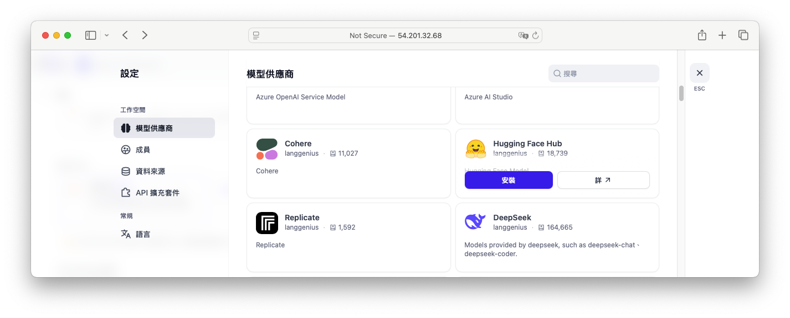

3. 找到 **Hugging Face Model** 欄位，按下 **新增模型**（見下圖範例）
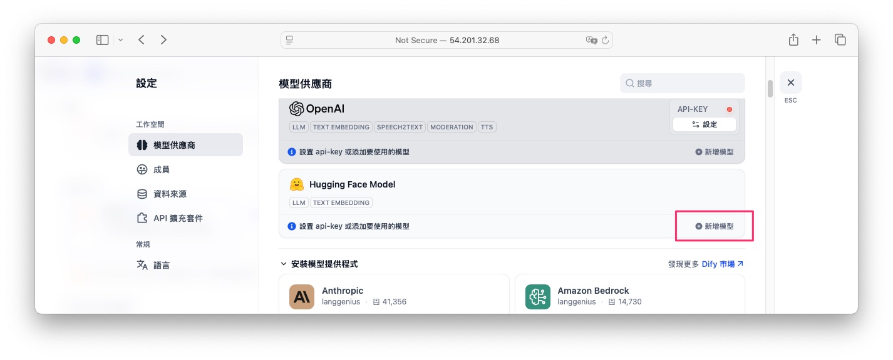

4. 設定 **Hugging Face Text Embedding** 模型
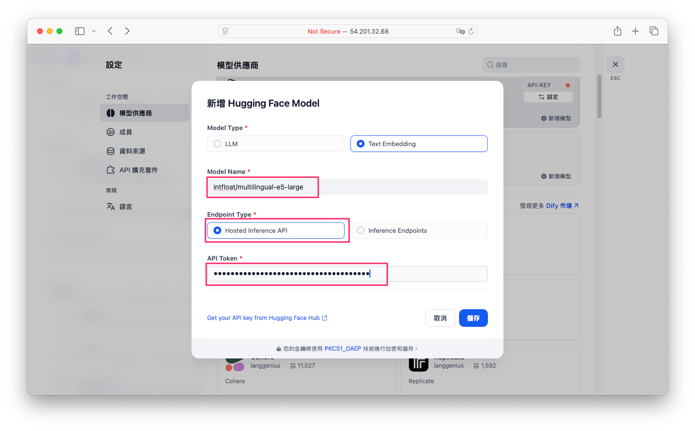
    在「新增 Hugging Face Model」彈窗中，依下列欄位填寫：

    | 欄位                | 操作說明                                               |
    | ----------------- | -------------------------------------------------- |
    | **Model Type**    | 選擇 **Text Embedding**                              |
    | **Model Name**    | 輸入欲使用的 HF 模型名稱，例如：`intfloat/multilingual-e5-large` |
    | **Endpoint Type** | 保持預設 **Hosted Inference API**                      |
    | **API Token**     | 貼上先前從 Hugging Face 取得的 Access Token                |

    完成後按 **儲存**，即可在 Dify 中使用 Hugging Face 提供的 Embedding 模型。

## 在知識庫建立頁面選擇自訂模型

1. 回到 **Knowledge** → **Create Knowledge** → 檔案匯入流程中
2. 展開 **Embedding 模型** 下拉選單，將看到剛剛新增的模型名稱
3. 檢索設定選擇**向量檢索**

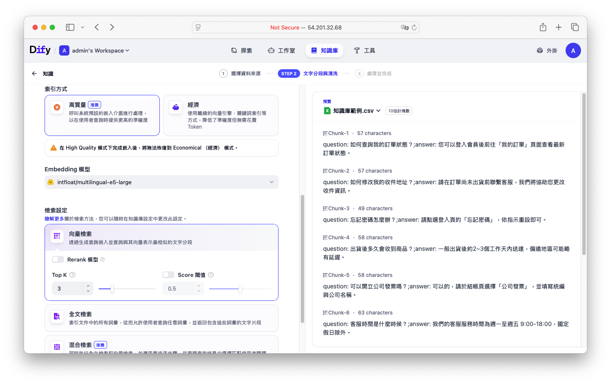

!!! info

        * **Top K**：
        指的是從向量資料庫中，依照與查詢向量相似度排序後，回傳前 K 筆最相關的文本片段。例如設定為 3，就會取出相似度最高的 3 筆資料。

        * **Score 閾值**：
        指過濾相似度分數低於此值的結果。設定為 0.5，代表只有相似度 ≥ 0.5 的片段才會被保留，避免過於不相關的回傳。

完成分數與筆數設定後，點擊「儲存並處理」，Dify 就會自動將匯入的文件向量化並存入向量資料庫，後續查詢即可快速命中相關內容。

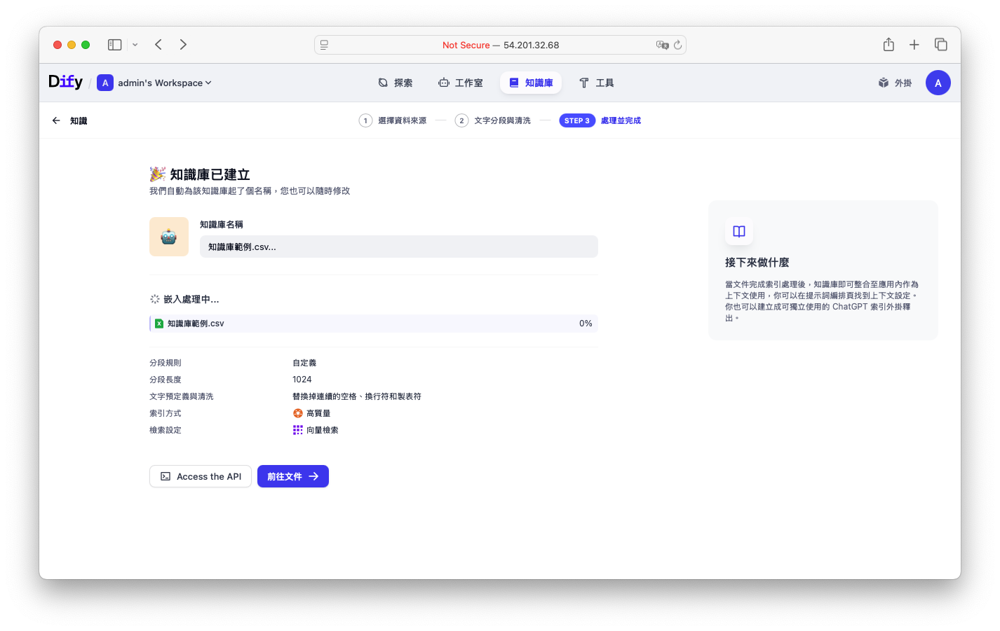

## 新增或擴充知識資料

除了匯入完整 CSV 檔案外，你也可以：

* 手動新增單筆問答資料
* 上傳額外的 Excel/CSV/PDF 等文件進行擴充知識

每筆資料都會經過自動向量化與關鍵字提取，非常方便管理與搜尋。

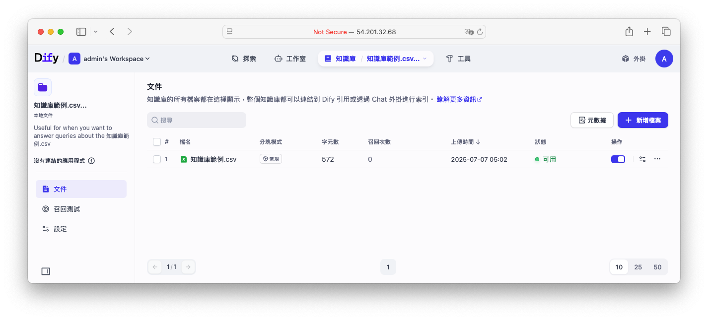

---

## 實測查詢效果

完成知識庫設定後，即可在 Dify 後台進行「召回測試」。輸入問題如：

* 「支援哪些付款方式？」
* 「營業時間？」

系統將從向量資料庫中找出語意相近的問答，進行智能匹配並顯示相關回答。

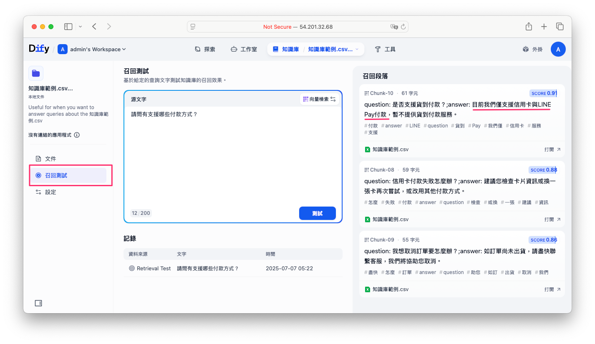

---

## 整合客服流程（預告）
本文教學先介紹如何建立 Dify 知識庫。[下一篇](./workflow-rag-chatbot-tutorial-1.md)，我們將說明如何將知識庫整合到客服流程中，並實作出一個完整的 AI 客服對話系統。

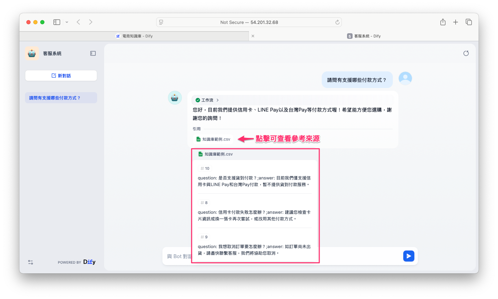

---

## 總結
大家可以根據需求選擇合適的 Embedding 模型。本文所採用的 multilingual‑e5‑large 適合於中短文本的快速 embedding(輸入的 tokens 上限只有 512 tokens 偏少)，但對於長文本或需精確檢索的任務，建議使用更強大的 BGE‑M3（具多功能 retrieval）搭配 BGE‑Reranker‑V2‑M3 做 reranker，能兼顧效率與效果。

| 任務類型                          | 建議模型組合                   | 解說                                          |
| ----------------------------- | --------------------------- | ------------------------------------------- |
| 中短篇 embedding / 多語 clustering | multilingual‑e5‑large       | 快速初始化，適合資源有限的小型應用                           |
| 長文本 retrieval                 | BGE‑M3                      | context up to 8192 ，支援 dense/sparse/ColBERT |
| 精細重排序                         | BGE‑M3 + BGE‑Reranker‑V2‑M3 | embedding + cross‑encoder reranking 提升結果    |

使用 Dify 建立 AI 客服知識庫具備以下優勢：

* 快速匯入資料（CSV、PDF、Notion、網站）
* 支援高品質向量化與語意查詢
* 可選擇混合查詢與 Rerank 提高精準度
* 模型如 Voyage 提供高性價比方案

掌握了 Dify + Embedding + Rerank + RAG 的精髓，就能打造真正能理解語意、提供準確回答的 AI 客服系統。
