# 使用 Dify 免費打造進階 AI 客服系統 | RAG 設定、禁用字、自訂回答、內容優化完整教學
上一篇我們介紹了如何透過 Dify 建立基本的 AI 客服知識庫，這次則帶大家深入瞭解更進階的客製化功能，包括對話開場白、問題建議、語音整合、檔案上傳、禁用字設定與自訂回答優化，讓 AI 客服系統更加實用且完整。

## 一、功能開啟與基本設定

首先進入 Dify 後台流程設定右上角，點選「功能」，即可看到各種進階設定選項：

* 對話開場白
* 下一步問題建議
* 語音轉文字
* 檔案上傳
* 引用與歸屬
* 內容審查

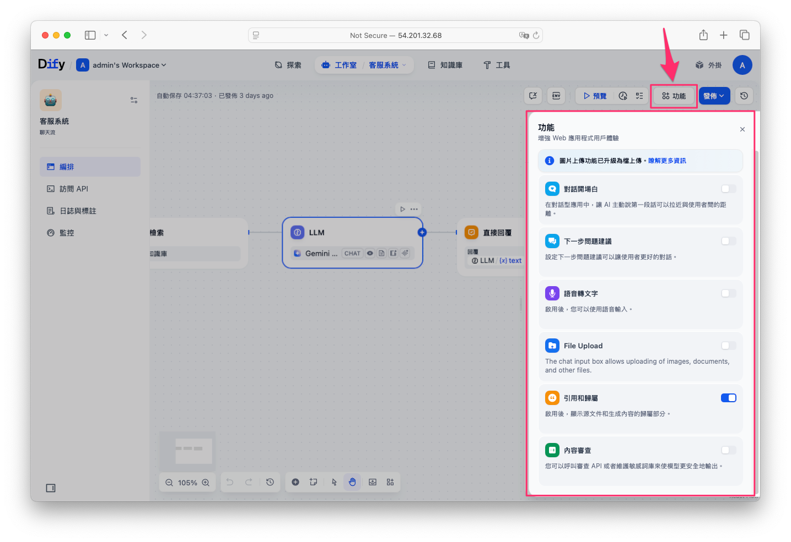

開啟所需功能後，即可進行詳細設定。

## 二、常用進階功能說明

### 1. 對話開場白
設計客服系統進入對話時的自動問候語，以及推薦常見問題，提升用戶體驗。

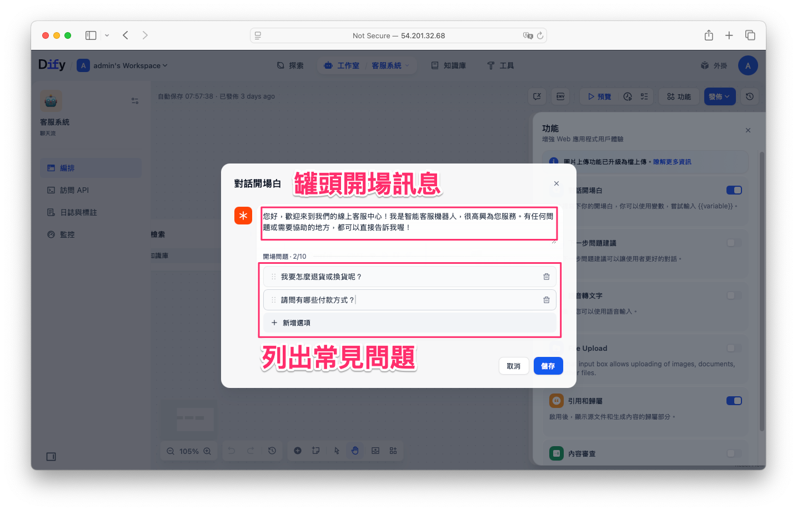

發佈後點選運行，開啟聊天視窗後即可看到剛剛設定的開場白訊息。同時下方貼列幾個是先預設的常見問題，點擊下去即可快速得到答案。

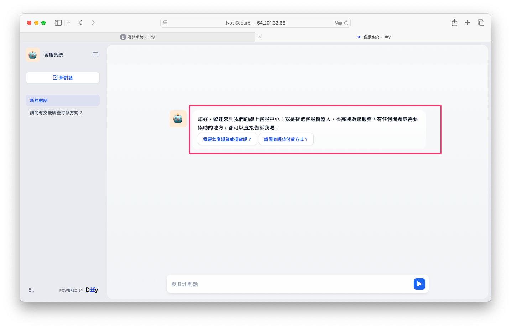

### 2. 下一步問題建議
開啟此功能後 AI 會根據用戶已提出的問題與回答，提供延伸相關問題，協助用戶快速獲得更多資訊。

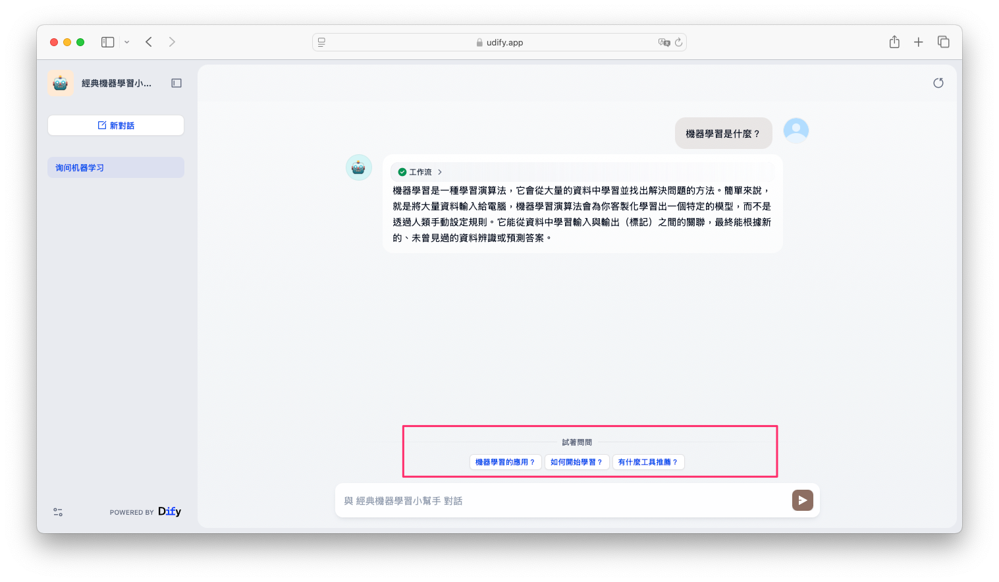

### 3. 語音轉文字
除了手動輸入訊息，也可以透過麥克風錄音當使用者聲音轉換成輸入的prompt。

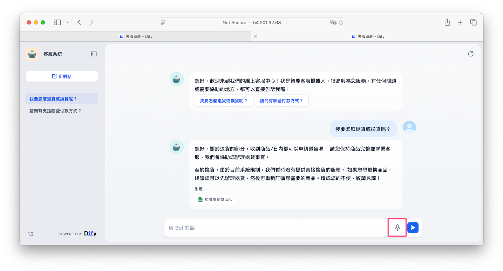

不過，在啟用此功能之前，必須先在 Dify 平台啟用 Groq 並設定 API 金鑰，詳細步驟請參考[這篇文章](../free-llm-api-integration-resources/groq-tutorial.md)。完成啟用後，即可免費調用 Whisper 模型，輕鬆將語音轉為文字。

### 4. 檔案上傳
允許用戶上傳圖片或文件作為問題說明，可設定檔案允許格式(包含URL形式解析功能)並且限制上傳數量與大小。同時必須在LLM節點的 User 使用者欄位添加 `{{#sys.files#}}` 這樣機器人才能讀取到使用者所上傳的檔案。

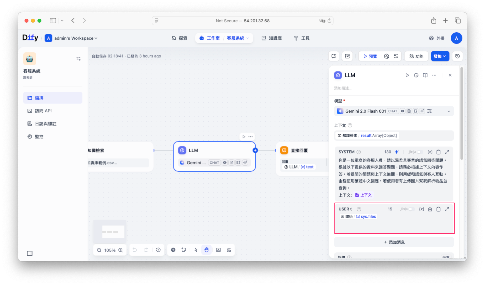

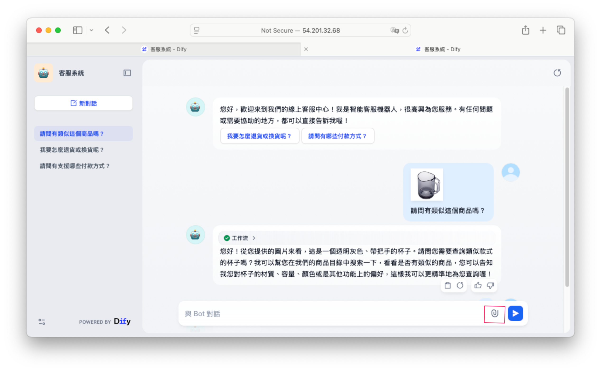

### 5. 引用與歸屬
開啟此功能後，用戶提問時會顯示知識庫相關來源供參考。

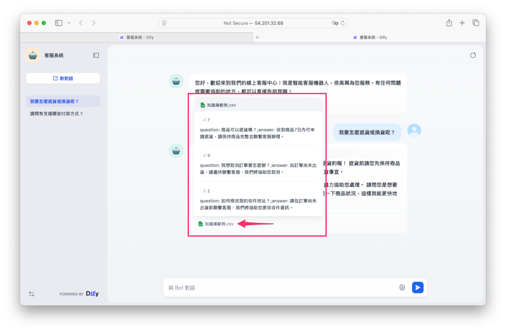

### 6. 內容審查（禁用字設定）
可設定禁用的關鍵字，避免不適當的內容輸入與輸出。此外也支援 OpenAI Moderation 模型進行內容審核(查需要在 模型供應商 中配置 OpenAI API 金鑰。)，過濾敏感詞。

## 三、日誌與標註功能優化
Dify 提供日誌管理，用於查看用戶對話內容並進行標註管理。

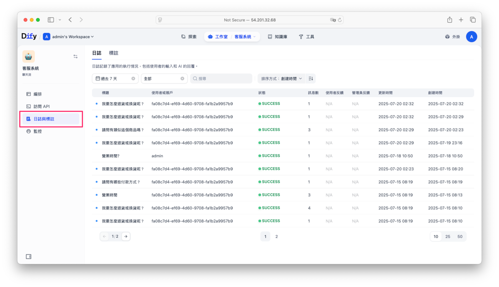

* **日誌功能**：記錄所有客服對話與用戶滿意度（按讚或不滿意），便於後續分析與改善。

* **標註功能**：可以將特定的問題與回答進行編輯，標記後的回答未來會優先使用，並能快速回應類似問題。

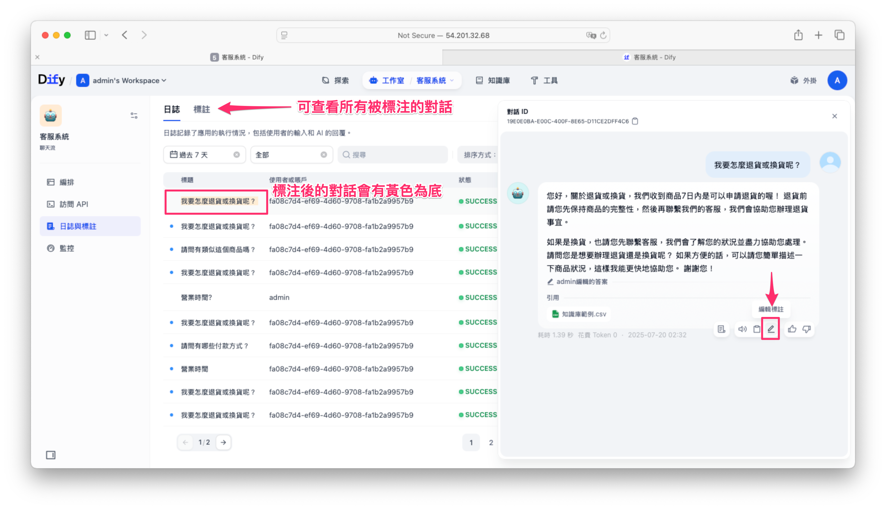

### 如何使用標註優化回答？
標註回覆功能開啟後，管理者只要在彈出視窗中設定一個介於 0.8～1.0 的分數閾值（數值越高表示只在更精準匹配時才觸發）以及選擇一款 Embedding 模型（例如 intfloat/multilingual-e5-large），系統就會先把使用者的提問透過該模型轉成向量，跟所有人工標註的問題計算餘弦相似度，只有當相似度達到設定的閾值時才會直接回傳對應的標註答案，否則再走 AI 備援生成流程；如此一來，常見且標準化的問題都能穩定回覆，同時又保留 AI 回答的彈性與廣度。

1. 點擊「日誌與標註」，選擇有價值的對話進行標註。
2. 標註的回答可進行手動優化與編輯。
3. 配置標註回覆的 embedded 模型，設定命中分數閥值，提高問題匹配精準度。

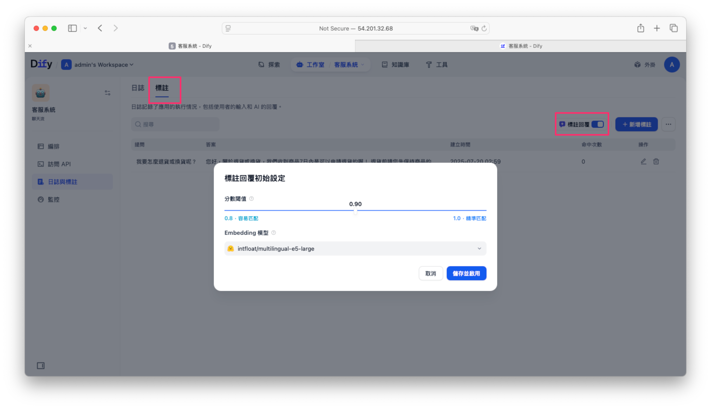

透過這種方法，常見問題或固定格式回覆能快速自動回應。

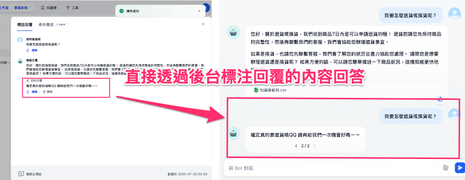

從後台可以看到這個提問的命中次數與分數是多少。

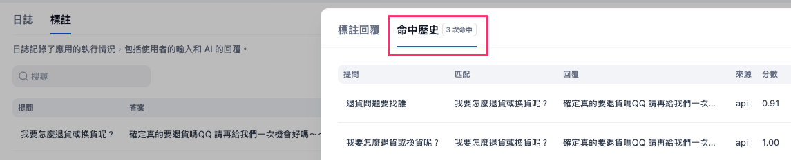

### 批次管理標註資料
除了手動新增標註外，也可透過 Excel 表格批次匯入問答資料，大幅提升維護效率。

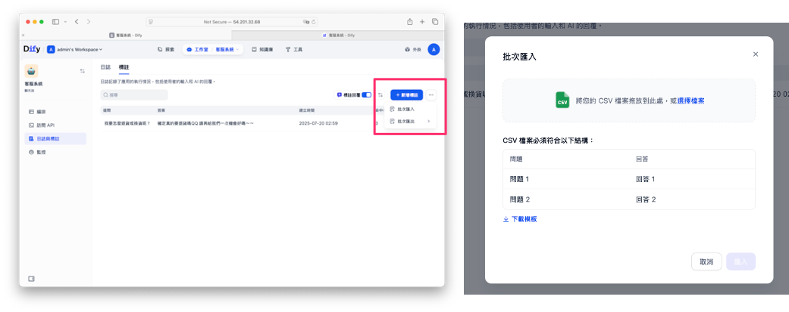

## 四、設定完成與效果驗證

完成所有設定後，點選「發佈更新」即可生效。你可以透過即時提問來測試設定是否成功，確認客服系統運作順暢。

透過以上進階功能設定與最佳化後，你將能輕鬆打造一個完善且高效的 AI 客服系統，滿足多元且複雜的客戶服務需求，進一步提升服務品質與用戶滿意度！

