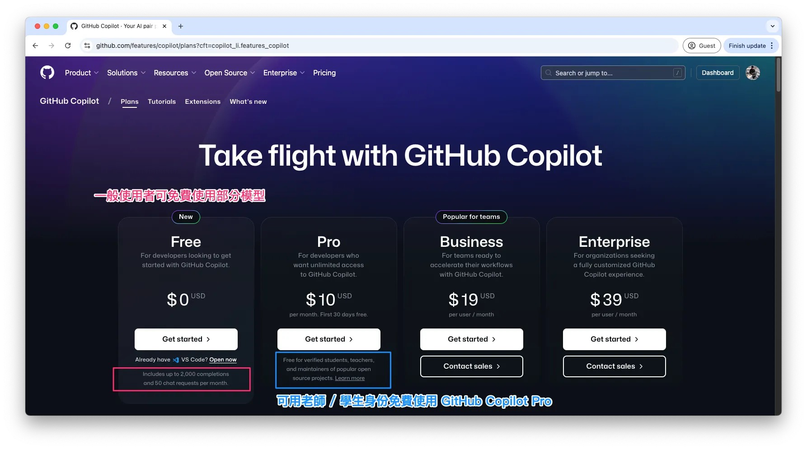
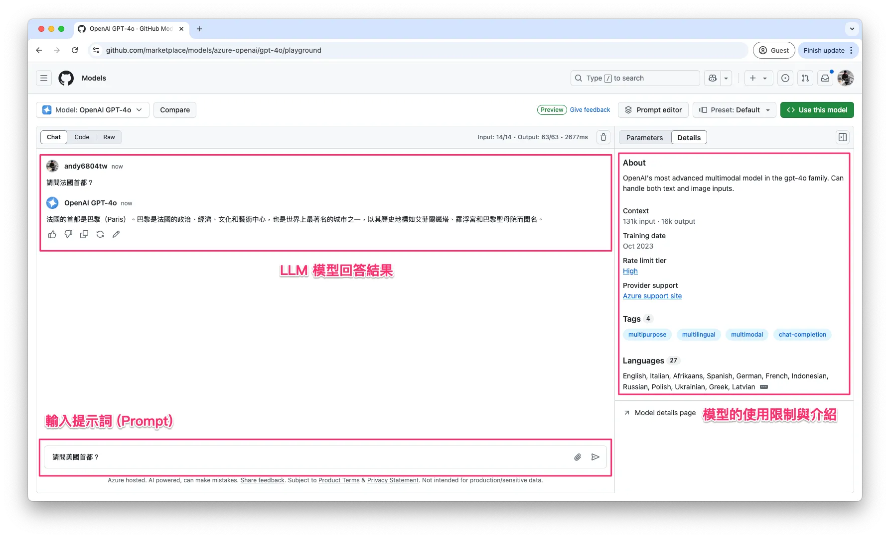

# GitHub Models 免費試玩 GPT、Llama、DeepSeek
> 帶你玩轉 Playground、API 串接，打造自己的 LLM 專案！

範例程式：[](https://colab.research.google.com/github/andy6804tw/crazyai-llm/blob/main/docs/free-llm-api-integration-resources/code/github-basic.ipynb)

## GitHub Models 介紹

[GitHub Models](https://github.com/marketplace?type=models) 是 GitHub 提供的一項免費服務，讓開發者能夠試用各種大型語言模型 (LLM)，例如 **GPT-4o、Llama 3.3、Phi-3.5** 等。這項服務特別適合個人開發者或小型專案，每日提供一定額度的免費 API 請求，讓使用者可以直接在 GitHub Playground 測試，或是透過 API 串接 GitHub Models 來開發自己的 AI 應用程式。

!!! note

      如果你正在尋找一個免費的 LLM 測試環境，GitHub Models 絕對值得一試！

## GitHub Models 的特點

✅ **免費額度**：每天最多可發送 50~150 次 API 請求（依模型而異）  
✅ **Playground**：無需寫程式即可在線上測試模型  
✅ **API 串接**：支援 OpenAI API 格式，與現有的 LLM 應用相容  
✅ **多種模型可選**：支援 GPT-4o、Llama、Phi 等多種 AI 模型  

---

## GitHub Models 支援的模型清單

GitHub Models 提供多種 **大型語言模型 (LLM)** 供開發者試用，涵蓋 **聊天模型、Embedding 模型**，適合不同的 AI 應用場景。

完整清單可在 [GitHub Models marketplace](https://github.com/marketplace?type=models) 查詢，以下是部分熱門模型：

### 📌 聊天模型
- DeepSeek-R1
- OpenAI GPT-4o
- OpenAI GPT-4o mini
- Llama-3.3–70B-Instruct
- Llama-3.2–90B-Vision-Instruct
- Phi-3.5-MoE instruct
- Phi-3.5-vision instruct
- Mistral Large
- Cohere Command R+
- AI21 Jamba 1.5
- JAIS 30b Chat
- ...

### 📌 Embedding 模型
- OpenAI Text Embedding 3
- Cohere Embed v3 Multilingual
- ...

---

## 免費與付費計畫

GitHub Models **免費用戶 (GitHub Copilot 免費版)** 可以使用部分模型，但如果想使用 **GPT-o1、GPT-o3-mini** 等最新模型，則需要升級到付費計畫 **[GitHub Copilot Pro](https://github.com/features/copilot/plans?cft=copilot_li.features_copilot)**。

!!! note

      **💡 如果你是老師或學生**，可以透過 GitHub Education **[申請免費使用 GitHub Copilot Pro](https://medium.com/彼得潘的-swift-ios-app-開發問題解答集/用老師-學生身份免費使用-github-copilot-223236e0e0e8)**，享受更高級的模型與更多額度，對於學術研究與 AI 學習特別有幫助！



點選任一個模型後，可進入模型介紹頁面，查看該模型的支援語言、輸入輸出限制、測試評分等資訊，並直接進入 Playground 測試其回應能力。


## GitHub Models 使用限制與限流說明

在開始使用 **GitHub Models** 之前，了解 **速率限制 (Rate Limits)** 非常重要。GitHub Models 依據不同的模型類型，將使用限制分為四個等級：

- **Low (低限制)**：適用於部分輕量模型，請求數量較少，適合一般測試用途。
- **High (高限制)**：適用於較大型的模型，例如 GPT-4o，速率限制較嚴格。
- **Embedding (嵌入式模型)**：適用於向量嵌入 (Embedding) 相關模型，主要用於語意搜尋與相似度計算。
- **Custom (自訂限制)**：適用於特殊模型，例如 Azure OpenAI o1-preview、o1/o3-mini，這些模型的使用限制會依據官方公告動態調整。

這些限制等級會影響每分鐘請求數、每日請求上限、單次請求 Token 數量等規則。你可以在模型介紹頁面 或 Playground 右側的 Rate limit tier 標籤，查詢當下適用的速率限制。以 GPT-4o (屬於 High 限制等級) 為例，免費使用者的請求限制如下：

- **每分鐘請求數**：最多 10 次
- **每天請求上限**：最多 50 次
- **每個請求的 Token 限制**：
      - **輸入 (Input)**：最多 8000 Tokens
      - **輸出 (Output)**：最多 4000 Tokens
      - **並發請求數 (Concurrent Requests)**：最多 2 個

!!! note

      詳細請求限制資訊，請參考官方文件：  [GitHub Models Rate Limits](https://docs.github.com/en/github-models/prototyping-with-ai-models#rate-limits)

在本篇文章中，我將帶各位兩種使用的情境：

- 直接在 [GitHub Playground](https://github.com/marketplace/models) 測試
- 申請 [API Token](https://github.com/settings/personal-access-tokens) 並在 Colab 串接模型


## 🎮 在 Playground 測試 LLM 模型

GitHub Models 提供 **Playground**，讓開發者可以無需寫程式，直接測試 LLM 模型的能力。只需選擇一個模型，即可輸入 Prompt 進行互動。


### 如何進入 Playground

1. **前往 GitHub Models**： [GitHub Models 入口](https://github.com/marketplace/models)
2. **選擇模型**：從下拉式選單中選擇一個模型
3. **開始聊天**：在輸入框輸入 Prompt，與 AI 進行對話



右側區塊可切換「Parameters」與「Details」：

- **Parameters：** 可設定與調整模型參數，如 System prompt、Response format、Max Tokens、Temperature 等。
- **Details：** 提供模型的相關說明。

在 GitHub Models Playground 的參數調整區（右側），使用者可以根據需求客製化 AI 模型的回應方式，透過 System Prompt 設定 AI 的角色與行為，並進一步微調 AI 回應的風格與長度。


首先，System Prompt (系統提示詞) 允許開發者定義 AI 的角色、專業領域或回應限制。例如，設定 AI 為「地理專家」，它就只會回答地理相關問題，對於其他問題則禮貌拒答。這樣可以確保 AI 的回應更加聚焦，符合特定應用場景的需求。

此外，開發者還可以透過以下幾個參數調整 AI 的回應方式：

- **Max Tokens (最大輸出字數限制)**：設定 AI 回應的最大字數，以控制回應的長短，例如 4096 代表 AI 生成的回應最多包含 4096 個 Token (約等於 3000 多個中文字)。
- **Temperature (隨機性控制)**：決定 AI 回應的多樣性，數值範圍 0 ~ 1，較低的值 (如 0.2) 讓 AI 回應更精確、可控，較高的值 (如 0.8) 則讓回應更加有創意或具變化性。
- **Top P (機率抽樣限制)**：這個數值決定 AI 在生成答案時，會從多少機率範圍內的詞彙中選擇。數值越低，AI 只會選擇最有可能的詞，使回應更保守、更可預測；數值越高，AI 會考慮更多詞彙選項，使回答更具變化性和創意。

!!! note

      **Top-P 與 Temperature 的搭配**

      - **若 Top-P 低、Temperature 高** → 受控範圍內增加變化（比較安全的創意）。
      - **若 Top-P 高、Temperature 高** → 內容會變得更加 隨機、奔放，適合創作但可能偏離主題。
      - **若 Top-P 低、Temperature 低** → 生成內容嚴謹正式但較死板。

左側區塊分為「Chat」、「Code」和「Raw」：

- **Chat：** 類似使用 ChatGPT，可以與模型進行多輪對話。
- **Code：** 展示 API 的使用方式，提供不同程式語言的範例。
- **Raw：** 顯示您與模型對話紀錄的原始資料。

在 GitHub Models Playground，使用者可以點擊 「Compare」按鈕，同時測試兩種不同的 LLM，觀察它們在相同 Prompt 下的回應差異。例如，在比較 GPT-4o 和 DeepSeek-R1 回答「全世界最高的山在哪裡？」時，GPT-4o 提供了精確的數據與測量資訊，而 DeepSeek-R1 則補充了文化背景與生態保護觀點。這種對比方式讓開發者能夠快速了解不同模型的資訊準確度、回應風格與適用場景，幫助選擇最適合的 LLM 來應用於專案中。


!!! note "Playground 適合誰？"

      如果你是**新手**或是希望**快速測試 LLM 的開發者**，Playground 是最佳選擇，因為不需要寫任何程式碼！

## 👨🏻‍💻 使用 API 測試 LLM 模型 (Colab 教學)

如果你希望將 GitHub Models **整合到自己的應用程式**，可以使用 **API 串接** 來發送請求。GitHub Models API **與 OpenAI API 格式相容**，讓開發者能夠無縫轉換至 GitHub 的 LLM 服務。

### API 申請步驟

**1. 建立 GitHub Personal Access Token (PAT)**：

- 前往 [GitHub Settings](https://github.com/settings/personal-access-tokens)
- 進入 **Developer settings > Personal access tokens > Fine-grained tokens**

- 點選 「Generate new token」，並選擇 Public Repositories (read-only) 權限
- 生成 Token 並**妥善保存**

   
**2. 在Google Colab 執行 API 測試**

為了安全起見，不建議直接在程式碼中明碼顯示 Token，而是應該使用 Colab Secrets 來存取（如果是本機開發建議使用dotenv管理環境變數）。


**在 Google Colab 左側選單點擊「🔑 Secrets」**

- 點擊「+ Add new secret」
- **Name** 欄位輸入 `GITHUB_TOKEN`
- **Value** 欄位貼上剛剛在 GitHub 生成的 Token
- 點擊「access✓」按鈕允許 Colab 存取金鑰


這個範例程式會自動讀取 GitHub Token，透過 GitHub Models API 呼叫 GPT-4o 來測試 LLM 模型的回應能力。程式首先從 Google Colab 的 Secrets 取得 `GITHUB_TOKEN`，並使用 OpenAI 客戶端 來連接 GitHub Models 伺服器。

```py
import os
from openai import OpenAI
from google.colab import userdata

# 驗證模型需要使用 GitHub 的 Personal Access Token (PAT)。
# 你可以在 GitHub 設定中產生 PAT，詳見官方文件：
# https://docs.github.com/en/authentication/keeping-your-account-and-data-secure/managing-your-personal-access-tokens
client = OpenAI(
    base_url="https://models.inference.ai.azure.com",  # 設定 API 伺服器的基礎 URL
    api_key=userdata.get('GITHUB_TOKEN'),  # 從 Google Colab 的使用者資料中取得 GitHub Token
)
```

接著，程式發送一個 聊天請求 (chat completion request)，其中包含 System Prompt，設定 AI 為繁體中文問答助手，並讓使用者詢問「法國的首都？」。最後，AI 會根據模型參數 (如 Temperature、Max Tokens、Top P) 生成回應，並將結果輸出。

```py
# 發送聊天請求
response = client.chat.completions.create(
    messages=[
        {
            "role": "system",
            "content": "你現在是個問答小幫手，並使用繁體中文回答問題。",  # 設定系統角色，引導 AI 以繁體中文回答
        },
        {
            "role": "user",
            "content": "請問法國的首都？",  # 使用者的提問
        }
    ],
    model="gpt-4o",  # 指定使用的 AI 模型為 GPT-4o
    temperature=1,  # 設定溫度值，影響回答的隨機性（1 代表較具變化性）
    max_tokens=4096,  # 設定回應的最大 Token 數（字數限制）
    top_p=1  # 設定 Top-p（核取樣），用於控制回應的多樣性
)

# 印出 AI 的回應內容
print(response.choices[0].message.content)
```

這個範例展示了如何使用 Colab + GitHub Models API 來快速測試 LLM 模型的對話能力。你也可以試試看將 model 替換成其他模型，例如嘗試近日熱門的 DeepSeek-R1。


上述範例是一個簡單的單輪對話示範，使用者輸入問題後，AI 依據設定的 System Prompt 回應對應的答案，沒有額外的上下文記憶功能。這種方式適合基礎的 API 測試，確保模型能夠正常運作。除了這種單輪對話模式，GitHub Models 官方教學還提供多種進階範例，讓開發者能夠體驗更完整的 AI 互動方式，例如：

- **執行多輪對話 (Run a multi-turn conversation)**
      - 讓 AI 記住前幾輪的對話內容，維持連貫的交流，例如聊天機器人或客戶支援應用。
- **串流輸出回應 (Stream the output)**
      - 讓 AI 逐字輸出回應，而非一次性返回完整答案，適合即時應用，如對話助手或 AI 文章生成。
- **使用圖片進行對話 (Chat with an image input)**
      - 除了文字輸入外，也可以讓 AI 分析圖片並提供回應，適用於圖像描述、OCR 文字辨識等應用場景。
- **工具調用與函式執行 (Identify and invoke tools)**
      - 讓 AI 能夠識別問題並選擇適當的外部工具來執行特定任務，例如查詢天氣、計算數學公式，甚至與資料庫互動。


!!! info

      下一篇文章將會介紹另一個免費LLM資源！


## 總結與下一步建議
透過這篇教學，我們學習了 GitHub Models API 的基本使用方式，包括 Playground 測試及 API 串接，並透過 Google Colab 示範如何讓 LLM 生成回應。值得注意的是，GitHub Models API 不僅支援 OpenAI API 格式，還相容於 LangChain API，這意味著開發者可以直接將 GitHub 提供的 LLM 模型整合進現有的 AI 應用程式，甚至與其他 AI 服務無縫接軌。

💡 **鼓勵你動手實作！**  
✅ **整合 RAG (Retrieval-Augmented Generation)**，結合外部知識庫提升 AI 回答準確性  
✅ **使用 Streamlit 或 Gradio** 封裝成 **聊天應用**，打造一個互動式 AI Chatbot  

透過這樣的練習，不僅能深化對 LLM 模型的理解，也能為你添加個人作品！現在就開始你的 **GitHub Models AI 專案** 吧！🚀🎯
