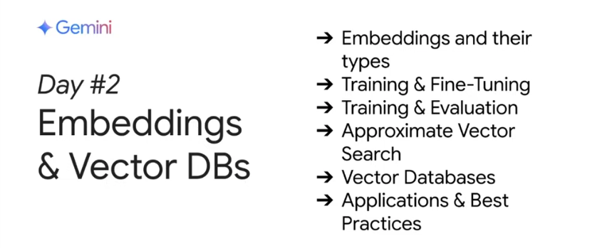

# [Day 2] Embeddings 與向量資料庫

在第二天的課程中，你將學習與了解 embeddings 與向量資料庫（或向量資料庫/資料庫）的基本概念及其應用。透過本單元，你不僅會掌握如何利用這些技術將即時或專業資料引入大型語言模型（LLM）的應用，還能學習到利用向量的幾何特性來分類與比較文字資料，以及如何評估 embeddings 的效果。

## 本單元內容

- **🎙️ Podcast 聆聽**  
    收聽本單元的[Podcast 摘要](https://www.youtube.com/watch?v=xCAVsst6WJ8&list=PLqFaTIg4myu_yKJpvF8WE2JfaG5kGuvoE&index=3)，先行瞭解 embeddings 與向量資料庫的基本原理。  

- **📄 白皮書閱讀**  
    閱讀「[Embeddings and Vector Stores/ Databases](https://www.kaggle.com/whitepaper-embeddings-and-vector-stores)」白皮書，進一步深入學習相關理論與技術細節。

- **💻 Kaggle 實作練習**  
    透過實作練習，你將完成以下項目：
    1. [建立 RAG 問答系統](https://www.kaggle.com/code/markishere/day-2-document-q-a-with-rag)
    2. [探索文字相似度](https://www.kaggle.com/code/markishere/day-2-embeddings-and-similarity-scores)
    3. [使用 Keras 建立神經分類網路](https://www.kaggle.com/code/markishere/day-2-classifying-embeddings-with-keras)

| 名稱                            | 範例程式 (zh_TW)                                                                                                                                                                                                                                                                            | 說明                                                                                             |
|---------------------------------|-----------------------------------------------------------------------------------------------------------------------------------------------------------------------------------------------------------------------------------------------------------------------------------------------|--------------------------------------------------------------------------------------------------|
| 建立 RAG 問答系統               |   | 利用自訂文件構建一個基於 RAG 的問答系統，從自訂資料中檢索並生成答案。                                           |
| 探索文字相似度                   |   | 使用 embeddings 技術分析與比較文字資料之間的相似度，瞭解向量如何反映文字間的語意關係。                           |
| 使用 Keras 建立神經分類網路     |   | 透過 embeddings 作為輸入特徵，利用 Keras 建立神經網路進行文本分類，掌握向量技術在實際任務中的應用。                |

!!! info "本日學習重點"

        今天的課程主要讓你瞭解以下內容：

        - **概念基礎：**  
        了解 embeddings 與向量資料庫的核心概念，並學習這些技術如何幫助你將即時或專業資料整合進 LLM 應用中。

        - **向量的幾何應用：**  
        探索向量資料在分類與比較文字方面的能力，從中瞭解如何透過數學與幾何方法處理語意資訊。

        - **評估方法：**  
        學習如何評估 embeddings 的效能，確保在實際應用中能夠取得準確且高效的結果。

        透過今天的課程，你將獲得應用 embeddings 與向量資料庫的實作能力，能夠將豐富的資料整合進你的大型語言模型應用中，並利用向量技術進行更精確的資料分類、比較與檢索。

---

## Day 2 直播精華整理
嵌入是數據（如文字、圖片）的數值向量表示，能將不同數據映射到同一語意空間，用距離代表語意相似度，方便比較與作為下游任務的輸入。 我們探討了文字嵌入（從 word2vec 到 BERT、Gemini）、圖片與多模態嵌入，以及結構化數據和圖形的嵌入方法。 訓練常使用雙編碼器與對比損失，評估則看精確度與召回率等指標。 為了快速搜尋數十億向量，我們介紹了近似最近鄰 (ANN) 演算法（如 ScaNN、HNSW），它們犧牲微小精度換取巨大速度提升。 向量資料庫正是利用這些演算法來高效儲存、管理、查詢嵌入。 最後，我們討論了應用，如搜尋、推薦、檢索增強生成 (RAG) 等，嵌入為 RAG 提供了生成更真實、有根據答案所需的上下文。

## Q&A 專家問答
### Q1：嵌入技術的進展與最佳實踐  
**問題內容：**  
在生成能夠捕捉細微語意（特別是針對專業領域或多模態資料）的嵌入向量方面，有哪些最新進展與最佳實踐？嵌入模型的選擇對下游向量搜尋任務的效能影響大嗎？

**專家觀點：**  

- **Andre** 表示，最新的趨勢在於整合大型語言模型 (LLM) 作為嵌入模型的預訓練骨幹，使得嵌入模型能夠利用多語言與多模態的理解能力；他也提到了 DeepMind 推出的 TIPS 模型（Text Image Pretraining with Spatial awareness），用來解決多模態嵌入中缺乏空間感知的問題。  
- **Howard** 補充說，Matryoshka 嵌入技術可使不同長度的嵌入前綴都具有效用，這讓我們能根據需求調整儲存的維度，同時也強調了利用 LLM 進行數據整理的重要性。

---

### Q2：整合向量搜尋至現有資料庫 vs. 專用向量資料庫  
**問題內容：**  
將向量搜尋功能整合進現有資料庫系統（例如 AlloyDB）與使用專用向量資料庫相比，各自的主要架構權衡是什麼？請簡述 AlloyDB 的特色與優勢。

**專家觀點：**  

- **Allan** 解釋，AlloyDB 是 GCP 提供的全相容 PostgreSQL 資料庫，經過架構創新後比傳統開源資料庫更快速；其內建向量搜尋能力（採用 ScaNN 演算法）能夠結合結構化資料與向量搜尋，讓使用者能在同一系統與 SQL 介面下完成多重查詢。  
- 他也指出，若資料主要為非結構化數據（如影像、文件），專用向量資料庫則較適合，但這通常會伴隨較高的成本及較寬鬆的數據一致性要求。

---

### Q3：向量嵌入與資料庫對企業數據架構的影響與挑戰  
**問題內容：**  
從策略層面來看，向量嵌入與向量資料庫技術的迅速發展，將如何影響企業數據架構與 AI 應用？企業在大規模採用這些技術時面臨哪些主要挑戰？

**專家觀點：**  

- **Patricia** 指出，這場技術變革意味著企業必須從傳統 SQL 精確匹配轉向建立多維度索引，並處理多模態資料。主要挑戰包括：  
    1. 部署與維護的成本與擴展性。  
    2. 缺乏統一的行業標準，導致整合與互操作性問題。  
    3. 專業人才不足，難以應對新技術的學習與應用。  
    4. 數據治理、安全性與合規性方面的要求日益嚴格。

---

### Q4：提升向量搜尋關聯性的高階技術  
**問題內容：**  
除了基本的餘弦相似度或歐幾里得距離之外，還有哪些進階技術（例如元數據過濾、混合搜尋、重新排序）可以進一步提升向量搜尋結果的相關性與準確性？這些技術如何整合到平台中？

**專家觀點：**  

- **Chuck** 表示，在採用進階技術前，必須先建立完善的評估機制。  
  - 混合搜尋結合了語意嵌入與傳統關鍵字匹配，能夠同時處理同義詞及相關概念。  
  - 重新排序技術則能根據資料來源的可信度對結果進行調整，但必須考量查詢延遲與系統吞吐量的平衡。

---

### Q5：如何升級嵌入模型？  
**問題內容：**  
當新一代嵌入模型問世時，是否必須重新生成資料庫中所有數據的嵌入？是否有更有效率的升級方法？

**專家觀點：**  

- **Chuck** 指出，由於不同嵌入模型之間通常不相容，因此更換模型時必須重新計算所有數據的嵌入。  
- **Howard** 補充，目前已有研究在探索如何將舊嵌入映射到新嵌入，但此技術仍處於試驗階段，尚未大規模部署。

---

### Q6：RAG 系統中文件與查詢使用不同嵌入模型的影響  
**問題內容：**  
在 RAG 系統中，如果文件與查詢使用不同的嵌入模型，會對檢索準確性及 LLM 生成回答的品質產生何種影響？

**專家觀點：**  

- **Shiai** 強調，為確保查詢與文件能夠映射到相同的語意空間，必須使用相同的嵌入模型。  
- 使用不同模型可能導致向量空間不一致，進而降低檢索效果並影響最終回答的準確性。

---

### Q7：如何處理 RAG 系統中的數據更新與時效性 (Drift)？  
**問題內容：**  
在動態或即時應用中，如何確保 RAG 系統中的查詢結果仍能與最新數據保持關聯性？系統該如何應對數據漂移？

**專家觀點：**  

- **Anant** 提到，監測嵌入隨時間的漂移是非常重要的，並建議使用低維度嵌入與增量索引技術以降低更新延遲與計算成本。  
- **Patricia** 補充，利用變更數據捕獲 (CDC) 以及即時 RAG 架構，可以有效應對數據變動。  
- **Allan** 則強調，傳統資料庫在事務一致性方面具備優勢，能夠即時反映數據更新，避免最終一致性問題。

---

### Q8：單一多模態模型 vs. 獨立單模態模型精度比較  
**問題內容：**  
在處理圖像與文字嵌入任務中，單一多模態模型與獨立單模態模型的精度比較如何？哪種模型更適合跨模態檢索？

**專家觀點：**  

- **Andre** 說明，多模態模型能夠同時處理不同模態的數據，具備跨模態檢索的優勢，但在單一模態的評估上，表現不一定超過專門的單模態模型。  
- **Howard** 補充，多模態模型利用大量線上圖文數據進行訓練，能將不同模態數據映射到共享嵌入空間，預期未來其單一模態精度將持續提升。

---

## Pop Quiz 課後練習

### Pop Quiz Q1  
以下哪一個應用程式最不適合使用 embeddings？

(A) Retrieval Augmented Generation (RAG)  
(B) 簡單規則系統  
(C) 異常檢測  
(D) 推薦系統

??? 答案

    **正確答案：** B. 簡單規則系統

    **解釋：** 簡單規則系統主要依賴固定規則與條件判斷，而 embeddings 的強項在於捕捉語意與上下文資訊，因此不適合用在僅需簡單邏輯判斷的應用上。

---

### Pop Quiz Q2  
以下哪一項是 scan 相較於其他近似最近鄰搜尋演算法的主要優勢？

(A) 廣泛開源且可取得  
(B) 針對高維資料設計，具有卓越的速度與準確度權衡  
(C) 只回傳精確匹配結果  
(D) 基於簡單雜湊技術且計算負擔低

??? 答案

    **正確答案：** B. 針對高維資料設計，具有卓越的速度與準確度權衡

    **解釋：** scan 演算法專門針對高維資料進行優化，在速度與準確度之間達到良好的平衡，因此能大幅提升搜尋效能。

---

### Pop Quiz Q3  
使用 bag of words 模型生成文檔 embeddings 的主要缺點是什麼？

(A) 忽略詞序與語意  
(B) 計算成本過高且需要大量資料  
(C) 無法用於語意搜尋或主題發現  
(D) 僅適用於短文本，無法捕捉長程依賴

??? 答案

    **正確答案：** A. 忽略詞序與語意

    **解釋：** bag of words 模型僅考慮詞頻，無法捕捉詞語間的順序與深層語意，這使得模型在理解文本細微語意時存在局限性。

---

### Pop Quiz Q4  
以下哪一項是使用 embeddings 進行搜尋時的常見挑戰，該如何解決？

(A) embeddings 無法處理大規模資料集，因此必須使用較小的資料集  
(B) embeddings 永遠優於傳統搜尋，無需搭配其他搜尋技術  
(C) embeddings 可能無法很好地捕捉字面資訊，因此應結合全文搜尋  
(D) embeddings 變化過於頻繁，必須防止更新

??? 答案

    **正確答案：** C. embeddings 可能無法很好地捕捉字面資訊，因此應結合全文搜尋

    **解釋：** embeddings 主要擅長捕捉語意資訊，但在需要精確字面匹配的情境下可能表現不佳，故通常會搭配全文搜尋以補足此缺點。

---

### Pop Quiz Q5  
使用局部敏感哈希 (LSH) 進行向量搜尋的主要優勢是什麼？

(A) 保證找到精確的最近鄰  
(B) 透過將相似項目分組到雜湊桶中來縮小搜尋空間  
(C) 是處理高維向量的唯一方法  
(D) 總是能提供最佳的速度與準確度權衡

??? 答案

    **正確答案：** B. 透過將相似項目分組到雜湊桶中來縮小搜尋空間

    **解釋：** LSH 的核心理念在於設計一組雜湊函數，讓相似向量更容易被分到同一個桶中，藉此大幅縮小搜尋範圍，提高搜尋效率。
