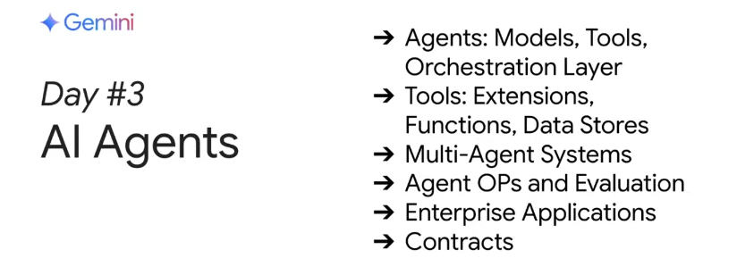

# [Day 3] 生成式 AI 代理人

在第三天的課程中，你將深入探索生成式 AI 代理人的世界。你不僅會學習如何構建複雜的 AI 代理人，了解其核心組件與反覆開發流程，還會接觸到進階的代理架構與方法，例如多代理系統、代理評估等技術。透過本單元的學習與實作，你將掌握如何將大型語言模型連接到現有系統，並與現實世界互動。

## 本單元內容

- **🎙️ Podcast 聆聽**  
    收聽本單元的Podcast 摘要，先行瞭解生成式 AI 代理人的基本概念與運作原理。

- **📄 白皮書閱讀**  
    閱讀《Generative AI Agents》白皮書，以深入了解代理人相關的理論基礎與設計方法。

- **💻 Kaggle 實作練習**  
    透過 Kaggle 上的 codelab 練習，你將完成以下項目：
    1. **與資料庫互動 (使用函數調用)：**  
        利用函數調用技術，讓 AI 代理人能與資料庫進行互動，從中檢索所需資訊。
    2. **建立代理訂單系統 (LangGraph)：**  
        使用 LangGraph 平台，構建一個模擬咖啡廳訂單的 AI 代理系統，實現代理人與現實業務的結合。

- **[選修] 進階單元 3b - “Agents Companion”**  
    此單元為選修內容，包括：
    - 收聽進階單元的 Podcast 摘要。
    - 閱讀進階《Agents Companion》白皮書，了解更多進階代理人設計與應用。

!!! info "本日學習重點"

    今天的課程重點在於：

    - **代理人基礎：**  
      學習生成式 AI 代理人的核心組件與反覆開發流程，瞭解如何從概念到實作建構出功能完整的代理人。

    - **進階代理架構：**  
      探索多代理系統、代理評估等進階技術，了解如何設計更智能且互動性更高的代理人架構。

    - **實作與整合：**  
      透過 Kaggle 上的實作練習，學習如何將大型語言模型與現有系統連接，實現與現實世界的互動應用。  
      例如，透過函數調用技術為聊天機器人提供 SQL 工具（包含 Gemini 2.0 Live API 範例），以及構建一個在咖啡廳中接單的 LangGraph 代理系統。

    透過今天的學習，你將能夠設計並構建出既智能又實用的 AI 代理系統，並深入了解代理人如何與外部系統連結，共同創造更具應用價值的解決方案。

## Day 3 直播精華整理 
第三天的直播聚焦在生成式 AI 代理。今天我們深入探討了如何利用前兩天學到的基礎模型、提示工程、embeddings 與向量資料庫等技術，來打造能夠觀察、推理並自主或半自主執行任務的 AI 代理。講者們除了介紹生成式 AI 代理的基本概念與核心組成（如模型、工具與調度層）之外，還分享了如何利用工具調用、外部資料連結，以及多代理系統的應用與挑戰。

---

## Q&A 專家問答
### Q1：請問 Notebook LM 的功能與優勢？  
**問題內容：**  
作為 Notebook 和 Project Mariner 的忠實用戶，請問 Stephen 能否簡單介紹 Notebook LM 的核心功能與優勢？

**專家觀點：**  

- **Stephen** 說明 Notebook LM 能夠將上傳的文件轉換成資料庫，並以 AI 專家方式回答相關問題，同時附帶來源引用以驗證事實。  
- 系統還提供視覺化的 mind maps，協助使用者快速導航與理解複雜資訊。

---

### Q2：如何設計能夠輔助人類的生成式 AI 代理？  
**問題內容：**  
請問在設計能夠輔助人類思考與創造的 AI 代理時，應注意哪些設計原則？又如何平衡代理人的自主性與使用者控制？

**專家觀點：**  

- **Stephen** 強調模型必須嚴格根據上傳的文件資料來回答，確保事實正確。  
- 同時，必須給予模型一定的創意空間，以便提供額外的思考點，但不能偏離核心資料。  
- 提到不同版本模型對指令解讀可能不同，需持續調整 prompt 以達到最佳平衡。

---

### Q3：如何評估與除錯 AI 代理的行為？  
**問題內容：**  
在定義、評估及除錯自主或半自主 AI 代理人的行為時，有哪些新方法、測試框架或工具能確保代理人如預期運作並保持與使用者目標一致？

**專家觀點：**  

- **Patrick** 提出傳統「金標準測試資料集」容易因模型更新而失效，建議採用情境（scenario）測試。  
- 情境測試著重任務完成與結果，而非僅僅流程細節，能提供更彈性的評估。  
- 持續的觀察與調整機制是確保代理人穩定運作的關鍵。

---

### Q4：如何協同函式呼叫與 grounded search 提升代理人效能？  
**問題內容：**  
請問在建構 AI 代理時，如何透過函式呼叫與 grounded search 協同運作，確保代理人能準確、安全且可靠地執行多步驟任務？

**專家觀點：**  

- **Julia** 與 **Patrick** 指出，透過函式呼叫能使代理人利用外部工具，減少僅靠模型知識產生幻覺的風險。  
- 使用 few-shot 例子可提升代理人控制函式調用順序的能力。  
- 結合 prompt 工程與工具調用，可大幅提高任務執行的準確性與效率。

---

### Q5：企業在採用生成式 AI 代理時面臨哪些挑戰？  
**問題內容：**  
生成式 AI 代理從實驗階段走向生產部署時，企業在採用上最大的障礙是技術、倫理問題，還是管理代理人行為與整合的複雜性？

**專家觀點：**  

- **Antonio** 強調，關鍵在於滿足使用者需求與確保各代理間的協同運作。  
- 需同時關注局部代理（單一任務）與全局流程（整體運作）的「良好定義」。  
- 建立多維度的監控指標，以確保整體系統的穩定與安全。

---

### Q6：如何防止長時間運行的代理人偏離原始目標？  
**問題內容：**  
面對 LLM 驅動的複雜推理與工具使用，如何確保長時間運行的代理人能持續保持原始目標並避免偏離（drift）？

**專家觀點：**  

- **Antonio** 建議建立監控指標與定期評估機制，持續追蹤代理人行為。  
- 利用外部評估模型（例如 LLM 擔任評審）及 reinforcement learning 技術，幫助調整與校正代理行為。  
- 結合回測資料與人類回饋，以進行動態校正。

---

### Q7：Gemini 是否支援 MCP 以及如何整合？  
**問題內容：**  
請問 Gemini 是否支援 MCP？若支援，如何在代理人流程中整合 MCP？這種組合的優缺點有哪些？

**專家觀點：**  

- **Alan** 表示 Gemini 支援 MCP，並在公開範例中已有展示。  
- MCP 作為輕量化的 API 封裝，有助於簡化跨系統整合。  
- 優點在於降低整合成本，但在處理高度敏感資料的生產環境中，仍需謹慎評估安全性。

---

### Q8：如何處理即時資料的矛盾與錯誤？  
**問題內容：**  
AI 系統如何評估來自多個來源的即時資料可靠性，進而解決矛盾並自我修正錯誤決策？

**專家觀點：**  

- **Julia** 與 **Jacqueline** 提出，可以利用專門的評估代理人收集與整合多方資料，再產生候選回答供系統選擇。  
- 系統可透過多回合的批評與反饋機制，持續自我校正與改善。  
- 設計時需平衡資料處理速度與正確性，避免因即時性而產生誤判。

---

### Q9：高度自主代理人可能存在哪些風險？  
**問題內容：**  
針對能夠自行創造工具的高度自主 AI 代理人，您認為其可能存在哪些根本限制與風險？又該如何安全管理？

**專家觀點：**  

- **Julian** 與 **Allan** 表示，目前高度自主代理人仍需人類介入進行最終審核，以防工具失控。  
- 建議在工具生成過程中設立嚴格的審查與版本控制機制，提高透明度。  
- 強調在生產環境中必須採取額外的安全措施，確保工具創建過程符合預期規範。

---

### Q10：生產環境中部署即時 AI 代理的挑戰有哪些？  
**問題內容：**  
在生產環境中部署即時 AI 代理時，響應時間、API 成本與準確度等方面面臨哪些挑戰？遇到使用者指令衝突或模糊查詢時，有哪些技術可以改善推理？

**專家觀點：**  

- **Assad** 等專家提到，部署時需在響應速度、成本控制與準確性間找到平衡。  
- 從傳統輪詢模式轉為全雙向事件流架構，有助於提升即時互動性能。  
- 當面對模糊或衝突指令時，代理人可透過追問、提供選項或利用歷史記憶來協助判斷。

---

### Q11：整合 Gemini API 時的安全性與隱私考量有哪些？  
**問題內容：**  
在將 Gemini 類 API 整合到可能處理敏感使用者資料的應用程式中，應注意哪些安全性與隱私保護的關鍵考量？

**專家觀點：**  

- **Alan** 強調必須注意使用者資料在各系統間的傳遞與儲存方式，避免資料外洩。  
- 使用前需詳閱服務條款與隱私政策，確保資料不被用於未經授權的訓練。  
- 建議將原始使用者輸入轉換為結構化資料，並搭配傳統 DevOps 與安全管理措施來保護敏感資訊。

---

## Pop Quiz 課後練習

來驗收一下今天「生成式 AI 代理」的學習成果吧！

### Pop Quiz Q1
哪一項最能正確描述生成式 AI 代理？

(A) 只能生成文字的語言模型  
(B) 能夠觀察、推理並利用工具執行任務的應用程式  
(C) 一種用於資料儲存的數據庫  
(D) 用於訓練 AI 模型的硬體設備  

??? 答案

    **正確答案：** B. 能夠觀察、推理並利用工具執行任務的應用程式

    **解釋：** 生成式 AI 代理不僅僅是單純的語言模型，而是結合模型、工具呼叫及調度層等核心組件，協同完成特定任務。

---

### Pop Quiz Q2
在生成式 AI 代理的核心組成中，哪個部分主要負責管理代理內部的推理與行動流程？

(A) 模型  
(B) 調度層  
(C) 工具呼叫  
(D) 數據存儲  

??? 答案

    **正確答案：** B. 調度層

    **解釋：** 調度層負責協調代理的內部思考與行動循環，確保代理能夠根據預定邏輯進行決策與執行，而非單純依賴模型生成文字或數據存取。

---

### Pop Quiz Q3
關於生成式 AI 代理中使用的「函數調用」，下列何者描述正確？

(A) 允許代理直接調用外部 API 以取得最新資訊  
(B) 僅用於生成文字，不會調用任何外部資源  
(C) 僅能調用一次，無法進行多次操作  
(D) 用來儲存代理的設定參數  

??? 答案

    **正確答案：** A. 允許代理直接調用外部 API 以取得最新資訊

    **解釋：** 函數調用使代理能夠動態地調用外部工具或 API，從而獲取即時且真實的數據，並進一步支持任務執行。

---

### Pop Quiz Q4
在生成式 AI 代理中，數據存儲的主要作用是什麼？

(A) 儲存代理的設定與參數  
(B) 為代理提供即時且動態的資料存取能力  
(C) 控制代理的推理流程  
(D) 驗證代理生成內容的準確性  

??? 答案

    **正確答案：** B. 為代理提供即時且動態的資料存取能力

    **解釋：** 數據存儲（Data Stores）主要用於存取與管理外部資料，讓代理能夠基於最新資訊產生更具針對性的回應。

---

### Pop Quiz Q5
關於多代理系統（Multi-agent systems），下列哪項敘述正確？

(A) 多代理系統指的是單一模型處理所有任務  
(B) 多代理系統中，各專家代理協同合作，共同完成複雜任務  
(C) 多代理系統只適用於處理簡單任務  
(D) 多代理系統完全不需要人類介入  

??? 答案

    **正確答案：** B. 多代理系統中，各專家代理協同合作，共同完成複雜任務

    **解釋：** 多代理系統利用不同專長的代理協同合作，以解決單一代理難以應付的複雜任務，進而提升整體系統效能。

---

### Pop Quiz Q6
在生成式 AI 代理中，為什麼需要使用工具呼叫（如 API 調用）？

(A) 以提升生成文字的速度  
(B) 讓代理能夠獲取即時且真實世界的資料並執行相關操作  
(C) 僅用於改善模型的語言生成效果  
(D) 工具呼叫僅能用來加速推理速度  

??? 答案

    **正確答案：** B. 讓代理能夠獲取即時且真實世界的資料並執行相關操作

    **解釋：** 工具呼叫使代理能夠超越模型內部知識的限制，透過調用外部資源取得最新數據，從而生成更具時效性與精確性的回應。
