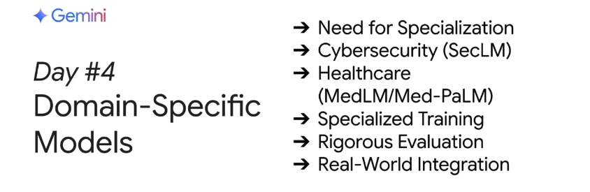

# [Day 4] 特定領域大型語言模型

在第四天的課程中，你將深入探討如何建立與應用專門針對特定領域問題的大型語言模型（LLMs），例如 SecLM 與 MedLM/Med-PaLM。透過閱讀相關資料與實作練習，你將學習如何利用 Google Search 數據引入實際資訊，並使用 Live API 的繪圖工具將數據視覺化；此外，你也會學習如何使用自訂標記資料對 Gemini 模型進行微調，以解決專屬領域的任務。

## 本單元內容

- **🎙️ Podcast 聆聽**  
    收聽本單元的 Podcast 摘要，瞭解特定領域 LLM 的基本概念與應用場景。

- **📄 白皮書閱讀**  
    閱讀《Solving Domain-Specific Problems Using LLMs》白皮書，進一步了解如何解決特定領域問題。

- **💻 Kaggle 實作練習**  
    透過以下練習，你將完成：
    1. **微調 Gemini 模型：**  
        使用自訂標記資料對 Gemini 模型進行微調，解決專屬領域任務。
    2. **利用 Google Search 數據生成回應：**  
        學習如何將 Google Search 的真實數據引入模型生成過程，並運用 Live API 的繪圖工具進行視覺化。
    3. **互動式對話體驗：**  
        若你希望進一步體驗互動式對話，可嘗試將白皮書內容加入 NotebookLM。

!!! info "本日學習重點"

        今天的課程主要讓你了解以下內容：

        - **特定領域模型的建立與應用：**  
          掌握如何構建針對特定領域問題的 LLM，如 SecLM 與 MedLM/Med-PaLM，並了解相關研究人員的見解。

        - **數據引入與視覺化：**  
          學會如何利用 Google Search 數據為模型注入即時資訊，再透過 Live API 的繪圖工具將數據視覺化，提升模型回應的實用性與真實性。

        - **模型微調：**  
          探索如何使用自訂標記資料對 Gemini 模型進行微調，以更精確地解決專屬領域的任務。

        透過今天的學習，你將能夠打造出針對特定領域問題的專用大型語言模型，並學習如何整合實際數據與模型微調，打造符合應用需求的智能解決方案。

## Day 4 直播精華整理

今天的直播聚焦在如何針對特定領域（如資安與醫療健康）進行大語言模型的專精調整。專家們從多角度探討如何利用 fine-tuning、參數高效調整以及混合架構（例如 agent 架構與 RAG 技術）來提升模型在專業應用上的效能與可靠性。同時，也透過 Codelab 示範，從資料前處理、模型微調到效能評估，完整呈現如何實務操作。

---

## Q&A 專家問答

### Q1：專精策略與模型更新  
**問題內容：**  
從研究與工程角度，如何選擇 fine-tuning、參數高效調整或從頭訓練小型模型等策略來專精大語言模型？又該如何在控制成本下，確保模型能持續更新？  

**專家觀點：**  

- **Donnie** 說明，並沒有單一最佳方案，最佳策略取決於任務的複雜度、資料量與品質，必須參考文獻與進行實驗來決定。  
- 補充指出，若運算成本較低，便能更頻繁地更新模型，使其能適應不斷變化的需求。

---

### Q2：fine-tuning 與通用性平衡  
**問題內容：**  
在進行 fine-tuning 時，如何避免模型過度專精導致通用能力流失（catastrophic forgetting）？在何種情況下應該採用提示工程或檢索，而非直接微調？  

**專家觀點：**  

- **Chris** 提到，fine-tuning 容易引發 catastrophic forgetting，必須透過廣泛的評估，確保模型在各類任務下都能維持基本能力。  
- **Scott** 補充，根據模型原始 out-of-box 能力與任務需求，適當利用 in-context learning 或提示調整，能降低微調風險。

---

### Q3：資安領域資料的挑戰與策略  
**問題內容：**  
針對資安領域，如何取得並運用高品質且敏感的資料進行微調？又如何確保模型在提供安全建議時具備準確性與可信度？  

**專家觀點：**  

- **Scott** 表示，最佳做法是結合大量公開資安資訊與內部專有資料，並透過引用來源（citations）來增強回應可信度。  
- 補充指出，利用 runtime 技術（如 RAG）輔助，能有效提升模型在專業應用上的表現。

---

### Q4：醫療與生命科學的挑戰與機會  
**問題內容：**  
在醫療與生命科學領域，專用模型面臨哪些獨特挑戰？如何透過嚴謹評估、數據治理與專家驗證，確保模型在安全、準確及符合法規要求的前提下發揮效能？  

**專家觀點：**  

- **Eva** 指出，醫療領域潛力巨大，但挑戰包括專業術語複雜、資料稀缺及法規嚴格等，因此需採取多面向數據治理與嚴密的驗證流程。  
- 補充：跨領域合作與持續監控對於確保模型應用成功極為重要。

---

### Q5：深度專業知識與過度微調的平衡  
**問題內容：**  
如何在注入深度專業知識與避免模型因過度微調而失去通用性之間取得平衡？是否應考慮利用 RAG 或擴充 context window 來輔助專精調整？  

**專家觀點：**  

- **Caric** 表示，根據任務需求選擇輕量的參數高效微調方式，再輔以長 context window 與 in-context learning，能在專精的同時保有模型的通用能力。  
- 補充：適度微調與上下文資訊結合，是確保模型既專業又不失靈活性的關鍵。

---

### Q6：外部知識庫與即時資料整合  
**問題內容：**  
當外部知識庫提供即時資料流時，如何進行資料 grounding 以確保模型回應既準確又具時效性？  

**專家觀點：**  

- **Scott** 提到，透過緩存機制與動態更新資料庫，可有效整合即時資訊；同時，利用 Google 搜尋 grounding 補足資訊，有助於提升答案的準確度。  
- 補充：依據資料來源的專業性，適時區分使用通用與專用的 grounding 資料。

---

### Q7：空間複雜性管理  
**問題內容：**  
針對 Google Cloud Security 使用的 seim 技術，如何管理多來源資料並監控模型版本變化，確保系統效能持續穩定？  

**專家觀點：**  

- **Scott** 強調，必須建立自動化監控機制，持續追蹤各資料來源及模型行為的變化，並依照狀況進行調整，以維持高效運作。

---

### Q8：混合架構設計的考量  
**問題內容：**  
何時應採用 domain specific LLM、通用 LLM 或兩者結合的混合架構？是否有 agent 架構能協同運作以彌補各自不足？  

**專家觀點：**  

- **Caric** 與 **Eva** 指出，利用 agent 架構可整合通用模型與專用模型，由 orchestrator 動態調度，並引入即時資料補強，達到最佳解決方案。  
- 補充：混合架構需考量運算資源與系統複雜度，靈活根據任務需求選擇最適方案。

---

### Q9：關鍵產業應用的限制與挑戰  
**問題內容：**  
在醫療、金融等關鍵產業中，domain specific LLM 面臨哪些技術與系統整合限制？如何彌補這些差距以促進更廣泛的採用？  

**專家觀點：**  

- **Donnie** 表示，主要挑戰在於系統整合的複雜性、多方利益關係與嚴格監管，解決之道需要從技術改進與跨領域合作兩方面入手。

---

## Pop Quiz 課後練習

### Pop Quiz Q1
在醫療領域中，MedM 與 MedP 模型的主要目標是什麼？

(A) 完全替代醫生進行診斷  
(B) 利用先進 AI 輔助醫療決策，改善健康照護  
(C) 自主學習醫療知識，完全無需人為干預  
(D) 建立一個能回答所有醫療問題的通用系統

??? 答案

    **正確答案：** B

    **解釋：** 這兩個模型旨在輔助醫療專業人員，保持人類在決策迴圈中，從而提升整體健康照護品質。

---

### Pop Quiz Q2
在 fine-tuning 過程中，最常見的風險是什麼？

(A) 模型過度泛化  
(B) catastrophic forgetting  
(C) 提示工程效果不佳  
(D) 過量數據導致訓練失敗

??? 答案

    **正確答案：** B

    **解釋：** 過度微調可能導致模型失去原有的通用知識，即所謂的 catastrophic forgetting，因此必須謹慎評估微調程度。

---

### Pop Quiz Q3
針對資安應用，哪一項技術能有效補足模型在即時資料上的不足？

(A) 大規模數據儲存  
(B) 強化學習  
(C) Retrieval Augmented Generation (RAG)  
(D) 模型參數逐步調整

??? 答案

    **正確答案：** C

    **解釋：** RAG 能夠從外部即時資料中補充資訊，提升模型回應的準確性與時效性。

---

### Pop Quiz Q4
混合架構的主要優勢是什麼？

(A) 完全依賴單一模型，簡化系統設計  
(B) 結合通用模型與專用模型，互補彼此不足  
(C) 降低資料需求  
(D) 減少硬體運算成本

??? 答案

    **正確答案：** B

    **解釋：** 混合架構透過 agent 機制整合不同模型的優勢，既能提供流暢的對話交互，又能注入專業領域知識。
