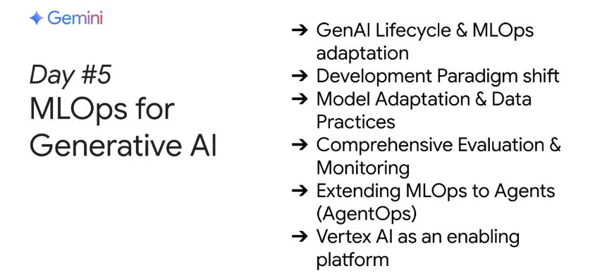

# Day 5: 生成式 AI 的 MLOps

在第五天的課程中，你將探索如何將傳統的 MLOps（機器學習運維）實踐應用到生成式 AI 中，並學習如何運用 Vertex AI 提供的工具來支援基礎模型與生成式 AI 應用（例如 AgentOps 代理應用）。今天沒有 codelab 練習，但請務必收聽本單元的 Podcast 摘要，並閱讀《MLOps for Generative AI》白皮書，以便在明天的直播中進行代碼 walkthrough 與現場示範。在直播中，我們將展示 [goo.gle/agent-starter-pack](https://goo.gle/agent-starter-pack) 儲存庫，此資源旨在簡化生成式 AI 的 MLOps 流程，加速產品化部署。

## 本單元內容

- **🎙️ Podcast 聆聽**  
  收聽本單元的 Podcast 摘要，了解生成式 AI MLOps 的基本概念與應用挑戰。

- **📄 白皮書閱讀**  
  閱讀《MLOps for Generative AI》白皮書，深入瞭解如何將傳統的 MLOps 技術調整並應用於生成式 AI，並學習如何利用 Vertex AI 的工具來管理和部署基礎模型與生成式應用。

- **直播預習**  
  雖然今天沒有 codelab 練習，但請提前瀏覽 [agent-starter-pack 儲存庫](https://goo.gle/agent-starter-pack)（請點擊連結進入）。明天的直播中，我們將進行代碼 walkthrough 及現場示範，展示如何利用此資源簡化生成式 AI 的 MLOps 流程，加速產品化部署。

- **互動式對話體驗**  
  若你希望進行更具互動性的對話，也可以嘗試將白皮書內容加入 NotebookLM，進一步與模型進行互動交流。

!!! info "本日學習重點"

        今天的課程主要讓你了解：

        - **生成式 AI 的 MLOps 實踐：**  
          探索如何調整傳統 MLOps 技術，並應用於生成式 AI 領域，包括模型監控、部署、版本管理等關鍵技術。

        - **Vertex AI 工具應用：**  
          學習如何利用 Vertex AI 提供的工具與服務，支援基礎模型及生成式 AI 應用（例如 AgentOps）的管理與部署。

        - **直播演示預習：**  
          瀏覽並預習 [agent-starter-pack](https://goo.gle/agent-starter-pack) 儲存庫，了解如何利用這個資源來簡化生成式 AI 的運維流程，並加速生產部署的步伐。

        透過今天的學習，你將能夠掌握生成式 AI 的運維方法，並利用現代化工具有效管理與部署 AI 模型，為後續的產品化應用打下堅實基礎。

## Day 5 直播精華整理
在最後一天的內容，討論如何運用 MLOps 將生成式 AI 應用落地生產。這一天的內容主要聚焦於利用 Vertex AI 平台實現 Gen AI 的全生命周期管理，從數據準備、模型適配、評估與監控，到部署與治理。講者們回顧了前幾天所學的基礎模型、嵌入式表示、代理系統以及領域專屬模型，並進一步探討了如何將這些技術組合起來，打造出既高效又可持續運營的 AI 產品。同時，專家們也就細分領域（如醫療、資安）中專業模型的微調策略、代理與混合架構、數據對齊與即時更新等挑戰進行了深入討論。

## Q&A 專家問答

### Q1：最新技術如何協助生產化生成式 AI 代理？  
**問題內容：**  
請問在代理領域中，面對迅速發展與生產化挑戰，最新有哪些技術可以協助開發者將代理系統投入實際生產？

**專家觀點：**  

- **Sora Tovari** 表示，代理技術正從僅依賴提示包裝，轉向具備真實行動能力的代理系統。  
- 強調使用各種開源框架（例如 LangChain、LangGraph）來管理與編排代理。  
- 提到「函數調用」技術，使大型語言模型能夠與外部 API 或資料源互動，進而執行實際任務。  
- 認為自動化評估系統（例如 autoerators）對於驗證代理在生產環境下的效能十分關鍵。

---

### Q2：生成式 AI 的 MLOps 流程需要哪些新元件或工作流程？  
**問題內容：**  
傳統 MLOps 著重於管理訓練資料與模型版本，但在生成式 AI 中，提示工程、微調、資料集、RAG 以及代理工具鏈管理成為核心，請問需要哪些新的元件或工作流程來協助管理？

**專家觀點：**  

- **Gabriella** 提出，生成式 AI 多以預訓練的基礎模型為起點，後續透過提示工程（當作程式碼來管理）、微調與版本控管來達成客製化。  
- 需要將提示模板視同程式碼進行版本管理與測試，並運用工具鏈整合各項元件（如向量資料庫與資料管道）。  
- 也提及利用 CI/CD 工具及平台（例如 Vertex AI）來自動化整個 MLOps 流程。

---

### Q3：如何在 GCP 中評估生成式模型的輸出品質？  
**問題內容：**  
生成式模型的評估不只依賴傳統準確率，請問在 GCP 中有哪些技術或工具可用於評估模型的流暢度、相關性、避免幻覺，以及安全性和成本效益？

**專家觀點：**  

- **Anand 與 Ivan** 分別指出，可將評估拆解為點對點評估與並排比較，並利用自動化工具（如 autoerators）來達成。  
- 說明利用 Vertex AI 的實驗服務，允許使用者自訂評估指標，進一步監控代理在工具選擇與使用上的表現。  
- 同時關注多模態評估，針對文字、影像與影片生成的品質進行綜合判斷。

---

### Q4：生成式 AI 專案在應用 MLOps 時最大的瓶頸為何？  
**問題內容：**  
從資料準備、微調到監控部署代理與模型的整個生命週期中，目前在應用 MLOps 原則於生成式 AI 專案上，最大的挑戰是什麼？又需要哪些新工具或平台功能來突破這些挑戰？

**專家觀點：**  

- **Socrates 與 IA** 強調，多模態資料（如影像、音訊、影片）的收集與標記是極大挑戰。  
- 指出代理人在工具調用與跨部門協作（例如資料科學家、提示工程師、DevOps 等）上的複雜性，增加了整體管理難度。  
- 提及記憶體管理、代理間互動記錄的維護等技術瓶頸，並呼籲未來需有更完善的監控與自動化評測工具。

---

### Q5：GCP Cloud AI 如何簡化生成式 AI 的 MLOps 生命週期？  
**問題內容：**  
請問 GCP Cloud AI 在簡化生成式 AI 開發者 MLOps 生命週期上有何優勢？在生產化過程中，面臨成本與延遲挑戰又如何解決？

**專家觀點：**  

- **Mike 與 Avon** 表示，Google Cloud 提供了極具開發者友善的工具，如提示版本控管功能（整合於 Vertex AI Studio 與 SDK 中），大幅簡化提示管理流程。  
- 說明利用 Vertex AI Custom Jobs 進行微調，以及 Vertex AI Prediction Service 來快速部署模型。  
- 強調整合監控儀表板、日誌追蹤和 token 數量計算，以便精準管控成本和延遲問題。

---

### Q6：未來五年生成式 AI 的 MLOps 將如何演進？  
**問題內容：**  
展望未來五年，請問生成式 AI 的 MLOps 將如何演進以支援企業級應用，尤其在自動化模型再訓練與治理優化方面？Vertex AI 將扮演何種角色？

**專家觀點：**  

- **Sorob** 指出，未來五年的技術發展將更加迅速，代理系統將呈現更多元且異質的發展趨勢。  
- 建議持續關注 Kaggle、AI Studio 等平台，從中捕捉最新技術動向。  
- 預期 Vertex AI 將提供更完整的企業級管理與部署解決方案，整合自動化模型再訓練及治理優化功能。

---

### Q7：Agentic AI 將如何改變軟體開發生命週期？  
**問題內容：**  
請問 Agentic AI 會如何對軟體開發生命週期產生根本性變革？除了資料科學代理人與 Collab 筆記型電腦外，還有哪些新趨勢正在醞釀？

**專家觀點：**  

- **Socrates 與 Ivan** 提到，生成式 AI 將重塑程式碼撰寫、測試及除錯流程。  
- 引入「vibe coding」概念，主張 AI 作為開發夥伴協助自動產生、測試及優化程式碼。  
- 強調未來各式 IDE 擴充工具（例如支援 Gemini 的外掛）將進一步促進軟體開發全流程的自動化與智慧化。

---

### Q8：未來是否會出現代理人市場及相關新功能？  
**問題內容：**  
請問您認為未來是否會出現由軟體公司或數位創作者打造的代理人市場？在即將到來的 Google Cloud Next 上，是否會有與代理人相關的新功能或公告推出？

**專家觀點：**  

- **Sorob** 回應認為，市場上將會出現多樣化的代理人，且它們會根據效能與應用場景展現出各自的特色。  
- 強調代理人的安全性、驗證及存取控制將成為未來關鍵，類似於行動裝置應用商店的審核機制。  
- 舉例提到 Stripe 近期展示的代理人間支付解決方案，並預期在 Google Cloud Next 上會有更多相關公告與新功能推出。

---

## Pop Quiz 課後練習

來驗收一下今天「生成式 AI 代理」的學習成果吧！

### Pop Quiz Q1
哪一項不是生成式 AI MLOps 的核心實踐？

(A) 提示工程與評估作為反覆迭代的循環  
(B) 資料驗證、模型評估與模型監控  
(C) 從零開始訓練基礎模型  
(D) 管理與版本控管提示模板、流程定義與外部資料集  

??? 答案

    **正確答案：** C. 從零開始訓練基礎模型

    **解釋：** 生成式 AI MLOps 的重點在於運用預訓練模型並針對應用進行客製化，而非從頭訓練一個基礎模型。

---

### Pop Quiz Q2
什麼是生成式 AI 中的提示模板（prompt template）？

(A) 使用者直接輸入的簡單文字  
(B) 包含指令、範例與使用者輸入佔位符的一組結構化文本  
(C) 基礎模型本身  
(D) 模型所產生的最終輸出  

??? 答案

    **正確答案：** B. 包含指令、範例與使用者輸入佔位符的一組結構化文本

    **解釋：** 提示模板提供一組指導模型如何回應的指令和範例，並在適當位置插入使用者輸入，協助生成更精確的輸出。

---

### Pop Quiz Q3
生成式 AI 應用中進行 chaining 的目的是什麼？

(A) 維持模型輸出的即時性  
(B) 避免幻覺現象並保持即時性  
(C) 增加模型的複雜度  
(D) 降低模型的運算效率  

??? 答案

    **正確答案：** B. 避免幻覺現象並保持即時性

    **解釋：** 透過 chaining 技術，可以將模型的輸出串連起來，有效降低幻覺現象，同時保持輸出的連貫性與即時性。

---

### Pop Quiz Q4
為什麼評估在生成式 AI 系統開發中是一個關鍵步驟？

(A) 確保模型部署於正確的基礎架構上  
(B) 優化資源利用與降低延遲  
(C) 追蹤資料與模型版本的沿革  
(D) 測量模型輸出的品質與效能  

??? 答案

    **正確答案：** D. 測量模型輸出的品質與效能

    **解釋：** 評估能夠檢驗模型在實際應用中是否符合預期的效能，包括流暢度、相關性與安全性，是確保生成式 AI 系統成功的關鍵步驟。

---

### Pop Quiz Q5
下列哪一個 Vertex AI 產品可以在生產環境中持續執行評估工作並監控生產偏差與漂移？

(A) Vertex AI 模型監控  
(B) Vertex AI Pipelines  
(C) Vertex AI 特徵庫  
(D) Vertex AI 模型註冊  

??? 答案

    **正確答案：** B. Vertex AI Pipelines

    **解釋：** Vertex AI Pipelines 能夠自動化評估任務及持續監控模型的生產表現，包括偏差與漂移，協助維持系統穩定運作。
