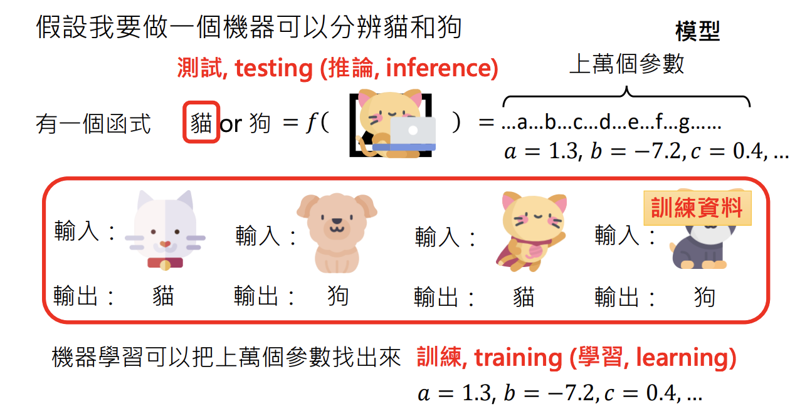
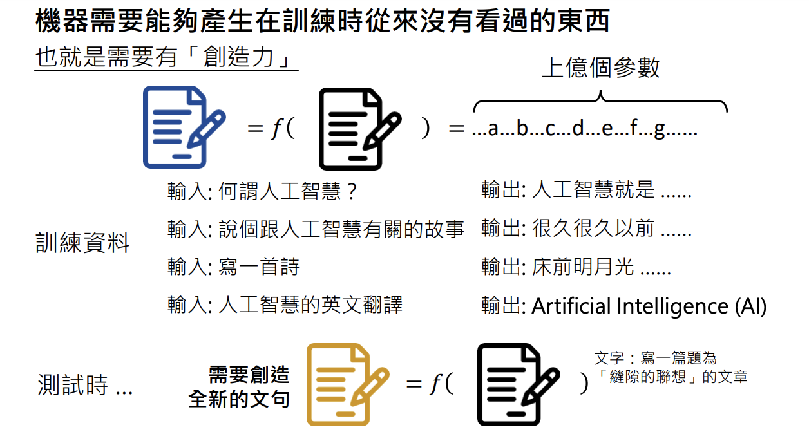

# 生成式AI是什麼？
> 李宏毅 生成式導論 2024 第1講

<iframe width="560" height="315" src="https://www.youtube.com/embed/JGtqpQXfJis?si=1eDwlRxLV3Xctr3f" title="YouTube video player" frameborder="0" allow="accelerometer; autoplay; clipboard-write; encrypted-media; gyroscope; picture-in-picture; web-share" referrerpolicy="strict-origin-when-cross-origin" allowfullscreen></iframe>

<iframe style="border-radius:12px" src="https://open.spotify.com/embed/episode/15r9XLdXicJQpGybCbcVf9?utm_source=generator&theme=0" width="100%" height="152" frameBorder="0" allowfullscreen="" allow="autoplay; clipboard-write; encrypted-media; fullscreen; picture-in-picture" loading="lazy"></iframe>

近年來，「生成式人工智慧（Generative AI）」席捲全球，不管是在產業還是學術研究領域，都引爆了一股前所未見的熱潮。像是大家耳熟能詳的 **ChatGPT**，或者能夠將「文字變成圖像」的 **Stable Diffusion**、**Midjourney** 等，都是生成式AI技術的精彩應用。相較於傳統的AI通常用來做分類（例如垃圾郵件偵測、貓狗分類），生成式AI真正厲害之處在於它能**自行產生過去從未出現的新內容**，包括文字、圖像乃至於程式碼，在創作與問題解決上都大大拓展了AI的潛能。

然而，生成式AI到底是什麼？它和一般AI有什麼不同？在這篇文章中，我會先從生成式AI的定義開始談起，接著逐步介紹它在人工智慧中的定位、背後的技術基礎，以及應用與未來發展的可能性，帶領大家一起探索這個令人興奮的AI領域。

## 生成式AI的定義與特徵
「生成式人工智慧（Generative AI）」最核心的概念，就是**讓機器能夠自動產生複雜而有結構的物件**。舉例來說，一篇文章是由文字組成，一張影像是由像素組成，一段語音是由取樣點組成。這些都屬於複雜度極高、需要龐大組合可能性的資料形式，讓機器從中找出「合理的排列方式」並自動生成內容，就是生成式AI的最大特色。

### 為何說「複雜」？
「複雜」意味著我們無法用窮舉（exhaustive search）去找出所有可能性，因為那幾乎是**天文數字**。課程中舉了個例子：如果要讓機器生成一篇 100 個字的中文文章，而常用的漢字設為 1000 個，那麼理論上的排列組合有 \( 1000^{100} = 10^{300} \) 之多，遠遠超出人類或傳統電腦可以直接枚舉的範圍。

### 生成式AI不是分類
如果是垃圾郵件偵測或貓狗分類，機器只需要在幾個固定的類別中做出選擇，這樣的問題屬於**分類 (classification)**，並不需要機器「從無到有」產生新內容，所以不被歸類為生成式AI。

## 生成式AI在人工智慧中的定位
從整個AI發展的宏觀角度來看，生成式AI只是人工智慧眾多目標之一。AI 的應用範疇極廣，包含影像辨識、語音辨識、推薦系統、機器翻譯等等，而生成式AI的著眼點就是讓機器能 **「創造」**，而非單純地「判斷」或「分類」。

!!! note

    左圖呈現的是教授所認為的 AI 技術與目標之間的關係，右圖則是網路上常見的『AI－機器學習－深度學習－生成式AI』關係示意。教授認為深度學習只是達成生成式AI的技術手段，而生成式AI本身是一個獨立的目標，不應該被直接歸入深度學習的範疇。不過，就現階段而言，要實踐生成式AI的主要方法仍然是深度學習，所以暫且接受這樣的歸納方式。

### 深度學習 vs. 生成式AI
尤其近年來深度學習（Deep Learning）大放異彩，提供了許多強力的技術手段（例如各種神經網路架構），得以讓生成式AI在現實層面快速突破。正如課程中所提到的：

!!! note

    深度學習是技術，生成式人工智慧是一個目標。

生成式人工智慧是人工智慧的眾多目標之一，可以讓機器產生複雜而有結構的物件。

---

## 機器學習的基礎：從函式學習到生成式模型
談生成式AI前，不能不先了解「機器學習（Machine Learning）」最基本的運作邏輯：**透過資料學習出一個函式**。在最簡單的數學模型裡，假設有 \( y = f(x) = ax + b \)，只要給定足夠的輸入 \( x \) 與對應的輸出 \( y \)，機器就能自己算出參數 \( a \) 與 \( b \)。

### 訓練（Training）與推論（Inference）
如果要分辨貓和狗，模型可能包含成千上萬的參數。給定輸入與輸出，機器透過學習找出這些參數，這個過程稱為 **訓練 (training)**。推論過程則稱為 **測試 (testing) 或 推論 (inference)**。

- **訓練**：給機器大量範例（輸入與正確輸出），讓它不斷調整參數，直至能對大部分範例都做出準確預測。  
- **推論**：當訓練好之後，拿到一個新輸入，機器就能用已學到的參數來輸出結果。這個階段也稱為測試（Testing）或推論（Inference）。

這個擁有成千上萬參數的函數，通常會以類神經網路來表示，而用於求解這些參數的技術就是深度學習，它是一種機器學習的方法。

## 生成式AI的核心技術：文字接龍
生成式AI的熱門應用中，最廣為人知的就是 。若從深度學習的觀點來看，ChatGPT 本質上是一個具備上億個參數的複雜神經網路，它將文字編碼後，透過多層注意力機制進行運算，最後再以文字形式輸出結果。雖然在數學上可以將其視為一個『函式』，但它遠遠超越了一般人對函式的想像，具有強大的語言理解與生成能力。

### 文字接龍
在語言模型（Language Modeling）中，機器的目標就是一次**預測下一個字**，然後把新預測到的字接到句尾，再繼續預測下一個字。就像在玩接龍遊戲一樣，**逐字生成**，直到產生一段完整的文字回應。下圖顯示了語言模型是如何一步步預測下一個字的流程。

事實上，GPT（Generative Pre-trained Transformer）家族的模型正是以這種自迴歸生成（Autoregressive Generation）的方式運作。每次都根據前面所有的上下文，推斷最可能出現的下一個字，並將其接續到現有的序列之後。如下圖所示，對於文章（由文字構成）或圖片（由像素構成），都可以透過將內容切割成較小的單位（字或像素），按照某種固定的順序依序產生。

生成式人工智慧面臨的挑戰在於，它必須能夠產生連訓練期間從未出現過的內容。就好比要它生成一首資料庫中不存在的詩，在這裡教授將這項能力稱為「創造力」。

## AI畫圖的原理：從 Stable Diffusion 到 Midjourney

除了文字聊天外，生成式AI也可以用來 **「自動畫圖」**。像 **Stable Diffusion**、**Midjourney**、**DALL-E** 等模型，都是透過大量的「文字與圖像」的配對資料進行訓練，學會把文字描述轉換成對應的像素分布，進而 **「憑空」生成一張新圖**。

### 自迴歸生成 (Autoregressive Generation)
跟文字接龍很類似的是，有些模型也嘗試用「像素接龍」的方式來生成圖像，稱為 **Autoregressive Generation**。不過在實務上，如果要逐像素預測，圖片的維度過大，導致效果並不如人意（OpenAI 曾做過相關嘗試，但最後並不普及）。

---

## 生成式AI的未來發展與應用

事實上，**生成式AI並不是現在才有**。早在神經網路技術蓬勃之前，就有許多研究在嘗試讓機器自動生成文本或圖像。只是近年來，由於硬體算力提高、深度學習算法演進，以及海量資料庫的可用性，才讓生成式AI真正綻放光芒。

### 多領域應用
- **內容創作**：自動寫作、翻譯、繪圖、影音生成  
- **語音應用**：Text-to-Speech、音樂生成  
- **自動客服**：對話式AI、客服機器人  
- **工程領域**：自動產生程式碼或設計圖

同時，我們也面臨了 **Deepfake** 和假訊息散播的風險。如何在享受創造力的同時，落實適當的監管與倫理規範，是生成式AI必須面對的重要課題之一。

## 結論與總結

生成式AI的出現，讓機器不再只是被動地「辨識」或「判斷」，而是能**主動「創造」**，並在龐大的可能性空間中，找出最符合需求或最有趣的內容。深度學習所帶來的技術進展，更使這項目標不僅限於理論或少量示範，而是能真正在商業與日常生活中落地。

然而，越是強大的技術，越需要更全面的考量，包括產生內容的正確性、偏見問題、侵權爭議，以及在社會倫理層面的影響。未來生成式AI只會持續地精進和擴張版圖，我們也期待在「AI 的創造力」與「人類的價值」之間，能取得更好的平衡與合作，讓這股科技進步真正成為全民受益的力量。

