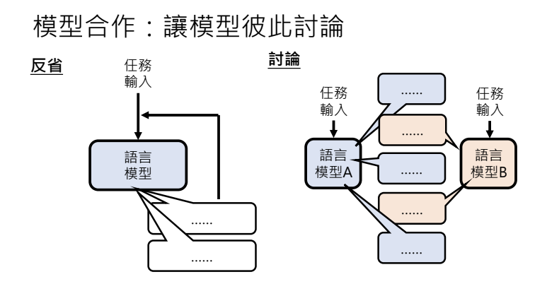
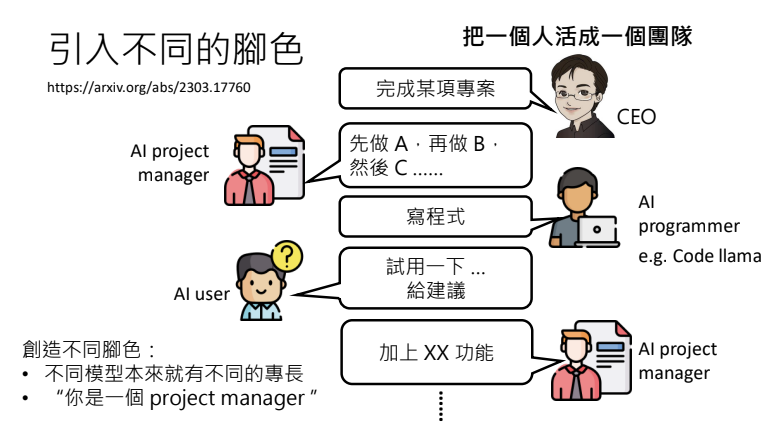
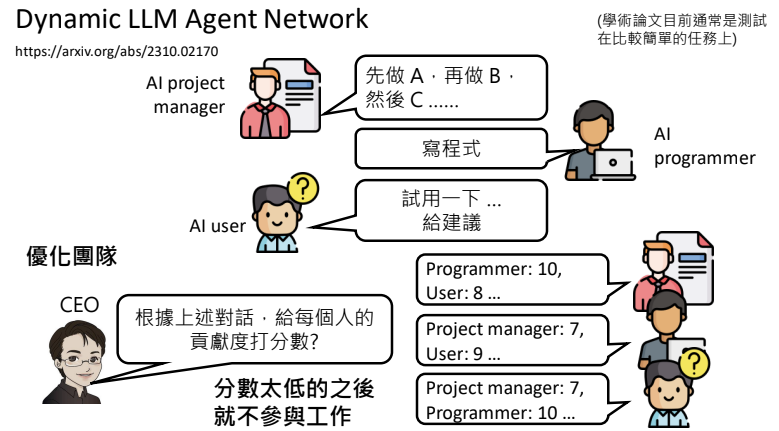

# 訓練不了人工智慧？你可以訓練你自(下)-讓語言彼此合作，把一個人活成一個團隊
> 李宏毅 生成式導論 2024 第5講

<iframe width="560" height="315" src="https://www.youtube.com/embed/inebiWdQW-4?si=yheUIBUufiM1oSR4" title="YouTube video player" frameborder="0" allow="accelerometer; autoplay; clipboard-write; encrypted-media; gyroscope; picture-in-picture; web-share" referrerpolicy="strict-origin-when-cross-origin" allowfullscreen></iframe>

<iframe style="border-radius:12px" src="https://open.spotify.com/embed/episode/5AuXrZXx5rI2PLlS17PW02?utm_source=generator&theme=0" width="100%" height="152" frameBorder="0" allowfullscreen="" allow="autoplay; clipboard-write; encrypted-media; fullscreen; picture-in-picture" loading="lazy"></iframe>

本講探討的是如何利用多個大型語言模型（LLM）進行合作，通過分工與討論的方式，不僅能降低成本，還能激發出超越單一模型的智慧和效率。下面的各個部分將從模型分工、互動討論到團隊組建，系統性地呈現相關知識與應用案例。

!!! info

    在《葬送的芙莉蓮》的故事中，一位千年魔法使芙莉蓮與弟子攜手合作，面對自身複製體的致命挑戰。他們藉著彼此絕佳的默契合作，突破了獨自作戰的侷限；正如當前多個語言模型協同合作時，能夠發揮出1+1大於2的效果。

    > 李教授引自動畫《葬送的芙莉蓮》

---

## 不依賴重新訓練參數來提升語言模型能力

語言模型之所以強大，不在於重新訓練其參數，而在於如何運用提示（prompting）策略喚醒模型內部已具備的知識。以下整理了五種錦囊妙計：

1. 神奇咒語  
2. 提供額外資訊  
3. 把任務分多步驟來解
4. 使用工具
5. [語言模型彼此合作](#5)

!!! note

    本文章將探討最後一個主題：
    
    - **語言模型彼此合作**： 多個模型協同合作，整合優勢，提供更全面的回應。

---

## 5. 語言模型彼此合作
我們將探討如何通過設計精巧的對話與討論機制，使得多個語言模型能夠有機協同，形成一個高效運作的智慧團隊。

### 5.1 讓合適的模型做合適的事情

不同語言模型各有其優勢與限制。例如，雖然 GPT-4 功能全面，但因運算與使用成本較高，對於一些簡單任務則可由成本較低的 GPT-3.5 來負責處理。實際上，平台上已經在應用類似技術，利用一個專門的分配模型決定將任務指派給最合適的模型，從而使整體效能與成本達到最佳平衡。

!!! note

    - 參考論文: [FrugalGPT: How to Use Large Language Models While Reducing Cost and Improving Performance](https://arxiv.org/abs/2305.05176)

---

### 5.2 讓模型彼此討論

模型之間的討論能夠互補各自的知識盲點。透過讓一個模型產生答案，再由另一個模型檢視並提出修正建議，最終可形成更完善的結果。這種反覆互動不僅提升回答的正確率，也能激發出更多創新的思路。

---

#### 模型合作：實例中的翻譯討論

在一個具體案例中，李教授示範如何將「葬送的芙莉蓮」翻譯成英文，各個模型則各自提出了多個翻譯版本。（如 *The Buried Laurel*、*Entombed Fleuriem* 等），隨後通過反覆交換意見，逐步達成共識，最終選擇了譯為 *Florian's Redemption*。這個過程展示了模型間通過對話和爭辯，如何產出比單一回應更為精確和創新的結果。

---

#### 模型合作：多一點模型一起討論

實驗顯示，當參與討論的模型數量增加時，整體回答的正確率也會隨之提高。同時，適當增加討論回合數（通常達到約四個回合後效果最佳）能使最終答案更為完善。這意味著，多模型間的充分互動是激發最佳結果的重要因素。

!!! note

    - 參考論文: [Improving Factuality and Reasoning in Language Models through Multiagent Debate](https://arxiv.org/abs/2305.14325)

---

#### 模型合作：多模型怎麼討論

有篇論文研究研究探討了多模型討論的多種方式，包括：
1. 全體模型共同參與討論；
2. 一位模型擔任主管，其他模型分別向其彙報；
3. 模型之間進行串聯式的互動；
4. 兩模型辯論，由第三模型擔任裁判決定最佳回答。

目前論文的結論是，沒有一個最合適的討論方式，不同任務對應不同的討論模式，根據實際需求選擇合適的互動方式可以更有效地提升整體效能。

!!! note

    - 參考論文: [Exchange-of-Thought: Enhancing Large Language Model Capabilities through Cross-Model Communication](https://arxiv.org/abs/2312.01823)

---

#### 討論要怎麼停下來？

要讓討論達到最佳效果並最終結束，需要引入一個裁判模型。該模型根據各模型間的對話內容進行判斷，決定是否達成共識並產生最終摘要。這個機制不僅能防止討論變得拖泥帶水，同時也能確保不會因過早結束而錯失進一步深入探討的機會。

---

#### 討論會不會停不下來？

實際上，模型間的討論往往不會無限延續，主要是因為在設計 prompt 時通常會引入激發反對與挑戰的指令，使討論在達到一定深度後自然結束。關鍵在於如何設計 prompt，使得模型既能充分發揮質疑與辯論，又不至於因過度懷疑而提前終止討論。

!!! note

    - 參考論文: [Encouraging Divergent Thinking in Large Language Models through Multi-Agent Debate](https://arxiv.org/abs/2305.19118)  
    - 參考論文: [Improving Factuality and Reasoning in Language Models through Multiagent Debate](https://arxiv.org/abs/2305.14325)

---

### 5.3 團隊需要有不同的腳色

團隊分工是成功合作的重要關鍵。不僅在傳統的勇者小隊中需要不同專長的成員，在語言模型的應用中也同樣適用。透過讓模型根據自身專長分工，可以使整個系統發揮出更高的效率與精準度。

---

#### 引入不同的腳色 - 建立團隊

在一個專案中，可能需要負責規劃的專案經理(PM)、執行程式碼的工程師以及測試用戶等角色。藉由讓不同模型各自扮演特定角色，不僅能針對任務的不同面向進行專業處理，也能利用模型之間的互補優勢提高整體表現。

!!! note

    - 參考論文: [CAMEL: Communicative Agents for "Mind" Exploration of Large Language Model Society](https://arxiv.org/abs/2303.17760)

---

#### 引入不同的腳色 - 優化團隊

[參考論文_Dynamic LLM-Agent Network: An LLM-agent Collaboration Framework with Agent Team Optimization](https://arxiv.org/abs/2310.02170)

除了組建團隊，團隊內部的優化也是關鍵。透過讓各模型互相評分，將表現較差的模型淘汰，能持續提升團隊效能。這種考績機制類似於企業內部的績效評估，旨在建立一支高效且專注的模型團隊。

---

#### 開源專案

目前已有多個開源專案，如 [MetaGPT](https://github.com/geekan/MetaGPT)、[ChatDev](https://github.com/OpenBMB/ChatDev) 等，展示了如何利用多個語言模型協同工作，完成從寫程式到自動化專案管理等任務，為未來更廣泛的應用提供了可能。

!!! note

    - 參考論文 MetaGPT: [Meta Programming for A Multi-Agent Collaborative Framework](https://arxiv.org/abs/2308.00352)  
    - 參考論文 ChatDev: [Scaling Large-Language-Model-based Multi-Agent](https://arxiv.org/abs/2406.07155)

---

#### 由 AI 組成的社群

除了團隊合作，還有研究探索由多個語言模型組成的虛擬社群，甚至模擬出具有人際互動與情感連結的「AI 村民」。這類實驗展示了語言模型在未來可能不僅僅是工具，而是能夠構成一個完整生態系統的智能體系。

!!! note

    - 參考論文: [Generative Agents: Interactive Simulacra of Human Behavior](https://arxiv.org/abs/2304.03442)  
    - 參考影片: [【生成式AI】讓 AI 村民組成虛擬村莊會發生甚麼事？](https://www.youtube.com/watch?v=G44Lkj7XDsA&t=3s)

---

## 結語

從《葬送的芙莉蓮》中的團隊協作故事，到現今多模型間的討論與分工，不難看出，合作與專業分工始終是解決複雜問題的重要法則。透過合理分配任務、促進模型間的充分交流，以及建立完善的團隊評估機制，我們不僅能在成本上取得優勢，更能激發出語言模型潛在的巨大效能。未來，當每個模型都專注於自身的強項時，集合起來的智慧便足以改變整個產業的面貌，甚至實現「一個人活成一個團隊」的夢想。
