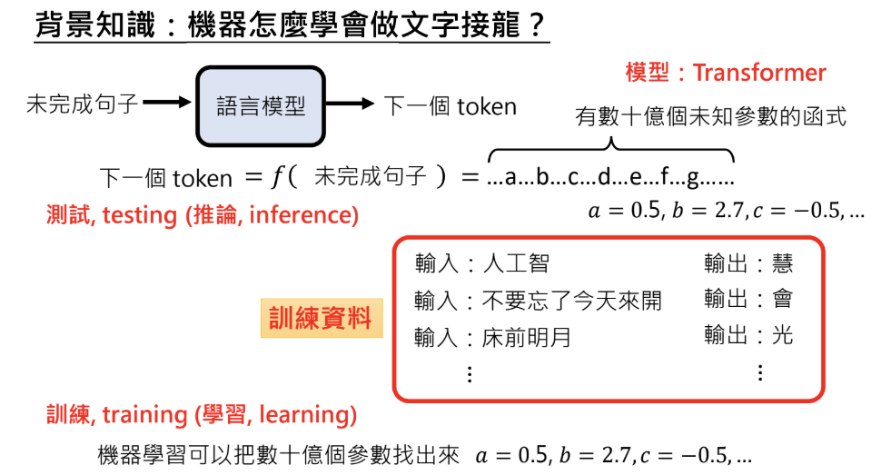
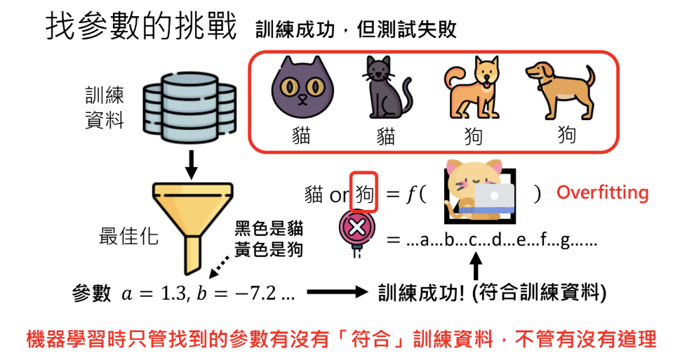
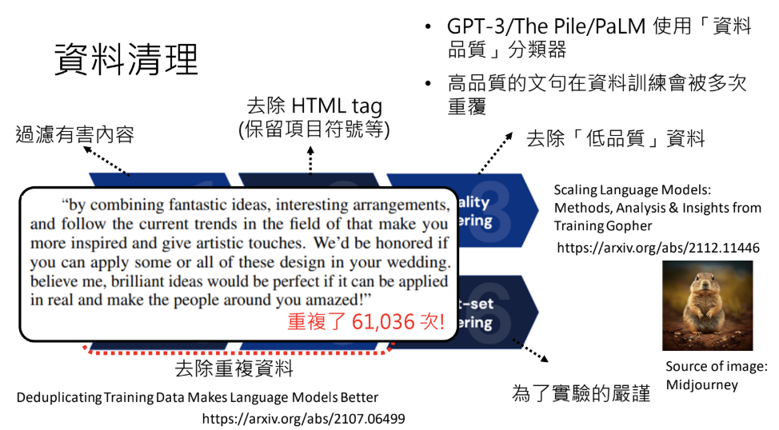

# 大型語言模型修練史 — 第一階段: 自我學習，累積實力
> 李宏毅 生成式導論 2024 第6講

<iframe width="560" height="315" src="https://www.youtube.com/embed/cCpErV7To2o?si=_kQvul5OZR2vtxvN" title="YouTube video player" frameborder="0" allow="accelerometer; autoplay; clipboard-write; encrypted-media; gyroscope; picture-in-picture; web-share" referrerpolicy="strict-origin-when-cross-origin" allowfullscreen></iframe>

本講將深入探討大型語言模型如何從海量資料中自我學習，並通過持續的參數調整與最佳化過程，逐步累積知識與能力。這些模型不僅能夠精準捕捉語言結構與文法規律，更在多樣化應用中展現出卓越效能，從自動生成文本到複雜語言理解任務，都證明了深度學習技術的巨大潛力。

這部分文章將分為三篇，分別剖析大型語言模型的三個修煉階段：

- 第一階段：自我學習，累積實力
    - 透過海量資料進行文字接龍訓練，持續調整與優化參數，逐步打下穩固的內功基礎。

- 第二階段：名師指點，發揮潛力
    - 結合人類專業指導與精緻化資料，讓模型得以更精準地應用已學知識，並克服過去的侷限。

- 第三階段：參與實戰，打磨技巧
    - 將模型投入真實世界情境，經由反覆驗證與調整，最終形成能靈活應對各種任務的強大能力。

!!! info

        所有的階段都是在學文字接龍，只是訓練資料不同。

本文著重第一階段「自我學習、累積實力」，說明模型如何透過海量資料進行文字接龍訓練，並在不斷的參數調整與最佳化過程中逐步累積知識與能力，為後續階段的發揮奠定堅實基礎。

---

### 背景知識：文字接龍

大型語言模型的核心任務即是文字接龍：根據已輸入的未完成句子，逐步生成後續文字。這個生成過程中，每一次輸出都稱為一個 *token*（在本課程中假設一個中文字就是一個 token）。

從基本原理上看，模型實際上是一個函式，輸入一段文字，輸出下一個 token。這個函式由數十億個未知參數構成，而這些參數的具體數值則由訓練資料自動學習得出。

---

### 背景知識：機器如何學會做文字接龍？

模型學習文字接龍的過程可分為兩個主要階段：

1. **訓練（Training / Learning）**  
   利用大量的訓練資料，模型在接收到不完整句子時，根據資料中正確的接續選項來找出最佳參數組合。這個過程本質上是一個最佳化（Optimization）任務，透過不斷調整參數（包括超參數設定）來最小化錯誤，從而讓模型能夠正確預測下一個 token。

2. **推論（Testing / Inference）**  
   當模型完成訓練後，便可以利用得到的參數進行文字接龍，即根據新的未完成句子產生連貫的文字。

!!! note

    在此過程中，模型本質上只依賴訓練資料來「學習」如何接龍，而無法理解資料背後更深層的意義或世界知識。

---

### 找參數的挑戰

在模型訓練中，調整數十億個參數以使其符合訓練資料的要求是一個極具挑戰的最佳化過程。這裡需要注意幾個重點：

- **超參數（Hyperparameter）的設定**  
  超參數決定了最佳化過程的運行方式，例如學習率、批次大小等。這些由人為設定的參數對最終的訓練結果有著重要影響，但往往需要反覆調整和大量算力支持才能達到理想效果。

- **訓練失敗與過擬合（Overfitting）**  
  有時候即使訓練資料上的結果看似成功，模型在遇到未曾見過的資料時卻表現不佳，這就是所謂的過擬合。例如，若訓練資料中所有貓的圖片均為黑色，而所有狗的圖片均為黃色，模型可能會僅依據顏色來判斷，導致遇到黃色貓時出錯。這反映出僅依賴訓練資料而忽略資料多樣性的問題。

為了讓模型找到更合理的參數，有幾種策略：

- **增加訓練資料的多樣性**  
  異質化的訓練資料能讓模型學習到更多變化，例如在貓狗分類的例子中，加入黃色貓與黑色狗的資料，迫使模型不僅依賴顏色進行分類。

- **設置良好的初始參數（先驗知識）**  
  傳統上，初始參數通常是隨機生成，但若能提供一組接近最終期望值的初始參數，則最佳化過程更容易收斂到理想結果。這類方法有時被視作將「先驗知識」融入模型學習的過程中。

---

### 學習所需資料量與知識層次
要學會文字接龍，涉及兩個層面：語言知識和世界知識。語言知識方面，根據相關文獻，所需資料量並不龐大。然而，要真正做好文字接龍，模型必須對世界知識有所理解。

- **語言知識**：  
  指的是文法、詞彙等基本語言規則，所需資料量可能不多，幾個詞彙或例子即可讓模型掌握文法結構。

- **世界知識**：  
  涉及對現實世界的理解，如物理現象（例如水的沸點隨氣壓變化）和社會常識等。由於世界知識層次繁多，即使擁有數百億 token 的資料，也可能無法完全涵蓋所有情境。這也是為何模型需要龐大的資料量才能在實際應用中表現得更接近人類常識。

舉例來說，水在一般大氣壓下的沸點是 100 度，但在低壓環境下可能只有 50 度。這類知識的多樣性要求訓練資料必須足夠豐富，才能讓模型在不同情境下做出正確的預測。

!!! note

    - 參考論文: [When Do You Need Billions of Words of Pretraining Data?](https://arxiv.org/pdf/2011.04946)

---

### 任何文字資料都可以拿來學文字接龍？

實際上，任何來源的文字資料都能用來訓練語言模型。現今網路上充斥著各式各樣的資料，這些資料可直接用於教模型如何進行文字接龍。這種依賴海量資料的學習方式稱為 **Self-supervised Learning（自督導式學習）**，即模型透過從網路爬取的大量資料自我學習，幾乎不需要人工標記。

!!! note

    此處的訓練是 "train from scratch"，因為有近乎無窮無盡的資料，所以比較不用擔心 overfitting 的問題。

---

### 資料清理與品質控制

即便自監督學習大幅降低了人工介入，基本的資料清理仍然不可或缺。清理流程通常包括：

- 過濾掉有害或不適宜的內容（例如色情、暴力等）。
- 移除不必要的 HTML 符號與格式。
- 利用資料品質分類器篩選高品質資料（例如教科書或維基百科內容），使模型能重複接觸這些資料以加深學習效果。

!!! note

    - 參考論文: [Scaling Language Models: Methods, Analysis & Insights from Training Gopher](https://arxiv.org/pdf/2112.11446)

此外，重複資料的去除也是一項重要工作。有研究指出，網路爬取的資料中可能出現極高頻率的重複內容（例如某婚禮公司業配文重複出現數萬次），若不清理會使模型過度偏向某些特定訊息。

!!! note

    - 參考論文: [Deduplicating Training Data Makes Language Models Better](https://arxiv.org/pdf/2107.06499)

---

## 在 ChatGPT 之前的 GPT 系列
以下將簡要回顧 OpenAI 在 ChatGPT 問世之前推出的三代 GPT 系列模型，從起步階段到大規模進階，帶領大家了解這些模型如何一步步累積能力。大型語言模型的發展歷程，是一個不斷突破規模與效能的過程。從最初的 GPT-1 到 GPT-3，參數規模呈指數級增長，訓練資料量也大幅擴展。然而，僅靠增大模型並無法保證智能的飛躍，每一代 GPT 都面臨新的挑戰與瓶頸，推動研究者持續改進技術，使模型在理解力、生成能力與泛化性上逐步提升。

### GPT-1：起步階段
在 GPT-1 時期，模型雖能生成連貫的文字，但仍無法在複雜任務中展現優異表現。當時的重點在於初步驗證 Transformer 架構在語言生成上的潛力，並為後續的 GPT 版本奠定雛形。

- **參數量**：約 117M
- **訓練資料量**： 約 700 本書的文字內容，資料規模有限。
- **特點**： 作為 GPT 系列的初代模型，重點在探索如何透過機器學習方法，教導模型進行文字接龍。雖然模型規模不大，但首次證明了「預訓練 + 微調」的可行性，開啟了日後深度語言模型的發展。

### GPT-2：初步擴展
儘管 GPT-2 在當時引起了廣泛關注，但在理解深層語意與精準回答特定問題方面，仍存在明顯的局限。模型常出現「亂回答」或「內容不一致」的情況，顯示出單純擴大模型與資料量並不足以解決所有問題。

- **參數量**：約 15 億
- **訓練資料量**：約 40GB
- **特點**： 相較於 GPT-1，GPT-2 的參數量大幅提升，資料規模也明顯擴增。它在文字生成的流暢度與多樣性方面有所突破，並且在某些下游任務上展現了不錯的效果。

#### GPT-3：大規模進階
然而，GPT-3 仍面臨一些挑戰：在某些特定任務上的正確率僅約 50%，顯示模型在「記憶」龐大資訊後，仍難以在複雜情境下充分理解或運用知識。此階段為之後 ChatGPT 等對話式模型奠定基礎，但同時也突顯出要真正實現高水平的語言理解與推理，除了擴充模型規模與訓練資料，還需要進一步的訓練策略與人類指導。

!!! note

    - 參考論文: [Language Models are Few-Shot Learners](https://arxiv.org/pdf/2005.14165)

- **參數量**：達到 175B
- **訓練資料量**：高達 580GB，約 300B 個 tokens
- **特點**： GPT-3 在規模上遠超前兩代，提出了「少樣本學習（Few-Shot Learning）」的概念，讓模型能在不大量微調的情況下，就能根據少量範例完成各種任務。由於使用了巨量資料，模型擁有相當豐富的「世界知識」，生成的文本也更具可讀性與連貫度。

---

### 模型規模與效能挑戰

更大規模的模型並非萬能。實驗顯示，即便將模型放大數倍，其回答問題的準確度仍可能受限於資料品質、最佳化策略與資料多樣性。這也說明了語言模型修煉過程中，僅僅依靠算力與參數量並不足以保證最終效能，資料清理與超參數調整同樣重要。

---

### 模型回答問題的局限

語言模型回答問題時，常出現不精確或不一致的現象，主要原因在於模型僅依據「文字接龍」學習，缺乏專門的問答訓練。雖然可從海量網路資料中獲取訊息，但不會主動驗證正確性，易在面對新情境時產生偏差或混淆。此外，模型掌握的多是字詞與文法規律，並未真正理解問題的意圖或世界知識，因此需要額外的教導與回饋機制，才能讓其回答更精準、穩定。

以「台灣最高的山是哪一座？」為例，網路上可能同時出現了完整的解答、討論區中的不完整對話、甚至是引導讀者自行留言回答的文章。當模型接觸到這些參差不齊的資料時，並不會分辨哪些是正確答案，哪些僅是互動或噪音資訊，導致在回答時可能混淆各種文本片段，或生成似是而非的敘述。

此外，模型對真實世界的理解仍相當有限：

- **缺乏真實世界知識驗證**：模型無法真正「驗證」資訊是否正確，只能在文字中模仿人類的表達方式。
- **僅具表層語言規律**：透過大量資料，模型或許能學到詞彙搭配與文法結構，但缺少對上下文的深層推理與理解能力。
- **未經專門問答訓練**：若缺乏人類指導或特定的訓練機制，模型便無法精準掌握問答的目標與格式。

### 從自我學習到人類指導

第一階段的自我學習使模型從網路上大量爬取資料，自行學習文字接龍，但這種方式使得模型僅能「記住」資料，而無法真正掌握如何正確應用知識。進一步的提升需要第二階段，由人類提供指導，調整模型輸出，使其能更好地回答問題並展現出真正的理解力。

因此，若想讓語言模型真正具備穩定且正確的答題能力，後續仍需加入明確的「教導」過程，例如專門的問答資料、對話式訓練、以及人類回饋強化學習等，才能讓模型不只擁有「大量資訊」，更能在回答問題時展現真正的理解與應用。

---

## 結語

大型語言模型的訓練是一個多層次、複雜的過程，從基本的文字接龍到參數優化，再到資料清理與多樣性補充，每一環節都至關重要。儘管現今的模型在參數規模與資料量上已大幅提升，但在真正「理解」並正確應用知識方面，仍存在不少挑戰。未來，如何在自我學習與人類指導之間找到平衡，將是進一步提升模型效能的關鍵。

