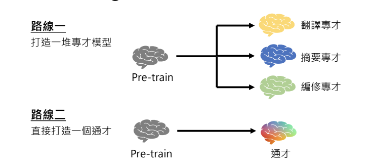
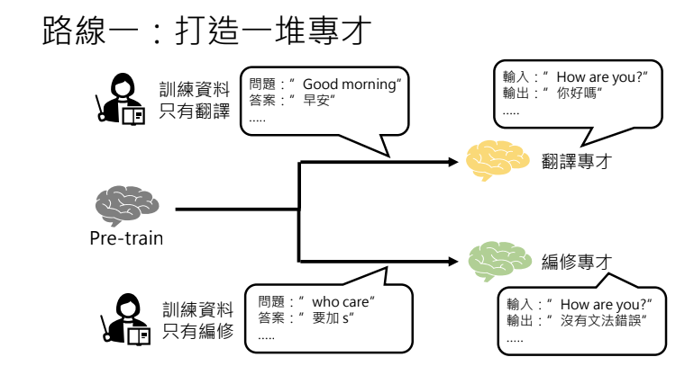
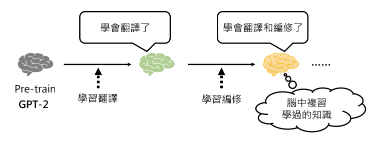
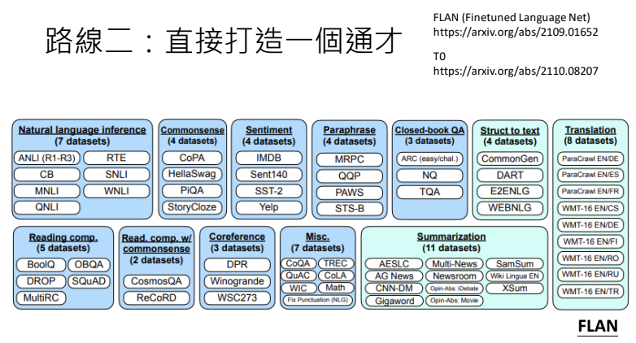
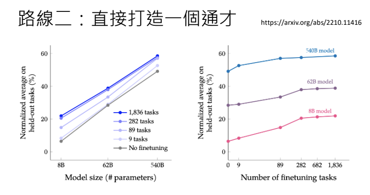
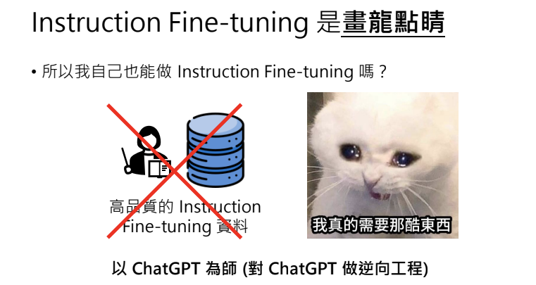

# 大型語言模型修練史 — 第二階段: 名師指點，發揮潛力
## 兼談對 ChatGPT 做逆向工程與 LLaMA 時代的開始

> 李宏毅 生成式導論 2024 第7講

<iframe width="560" height="315" src="https://www.youtube.com/embed/Q9cNkUPXUB8?si=S32Orb4Zyl-Bp-ry" title="YouTube video player" frameborder="0" allow="accelerometer; autoplay; clipboard-write; encrypted-media; gyroscope; picture-in-picture; web-share" referrerpolicy="strict-origin-when-cross-origin" allowfullscreen></iframe>

本講將深入探討大型語言模型如何從海量資料中自我學習，並通過持續的參數調整與最佳化過程，逐步累積知識與能力。這些模型不僅能夠精準捕捉語言結構與文法規律，更在多樣化應用中展現出卓越效能，從自動生成文本到複雜語言理解任務，都證明了深度學習技術的巨大潛力。

這部分文章將分為三篇，分別剖析大型語言模型的三個修煉階段：

- 第一階段：自我學習，累積實力
    - 透過海量資料進行文字接龍訓練，持續調整與優化參數，逐步打下穩固的內功基礎。

- 第二階段：名師指點，發揮潛力
    - 結合人類專業指導與精緻化資料，讓模型得以更精準地應用已學知識，並克服過去的侷限。

- 第三階段：參與實戰，打磨技巧
    - 將模型投入真實世界情境，經由反覆驗證與調整，最終形成能靈活應對各種任務的強大能力。

!!! info

        所有的階段都是在學文字接龍，只是訓練資料不同。

本文著重第二階段「名師指點，發揮潛力」。整合了語言模型從海量文本預訓練到利用人類標註資料進行 Instruction Fine-tuning 的核心技術，並探討如何藉由微調過程讓模型從單一任務「專才」逐步轉變為能夠應對多任務的「通才」。

---

## 1. 人類老師教導與 Instruction Fine-tuning

在語言模型的第二階段訓練中，關鍵在於利用人類提供的標註資料來調整模型的回應。人類老師事先構思出可能的使用情境與問題，並提供對應的正確答案，將這些問答轉換為模型可用來做文字接龍訓練的資料格式。例如，若問題是「臺灣最高的山是哪座？」，正確答案則為「玉山」。資料中通常會明確標示出哪部分屬於使用者輸入，哪部分屬於模型回應，這樣的格式能夠幫助模型在遇到相似情境時，產生符合預期的回覆。

此外，正因為資料需由人類準備，故其數量通常較有限，這也是後續需要結合大規模預訓練參數的重要原因。

資料中將使用者與 AI 的部分做了明確標記，避免出現模糊不清的情況，讓模型在文字接龍時能夠準確判斷何時應該結束回應，何時需要補充更多內容。在上圖中提到的另一個範例裡，當問題是「你是誰？」時，GPT並不是接著問題後面的文字進行延續，而是直接開始回答。這很可能是因為在訓練過程中，模型就已經接收到這類標記符號的資訊。

---

## 2. 預訓練與微調：從大規模數據到精細調控

由於僅靠人類老師提供的標註資料量遠遠不足以覆蓋各種情境，因此第一階段預訓練便成為關鍵。預訓練階段透過從網路上爬取的大量文本數據，讓模型學習到語言的基本規則與複雜結構，形成一組強大的初始參數。這些參數能捕捉到語言中的深層規律，進而在第二階段微調時提供良好的基礎，使得微調後的參數與預訓練參數不會相差過大，從而保留了模型原有的泛化能力。

!!! note

        在微調過程中，模型僅對少量人類標註的資料做「微調」，這個步驟即稱為 Fine-tuning，而預訓練則稱為 Pre-train。

為了防止微調時產生過大的變化，進一步影響模型在未見任務上的表現，常採用一種技術 —— **Adapter**。透過 Adapter（例如 LoRA 技術），可以在不改動原有預訓練參數的情況下，僅針對新增的少量參數進行最佳化，而達到有效降低運算量與保留初始模型知識的目的。

近年來，Adapter 技術在大型語言模型的微調領域蓬勃發展，出現了各種創新的做法與變體。透過這些 Adapter 技術，開發者可以根據任務特性與硬體資源限制，選擇適合的「參數插入方式」。它們的共同目標，都是在保留預訓練模型大量知識的前提下，使用極少量新參數達到高效率微調，並能快速應用於多種場景。

!!! note

        - 參考文獻： [Exploring Efficient-tuning Methods in Self-supervised Speech Models](https://arxiv.org/abs/2210.06175)

---

## 3. Adapter 技術與參數調控

Adapter 技術的核心概念在於，當模型進行最佳化時，不直接改動預訓練獲得的參數，而是在模型結構中額外加入少量的可訓練參數。這樣做不僅降低了調參的計算量，也使得模型的調整保持在一個合理的範圍內，而避免出現學習到不合理的特徵（例如見「最」就答「玉山」的情況）。

實務上，這種方法可以使得新參數與初始參數保持較高的相似性，並確保模型能夠從大量預訓練中學到的複雜規則中獲益，進而具備更好的舉一反三能力。

---

## 4. 舉一反三：模型泛化能力的展現

預訓練階段不僅僅是累積數據，更多的是讓模型學習如何做文字接龍，掌握語言的內在結構與邏輯。這使得模型在面對新的、未見過的任務時，仍能依據已學到的複雜規則做出合理的回應。例如，模型在學習到「臺灣最高的山是玉山」的同時，也能自然而然地理解「世界最高的山是聖母峰」這樣的知識遷移現象。

在GPT出現之前，曾有一款名為BERT的模型在104種語言上進行預訓練。只要訓練它某一種語言的任務，它就能在其他語言上展現出相似的能力。舉例來說，如果教它英文的閱讀測驗，當它學會英文後，同時也具備中文的能力。實驗結果顯示，某些模型經過多語言預訓練後，即使只用單一語言的標註資料進行微調，也能在其他語言上達到相近的表現。這種「舉一反三」的特性，正體現了預訓練參數在泛化上的強大效力，也是大規模語言模型備受矚目的原因之一。

!!! note

        - 參考文獻： [Zero-shot Reading Comprehension by Cross-lingual Transfer Learning with Multi-lingual Language Representation Model](https://arxiv.org/abs/1909.09587)

這項實驗來自一篇2019年的論文。實驗中，先用104種語言的資料進行預訓練，再利用英文問答資料做微調，最後以中文問答進行測試。結果顯示，得到的F1分數與第一個QANet差不多，證明只要有良好的預訓練模型，再搭配適當的微調，模型就能展現出優異的舉一反三能力。

---

## 5. Fine-tuning 路線：打造專才與通才

在大規模語言模型的應用裡，微調（Fine-tuning）是一種常見且重要的調整方式。就微調的策略而言，主要可以分成兩條路線：

1. **打造多個「專才」模型**  
   先把預訓練好的模型，針對不同領域或任務需求進行調整，從而產生多個各司其職的「專才」模型（像是翻譯專才、摘要專才、編修專才等等）。

2. **發展一個「通才」模型**  
   直接把預訓練好的模型，進一步打造成「通才」，讓同一個模型就能同時應付多種任務。

!!! note

        這兩條路線各有優勢，至於要選哪一種，通常就得看實際的應用需求和資源考量。

### 5.1 路線一：打造一堆專才模型

專才路線即針對單一任務進行微調，讓模型在特定領域（如翻譯或編修）上達到極高的精準度。例如，收集大量翻譯資料進行微調，讓模型專注於翻譯工作；或是收集編修相關資料，使模型成為語法編修的專家。這類模型在各自專長的任務上表現極佳，但僅限於單一任務。

BERT 本身就是走「專才路線」的代表。它先在第一階段透過大規模語料進行預訓練，學到通用的語言知識，接著再針對不同任務（像是情感分類、序列標注、問答系統等等）各自進行微調，產生一堆「專才」模型。這種方法強調為每個任務打造一個專門的解決方案，也正是 BERT 在許多 NLP 領域能大放異彩的關鍵。從 BERT 系列模型的實驗結果來看，即使不同任務的專才模型表現已經逼近甚至超越人類水準，但相對來說，應用範圍還是比較受限。

!!! note

        - 延伸閱讀： [【機器學習2021】自督導式學習 (Self-supervised Learning) (二) – BERT簡介](http://youtube.com/watch?v=gh0hewYkjgo)

### 5.2 路線二：直接打造一個通才模型

通才路線的目標是構建一個多任務模型，能夠同時應對翻譯、摘要、編修等多種任務。此方法通常需要集合來自各個任務的標註資料，讓模型在微調時能學習到不同任務之間的共通知識，進而展現出舉一反三的能力。實驗中，通才模型在未曾見過的任務上依然能夠正確回應，顯示出其強大的泛化能力。

第一篇論文提出的想法是：如果無法一次蒐集所有任務所需的大量資料，那就有什麼教什麼──有翻譯資料就先教翻譯，有編修資料就教編修。然而，這種作法可能會遇到「學了新的就忘了舊的」問題，因此論文中提出了「複習」的概念，藉此避免模型在學習新任務時遺忘先前已習得的知識。

!!! note

        - 參考論文： [LAMOL: LAnguage MOdeling for Lifelong Language Learning](https://arxiv.org/abs/1909.03329)  

#### 5.2.1 Google在通才上的發展

後來，許多研究團隊也陸續朝「通才」的方向邁進。最知名的案例之一就是 Google 推出的 FLAN（Fine-Tuned Language Net）模型。它透過大量且多樣化的任務進行訓練，並對語言模型做 Instruction Fine-Tuning，這大約是 2021 年左右的研究成果。 同年 10 月，社群又出現了另一個名為 T0 的模型，做法跟 FLAN 類似：同樣是蒐集一大堆任務，針對模型進行微調，希望能打造一個多功能的「通才」模型。

!!! note

        - 參考論文： [Finetuned Language Models Are Zero-Shot Learners](https://arxiv.org/abs/2109.01652)  
        - 參考論文： [Multitask Prompted Training Enables Zero-Shot Task Generalization](https://arxiv.org/abs/2110.08207)

在 FLAN 的原始論文裡，他們把 FLAN 跟 GPT-3 進行比較。先前提過，GPT-3 在實際應用時常常會出現「不受控」的情況，因此表現並不算太穩定。圖表中，黃色的柱狀代表原始的 GPT-3，紅色則是 GPT-3 加上 In-Context Learning（也就是在提示中給模型一些範例），而藍色則是做過大量 Instruction Fine-Tuning 的 FLAN。結果顯示，面對三個 FLAN 沒見過的新任務時，FLAN 的表現都勝過 GPT-3。實際上，通才模型在指令微調後，其在各種未見過的任務上均能展現出顯著提升的正確率，甚至超越部分專才模型。

之後，Google 又在 2022 年 10 月進一步擴大任務規模，收集了多達 1800 個任務（注意這是 1800 種任務，不是 1800 筆資料；像「翻譯」算一種任務、「摘要」算另一種任務，而每個任務裡面還可能包含上萬筆資料），同樣對語言模型做 Instruction Fine-Tuning。實驗結果相當不錯：若把縱軸視為模型在從未見過的任務上之正確率、橫軸視為模型大小，可以看到不論模型大小如何，只要訓練的任務數越多（顏色越深），模型在新任務上的表現就越好。另一張圖則顯示，當訓練的任務數目增加時，模型在沒看過的任務上也能持續進步。

!!! note

        - 參考論文： [Scaling Instruction-Finetuned Language Models](https://arxiv.org/abs/2210.11416)

在左圖裡，橫軸代表模型大小（參數數量），縱軸則是模型在沒看過的任務上所達到的正確率。結果顯示，如果比較相同大小的模型，當它們在預訓練階段看到的任務越多，效能就越好。右圖的橫軸則是預訓練時所使用的任務數量，縱軸同樣是模型在沒看過的任務上達到的正確率，每一條線分別代表不同參數量的模型。可以看到，隨著預訓練任務數量的增加，模型在沒看過的任務上也能達到更高的正確率。

!!! note

        上一堂課提到那個擁有 5400 億參數的 PaLM，如此龐大的模型，起初在回答問題時常常「不乖乖回應」，甚至還會一直反問你更多問題；可是一旦做過 Instruction Fine Tuning 後，它就穩定下來，能夠好好回答你的問題了。

#### 5.2.2 OpenAI在通才上的發展
OpenAI 在 2022 年 3 月發表了 InstructGPT 這篇論文，主要是對 GPT-3 做 Instruction Fine Tuning。實驗顯示，跟原始的 GPT-3 或加入 In-Context Learning 的 GPT-3 相比，InstructGPT 的使用者滿意度顯著提升；而且在論文中，他們也指出 InstructGPT 表現甚至超越了 Google 的 FLAN 以及 Hugging Face 的 T0。

其中一個關鍵原因是：FLAN 透過模板把現有的 NLP 資料集轉成一問一答的形式，但這些問題往往偏向研究用的「死板」格式。相對之下，OpenAI 早在 2020 年就已經讓 GPT-3 上線，蒐集到許多真實使用者的提問，再請標記人員產生對應的正確答案。由於這些數據更貼近人類實際的使用情境，也更能涵蓋多元的提問形式，因而使 InstructGPT 的表現比只用模板產生問題的 FLAN 更勝一籌。

#### 5.2.3 Meta在通才上的發展
在 InstructGPT 這篇論文裡，OpenAI 發現 Instruction Fine Tuning 才是真正的「畫龍點睛」。很多人以為這類微調需要海量資料，但事實上他們只用了上萬筆就讓模型表現大幅提升。不只 OpenAI，如 Meta 推出的開源語言模型 LLaMA2 也只用了 2.7 萬筆資料，還特別強調「Quality is all you need」。後來他們又發表了 LIMA，只用 1000 筆作者自行編寫的資料進行微調，結果在 43% 的情況下能和 GPT-4 打成平手或甚至勝過 GPT-4，顯示少量且高品質的資料依然能打造出不錯的模型。

!!! note

        - 參考論文： [lama 2: Open Foundation and Fine-Tuned Chat Models]()
        - 參考論文： [LIMA: Less Is More for Alignment]()

---

## 6. Instruction Fine-tuning 與資料品質的重要性

Instruction Fine-tuning 的關鍵在於資料品質，而非僅僅追求資料量。研究顯示，僅需上萬筆甚至更少的高品質標註資料，就足以大幅改善模型的回應準確性。與此同時，真實使用者的問題數據具有不可替代的價值——真實數據能夠反映使用情境的多樣性，使模型在面對各種變形任務時依然能給出正確答案。

### 6.1 我們自己可以做Instruction Fine-tuning嗎？
既然 Instruction Fine Tuning 不需要太多資料，那是不是每個人都能自己來做呢？ 答案並沒有那麼簡單，因為關鍵不在「數量」而在「品質」。如果沒有像 OpenAI 那樣的線上服務，無法蒐集到真實使用者提出的多元問題，就很難獲得高品質的微調資料。換句話說，沒有高品質的指令與對應答案，想自行做出像 InstructGPT 那樣的成果，幾乎是不可能的事。

### 6.2 逆向工程的做法
有些人看到了 Instruction Fine Tuning 不需要太多資料，就想「那我可不可以自己做呢？」但問題在於，你沒有高品質的 Instruction Fine Tuning 資料──不像 OpenAI 有線上服務可以蒐集真實使用者的問題。於是就有人想到：**「以 ChatGPT 為師」**，也就是對 ChatGPT 進行逆向工程，嘗試推測它的 Instruction Fine Tuning 資料是什麼。

做法大致如下：  

1. 先問 ChatGPT：大型語言模型能做哪些事？ChatGPT 會列出各種可能的應用情境，例如幫忙寫郵件、做摘要、協助安排行程等等。  
2. 再讓 ChatGPT 幫你想，針對某個特定任務（像是撰寫郵件），使用者可能會提出哪些具體需求或問題（例如邀請老師來演講、提醒繳交報告等等）。  
3. 最後，直接把這些 ChatGPT 幻想出來的問題丟回去給它，讓它提供答案。這樣一來，你就能取得「問題＋答案」的資料，拿來做自己的 Instruction Fine Tuning。

當然，也有人質疑：從 ChatGPT 逆向工程得到的資料，品質到底夠不夠好？有研究顯示，這些資料可能沒有想像中那麼優質，但「聊勝於無」。雖然 OpenAI 在使用條款裡明確寫著「不得利用 ChatGPT 生成的資料來打造與其競爭的模型」，但不少小團隊還是默默這麼做，畢竟若自己手上完全沒有資料，這也是能取得 Instruction Fine Tuning 資料的一種方法。

!!! note

        - 參考文獻： [Self-Instruct: Aligning Language Models with Self-Generated Instructions](https://arxiv.org/abs/2212.10560)  
        - 參考文獻： [The False Promise of Imitating Proprietary LLMs](https://arxiv.org/abs/2305.15717)

---

## 7. 開源 LLaMA 與全民微調的時代
到目前為止，我們已經有了兩種Instruction fine tuning資料：一種是由人類標註的，另一種是從ChatGPT獲取的。但這還不足以開始進行Instruction fine tuning，因為我們缺乏預訓練的參數。像OpenAI的GPT-3和Google的PALM都有完整的預訓練參數，而我們卻沒有這些資源，整個局面因此陷入僵局，沒有人能夠自行打造大型語言模型。直到有一天，Meta釋出了Llama系列模型，徹底改變了生態。Llama第一代在2023年2月發布，第二代則在2023年7月推出。第三代則在2024年4月推出。

第一代釋出後，引發了學術界與工業界的廣泛關注，世界頓時迎來了解放；兩週後，斯坦福利用Llama預訓練模型和約5萬筆從ChatGPT API獲取的資料，成功打造了Alpaca。隨後，美國其他學校又聯手從一個對話分享平台上獲取了7萬筆資料，對Llama進行Instruction fine tuning，推出了Vicuna。

這些模型都是以 LLaMA 作為初始參數，再搭配少量的 Instruction Fine-tuning 資料，從而構建出具有強大實用性的通才模型。如今，借助開源資源和低廉的計算成本，每個人都可以自行微調大型語言模型，實現個性化應用。各版本的 Llama 層出不窮，每個人都能利用這些公開的預訓練參數打造專屬的模型，這正是我們在作業五和作業六中要實踐的，也鼓勵大家親自嘗試打造自己的語言模型。

!!! note

        - 參考文獻： [A Survey of Large Language Models](https://arxiv.org/abs/2303.18223)

---

## 結語

從預訓練到微調，再從專才到通才，大型語言模型的演進不僅展示了深度學習在自然語言處理領域的突破，也顯示出優質資料與精細調控的重要性。通過 Instruction Fine-tuning，模型能夠在極少量高品質標註資料的輔助下，達到驚人的泛化能力和靈活性。隨著 LLaMA 等開源模型的釋出，未來每個人都有機會參與到這場技術革命中，為各種實際應用場景提供定制化解決方案。

