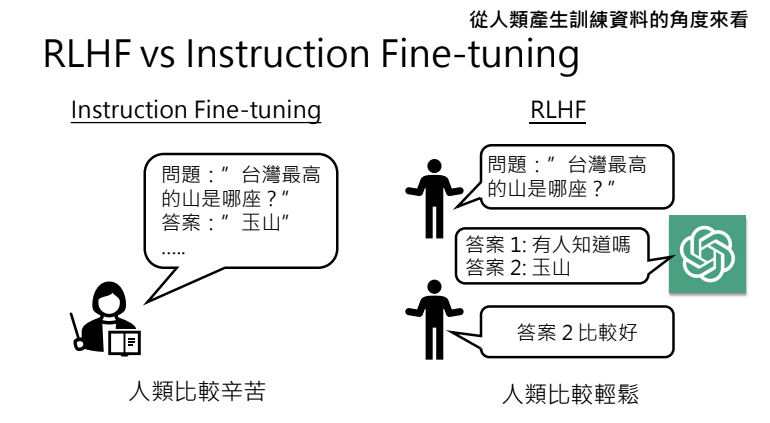
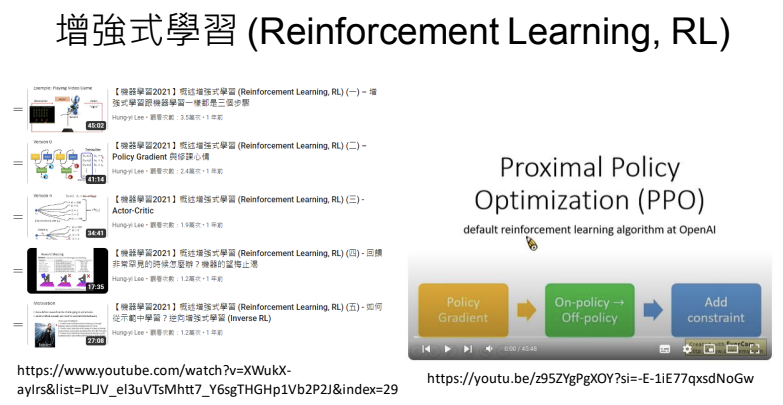

# 大型語言模型修練史 — 第三階段：參與實戰，打磨技巧  
## (Reinforcement Learning from Human Feedback, RLHF)

> 李宏毅 生成式導論 2024 第8講

<iframe width="560" height="315" src="https://www.youtube.com/embed/v12IKvF6Cj8?si=4cAGfkic-rUkN_nv" title="YouTube video player" frameborder="0" allow="accelerometer; autoplay; clipboard-write; encrypted-media; gyroscope; picture-in-picture; web-share" referrerpolicy="strict-origin-when-cross-origin" allowfullscreen></iframe>

??? info "老師叮嚀"

    - 9:30 在這段課程錄影中，為了更清楚地比較 Alpha Go 的訓練過程與大型語言模型的訓練方式，我對 Alpha Go 的實際推論與訓練過程進行了大幅度的簡化。例如，我並未提及 Value Network 和 MCTS 等概念。如果您希望深入了解 Alpha Go 的訓練與推論過程，建議您閱讀原始論文。

    - 13:30 需要注意的是，本段課程主要講述的是 Alpha Go 中 Policy Network 的訓練方式。事實上，Alpha Go 還包含了 Value Network 的訓練，用於估算棋局的勝率。這引發了一個有趣的思考：是否可以在大型語言模型的 RLHF中引入類似的概念？

    - 19:50 在翻譯術語時，Reward Model 可能譯為「報酬模型」或「獎勵模型」比較合適

    - 34:00 有關人生道路的抉擇不建議詢問大型語言模型

本講將深入探討大型語言模型如何從海量資料中自我學習，並通過持續的參數調整與最佳化過程，逐步累積知識與能力。這些模型不僅能夠精準捕捉語言結構與文法規律，更在多樣化應用中展現出卓越效能，從自動生成文本到複雜語言理解任務，都證明了深度學習技術的巨大潛力。

這部分文章將分為三篇，分別剖析大型語言模型的三個修煉階段：

- 第一階段：自我學習，累積實力
    - 透過海量資料進行文字接龍訓練，持續調整與優化參數，逐步打下穩固的內功基礎。

- 第二階段：名師指點，發揮潛力
    - 結合人類專業指導與精緻化資料，讓模型得以更精準地應用已學知識，並克服過去的侷限。

- 第三階段：參與實戰，打磨技巧 
    - 將模型投入真實世界情境，經由反覆驗證與調整，最終形成能靈活應對各種任務的強大能力。

!!! info

    所有的階段都是在學文字接龍，只是訓練資料不同。

在大模型訓練的第三階段，核心在於讓模型與使用者互動並根據回饋進行微調，這一過程稱為增強式學習（RLHF）。使用者在提供回饋的過程中，會根據新舊答案的比較選擇較佳者，進而幫助模型優化生成機率。

---

## 回顧前兩階段
在前三個階段的訓練過程中，第一階段是自督導學習，第二階段是讓人類提供答案進行督導學習，而第三階段則完全基於人類回饋進行調整，重點不在於每一個細節的正確性，而在於最終結果的優劣。

簡單回顧整個訓練流程：

- **第一階段（Pretrain）**  
  利用大量網路資料進行自監督預訓練，無需太多人類介入。

- **第二階段（Instruction Fine-tuning）**  
  透過人類提供正確的問題和答案進行督導式學習，重點在於逐步預測下一個 Token。

- **第三階段（RLHF）**  
  不直接告知正確答案，而是根據完整回答之間的比較回饋來調整模型，重點在於整體回答品質。

## RLHF 與增強式學習的基本概念

在使用模型時，若對回答不滿意，可點擊「重新來一次」，這時候系統會詢問使用者：新舊答案哪個更好。這種回饋資訊成為模型微調的依據，其核心理念在於：
- **提高優良回答的出現機率**：當回饋指示某回答較佳時，模型就調整參數使此回答更可能被生成。
- **降低不佳回答的生成機率**：反之，若回饋認為某回答較差，則模型會降低生成此回答的概率。

此外，RLHF 的實現通常採用演算法如 PPO（Proximal Policy Optimization），其目標在於讓模型在整體生成結果上達到更好的表現，而不只是逐步預測下一個 Token。

---

## RLHF 與 Instruction Fine-tuning 的比較
從產生訓練資料的角度來看，Instruction Fine-tuning 與 RLHF 都需要人類參與，但在 Instruction Fine-tuning 階段，人類需要自行提出問題並提供正確答案，因此較為辛苦；而在 RLHF 階段，模型會先生成多個答案，人類只需選擇較好的回答，過程更輕鬆。

兩種方法皆需要人類介入，但其差異在於：
- **Instruction Fine-tuning**：需要人類直接產出正確答案，強調「每一步」的正確連接（即下一個 Token 的生成），整個過程依賴監督學習。
- **RLHF**：只需要人類在多個候選回答中選出較佳的那一個，重點在於「整體結果」的優劣比較，這使得人類能輕鬆給出偏好，而無需創造正確答案。

RLHF 的優點在於，人類創作正確答案往往困難，但評判答案優劣卻相對容易。舉例來說，若要寫一首讚揚大型語言模型的七言絕句，Instruction Fine-tuning 階段要求人類自行撰寫正確詩句，而這需要很高的創作能力；而在 RLHF 階段，模型先生成兩首詩，再由人類快速選出較佳者（例如：一首不符格式、一首符合格式），以此提供回饋。這說明，對人類而言，評判答案比創作正確答案要簡單得多。

從模型學習的角度來看，Instruction Fine-tuning 主要訓練模型如何預測下一個字，假設每一步都是正確的，最終結果也會正確；但這個假設不總成立，因為模型只關注局部預測。相比之下，RLHF 接收的是完整答案之間的比較回饋，促使模型採用全局思考，專注於生成整體最佳答案，而非僅僅每一步的正確性。

!!! note

    總結來說，Instruction Fine-tuning 著眼於「過程」，而 RLHF 著眼於「結果」，讓模型學習如何在整體生成中顧及人類偏好。

---

## 增強式學習 (Reinforcement Learning, RL) 在語言模型中的應用

增強式學習的概念在於，透過回饋信號微調模型參數，使得生成的完整回答更符合使用者期待。當人類告知某回答較佳時，模型會調整參數以提高該回答出現的機率；反之，降低較差回答的生成機率。這與傳統的逐步預測不同，RLHF 關注的是整體生成結果的品質。

過去語言模型主要只依靠「下一步預測」來生成文字，但這種方法缺乏全局考量。透過 RLHF，模型不再只專注於單一步驟，而是能夠以整體生成的回答作為評估依據，進而達到更一致且符合人類偏好的表現。

---

## 語言模型與下圍棋的類比
將語言模型的生成過程類比為下棋，兩者在本質上都屬於生成式學習，但每一步卻可視為一個分類問題：

- **語言模型**：根據目前的輸入句子預測下一個 Token。
- **AlphaGo**：根據當前棋盤狀況預測下一步落子位置。

  

AlphaGo的對弈過程是，它先根據當前棋局決定下一步落子，接著對手根據更新後的棋局回應，再由AlphaGo依據最新局勢選擇下一步。類似地，語言模型讀取未完成的句子後，會根據機率分佈選擇一個Token並接在輸入後，隨著上下文更新再生成下一個Token。

AlphaGo與對手的互動可以看作是一場棋局接龍，這與語言模型的文字接龍有著異曲同工之妙。AlphaGo首先下第一步，對手接著下第二步，然後AlphaGo根據前兩步決定第三步，如此循環。語言模型則根據當前輸入生成一個token，再依序生成下一個，直至句子結束。雖然整體上看這兩者屬於生成式學習，但每一步實際上都是在解一個分類問題，即在未完成的棋局或句子中選擇最佳的落子或token。

AlphaGo的學習分為兩個階段：首先，它通過模仿棋譜學習，即根據人類棋局模仿下法，這類似於語言模型在預訓練與指令微調階段中學習如何根據人類示範生成下一個字；但僅靠模仿只能應付一般對手。要打敗頂尖高手，AlphaGo必須進行強化學習：與對手對弈後，根據勝負反饋調整各步棋的概率。同樣，語言模型在強化學習階段會生成多個答案，經由人類評判哪個更優，進而調整生成策略，提高好答案出現的機率，降低差答案的機率。這兩者在初期均依賴模仿學習，而在後期則通過強化學習不斷優化策略，達到更高的表現。

語言模型的回饋方式與下圍棋截然不同。在圍棋中，一局結束後，勝負由既定規則明確判定；而語言模型的答案品質往往缺乏明確標準，因此常讓模型生成多個答案，由人類排序比較哪個較佳。直接評斷單一答案的好壞不易，因為答案的優劣是相對且模糊的。這也是為什麼文獻中普遍採用多答案比較的方式來獲取回饋。

!!! note

    在下圍棋中，每一步落子都有明確的勝負標準；而語言模型的每一步雖然都是分類問題，但最終的評價卻取決於整個回答的品質，這就需要通過多候選答案比較來進行回饋。

AlphaGo 的 RL 不依賴人工介入，因為圍棋規則自帶明確的勝負判斷，AlphaGo 可以透過與自身不同版本對弈來進行學習。而語言模型的 RL 則需要人類來評價生成句子的好壞，因為沒有客觀標準可判斷。為了彌補這一點，語言模型會建立一個「回饋模型」，模擬人類評分，從而使模型能在有限的人類回饋下學習並提升回答品質。

??? 內有芙莉蓮故事

    **虛擬人類回饋：最大化有限回饋效用的挑戰**

    語言模型的增強學習與下圍棋有很大不同。圍棋勝負由固定規則決定，而語言模型則依賴有限的人類回饋來評估答案好壞。但由於人類的時間和精力有限，如何最大化這些回饋的效用就成為一大挑戰。李老師借用《芙莉蓮》的故事：雖然勇者辛梅爾僅短暫出現，但他的存在對芙莉蓮的決策影響深遠。類似地，我們可以用有限的人類回饋來構建一個“虛擬人類”，使模型在需要回饋時，能夠想像出“如果是人類會怎麼評價”，從而更有效地調整生成策略。

    

---

## 回饋模型 (Reward Model)：建立與應用
Reward model 是用來模擬人類偏好的工具。訓練過程中，首先收集人類的反饋數據——讓人類比較不同答案並指出哪個較佳。接著，訓練一個模型，使其在輸入同一個問題和答案後能夠輸出一個分數，並滿足：若答案 A 優於答案 B，則 score(A) > score(B)。訓練完成後，語言模型可以生成多個候選答案，再將這些答案輸入 reward model 進行評分，最終挑選分數最高的答案展示給用戶，從而模擬人類的偏好。

為了更有效地利用人類回饋，建立一個能夠模擬人類偏好的「回饋模型」成為關鍵。其基本流程如下：

- 收集人類對多個候選答案的偏好數據。
- 訓練回饋模型，使其在輸入問題與答案後能輸出一個分數，代表該答案符合人類偏好的程度。
- 在實際應用中，語言模型可同時產生多個答案，將這些答案交給回饋模型評分，選出分數最高者作為最終回應。

這種方法可以不必每次都依賴人類直接介入，而是利用已訓練好的回饋模型進行自我學習和參數微調。

---

## 虛擬人類學習與 RLAIF 的未來趨勢

一種更佳的作法是讓語言模型直接從回饋模型學習，將語言模型的輸入與輸出作為回饋模型的輸入來評分，再利用回饋結果進行參數微調：若評分偏低則降低該回答出現的機率，反之則提高。這樣一來，語言模型無須等待人類回應即可直接學習。隨著模型能力的提升，除了真實的人類回饋外，近年也開始探索利用 AI 模型自行提供回饋（RLAIF: Reinforcement Learning from AI Feedback），其優點包括：

- 減少人類回饋的成本與局限。
- 同一模型可以在生成回答的同時，自行評估並進行反饋調整。

Instruct GPT 這篇論文（2022 年 3 月發表）比較了僅進行 Instruction Fine Tuning（SFT）的模型與使用 PPO 進行 RLHF 微調的模型，結果顯示，經過 RLHF 訓練的模型表現更佳。實驗中，不同顏色的曲線代表了不同階段：藍色表示第一階段的預訓練模型，綠色代表第二階段的指令微調模型，而紅色和黃色則代表第三階段的 RLHF 模型。研究發現，即使是最小的 1.3B 模型，在經過 RLHF 調校後，其效能也能超越僅完成預訓練的大型 175B 模型，充分證明了在有限的人類回饋支持下，Instruction Fine Tuning 與 RLHF 對模型性能提升的重要性。

這種自我回饋的方法正逐步被探索，但同時也面臨如何避免「自我強化偏差」的挑戰，即模型可能因過度依賴內部回饋而產生不自然或重複的語言行為。

!!! note

    - 參考論文: [Training language models to follow instructions with human feedback](https://arxiv.org/abs/2203.02155)

---

## 過度向虛擬人類學習不是好事
根據2020年的一篇OpenAI論文及相關筆記顯示，過度依賴虛擬人類（reward model）學習可能會對模型產生有害影響。論文中的實驗以摘要任務為例，通過一個圖表展示，橫軸表示模型從虛擬人類那裡學習的深度（愈往右表示越深），而縱軸則代表偏好程度：虛線顯示reward model的評價，實線則反映真實人類的偏好。結果顯示，隨著模型過度學習，reward model會越來越偏好其輸出，但這些輸出不一定能獲得真實人類的認同，反而可能使人類的喜好下降。這一發現提醒我們，在利用虛擬回饋時必須謹慎，以免偏離真實人類需求。

當模型過度依賴虛擬人類回饋時，其生成的摘要會展現出奇怪的特徵。例如摘要結尾總是帶有 "please"，而中間則常常出現三個問號。這可能是因為虛擬人類本身只是一個模型，在回饋學習過程中吸收了不尋常的偏好，進而引導語言模型產生異常的輸出。

!!! note

    - 參考論文: [Learning to summarize from human feedback](https://arxiv.org/abs/2009.01325)

### 過度學習虛擬回饋可能引起的行為後遺症
有觀點認為，ChatGPT 許多不盡如人意的表現，可能源自於過度依賴虛擬回饋模型學習。這一說法來自 OpenAI 共同創辦人 John Sormont 在 ICML 會議上的分享，他指出，過度學習虛擬人類（reward model）的回饋，可能使模型表現出一些讓人不喜歡的行為，例如過於冗長的條列回答、頻繁道歉、常以 “As an AI language model” 為開頭、語言過於模稜兩可，甚至常拒絕滿足用戶要求。這些行為均可能是虛擬老師過度介入後產生的後遺症。

- **冗長饒舌：** 回答時會詳細列舉，例如以 12345 條列，並以 "overall" 結尾。
- **過度道歉：** 模型經常在回答中表現出頻繁道歉的傾向。
- **固定格式：** 喜歡以 "As an AI language model" 作為開頭。
- **模稜兩可：** 回答內容常常過於含糊，不夠明確。
- **頻繁拒絕：** 模型過於常見地拒絕滿足使用者的要求。

由於虛擬老師學習存在缺點，許多研究者正致力於開發不依賴虛擬人類的新演算法，如 DPO 和 KTO。這些方法旨在避免因過度依賴虛擬老師而導致的偏差，雖然目前尚未完全驗證它們能否完全取代傳統方法，但最新論文已展現出這一方向的潛力。相關參考資料供大家參考。(作業會展示DPO方法)

!!! note

    - 參考論文: [Direct Preference Optimization: Your Language Model is Secretly a Reward Model](https://arxiv.org/abs/2305.18290)
    - 參考論文: [KTO: Model Alignment as Prospect Theoretic Optimization](https://arxiv.org/abs/2402.01306)

## 由AI來提供語言模型回饋(語言模型評價語言模型)
隨著AI能力的提升，傳統依賴人類回饋（RLHF）來訓練語言模型的方法面臨挑戰，因為人類回饋既昂貴又有限。近年來，研究者開始探索由AI自身提供回饋（RLAIF）的可能性，例如利用GPT-4這類超強模型來評估其他模型的輸出，甚至讓同一模型互相評價。這種方法利用語言模型的自我反省能力判斷答案的好壞，已在Claude的《Constitutional AI》論文及Meta的Self-rewarding模型中有所應用。換句話說，若取得人類回饋太麻煩，就有可能用先進的語言模型來替代，從而提高訓練效率和整體表現。

!!! note

    - 參考論文: [Constitutional AI: Harmlessness from AI Feedback](https://arxiv.org/abs/2212.08073)
    - 參考論文: [Instruction Tuning with GPT-4](https://arxiv.org/abs/2304.03277)
    - 參考論文: [RLAIF: Scaling Reinforcement Learning from Human Feedback with AI Feedback](https://arxiv.org/abs/2309.00267)
    - 參考論文: [Self-Rewarding Language Models](https://arxiv.org/abs/2401.10020)

## 增強式學習的挑戰與權衡
增強式學習面臨一個根本性的挑戰：如何定義「好」。由於「好」沒有固定標準，因此當人類被要求評價一個答案時，不同角度會產生衝突。例如，若語言模型回答「我不能教你製作火藥」以保障安全，這從安全角度來看是正確的，但從幫助性角度看，卻可能被認為是不夠有用的。為了解決這個問題，部分研究（如 Llama 的論文）嘗試訓練兩個不同的 reward model：一個從安全性評分，另一個從幫助性評分，並以一定策略結合兩者。

!!! note

    - 參考論文: [Llama 2: Open Foundation and Fine-Tuned Chat Models](https://arxiv.org/abs/2307.09288)
    -  參考論文: [Training a Helpful and Harmless Assistant with Reinforcement Learning from Human Feedback](https://arxiv.org/abs/2204.05862)

然而，不同模型對安全標準的定義也不盡相同，如 GPT-4、Gemini 與 Claude Dream 分別對製作玩具槍的回答就存在顯著差異。這些現象凸顯出，在增強式學習中確定什麼是「好」仍然是一個見仁見智、充滿挑戰的問題。

## 增強式學習的難題
隨著語言模型變得越來越強大，未來的增強式學習可能會面臨一個重大挑戰。當模型需要處理連人類也難以評斷好壞的問題時，如何獲得正確的回饋。舉例來說，當詢問「應該念博班還是工作」這類複雜問題時，GPT-4可能會給出模棱兩可的答案，甚至在不同情境下做出截然不同的選擇，而人類的評價往往帶有偏見且缺乏統一標準。這意味著，如果回饋基於這種不穩定的判斷，模型就可能被引導向錯誤的方向，進而無法持續進步。這一問題至今仍無明確解答，成為未來增強式學習亟待突破的難題。

!!! info

    有關學術問題，一律讀博班就對了!

---

## 目前進度與未來展望
總結來說，語言模型的訓練分為三個階段。第一階段是 Pretrain，也稱為 Foundation Model，它作為後續訓練的基石；第二階段是 Instruction Fine Tuning；第三階段則是 RLHF。後兩個階段均引入了人類教師進行調整，旨在讓模型對齊人類的偏好與需求。至此，我們已完整介紹了語言模型的訓練過程。

目前，透過 RLHF 訓練得到的模型已能在多數應用中達到令人滿意的效果，但仍面臨以下問題：

- 如何更精準地捕捉「好」與「壞」的標準。
- 如何在有限的回饋數據中最大化學習效果。
- 如何避免模型過度依賴虛擬回饋而偏離真實人類偏好。

未來，隨著 AI 自我反省與自我回饋技術（如 RLAIF）的發展，語言模型有望在降低人工回饋成本的同時，持續優化回應品質與安全性。

---

## 總結

本文綜合了預訓練、指令微調與 RLHF 三個階段的訓練流程，探討了如何利用人類與虛擬回饋來進行模型微調，並透過與下圍棋的類比解釋了語言模型生成過程中的每一步實際上都是一個分類問題，但整體生成卻屬於生成式學習。透過回饋模型（Reward Model）的建立與應用，模型能夠更貼近使用者的偏好，進一步提升生成結果的品質。儘管在實現過程中存在安全性、助益性以及回饋數據有限性等挑戰，但現有實驗已證明，經過 RLHF 微調後的模型具有顯著效能提升，未來隨著 AI 自我回饋技術的發展，語言模型在應用中將更趨完善。

