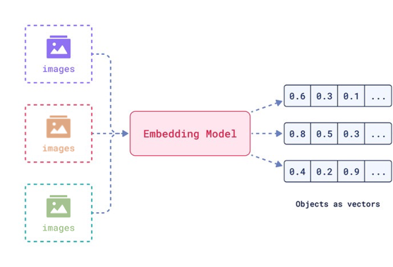
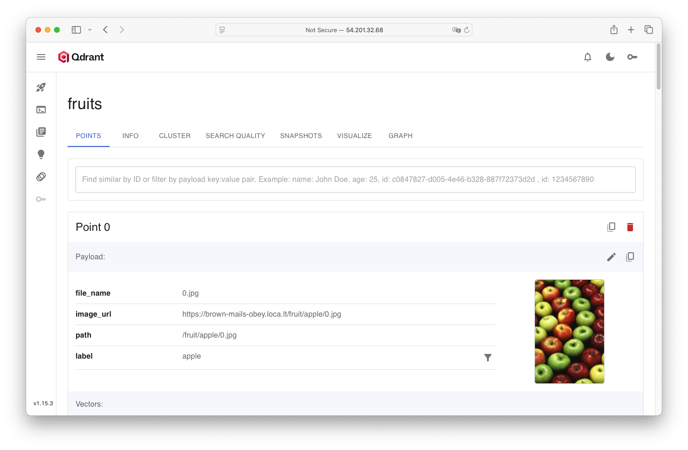
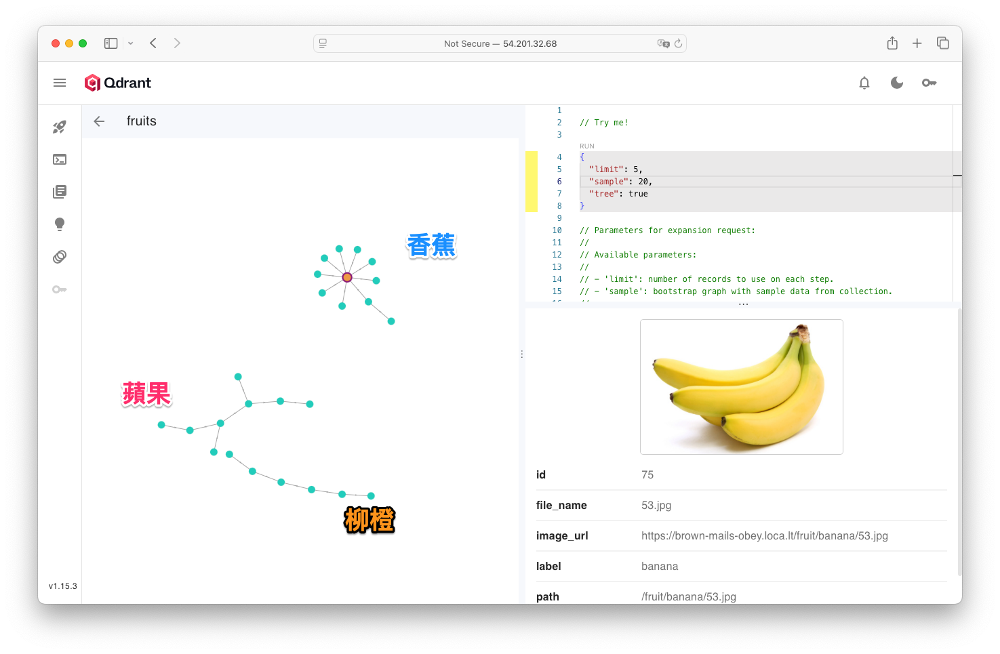
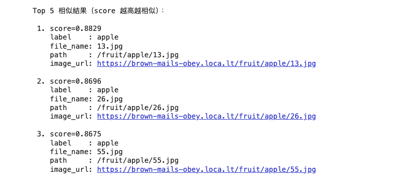

# Qdrant 圖片向量庫教學：從圖片 embedding、Graph 可視化到以圖搜圖

在現代 AI 應用裡，「向量檢索」已經成為搜尋、推薦、聚類與內容理解的關鍵技術。Qdrant 是一個高效能的向量資料庫，結合 Graph 視覺化工具，不只支援快速的相似度查詢，還能直觀探索資料集內部的語意關係。這篇教學會一步步帶你：

* 了解什麼是圖片向量 embedding
* 介紹主流 image embedding 與多模態模型
* 用 Qdrant 建立你的圖片向量庫
* 實作以圖搜圖查詢
* 利用 Qdrant WebUI Graph 探索資料結構
* 分享實務技巧與延伸應用

---

## 1. 什麼是圖片 embedding？為什麼需要向量資料庫？

現今許多 AI 模型（如 CLIP、OpenCLIP、ViT、DINOv2、BLIP2 等）能將圖片或多模態（圖＋文）內容轉換成高維度的向量（embedding）。每一張圖就像「壓縮」成一個 512 維、768 維甚至更高維的特徵點，這樣的向量可以計算彼此相似度、分群、做語意搜尋。



但是這些向量一旦超過幾萬、幾十萬筆，傳統 SQL 資料庫就難以高效檢索。這時候你就需要 **向量資料庫**（如 Qdrant、Milvus、Pinecone、Weaviate 等）來處理這類「高維向量檢索」場景。

---

## 2. 主流圖片與多模態 embedding 模型簡介

選對模型是建立圖片向量庫的第一步。以下簡單介紹幾種目前社群熱門且容易上手的 embedding 模型：

| 模型              | 特點                        | PyPI 套件/下載資源      |
| --------------- | ------------------------- | ----------------- |
| **OpenCLIP**    | 社群持續維護的 CLIP 延伸版，支援更多模型   | `open-clip-torch` |
| **ViT/DINOv2**  | 純圖片分類，適合專注於圖片語意           | `torchvision`     |
| **BLIP/BLIP-2** | 支援圖片描述（Captioning）、多模態應用  | `transformers`    |

**推薦新手直接用 `open-clip-torch` 的 ViT-B-32（OpenAI權重）做練習，穩定、社群熱門、支援度高。**

---

## 3. 用 Qdrant 建立圖片向量庫：完整實作流程

### 3.1 資料夾結構設計

在本範例中我們準備一些水果分類圖片（蘋果、香蕉、柳橙），結構如下：

```shell
fruit/
├── apple/
│   ├── 1.jpg
│   └── ...
├── banana/
│   ├── 1.jpg
│   └── ...
└── orange/
    ├── 1.jpg
    └── ...
```

### 3.2 啟動靜態伺服器與公開網址
由於圖片**不建議把原圖（二進位）塞進 Qdrant**：Qdrant 的 payload 是 JSON，放進去會膨脹、占用記憶體與 IO。標準做法是：

1. 原圖放在檔案伺服器（或 S3/MinIO/靜態網站）
2. 在 Qdrant 的 payload 存 **image\_url**
3. 進 Dashboard 的 Graph 或 Points 檢視，點節點就能看到這些連結

所以在本範例中我們快速地建立一個圖片檔案的伺服器，使用 `python -m http.server` + `localtunnel`，讓你的圖片能夠被 Qdrant 的 Console 或其他人透過外部網址瀏覽。

### 3.3 圖片轉 embedding 並寫入 Qdrant

主流程如下：

1. **載入 OpenCLIP 模型（ViT-B-32）**
2. **批次讀取每張圖片，轉換為向量**
3. **寫入 Qdrant**，僅存 **向量＋中繼資料**（如圖片名稱、公開 URL、標籤）

程式關鍵片段：

```python
import open_clip, torch, PIL.Image
from qdrant_client import QdrantClient
from qdrant_client.http import models

# 模型與 device 設定
model, _, preprocess = open_clip.create_model_and_transforms("ViT-B-32", pretrained="openai")
model = model.to("cuda" if torch.cuda.is_available() else "cpu").eval()

def embed_image(path):
    img = PIL.Image.open(path).convert("RGB")
    t = preprocess(img).unsqueeze(0).to(model.device)
    v = model.encode_image(t)
    v = v / v.norm(dim=-1, keepdim=True)  # Cosine 距離請務必正規化
    return v.cpu().numpy().squeeze()

# Qdrant 設定
client = QdrantClient(url="http://你的Qdrant:6333", api_key="(如需)")

# 上傳向量與 payload
client.upsert(
    collection_name="fruits",
    points=models.Batch(
        ids=[...],                   # 向量 id
        vectors=[...],               # 圖片向量
        payloads=[{                  # 方便查詢、顯示
            "file_name": "1.jpg",
            "image_url": "https://xxx/fruit/apple/1.jpg",
            "label": "apple",
        }, ...],
    ),
)
```

（更多批次處理與 payload 請參考你附檔完整程式）



---

## 4. Qdrant WebUI Graph：圖片聚類與關係視覺化
Qdrant 的 WebUI 提供 **Graph 視覺化** 工具，讓你不用寫前端也能探索資料集內向量間的結構：

1. 進 Qdrant Console → 選擇 Collection → **Graph 分頁**
2. 選擇抽樣數量（建議 500\~1000 內，避免瀏覽器負擔過重）
3. 選 Tree/kNN 連線方式。Graph 會自動根據向量相似度拉群集
4. **操作技巧：**

   * 拖曳、縮放群集
   * 點擊節點可看到原始圖片與 payload
   * 可用 metadata filter 篩選特定標籤



**實際效果可參考官方教學影片：[YouTube: Visualizing Vector Embeddings: Qdrant’s WebUI Graph Tool](https://www.youtube.com/watch?v=OzTHZ0SIulg)**
影片內的操作示範，能直接看到同類型圖片自動聚成 cluster，相似圖像集中分佈，支援直觀探索資料集品質與潛在錯誤。

---

## 5. 以圖搜圖查詢（Image Similarity Search）

Qdrant 不僅能存資料、做聚類，也能直接「以圖找圖」！步驟如下：

1. 選定一張 query 圖片，轉成向量
2. 使用 `client.search()` 根據 query 向量在 Collection 內做相似度查詢（可加分群/標籤 filter）
3. 取出前 k 個最相似的圖片（並可取得對應的 score, label, image\_url 等資訊）

程式片段：

```python
def search_image(query_image_path, k=5):
    # 1. 載入模型與預處理
    model, preprocess = load_model()
    # 2. 轉向量
    qvec = embed_image(model, preprocess, query_image_path)
    # 3. 搜尋 Qdrant
    hits = client.search(
        collection_name="fruits",
        query_vector=qvec,
        limit=k,
        search_params=models.SearchParams(hnsw_ef=64)
    )
    for h in hits:
        print(h.payload["image_url"], h.score)
```

更多完整查詢與範例請見你的程式附件。



---

## 6. 模型選擇、效能與資料設計實務建議

* **模型挑選**：OpenCLIP/ViT-B-32 屬高 CP 值入門首選，專案需求若要更高精度可考慮 ViT-L-14 或 BLIP2 等模型（但計算量也會大幅增加）
* **相似度度量**：圖像多用 Cosine，相似向量請正規化（如 `v = v / v.norm(...)`）
* **批次處理**：大數據量建議分批、異步寫入，並善用 Qdrant 的 HNSW 參數調校檢索效能
* **資料儲存建議**：Qdrant 只存「向量＋metadata」，原始圖片建議放物件儲存（如 S3/MinIO），payload 用 image\_url 對應
* **Graph 視覺化**：圖形過大會擠在一起，可篩選部份類別或先降維後投影
* **資料品質**：多元樣本（角度、光線、背景）能提升模型泛化力，標籤正確性也會直接反應在聚類結果

---

## 7. 延伸應用與技巧

* **多模態查詢**：若 embedding 支援圖＋文（如 CLIP），Qdrant 也可實現「以圖找文」、「以文找圖」混合搜尋
* **自動標註/聚類**：Graph 聚類結果可協助自動分群標註，找出標錯或冷門類型
* **前端應用串接**：利用 Qdrant API，可結合前端 Vue/React 做互動式圖片推薦、檢索平台
* **進階降維**：大量點建議 UMAP/t-SNE 先降維至 2D，前端可自訂更美觀的散點分布圖

---

## 結語

Qdrant 的 WebUI + 強大 Python API，結合主流多模態 embedding 模型，不只讓「以圖搜圖」超簡單，還能直觀探索向量資料集內的語意結構。不論你是做資料工程、內容推薦還是 AI 應用，這一套流程絕對讓你如虎添翼。
