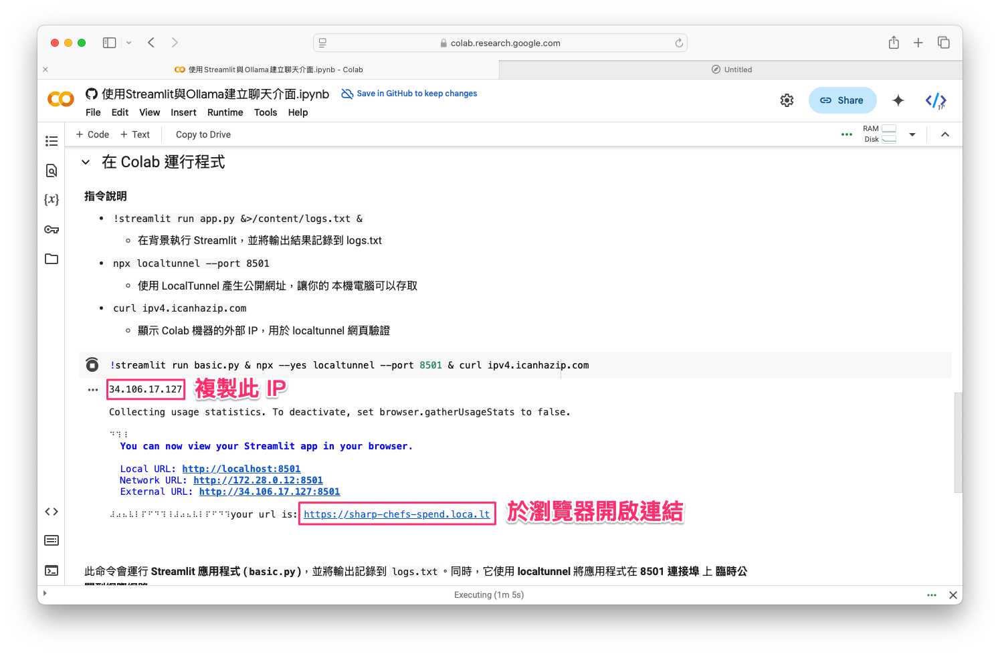

# 在 Colab 使用 Streamlit 與 Ollama 建立聊天介面

範例程式：[](https://colab.research.google.com/github/andy6804tw/crazyai-llm/blob/main/docs/llm-practical/code/使用Streamlit與Ollama建立聊天介面.ipynb)

## 前言
本教學將介紹如何在 **Google Colab** 上運行 **Streamlit**，並透過 **Ollama API** 來建立一個簡單的 **聊天介面**。由於 Colab **無法直接執行 `streamlit run`**，我們將使用 **LocalTunnel** 讓本機電腦可以存取 Colab 內運行的 Streamlit 應用。


此外，Ollama 服務可以運行在 **本機端**，也可以使用 **遠端伺服器或其他 LLM API（如 OpenAI、FastChat）** 來提供回應。

!!! info

        在執行此程式之前，請先確保本機電腦已安裝並運行 Ollama，並下載所需的模型。

        - 詳細內容請參考：[Ollama 使用教學：在自己的電腦上運行大型語言模型](./Ollama使用教學.md)
        - 完成Ollama部署後後，即可在本機運行 Streamlit 應用，透過 Ollama API 與 LLM 模型(gemma2:9b)進行互動！

---

## 步驟 1：安裝必要套件
首先，在 **Colab** 內安裝 **Streamlit**：
```bash
!pip install -q streamlit
```

---

## 步驟 2：程式概述
這支程式使用 **Streamlit** 建立一個 **單輪對話介面**，透過 **Ollama API** 來處理 AI 回應：

1. **使用者輸入訊息**，顯示在對話框內。
2. **程式將訊息傳送至 Ollama API（本機端 `11434` 連接埠）**，獲取 AI 回應。
3. **顯示 AI 回應**，並將對話內容儲存在 `st.session_state`，讓使用者能夠持續查看對話歷史。

!!! note 

        這是一個 **本機 AI 助手**，可以用來測試 **Ollama 模型**，或作為更進階應用的基礎。

---

## 步驟 3：建立 `basic.py` 並寫入程式
我們使用 **魔術指令 (`%%writefile`)** 在 Colab 內建立 `basic.py`，內容如下：
```python
%%writefile basic.py
import os
from openai import OpenAI
import streamlit as st

# 設定 OpenAI API 金鑰與模型端點
token = "ollama"
endpoint = "http://localhost:11434/v1/"
model_name = "gemma2:9b"

client = OpenAI(base_url=endpoint, api_key=token)

# 單輪對話初始化的 system prompt
SYSTEM_PROMPT = {"role": "system", "content": "你是一個有用的助手。且會根據使用者輸入的語言做回應。"}

# 初始化對話歷史，僅用於顯示（不保存上下文）
if "display_messages" not in st.session_state:
    st.session_state.display_messages = []

# 顯示對話歷史
for message in st.session_state.display_messages:
    with st.chat_message(message["role"]):
        st.markdown(message["content"])

# 接收使用者輸入
if user_input := st.chat_input("請輸入您的訊息..."):
    # 顯示使用者訊息
    st.session_state.display_messages.append({"role": "user", "content": user_input})
    with st.chat_message("user"):
        st.markdown(user_input)

    # 組合單輪對話訊息
    messages = [SYSTEM_PROMPT, {"role": "user", "content": user_input}]

    # 調用 OpenAI API 獲取回應
    response = client.chat.completions.create(
        messages=messages,
        model=model_name,
        temperature=1.0,
        top_p=1.0,
        max_tokens=1000,
    )

    # 獲取助理回應內容
    assistant_response = response.choices[0].message.content

    # 顯示助理回應
    st.session_state.display_messages.append({"role": "assistant", "content": assistant_response})
    with st.chat_message("assistant"):
        st.markdown(assistant_response)
```

---

## 步驟 4：替換 `endpoint` 以使用其他 LLM API（可選）
在這支程式中，`endpoint` 變數代表 **大語言模型（LLM）API 的網址**，它可以根據需求替換為：

- **本機端 Ollama (`localhost`)**
- **遠端 Ollama（固定 IP）**
- **OpenAI API**
- **其他自建 LLM 服務（如 FastChat、vLLM）**

 **📌 `endpoint` 替換方式**

| **環境**             | **範例 `endpoint`**                      |
|---------------------|----------------------------------|
| **本機 Ollama**     | `http://localhost:11434/v1/`    |
| **遠端 Ollama（固定 IP）** | `http://your-server-ip:11434/v1/` |
| **OpenAI API**      | `https://api.openai.com/v1/`    |

---

## 步驟 5：啟動 Streamlit 並讓本機存取



執行以下指令：

```bash
!streamlit run basic.py &>./logs.txt & npx --yes localtunnel --port 8501 & curl ipv4.icanhazip.com
```

📌 **指令說明**

- `!streamlit run basic.py &>./logs.txt &` → **在背景運行 Streamlit**，並將日誌輸出到 `logs.txt`
- `npx --yes localtunnel --port 8501` → **開放公開網址**，讓本機存取 Colab 內的 Streamlit
- `curl ipv4.icanhazip.com` → **顯示 Colab 機器的外部 IP**

---

## 步驟 6：取得公開網址並存取
執行上面的指令後，應該會顯示：
```
your url is: https://random-name.loca.lt
```

在 **Colab** 執行該命令後，應該會顯示類似以下的輸出內容：


請**複製 IP 位址**（例如 **35.106.17.127**），然後**點擊產生的 URL**，即可進入應用程式的頁面。

!!! info

        在本機瀏覽器開啟該網址，即可使用 Streamlit 聊天介面！


!!! info "下一步可以嘗試"

    上述範例是一個簡短的單向對話模式，使用者可以輸入問題後，AI 依 據設定的系統提示回應的答案，沒有額外的上下文標記功能。

    從執行結果可以看到，當我們請 AI **「說個笑話」**，它回應了一個關於海鷗的冷笑話。 接著，我回覆 **「好冷喔」**，我的意思是指 **笑話很冷**，但由於 AI 目前只支援 **單輪對話**，沒有記憶功能， 因此它無法理解「好冷喔」是對 **上一個笑話的回應**，而是將這句話當作一個**新的輸入**，並試圖根據當前的訊息進行回應，而不是理解這是一個對笑話的評價。因此，下一步可以嘗試：

    - **讓機器人具有多輪對話的功能 (Run a multi-turn dialogue)**，透過 `st.session_state` 存儲對話歷史。
    - **讓 AI 保持上下文**，例如：傳遞完整的歷史對話給 LLM 來生成更有記憶性的回應。

    這裡給個小練習，我們可以讓 AI **不只是單輪回答問題**，而是能夠記住對話內容，並進行更流暢、自然的互動更像 ChatGPT！ 

## 總結
這支 Python 範例程式讓我們可以：

✅ **在 Google Colab 運行 Streamlit 應用**  
✅ **透過 LocalTunnel 產生公開網址，讓本機存取**  
✅ **使用 Ollama 來處理 AI 對話**  
✅ **自由替換 `endpoint` 來連接不同 LLM API**  

這樣，你就能透過 **Colab 部署 Streamlit 聊天機器人**，並在本機直接使用。此外，這支程式碼也可以在本機的 Python 環境下運行，無需依賴 Google Colab 或 LocalTunnel。 只需在本機電腦中執行 `streamlit run basic.py`，然後在瀏覽器打開 **`http://localhost:8501`**，即可直接存取聊天介面，與 Ollama 進行互動。

